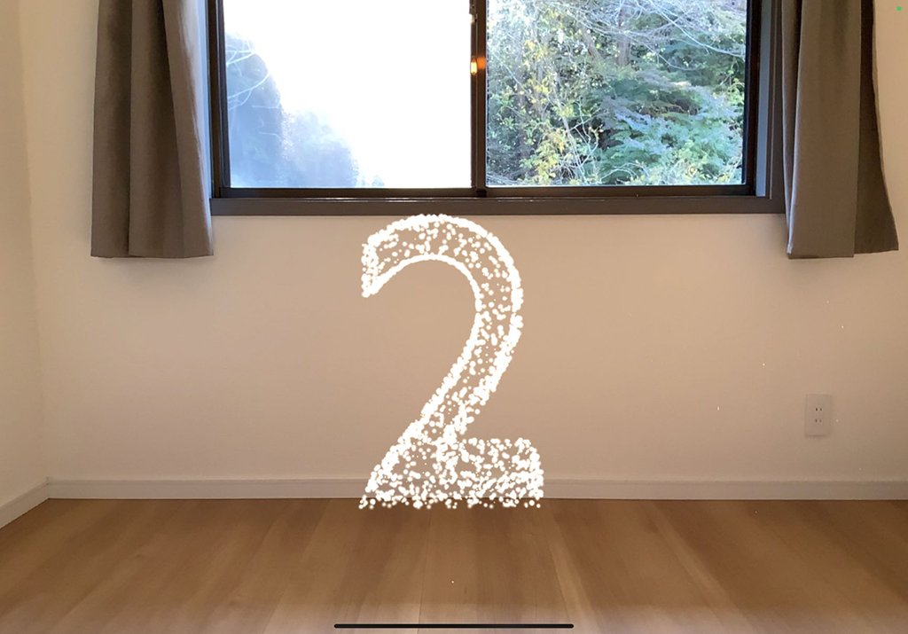
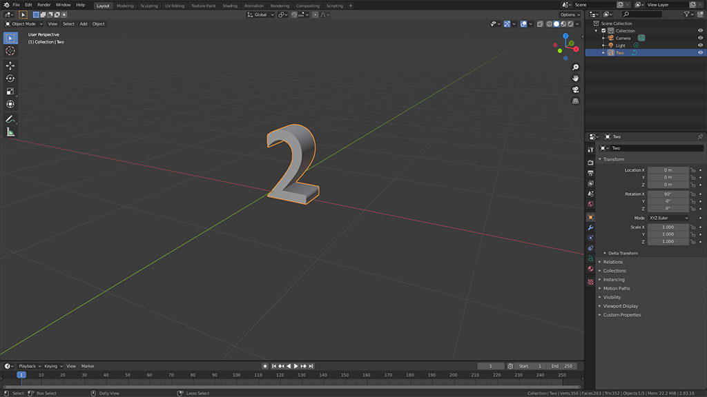
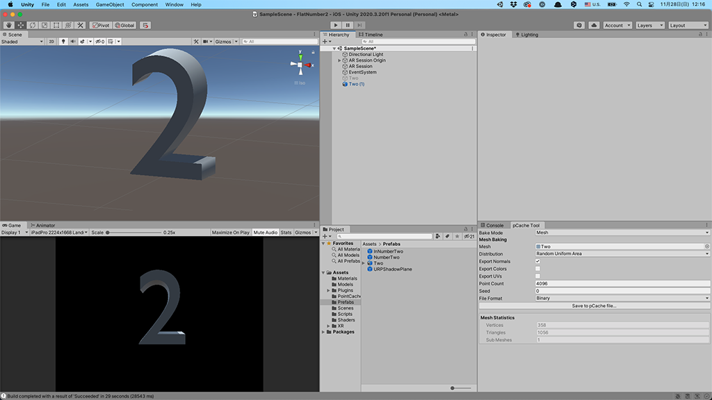
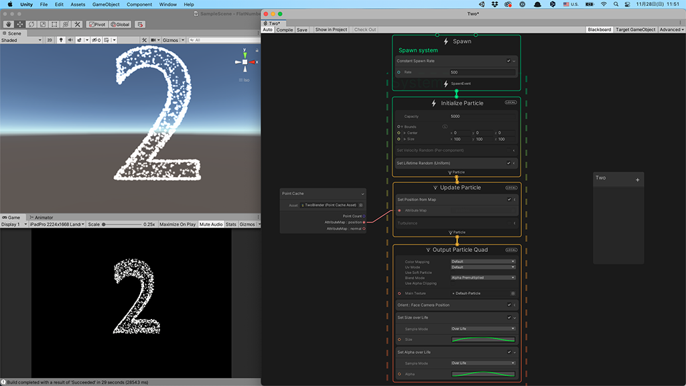
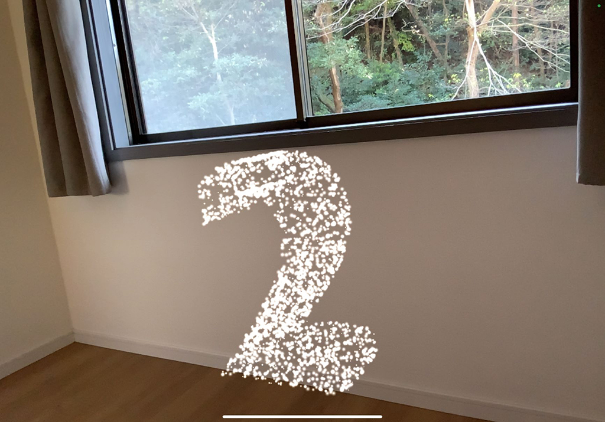

 

## **#02/25 [ 2021/12/02 ]** 
### by Mio Kato
  

 

AppleからARグラスが発表されるのを数年前から心待ちにしているので、ARを使った表現にしてみました。 
今年ももうすぐ終わりますねー。来年はメガネアプリを作れますように！

 

### **材料**

* ARを見るためのiPad,もしくはiPhone

 

### **技術**

* 3Dデータ作成：Blender
* ARプログラム作成：Unity

 

### **作り方**
 

### **1.**
 

BlenderなどのCGツール、もしくはFusion360のようなCADでモデルデータを作成します。 

   

### **2.**
 

FBXなどの形式でUnityにデータを持っていきます。 

   

### **3.**
 

UnityのVisualEffectGraphを使って3Dモデルをもとにパーティクルを作成することができます。 

   

### **4.**
 

作成したパーティクルをARFoundationと組み合わせてiOS向けに書き出せば、iPhoneやiPadで実際の空間に重ねて眺められます。 

  

ARなので、iPadを傾けていろんな角度から見てみることができます。 

  

せっかくなので動画でも。 
良く見ると、光の粒がそれぞれ蛍のように明滅しています。 

<iframe width="680" height="382.5" src="https://www.youtube.com/embed/Ar-hHQ7RyRs" title="YouTube video player" frameborder="0" allow="accelerometer; autoplay; clipboard-write; encrypted-media; gyroscope; picture-in-picture; web-share" allowfullscreen></iframe>

    

### **作者紹介**
 

**加藤 未央** 

[miokato | note](https://note.com/utomica/)
  

（Last Updated: 2023.04.11）

