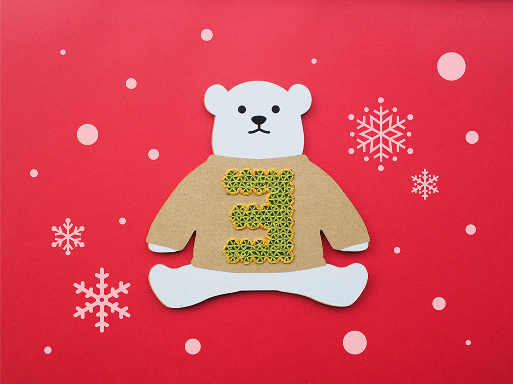
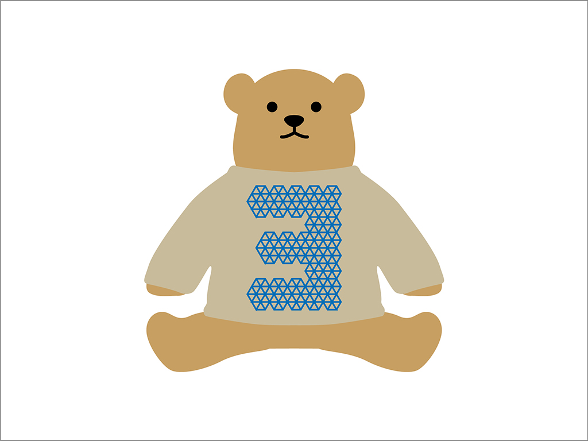
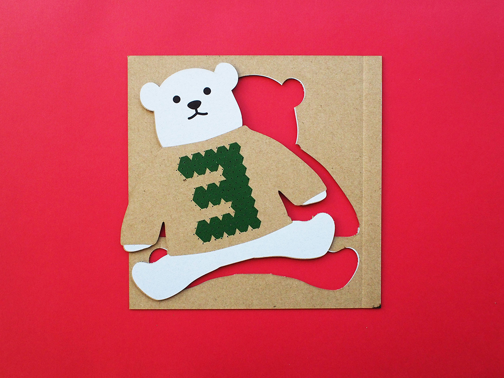
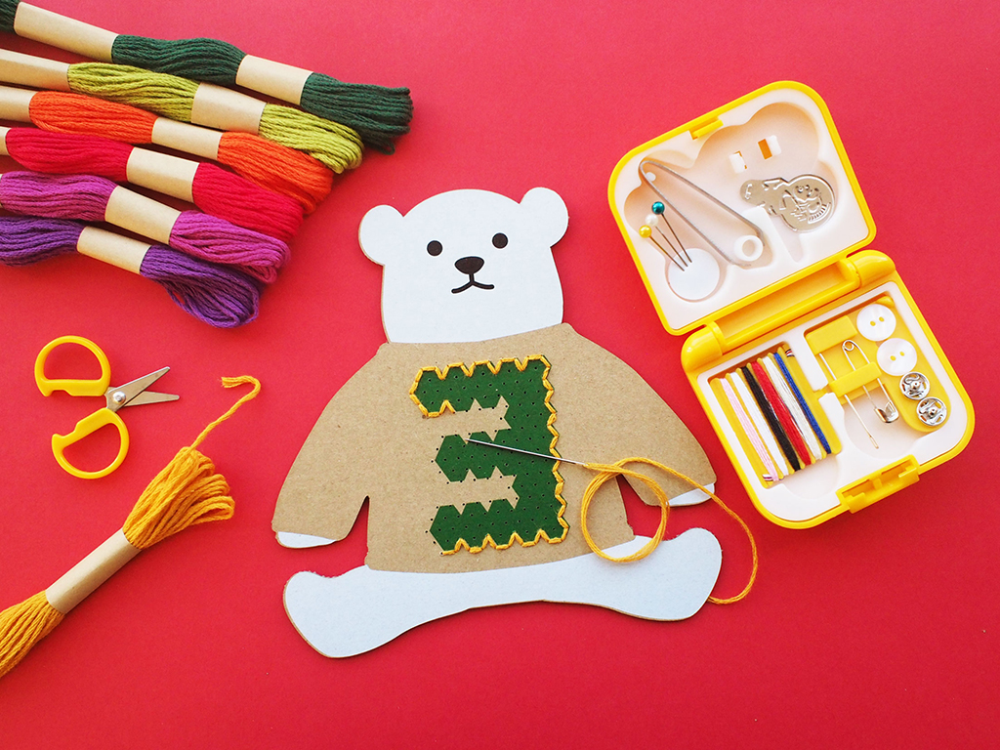
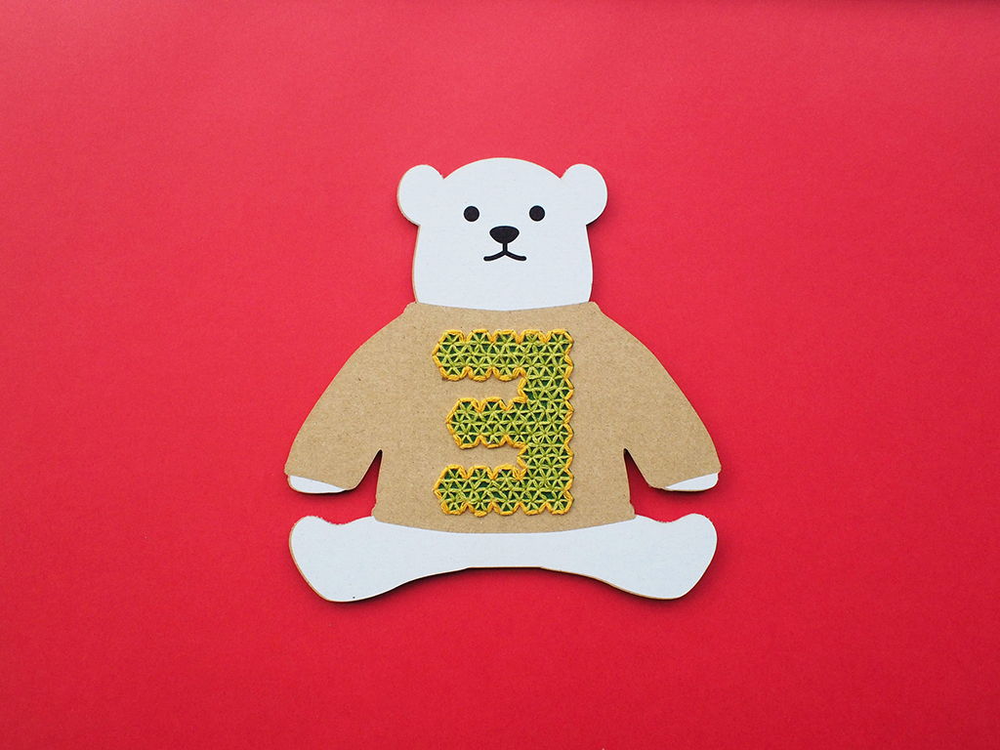

 

## **#03/25 [ 2021/12/03 ]** 
### by Kana Masuda
  

 

「3」の文字が刺繍されたセーターを着ている白くまさんをつくりました。

 

### **材料**

* 段ボール（厚さ1mmくらい）
* 刺繍糸

 

### **技術**

使用した道具

* レーザーカッター
* UVプリンター
* 手芸キット

使用したソフト

* Adobe Illustrator

 

### **作り方**
 

### **1.** 
Adobe Illustratorで完成形のイメージを固めます。 
イメージが決まったらそれを基に加工用データをつくります。 

  

### **2.** 
UVプリンターで白くまさんのボディーと「3」の文字をプリント後、 
レーザーカッターで輪郭と刺繍用の穴をカットします。 

  

### **3.** 
刺繍用の穴に合わせてちくちく刺繍していきます。 

  

### **4.** 
完成！ 

    

### **作者紹介** 
 

**益田 佳奈** 

FabLab SENDAI - FLAT（2014 - 2016年在籍）
  

（Last Updated: 2023.04.11）

