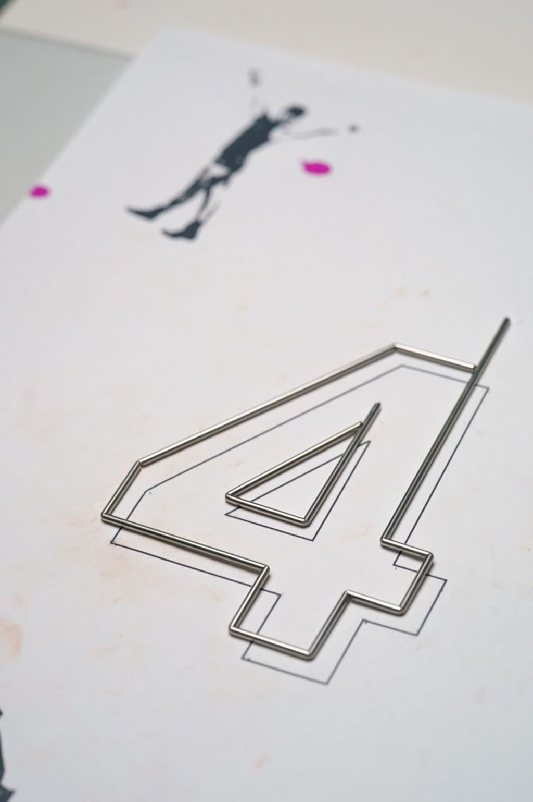

 

## **#04/25 [ 2021/12/04 ]** 
### by Kengo Fujimori
  

 

早くも12月の4日です。。 
師走という言葉に相応しく、ドタバタの中担当させて頂きます。藤森と申します。 
最後までよろしくお願いし・わ・す。 

 

### **材料**

* ステンレス溶接棒1.6mm
* ステンレス溶接棒1.0mm
* 塗料

 

### **技術**

* Rhinoceros(3DCAD)
* spot welder
* 塗装

 

### **作り方**
 

### **1.**
 

CADソフトで体の良い“４“をモデリングし、ワイヤーフレームのイメージを掴みます。 
このまま3Dプリンターやレーザーカッター、或いはCNCに持ち込めば、サクッと終わる話なのですが、 
今回は原点に立ち返って、あえてアナログな手法で挑みます。 
そんな訳でこの作業はあくまでイメージを掴むだけであり、3Dデータは使用しません。 

   

### **2.**
 

下絵を元に、ステンレス棒を曲げていきます。 
今回使うのはステンレスの丸棒2種類。1.6mmと1.0mmのコントラストを活かします。 
実に原始的ですが、4を構成する上でこの線の役割は非常に重要になってきますので、 
極力下絵のラインに沿うように、曲げる部分の厚みに⅔程、ヤスリを入れてクイックに曲がるようにします。 
90°に曲げる場合は四角ヤスリを使用しますが、きっかけの刻みを入れるために、初めは三角ヤスリである程度刻みを入れます。 
四角ヤスリと比較して三角ヤスリは垂直に当てると上面が平らになるので、 
コントロールをつけて力をかけやすくなりますが、一般の方からすると何のこっちゃな話です。 

 

 

 

   

### **3.**
 

曲げが完了した時点で、端点を仮着機でとめていきます。 
この仮着機は基本的にはジュエリー用ですが、私はジュエリー用途ではほとんど使用しておりません。 
金や銀よりも圧倒的に鉄やステンレスがとめやすく、ワイヤーワークには最適な機械です。
操作方法は単純で、仮留めするそれぞれの部材を電極のついたクリップに挟み、 
接触させた状態でフットスイッチを踏むとスパークします。 
両手に部材を持って固定した状態で止める事ができるので、 
位置決めがしやすく、固定後も仮着なので、多少動かすことができます。 

 

 

   

### **4.**
 

上記の要領で、曲げと仮着を繰り返し、ディティールを付加した後で、 
奥行きをつけていきます。奥行きが出ると、途端に存在感が増します。 
今回はデュアルイメージのバージョンにしたいので、簡素化したものをもう一つ作っておきます。 

 

 

   

### **5.**
 

アクリル塗料にて塗装を施します。 
今回は時間がなかったので、1層のみの簡素化したものですが、 
クリアで発色が良ければ良いほど、デジタルなワイヤーフレームのイメージが出ます。 
赤と青の塗り分けについては、2D画面上での3D表現からイメージを得ていますので、 
赤と青のイメージがブレて重なることで、2D的な3D形状を3次元上で2D的な3Dとして 
存在させることが目的となっていますが、やはり何のこっちゃな話です。 

   

### **6.** 
バランスの取れる位置で重ねて完成です。 
塗り分けたことで、重ねてもそれぞれが”4”として認識できます。 
とてつもなくアナログな作業ですが、表現しようとしていることは、とても古典的なデジタル手法です。 
もう少し丁寧に作るつもりでしたが、スケジュール的に当日の朝になってしまいました。 
2桁台の日程ですと時間的な余裕があったかもしれませんが、 
作業量が倍に増えてしまうので、今回 “4“を担当させて頂けて大変光栄でした。 
最後までお付き合い頂き有り難うございました。 

    

### **作者紹介**
 

**藤森 研伍** 

合同会社 StudioDIM 代表 
某DIY工房にてマネージャーを務めるも、施設が閉館となり、DIYからDIM（DO IT MYSELF）へと転換し、 
スタートアップ支援やメーカースペースの立ち上げなどに携わる。 
機械好きが高じてデジタルファブリケーションに傾倒するも、元々は金属工芸の作家であるため、手仕事からは離れられない。
  

（Last Updated: 2023.04.11）

