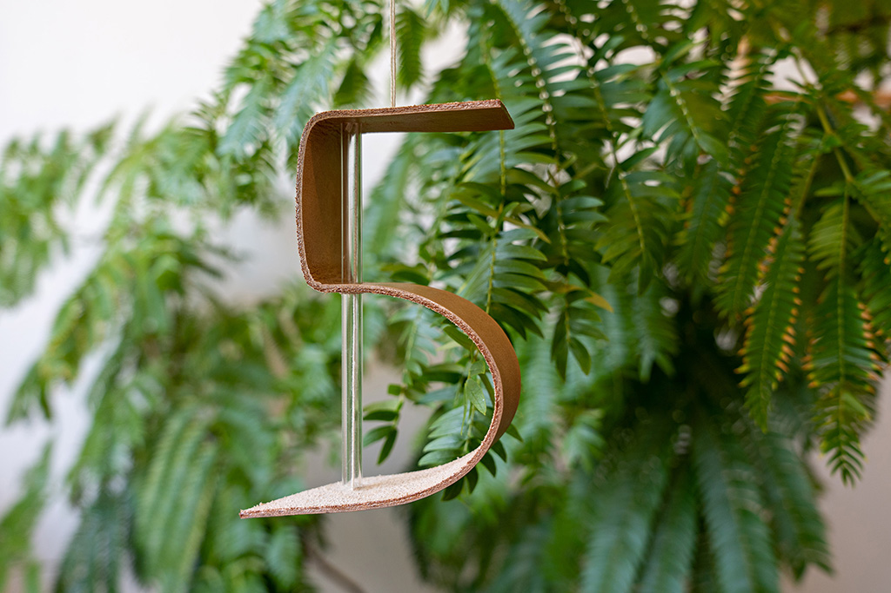
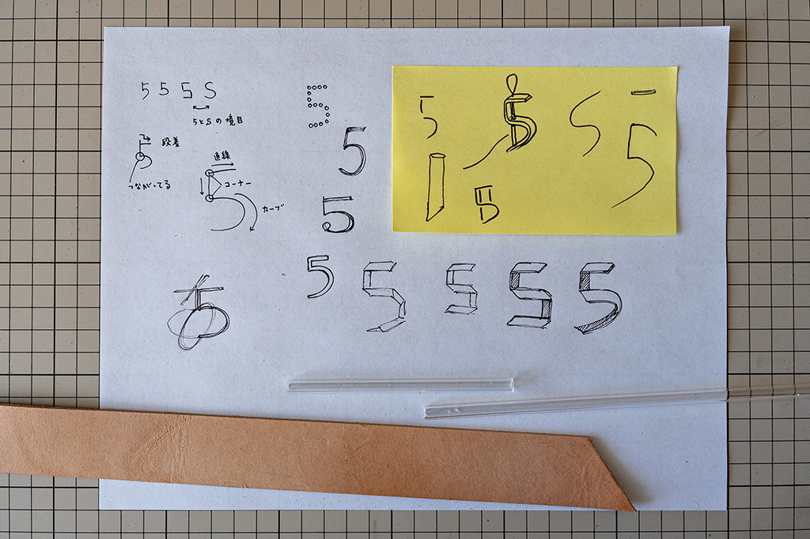
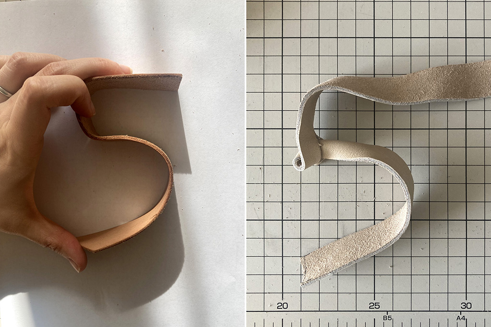
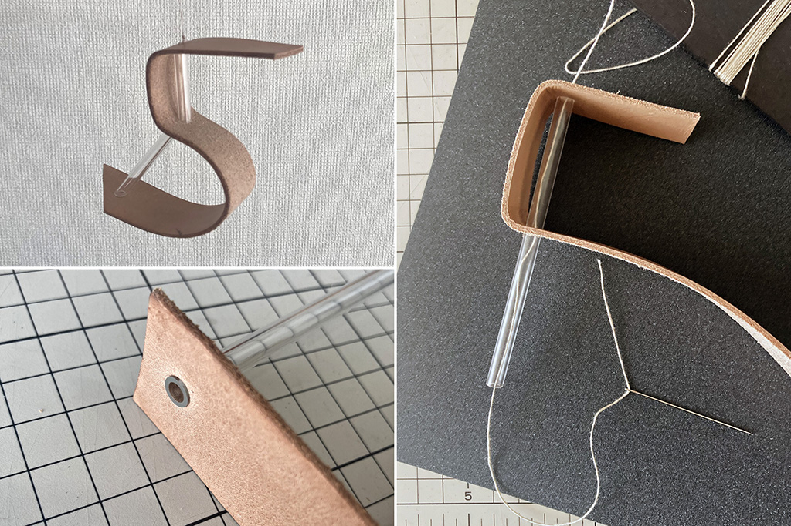

 

## **#05/25 [ 2021/12/05 ]** 
### by Mariko Higaki
  

 

革を曲げて数字の「5」のオーナメントを作りました。 
素材の持つ特性を生かし、要素を削ることを心がけました。 

 

### **材料**

* 厚手のヌメ革
* アクリルパイプ
* 麻紐

 

### **技術**

使用した道具

* ロータリーカッター
* ポンチ・金槌
* 糸ノコ
* 手芸キット

 

### **作り方**
 

### **1. 「5」の数字を観察する** 
まずはいろんな種類の「5」を描いてみて、「5」であると認識する要素を整理しました。 
上半分は直線的なのに対して下半分が緩やかなカーブ、という二種類の形の特性を兼ね備えているのが特徴です。 

  

### **2. 素材を決める** 
FabLab SENDAI-FLAT 主催ということでデジタルツールを使われる方が多い気がしたので、 
デジタルフリーでやってみたいという気持ちもあり「手で考える」ことを意識して、 
直線とカーブ、両方を表現できる手元のいろんな素材を触って、革に決めました。 

  

### **3. とりあえず作ってみて失敗する** 
まずは革の間にアクリルパイプで作ったスペーサーをはさんで「5」が作れないか試みたところ、 
スペーサーがずれてしまってダメでした。 
革にアクリルパイプの径よりも少し小さなポンチで穴を開けてギュッと通すことで「5」の維持に成功。 
数字のバランスを見ながら止める箇所を決めていきます。 

  

### **4. 仕上げて完成〜！** 
最後はオーナメントが傾かないように中心軸に糸を通して、 
革のケパケパが舞わないように断面を透明のコパで仕上げました。 
くるくるさせると数字の表情が変わってかわいい。 

    

### **作者紹介** 
 

**檜垣 万里子** 

プロダクトデザイナー 
趣味は工業製品の分解と工場見学 
Twitter [@mrkhgk](https://twitter.com/mrkhgk) 
Instagram [@mrkhgk](http://Instagram.com/mrkhgk/) 
[http://www.marikoproduct.com/](http://www.marikoproduct.com/)
  

（Last Updated: 2023.04.11）

