 

## **#06/25 [ 2021/12/06 ]** 
### by Daichi Komatsu (TORCH)
  

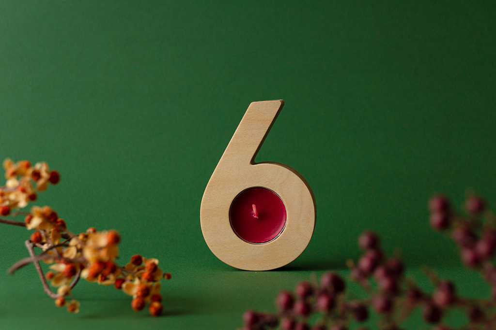

 

12月6日。 
クリスマスまでは、あと19日となったところ。 

秋はすっかり、冬にかわって 
冬物のコートやニットが手放せなくなってきた。 

東北の冬は寒く、 
まだまだこれから寒さ厳しくなると思うと少しゲンナリしたりもする。 

12月6日の今日は、月曜日。 

「冬はつとめて」と綴った、平安の暮らし上手の言葉は 
今でも賛成！と言いたくなるほど、冬の晴れた朝は澄んでいて気持ちがいい。 

けれども、電車の中はまだまだ忙しなく、 

みんな師走を駆け抜けようとして頑張っている。 

クリスマスプレゼントはどうしようか。 

ケーキの予約は間に合うだろうか。 

ああ、そんなことより年内に仕事は終わるのだろうか。。。 

なんて具合に。 

もうすぐ2021年も終わるのだから、 
これを機に、少し一年を振り返ってみてもいいかもしれない。 
（日曜日にしろって話だけど、休日は楽しむのに忙しい。） 

そうだ、今夜は少し早めにうちに帰ろう。 

そして、月曜日の疲れを癒せるように 

好きなものを買い込んで 

いつものバラエティー番組はつけず、 

照明もオフ。 

非常用に取っておいた 
小さなティーキャンドルに火を灯し 
静かに一年を振り返ってみる。 

アドベント（Advent）の風習が生まれた西方教会では、 
６という数字は「不完全な」数字。 

不完全だった自分を許す日なのかもしれないし、 

不完全燃焼だった2021年を振り返る日なのかもしれない。 

それでも、完全な人なんていないから 

私は私でいいのだ、と揺らぐろうそくを見つめて思う。 

バッカスを一口。 

そういえば、12/6日はセント・ニコラウスの日とも言われている。 

セント・ニコラウスは、貧しい三姉妹の娘たちが、 
生活のために身を売って生計を立てようとしていた姿に心を痛め 

真夜中にその家の暖炉の煙突からこっそりと、 
誰にも気づかれないように金貨を投げ入れたそうだ。 

そして、その金貨は、暖炉で乾かしてあった彼女たちの靴下の中に。 
その金貨で彼女たちは正式な結婚ができた、という逸話がある。 

そう、セント・ニコラウスはあのサンタ・クロース（Sinterklaas）なのだ。 

今頃きっと、ドイツの子供たちは 
目の前のケーキやプレゼントの箱に目を輝かせているに違いない。 

金貨を投げ入れて、誰かを助けるなんてことは自分にはできないけれど 
もしかしたら、目の前の人を少しだけハッピーにはできるのかもしれない。 

なかなかやりきれない2021年だった。 
でも、まだクリスマスがある。 
2週間以上も時間がある。 

今年のクリスマスは 
いつもよりも少しだけ頑張ってみてもいいのかも。 

目の前が少し明るく感じた。 

バッカスのアルコールが効いてきたのかもしれない。 

ろうそくの炎が静かに揺れている。 

 

---

 

長々とすみません。 
ある人物の日記のようなストーリー仕立てでお届けしてみました。 

FLATの大網さんからいただいた12月6日のお題。 

アドベントのことや12月6日のことを調べてみると、 
風習や数字の話、サンタクロースの起源などいろんなことが見えてきました。 

そもそも、アドベントはキリスト教の西方教会が始めたものだそうで 
アドベントの時に、ろうそくを灯す風習は1839年からと言われています。 
プロテスタントの神学者J.H.Wichernが、自身で創設した孤児院の子どもたちから「クリスマスまであと何日？」 
と質問を繰り返され、考えたアイデアがこのろうそくを灯すことだったそうです。 

月曜日から土曜日までは赤いろうそくを、日曜日には大きな白いろうそくを立てたそう。 
今ではそれが簡略化されて日曜日だけ灯すようになりました。 
（アドベントカレンダーも、ドイツのルーテル派が始めたとのこと。） 

そんなストーリーから、6を眺めていた時に、 
日本の昔の手燭を思い出し、6の形の中に手燭の機能を見つけ 
キャンドルホルダーに見立ててみました。（実際は置いて使ってください。） 
 

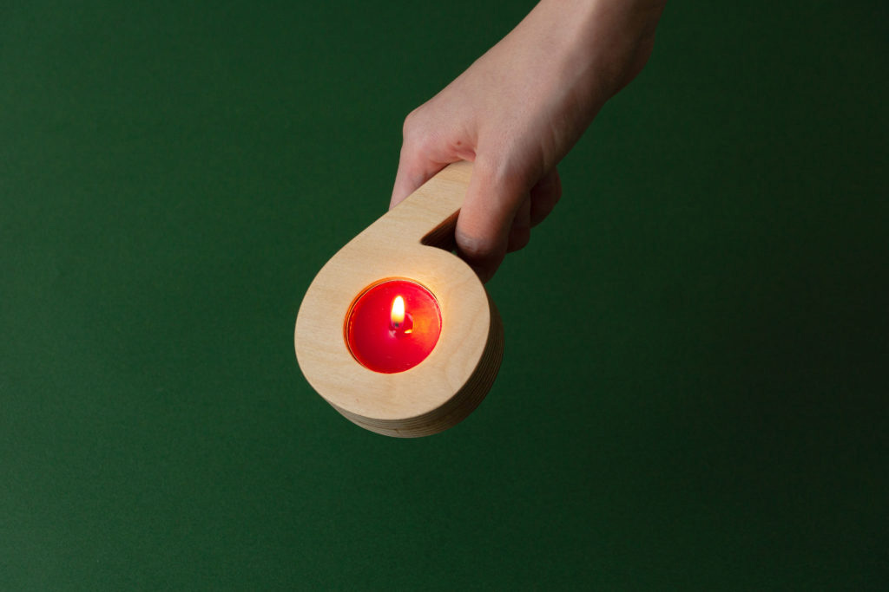
  

6日が過ぎたら、紐を通してツリーに下げてみてもいいかも。 

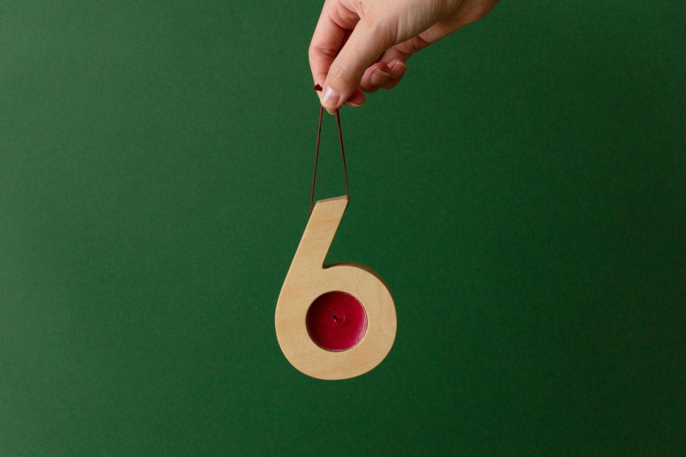
  

今回は期間限定なプロトタイプだからこそ、できる限り新しい資源を使いたくなかったので、
キャンドルホルダーは大学の学生たちが出すシナ合板の端材を使い、紐には読み終えた本の栞紐を使ってみました。

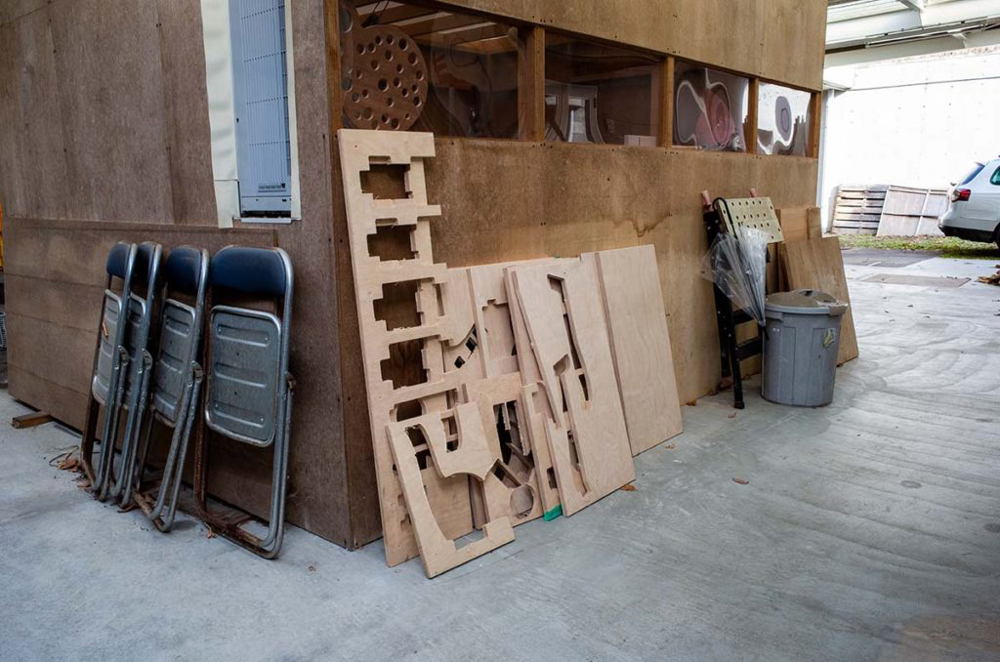
 

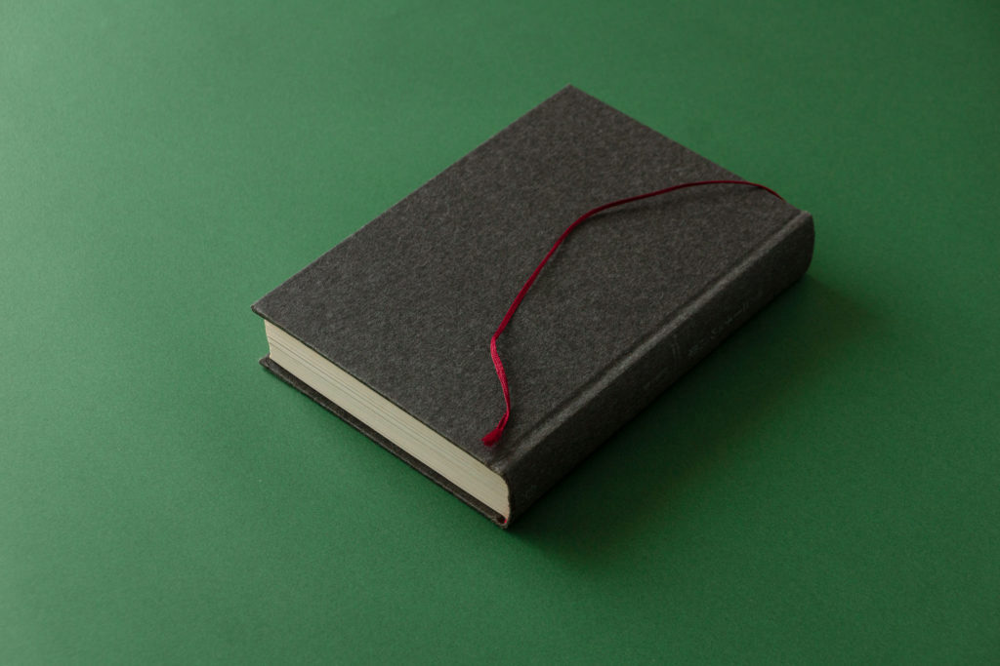
  

### **材料**

* シナ合板の端材（T18mm）
* 読み終えた本の栞（今回は「超訳ニーチェの言葉」）

 

### **技術**

* NC切削（データはRhinoceros）
* ボール盤（紐用の穴あけに使用）

 

### **書体**

* Avenir Heavy をベースに若干の修正

 

### **作り方**
 

**① ライノセラスのText Objectから、「Avenir Heavy」を選ぶ** 
 

**② 形の修正を少々。（実際の書体は赤線） 3mmほど飛び出し部分を伸ばします。** 
 

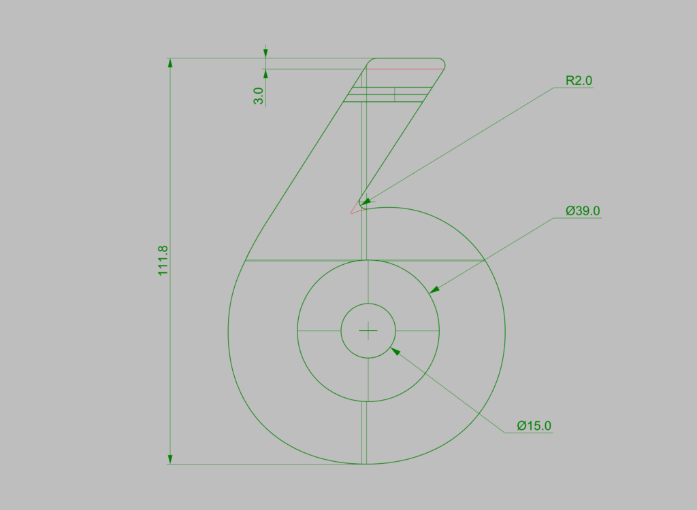
  

**③ 曲線を立ち上げる。** 
 

**④ キャンドルが入る部分に土台を作り、指が入る程度の穴を開けておく。 （キャンドルを取りやすくするため）** 
 

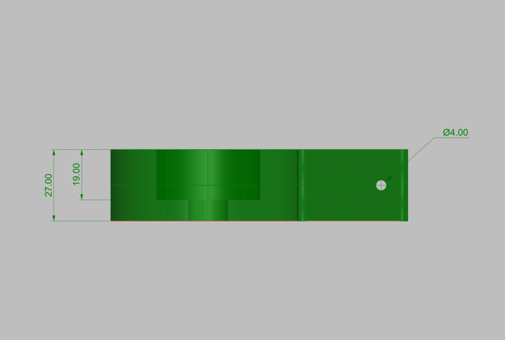
  

**⑤ データができたらNCに入れて、数時間。 失敗しないことを祈るのが大事。** 
 

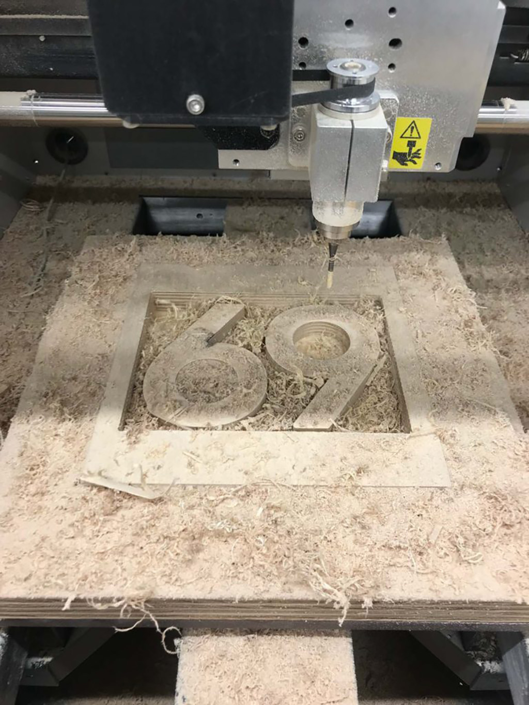
  

**⑥ 出来立ての「６」を2枚重ねて接着。 目地部分をやすりがけ。** 
 

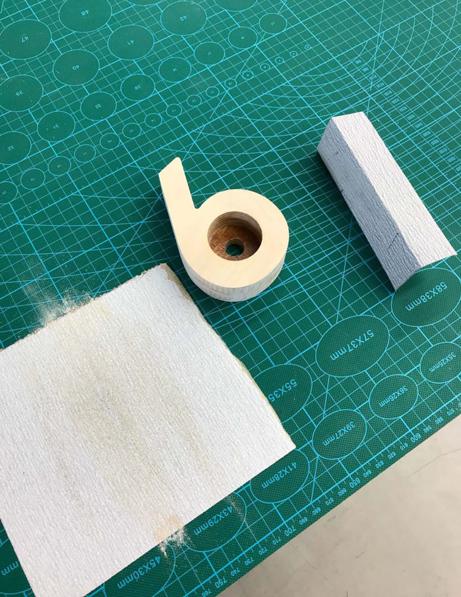
  

**⑦ ボール盤で紐を通せる穴を開けておく。（NCで一気にあけても良い）** 
 

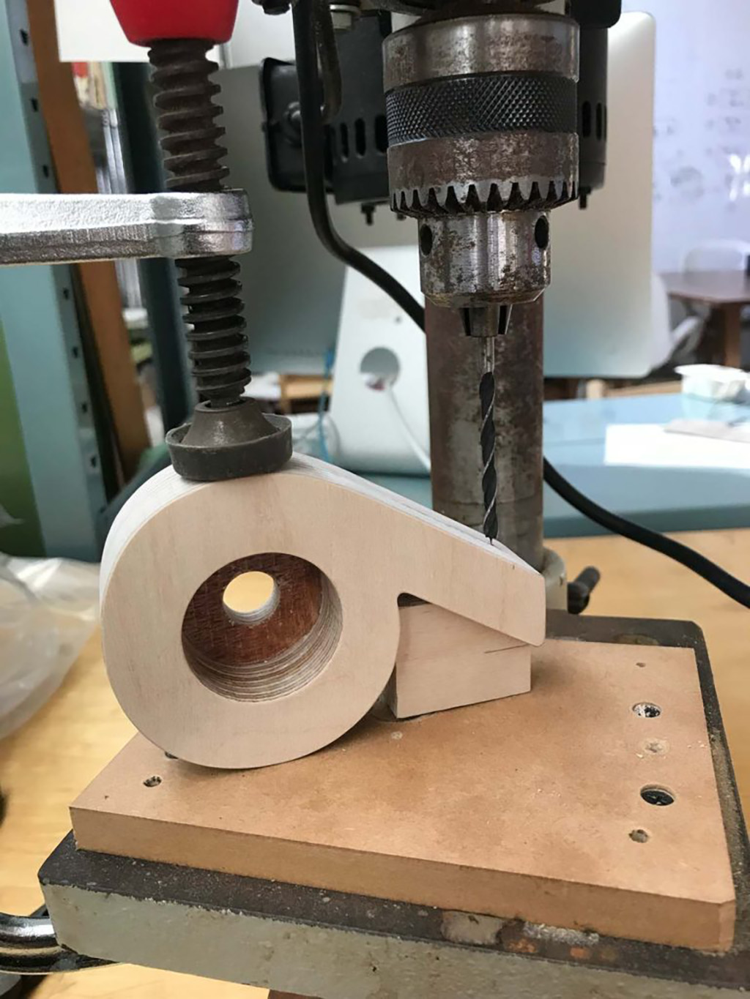
  

**⑧ 手当たりを良くするために面取りを行って、ペーパーを当てる。 面取りはR1mm程度で。** 
 

**⑨ キッチンに残っていたクルミ油で塗装。手触りサラサラ。** 
 

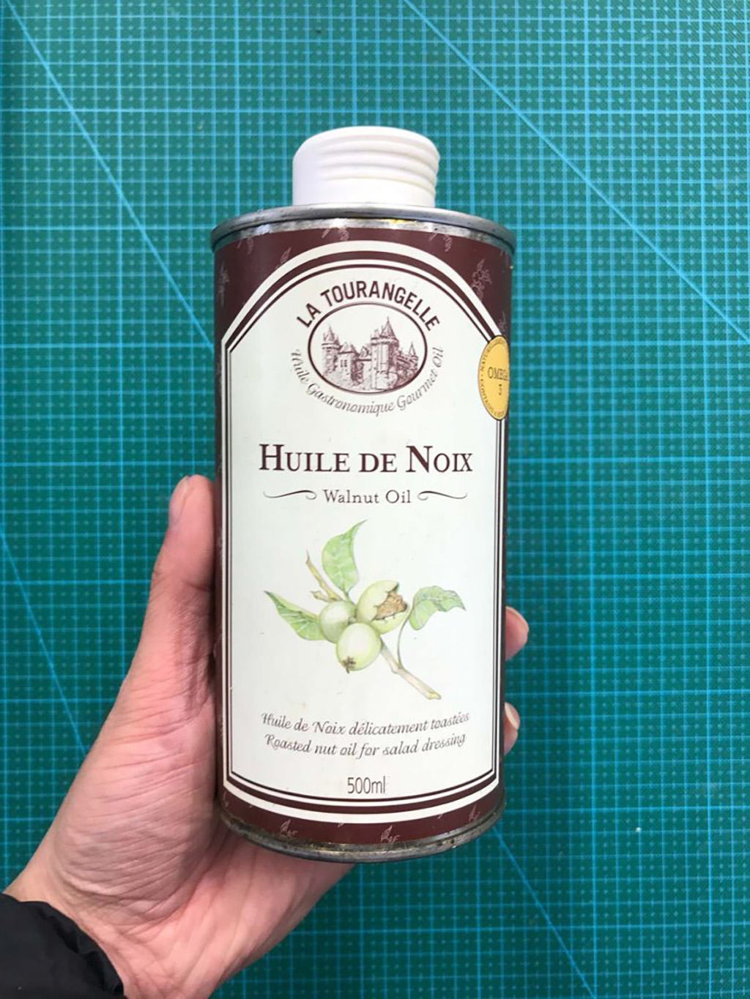
  

**⑩ 毎月の6日は、あなたの不完全を祝う日にしてみましょう。 （くれぐれも火事にはお気をつけて。）** 
 

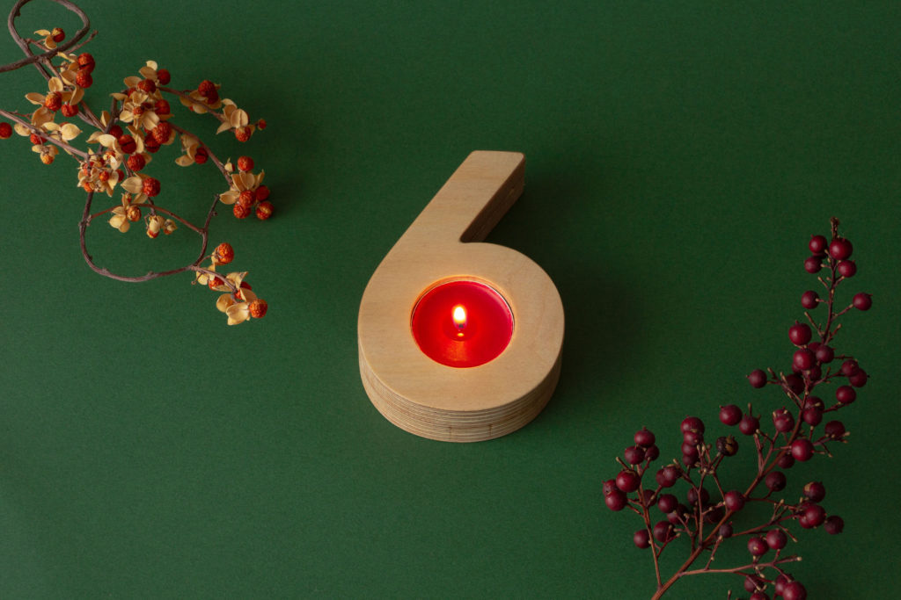

    

### **作者紹介** 

**小松 大知 （TORCH）** 

仙台市を拠点に、2021年からTORCHの屋号でデザイナーとして活動。 
11月より宮城大学で特任助教も兼務しています。 
クリスマスの次の日は、僕の誕生日です。 
Instagram [@daichikoma2](https://www.instagram.com/daichikoma2/) 
[https://www.torch-design.com/](https://www.torch-design.com/)
  

（Last Updated: 2023.04.11）

