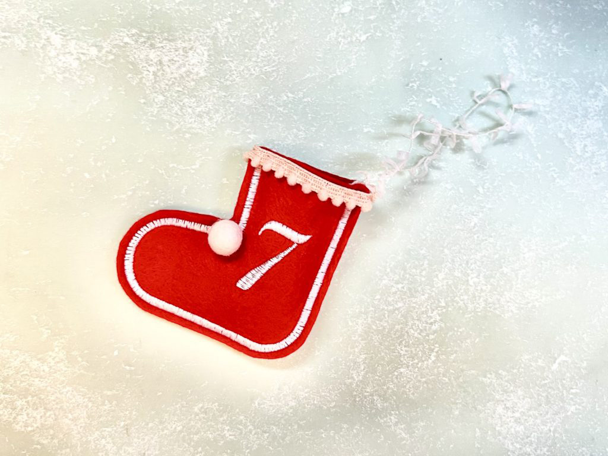
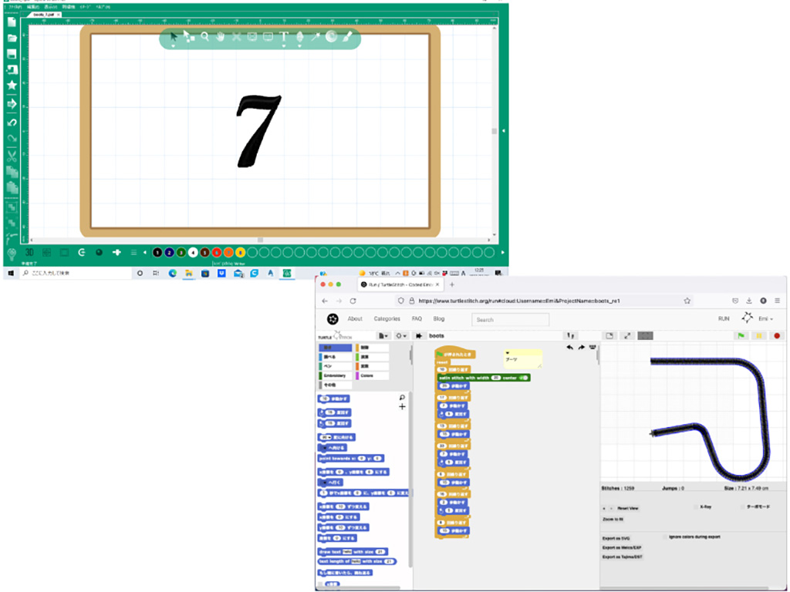
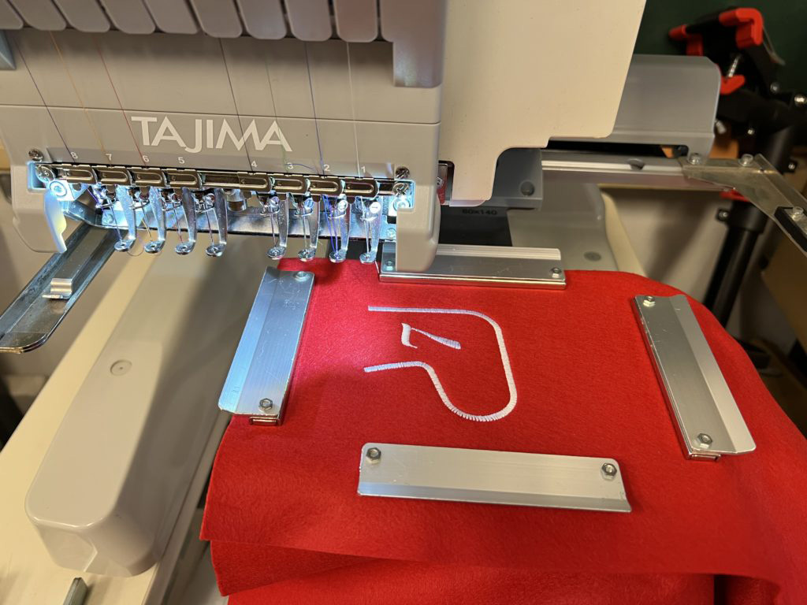
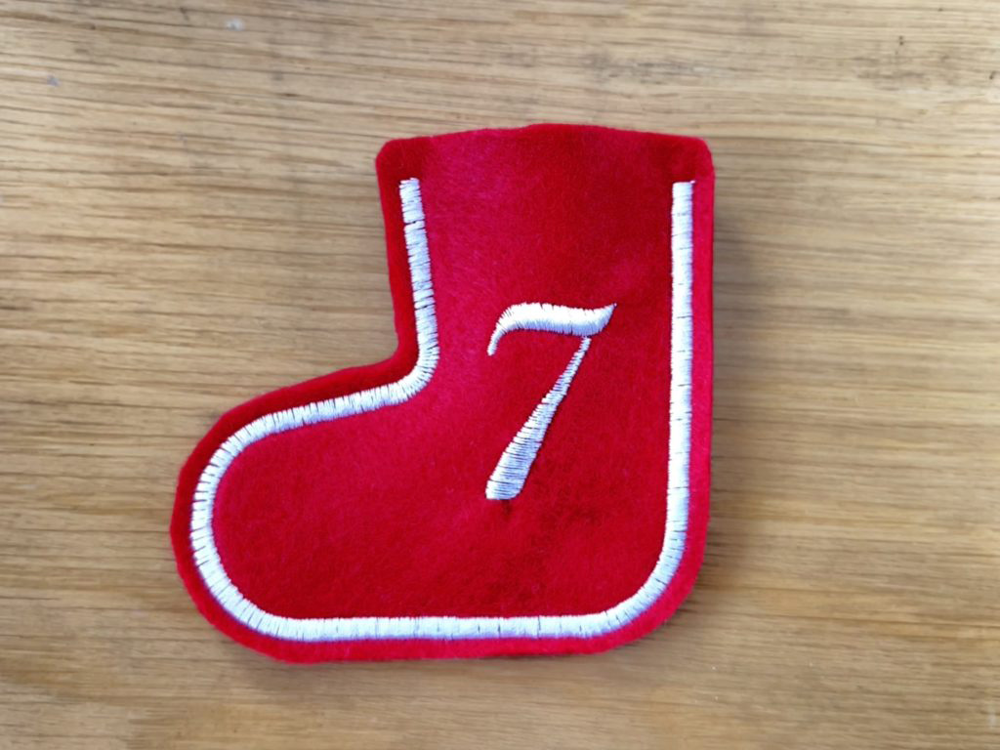

 

## **#07/25 [ 2021/12/07 ]** 
### by Emi Iguro
  

 

数字の“7”ってひっくり返すとブーツみたいな形に見えるよね？！という思い込みから、 
デジタル刺繍ミシンを使って、日付入りのブーツを作ってみました。 

 

### **材料**

* フェルト（赤）
* ウールのボンボン（白）
* リトルプチブレード（ピンク）
* りぼん（白）

 

### **技術**

* データ作成：Tajima Writer PLUS, Turtlestitch
* 刺繍ミシン：TAJIMA SAI 彩
* 裁縫道具

 

### **作り方**
 

### **1. データを作ります。**
 

  

数字の「7」はTajima Writer PLUSで作成。 
ブーツの型はTurtlestitch でプログラミングしました。ブーツの微妙な曲線はプログラミングで微調整できるので便利！ 
こちらのURLでプログラムを確認＆データをダウンロードできます。 
[https://www.turtlestitch.org/users/Emi/projects/boots](https://www.turtlestitch.org/users/Emi/projects/boots)
「Export as Tajima/DST」でダウンロードすると刺繍ミシンで縫うことができます。   

### **2. データをデジタル刺繍ミシンで縫います。**
 

  

1枚のフェルトに数字の「7」を刺繍します。 
2枚重ねたフェルトにブーツ型をサテンステッチします。
   

### **3. デコレーションします。**
 

  

ステッチの周りを切り落とし、ブーツ型にします。 
ポンポン付きのブレードとウールのボンボンを針と糸で縫い付けてデコります。 
昭和なレトロ感がでてきました。
   

### **4. 仕上げて完成〜！**
 

フェルトを2枚重ねにしているので、袋状に仕上がりました。 
小さなアメちゃんも入るサイズ。 
プレゼント、たくさんもらえるといいですね！ 

    

### **作者紹介**
 

**井黒 恵美** 

所属：[FabLab MinatoMirai](https://www.kanagawa-u.ac.jp/cooperation/project/fablab/), FabLab Setagaya at IID 
ひとこと：デジファブやプログラミングのゆるめな楽しみ方を模索しています。  

（Last Updated: 2023.04.11）

