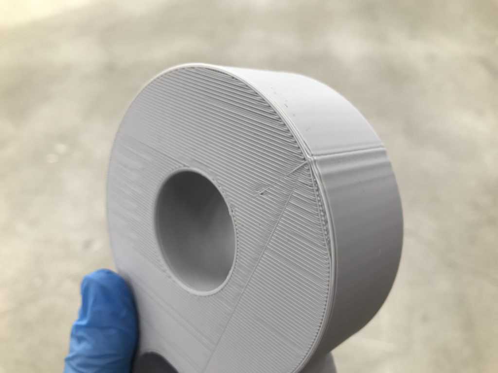
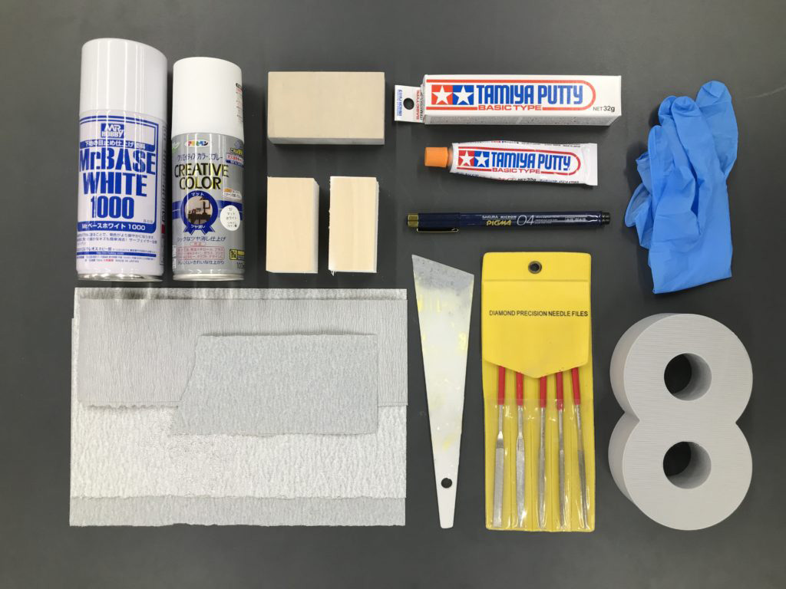
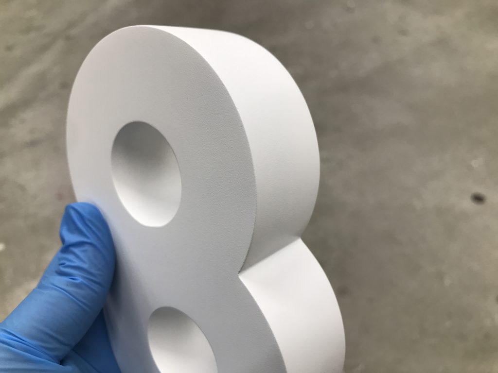
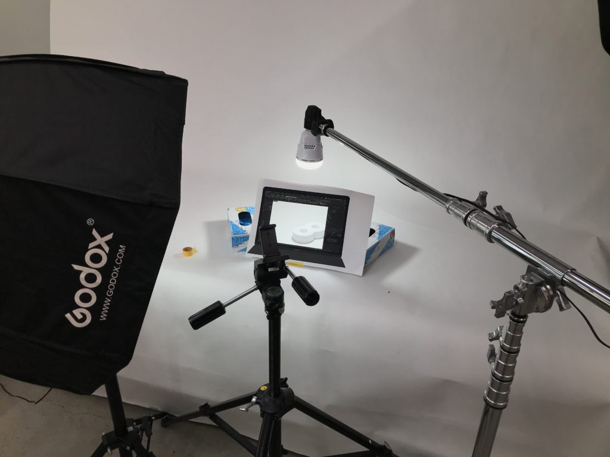

 

## **#08/25 [ 2021/12/08 ]** 
### by Shizuko Takahashi
  

 

今回作ったものは、きれいな8です！ 
まずはこちらの動画をご覧ください。 
 

<iframe width="680" height="382.5" src="https://www.youtube.com/embed/scKWxSxRXJQ" title="YouTube video player" frameborder="0" allow="accelerometer; autoplay; clipboard-write; encrypted-media; gyroscope; picture-in-picture; web-share" allowfullscreen></iframe>

 

おわかりいただけただろうか？ 
そうです！レンダリング画面ぐらいきれいな8を作りました！ 
みなさん3Dプリンタの積層跡って、気になりますよね。 
ACC2021の8日目は、FDMタイプの3Dプリンタで出力したものは、どれぐらい頑張ったらきれいに仕上がるのか？ 
その工程をお見せしようと思います！  

### **材料**

* フィラメント 
FLASHFORGE　MODERA：PLAフィラメントStandard　¥3,025 
[https://flashforge.shop-pro.jp/?pid=153781130](https://flashforge.shop-pro.jp/?pid=153781130)
* パテ 
タミヤ　タミヤパテ　ベーシックタイプ　¥275 
[https://www.tamiya.com/japan/products/87053/index.html](https://www.tamiya.com/japan/products/87053/index.html)
* サーフェイサー 
GSIクレオス　Mr.ベースホワイト1000　¥607 
[https://www.mr-hobby.com/ja/product2/category_33/245.html](https://www.mr-hobby.com/ja/product2/category_33/245.html)
* スプレー塗料 
アサヒペン　クリエイティブカラースプレー　マットホワイト　¥607 
[https://www.asahipen.jp/products/view/13483](https://www.asahipen.jp/products/view/13483)
* 紙やすり 
[https://www.3mcompany.jp/3M/ja_JP/p/d/b5005087002/](https://www.3mcompany.jp/3M/ja_JP/p/d/b5005087002/) 
[http://www.yamatome.co.jp/products/coated_abrasive/sheet/details_kovax_k-sheet/](http://www.yamatome.co.jp/products/coated_abrasive/sheet/details_kovax_k-sheet/)
* （ロキソニンテープ、肉まん)

 

### **技術**

* 3Dプリンタ 
FLASHFORGE（Adventurer3） 
[https://flashforge.jp/product/adventurer3/](https://flashforge.jp/product/adventurer3/)
* 大型プリンタ（EPSON　CS-P9550） 
[https://www.epson.jp/products/largeprinter/scp9550/](https://www.epson.jp/products/largeprinter/scp9550/)
* Rhinoceros
* Illustrator
* Premiere Pro
* やすりがけ
* 塗装
* 印刷
* 撮影

 

### **作り方**
 

### **1. モデリング&3Dプリント**
 

  

Rhinocerosで「8」を作ってstl形式で保存します。 
Adventurer3を使用するためFlashPrintというスライサーで出力の設定をします。 
今回はやすりがけがしやすいPLAフィラメントを使用しました。 
出力時間は4時間ほどでした。 
  

### **2. やすりがけ**
 

  

ここからが本題です。 
はじめに、全体を軽くやすりがけをしてほんの少し滑らかにして、サーフェイサーを吹いて軽くやすりがけ、 
その後パテを打ってやすりがけをしてみたのですが、これがまず失敗でした。 
削りやすいタイプのPLAだったとはいえ、PLAとパテではパテの方が断然柔らかいため、 
本体の凹部分に打ったパテだけが削り取られ、PLAの凹凸が露出してしまう、という結果となりました。 
 
そういうわけで、PLAのやすりがけからやり直すことにしました。 
紙やすりの#120からはじめ、#400まで段階的に、ただただやすりがけをします。 
数時間後、完璧ではないがなんとか凹凸を減らすことに成功し、サーフェイサーを吹いて帰りました。 
1日目はこれにて終了です。   

### **3. やすりがけ&サーフェイサー&パテ**
 

2日目、日頃の運動不足と前日のやすりがけによる筋肉激痛で目覚め、そのまま工房で作業を開始します。 
前日に吹いたサフを軽く落とし、気になる凹凸にパテを打っていきます。 
8の局面は均一にやすりがけするのが難しく、ちょっとでもやり過ぎるとPLAが露出してしまいます。 
なので初めのパテは若干厚めに打っております。 
 
ここからは#400から#600の紙やすりを使い、パテを打ってはやすりがけをし、 
サフを吹いてはやすりがけをし、というのを、「いいかな」と思うまで繰り返します。 
途中で筋肉激痛が限界を迎え、ロキソニンテープと肉まんを買って休憩しました。   

### **4. 塗装**
 

  

缶スプレーで塗装をします。 
今回は、レンダリング画面のざらつき感のある影を出すために、マットタイプの塗料を使いました。 
まず「8」の穴の部分から取り掛かることにしました。穴以外の部分をマスクし、穴に対して斜めに塗料を吹いていきます。 
穴部分の塗装作業は、作業台に直置きせず下に下駄を履かせて、穴の向こうに空気の逃げ道をつくるのがポイントでした。 
穴が吹き終わったらマスクを剥がし、全体に薄く吹いて、ちゃんと乾燥させて、また薄く吹いて、 
というのを、きれいにムラなく仕上がるまで繰り返します。   

### **完成！**
 

  

きれいな8ができました！やったー！   

### **5. 撮影**
 

  

「こっ、これ、レンダリングやないんか〜〜〜い！」となって欲しかったので、 
画面の中から8を取り出せるようにしようと考えました。 
まず、IllustratorでMacBookを描いてRhinocerosの画面をスクショしたものを配置して印刷します。 
白のワークスペース部分を切り抜き、ペラペラしないようにダンボールを裏に貼り付けます。 
バック紙とライトを用意し、レンダリング画面を見ながら、その画面になるように8のライティングをします。   

### **6. 動画編集**
 

画像だけでは立体感がよくわからないなと思ったので、 
これまで撮りためた動画をPemiere Proで編集して、1つの動画にまとめました。 
初めは時系列に並べたただの記録にしようと思って編集し始めたのですが、進めるうちに、 
「あれ、こっちが先の方がいいのか……」と思う場面が出てきて、 
作る前からちゃんと構成を考えないといけないなと思いました。 
だから絵コンテが必要なんだなあと、「言葉」ではなく「心」で理解できたッ！ 
そうやってできたのが、冒頭にお見せした動画です。   

### **感想**
 

たのしかったです！
    

### **作者紹介**
 

**高橋志津子** 

京都芸術大学ウルトラファクトリーにてデジタル加工を中心に学生の制作支援をしています！ 
来年度いっぱいで任期終了なので、お仕事を探しています！
  

（Last Updated: 2023.04.11）

