 

## **#09/25 [ 2021/12/09 ]** 
### by Hikaru Ishi (root n)
  

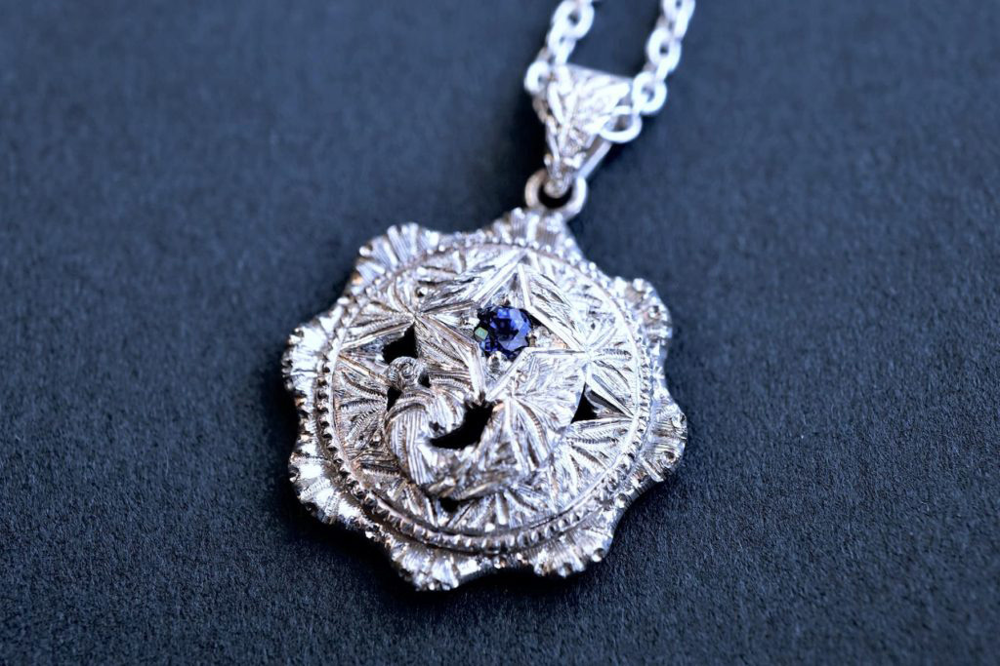

 

“9”を担当させていただきました、石井です。 
FabLab SENDAI-FLATのラボメンさんの中にはデジタルツールに強い方が多くいらっしゃるなか、 
私はローテク担当!?という事でアナログツールで制作しました。 
皆様の興味を惹く内容ではないかも知れませんが、異種格闘戦とのことなのでお許しを。  

### **材料**

* スターリングシルバー(Ag92.5%, Cu7.5%)
* サファイア(天然、約0.07ct)
* 銀ロウ

 

### **技術**

* 彫金

 

### **主な工具**（Fig.2参照）

* 糸鋸、ヤスリ各種、コンパス、洋彫りタガネ各種、ピンバイス、先端工具各種、ヤットコ各種、ガスバーナー&ふいご、ヤニ、線引き板、圧延ローラー、球台、リューター

 

### **作り方**
 

基本的に地金を切って、削って、曲げて、接合して、彫っての単純な繰り返しです。 
詳細は以下、長くなりますがご興味あれば。  

### **1. デザインと素材作り**（Fig.1~3） 

手を動かしてアイディアスケッチ(…という名の落書き)をしているうちに、なんとなく形が思い浮かんできます。 

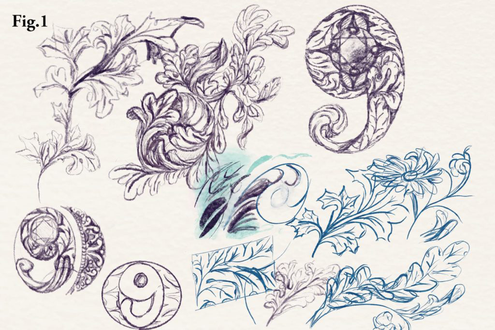
  

地金から作る場合は純銀と純銅を溶かし合わせる所から始めるのですが、今回は適当な端材を使いました。 

まずは圧延ローラーという工具で板を作っていきます。 
上部のハンドルを回す事で、上下2本の鋼鉄製の筒の間隔を変えられます。 
その隙間に地金板を通して薄くしていきます。 
間隔を狭めながら何度か繰り返し通して、目的の板厚にします。 
今回は1.1㎜厚と0.8㎜厚の板にしました。 
ちなみに、このローラーには平面のほかに、角溝と半丸の溝が切ってあります。 
そこへ棒状の地金を通すと角棒や甲丸形の棒材が作れます。(Fig.2) 

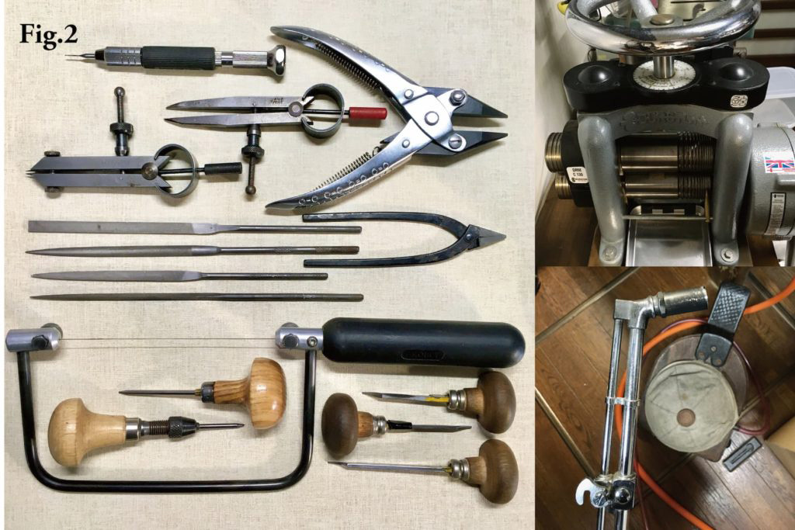
  

また、角棒を線引き板という穴の空いた鋼鉄の板に通すと、丸棒や針金状の線材を作る事ができます。(Fig.3) 
工業界で“引抜き加工”と呼ばれるものと同じかと思われます。 
大きい穴から順に小さい穴まで通していき、目的の太さの線材をつくります。 
今回はΦ0.7㎜の線材を作りました。 

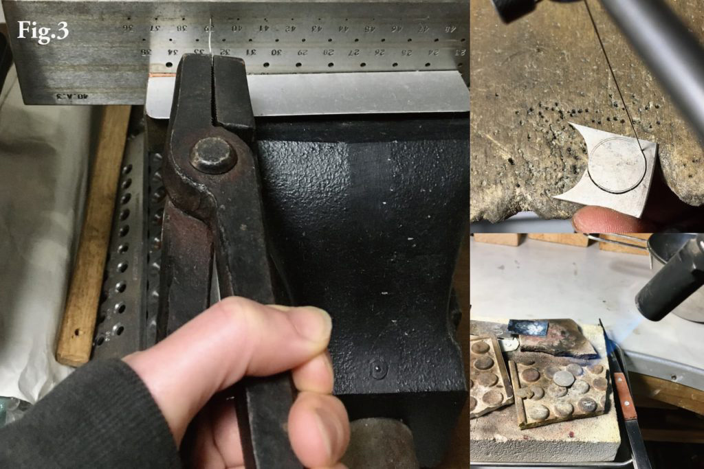
  

地金は加工を繰り返すと硬化してくるので、適宜『焼きなまし』を行います。 
貴金属は焼きなまし（バーナーで炙って水で急冷）すると、再びしなやかな状態に戻り、加工しやすくなります。   

### **2. 部品製作**（Fig.3~5） 

大まかなデザインが決まったら、板材にコンパスやタガネを使ってケガキを行い、糸鋸で部品を切り出します。(Fig.3) 
コンパスは特に使用頻度の高い工具で、円を描く以外にも、等分したり、中心を出したり、平行線を引くのに使えます。 

切り出した部材を、玉台という半球状のくぼみと、ドラえもんの拳みたいな形の道具を使って、部材を僅かにドーム状に成形。 

微調整や細部はヤスリで削って形状を整えます。 
『9』の形の部品が、下の部品にフチだけで嵌まって、僅かに沈む位に調整。 
(削り過ぎると9がすっぽ抜けて落ちるので注意！) 
このようにドーム状の膨らみや、部品ごとの僅かな段差を付けることで全体に立体感が出ます。(Fig.4) 

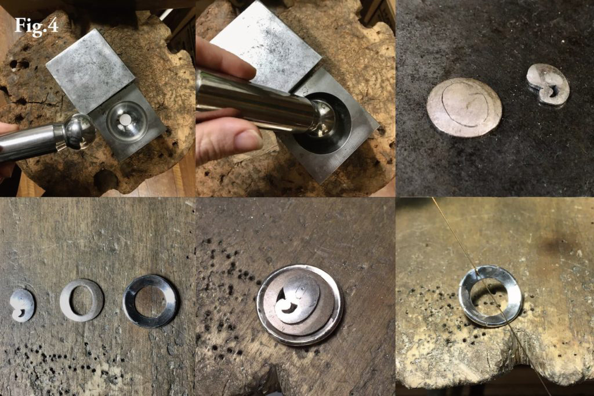
  

大まかな部品のすり合わせが完了したら、ベースの部品を花びら型に加工。 
糸鋸で八等分の切り込みを入れて、ヤスリで細工しました。 
今回は目測でやりましたが、もっと精密に作りたい場合はコンパスで各部キッチリ測ります。 
接合後だと磨きにくくなる所や、刻印等、彫りにくくなる箇所もあらかじめ加工しておきます。 

チェーンを通す金具(丸カンやバチカン)も本体と同様に線材と板から作ります。 
0.8㎜厚の板材を菱形に切り、板を貫通しない程度の穴をドリルで彫り、線材を立ててロウ付け。 
中心から曲げて成形。(Fig.5) 

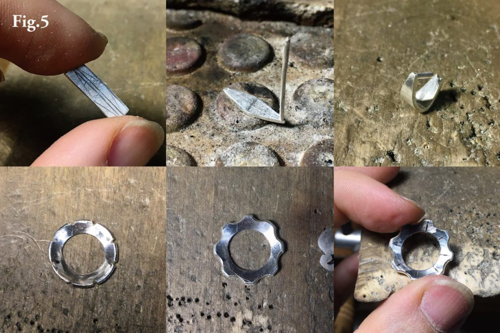
   

### **3. 接合**（Fig.6） 

部品が整ったらバーナーでロウ付け。 

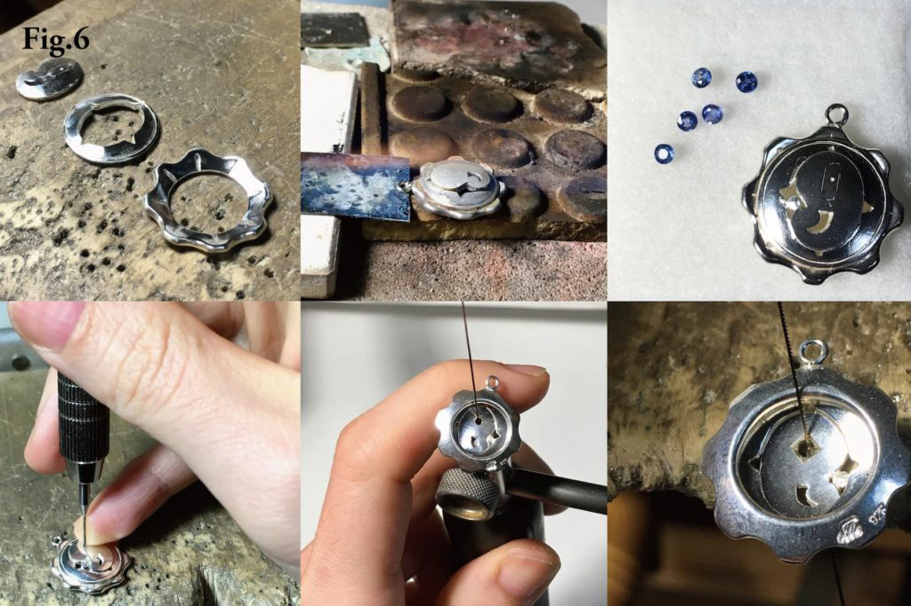
  

銀は金やプラチナと比較して、熱伝導率の高い金属です。 
【熱伝導率が高い≒熱が周囲に逃げやすい】という事なので、接合箇所を局所的に加熱するよりも全体の温度を上げるようにしてやると、綺麗にロウが流れて接合しやすいかと思います。 
左右のバランスを見て、『9』の部分の左側の隙間にも部品を一個追加。   

### **4. 石留め**（Fig.6〜7） 

石留めの技法はいろいろありますが、今回は平面部にタガネを使って宝石を留める、“彫り留め”を行います。 

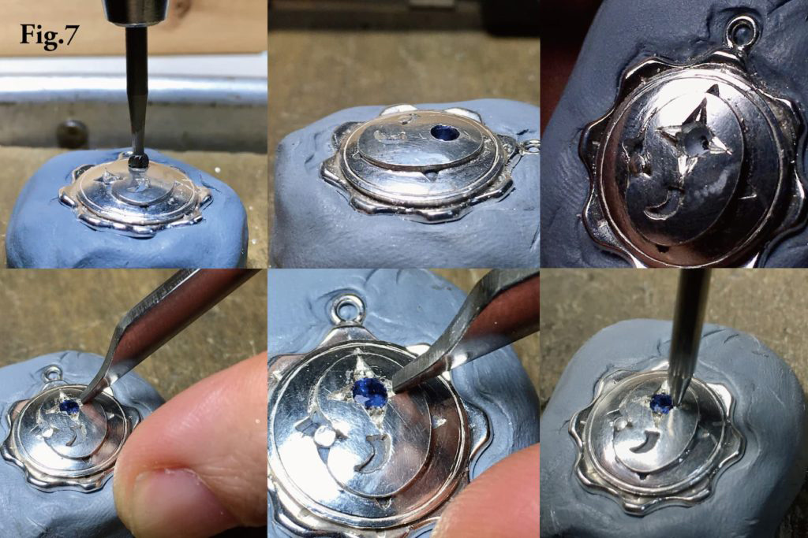
  

ヒートフォームというヤニの一種で本体を固定。 
ピンバイスにドリルを取り付け、石を留める場所に穴あけ。 
ドーム状の面に対して、法線方向にドリルを立てる事を意識。 
裏側に明かり取りを糸鋸で細工。表から見ると丸穴、裏から見ると角穴になります。(Fig.6) 
高級宝飾はこういった裏側の細工の差で大体分かると言われております。 

表側の穴をすり鉢状に広げて石の平面が地金面とツライチに収まるように調整。 
一旦石を取り出してから、爪になる部分をタガネで彫り出す。 
彫れたら、再び石を収めてタガネで爪を寄せる。石が傾かない様に対角にある爪を少しずつ寄せ、石留めします。 
半球状のタガネで爪の形を丸く整える。(Fig.7)   

### **5. 彫り**（Fig.8〜9） 

落書きを参考にしつつ、現物合わせの即興で良い感じになるよう彫っていきます。 

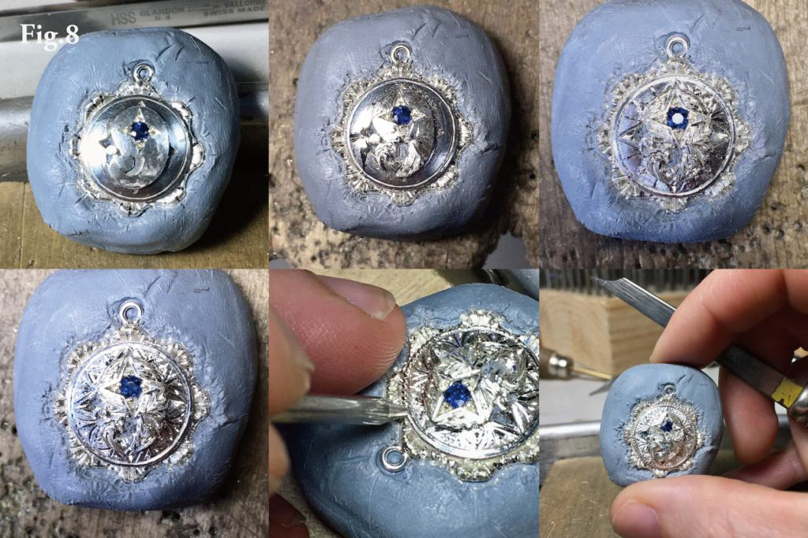
  

私はちょっとマイナーな工具、洋彫りタガネ“Ciappola”というものを使ってます。 
これには基本的に三角刀“Ongella”、丸刀“Mezza-tonda”、平刀“Piana”の三種の形状と、絹目テクスチャ用の“Rigata”があります。 
それぞれ大小各種サイズがあり、使い分けながら彫刻します。 
直線や曲線以外に、手首をひねりながら点々やギザギザを描く“Tremble”なる技法もあります。 
円形のフチには粒状の装飾“Mille-grane”を自作のミルタガネで入れました。 
最後に金具を閉じて余分な線材を切除し、細かい部分の仕上げを行って完成。  

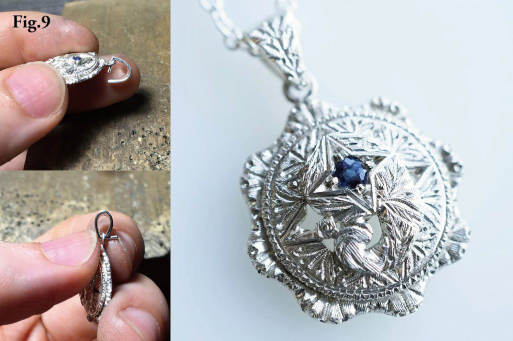
  

今回は主役の数字“9”が目立たなくなってしまったのが、大きな反省点です。 
もしまた機会があれば、彫りの手数の差で明暗のコントラストをつけて、数字を際立たせるようにしたいと思います。 

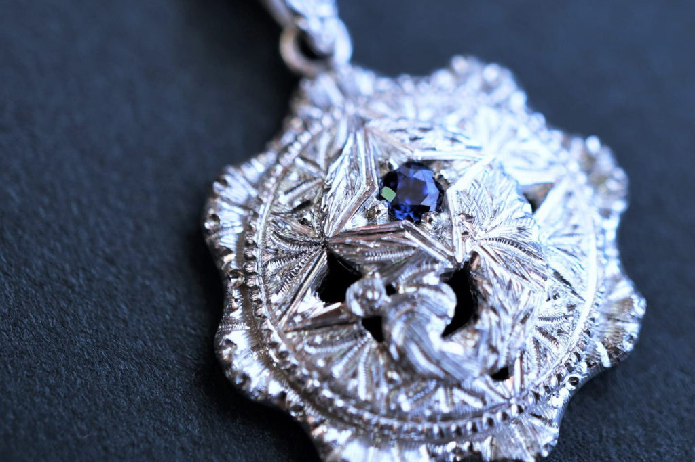
  

大変長い説明となりましたが、お読みいただきありがとうございます。 
お疲れ様でした。

    

### **作者紹介** 

**Root n / いしい ひかる** 

イタリアの伝統的な彫金技法でジュエリー作ってます。 
石、光らせます。 
[https://hikaruishi.com/](https://hikaruishi.com/)
  

（Last Updated: 2023.04.11）

