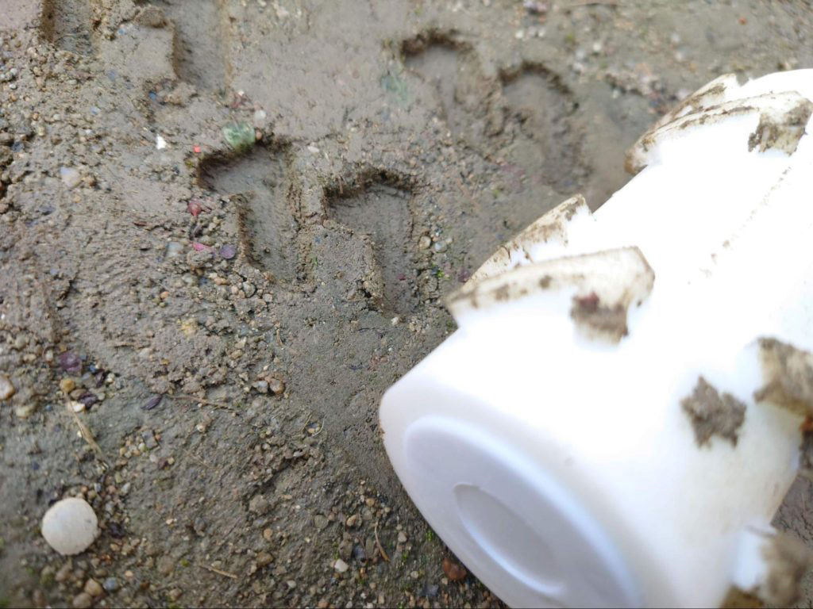
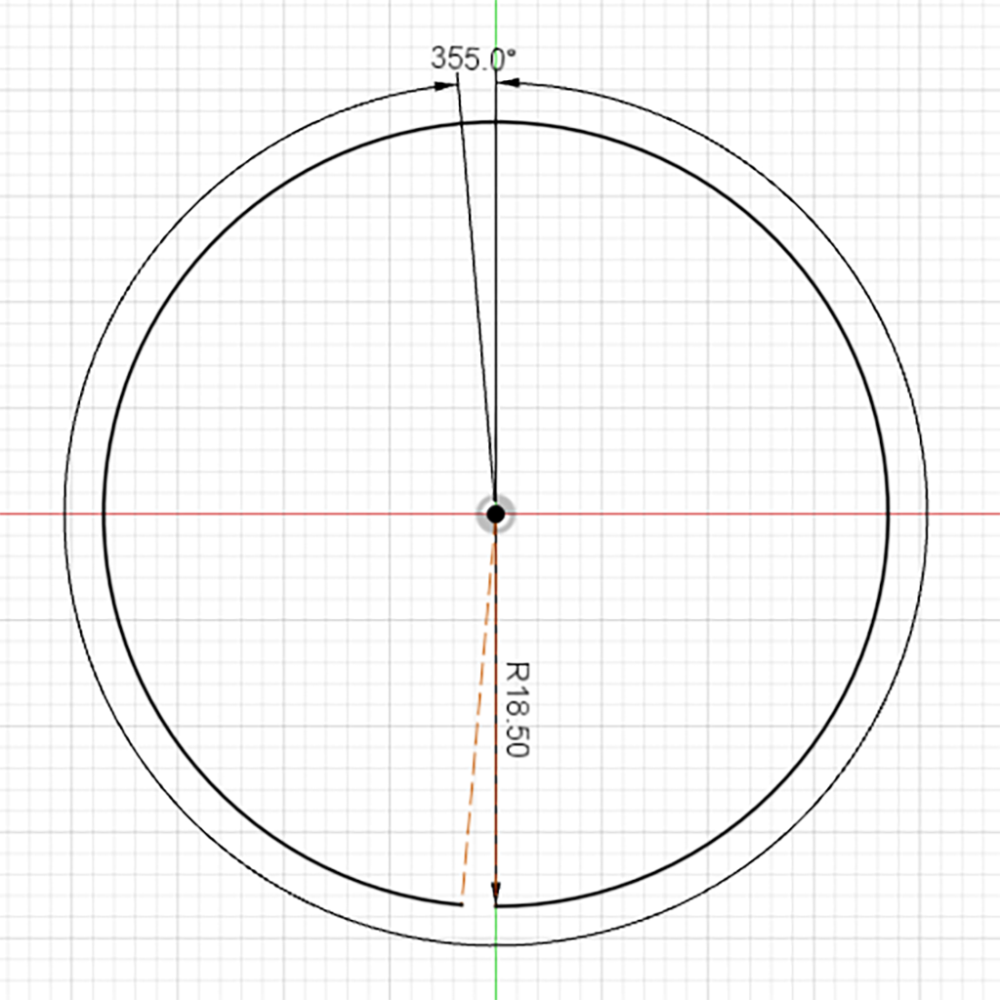
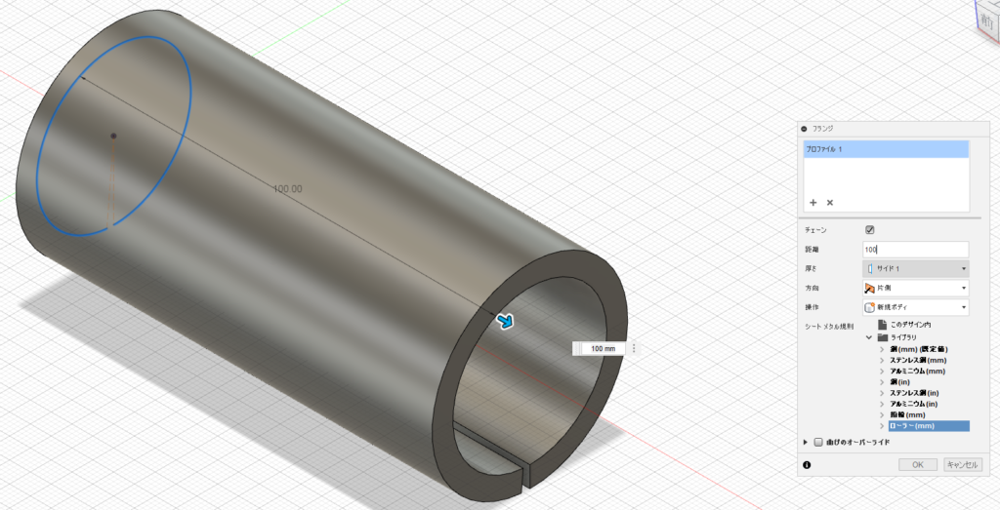
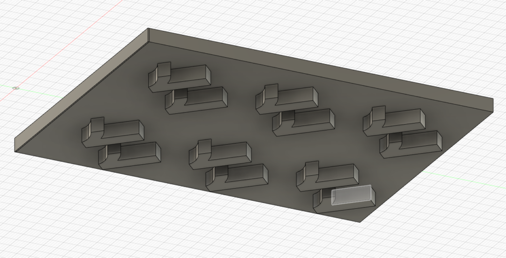
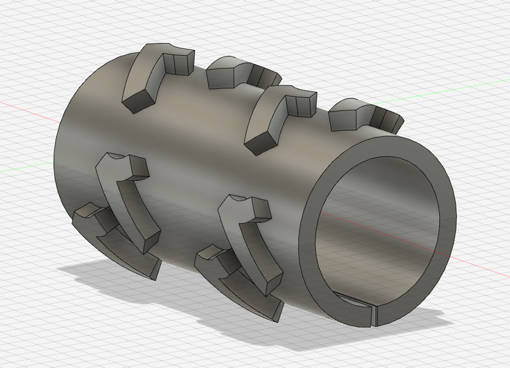
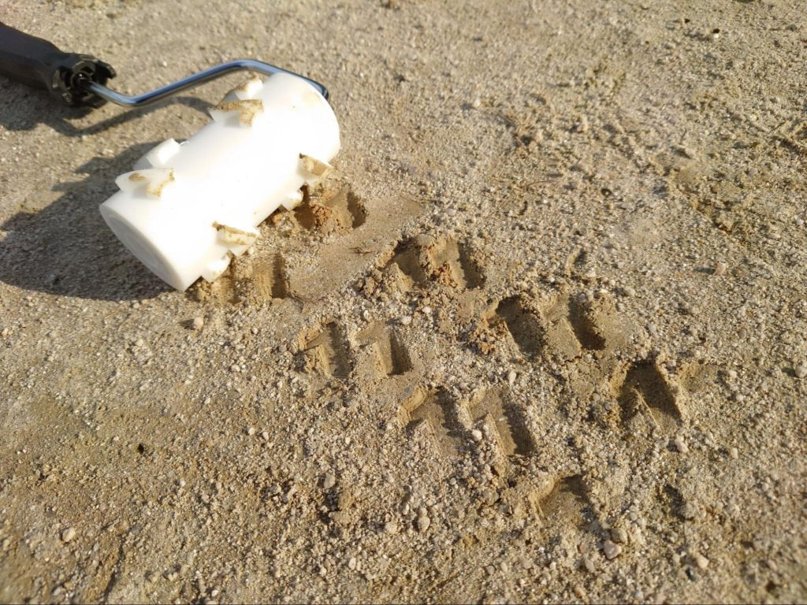

 

## **#11/25 [ 2021/12/11 ]** 
### by Mizuki Suzutani
  

 

「11」を担当させてもらいました。 
福岡市のエンジニアカフェにいる鈴谷です。 
 
今回は、『持続可能ないたずら』をテーマに、怒られなさそうな落書きローラーをつくりました。 
みんなで街に自分のデザインを加えていきましょう。 

 

### **材料**

* Afinia ABS Plusフィラメント
* カンペハピオ　UTローラーハンドル　4インチ
* 砂場

 

### **技術**

使用した道具

* Fusion360 (3D CAD)
* Afinia H+1 (3D プリンター)

 

### **作り方**
 

### **1. 『どんな模様を地面に刻みたいのか』を考える**
 

まず、土に刻む文字を考えます。 
あまり細かい模様は刻めないので、太いデザインにすると良いです。 
IllustratorなどでデザインしてDXFファイルでエクスポートしてもOK。 

今回は『11』を繰り返す模様にしました。
   

### **2. 塗装ローラーの採寸をする**
 

今回は印面を3Dプリントし、それを塗装ローラーに装着します。 

[https://www.amazon.co.jp/dp/B01B11GZOQ](https://www.amazon.co.jp/dp/B01B11GZOQ)

今回は4インチローラーを使います。 
使用したのは上のリンクとは異なるメーカーのものですが、だいたい同じサイズです。 
購入したもののローラー部の実寸を計測したところ、直径37～38mm、幅が100mmでした。
   

### **3. モデリングする**
 

円筒形状の側面にモデリングするので、Fusion360の「シートメタル」機能を使います。 

  

まず、一部だけちょっと欠けた円弧のスケッチを描きます 

  

シートメタルの「フランジ」機能で一部欠けた筒にして 

  

丸まっている部分を伸ばしてから下の面に図柄を左右反転してモデリングして、全部のモデルを結合してから 

  

「面を再折り曲げ」ボタンを押すと丸まります 
スキマをめるモデルをつくって結合させるとモデル完成！   

### **4. 3Dプリントして完成！**
 

3Dプリントしてローラーに填めました。充填率高めでプリントするのがおすすめ。 

  

この写真を撮るために福岡市中心部をさまよったんですが、都市部の公園って砂場とか無いんですね…… 

硬い土とか、水で濡れて泥状になっている地面の上でコロコロすると模様がつきます。 
雨が降ったら元通りになると思いますが、つまずかないように適度に元に戻しておきましょう。 

怒られない落書きをどろんこの上にしてあそびましょう！ 
固まる前のモルタルの上とか、焼く前の土器の表面とかでコロコロして模様つけてもおもしろいかも。

    

### **作者紹介**
 

**エンジニアカフェ** 

『エンジニアが集まる、活躍する、成長する街、福岡。』を掲げる福岡市の 
「エンジニアフレンドリーシティ福岡」活動の一環として、福岡市赤煉瓦文化館内に2019年8月21日オープン。 
エンジニアがより先鋭的なチャレンジやスキルの幅を広げることができることで 
多様多種の方に様々な機会を提供したいという想いから、官民一体で生まれたエンジニアのための施設です。 
[https://engineercafe.jp/](https://engineercafe.jp/)
  

**鈴谷 瑞樹** 

3Dプリンタ、レーザーカッター、CNCミリングマシンなどの機器を使い、 
ハードなものづくり（製造）からソフトなものづくり（IT）まで、幅広い知識と経験をもとに、 
ベンチャー企業の製品開発や、アーティストの作品制作支援を行う。各地のファブラボの立ち上げにも携わる。
  

（Last Updated: 2023.04.11）

