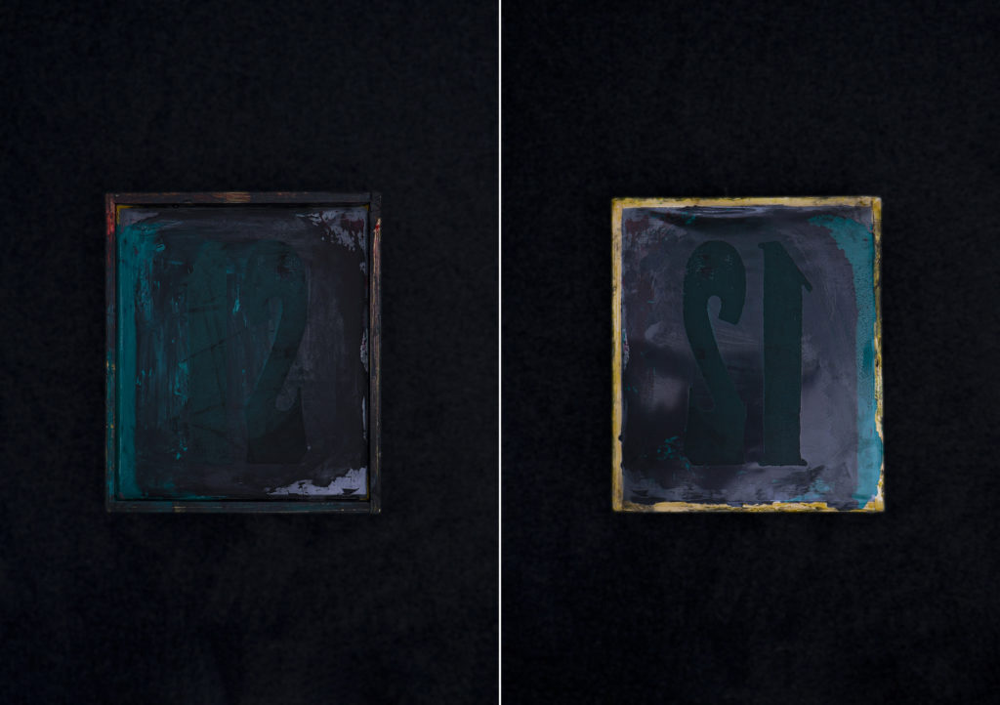
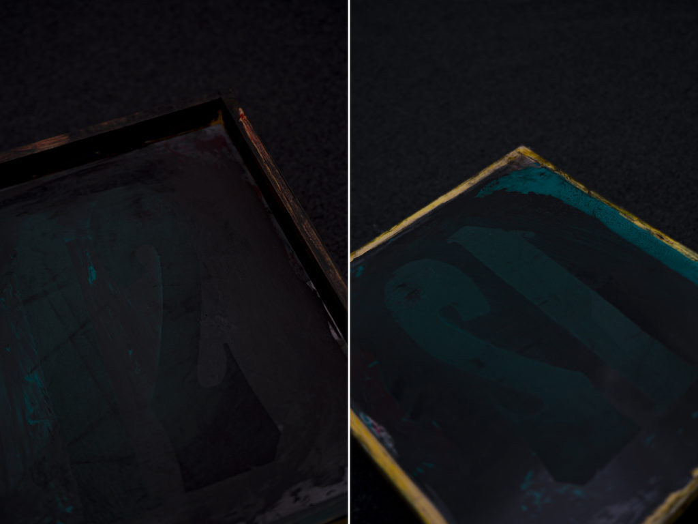

 

## **#12/25 [ 2021/12/12 ]** 
### by Yo Ooe
  

「１２」担当の大江です。 
今回はまず、「アドベント」をより深く理解するため、宮城県登美市にある「アドベント・フォーク・ミュージアム」へ訪れてのリサーチからはじめ、その文脈の源流をたどりました。
   

**-1　アドベント考**
 

アドベントの歴史は古く、多様なかたちがある。 
「アド＝加算する」という語にも関連づけられるように、スイス・ジェスミロー地方には、数字を羊皮紙などに刻印していくタイプの風習が記録されているし、17世紀のパキャロでは、「方向」や「向かうべき場所」という意味での「advert」に類似したカレンダーが残ってもいる。少々乱暴な考察ではあるものの「告知＝アドバタイジング」の由来を「アドベント」に求める向きも一部では再燃していて、コンテキストに多様性が出てきていることは喜ばしいことでもある。   

**-2　刻印型アドベントの歴史**
 

ジェスミローでの刻印型アドベントや、パキャロの告知カレンダーのような形態は、どの時点で現在のアドベントから分岐し、そして消えて行ったのか？という疑問が立ち上がる。当然、それらが行われていた時期は産業革命間も無いため、既製品や量産品として出回っていた可能性は少ないかもしれない。おそらくは、キリスト教の友愛精神によって形作られたギルドや州族内で、職人や材料工らによる相互扶助によりちまちまと作られていたことが想像できる。 
さまざまな宗教や民俗が証明しているように、それらが形骸化する際に最初に失われるのは、それらを作るための職人や治具、道具、そしてその製法自体である。アドベント史においても例外ではなく、アドベントの風習にかかわった職人、治具や道具、製法がしっかりと伝わっているケースは稀である。 
そんな状況のなか、わたしたちは「１２」のアドベント制作の手がかりを得るため、さらには、ジェスミロー地方やパキャロで行われていた特殊なアドベントは、なぜ起こり、なぜ廃れたのか、という学びを得るために「アドベント・フォーク・ミュージアム」へ行った。   

**-3　アドベント・フォーク・ミュージアムにて**
 

宮城県登美市の市街地からほどちかい立地の「アドベント・フォーク・ミュージアム」は、そのアドベントの量・質とともに世界トップクラスであるばかりか、その多岐に及ぶアーカイブとそれらに対する丹念なコンテキスト研究の立体的視座が評価されており、アドベント史家ばかりではなく、文化人類学、材料学、文化美学、宗教芸術学などさまざまな分野から注目されているそうだ。 

館長の亜土氏に、アドベントについてお話を伺った。 

「ひとくちにアドベント、というと、今の日本では、数字にそってお菓子を食べたり、すでに数字があつらえてある方式が主流ですよね。もともとは、必ずしもそうではなかった、という研究も世界中に多くあるんです。そもそも、「到来を待つ」という行為自体が大切だったところから、しだいにその「周辺」が重要になっていった流れがある。これはほかのさまざまな行事や民俗をみても自然なながれなのですが、祭りだって最初は「祈り」や「願い」だったものが、しだいにイベント化、エンタメ化していって今に至りますよね？アドベントもこうした流れをもっていた。つまり「待つ楽しさ」が大きくなっていったと。実際、いまもその進化の途中なんだとわたしたちは考えています。」   

**-4　刻印方アドベントのすがた**
 

ここで、前述したジェスミロー地方やパキャロのアドベントについてのお話に。 

「刻印方のアドベントは、ほんとうに一部の地域で発展したのみで、いまではかぎられた道具や資料が、各地の資料館に残るばかりです。」 

  

そう話しながら案内してくれたブースには、刻印のための「アドベント原版」が展示されていた。（写真／提供・アドベントフォークミュージアム） 
この「アドベント原版１２」はイタリア西部トーシュで使われていたものだそうで、おおよそ1600年後期のものだとされているそうだ。日本で収蔵されているアドベント原版のなかでは最古のもので、千葉の何瓶美民俗資料館に保管される「７」のアドベント原版に比べ100年以上も古いものだという。 

「当時の記録は非常に少ないですが、ニカワやマツヤニに泥やススなんかを混ぜたものをインクにして、着なくなった衣服などにこの原版を通して刻印したそうです。刻印してまわる役目の人もいて、『リートン』と呼ばれた役目なのですが、毎年その村で一番おおく口内炎ができた女性から選ばれた、という記述もあるんです。」 

たしかに、現在のようにどこでもだれでも日時がわかる状況と、当時の人々の日付の認識にはおおいに違いがあっただろう。日本だって、太陽暦が採用されたのは比較的最近である。そんなことを考えると、こんなふうに「日付を刻印して、到来を心待ちにする」という形の方がより自然であるとも思えてきた。 

   

**-5　探究はつづく**
 

さて、今回は残念ながら、ここで亜土館長の深爪が悪化してしまったとのことで、取材は解散とあいなってしまった。実際に「アドベント原版」を用いて刻印したテキスタイルなどのお目見えは次回にお預けであるばかりか、その後の歴史の変遷も聞けず、「１２」のアドベント制作の手がかりもなんだかままならないまま、宙ぶらりんではある。しかし、わたしたちのアドベント探究はまだ始まったばかり。その奥深さと魅力は増しつづけている。 
時代や民俗をこえて存在する「アドベント」という風習に長く向き合いながら、豊かさを待ち続けたい勇気がわいたような、そんな晴れやかな気持ちでミュージアムを後にしたのであった。 

終わり   

---

  

### **材料**

* 木
* にかわ
* 紗

 

### **技術**

* デジタル孔版によるfabrication

 

### **取材先**
宮城県登美市柚木２３−１６１０ 
（社）アドベント・フォーク・ミュージアム 
代表：亜土健斗（館長）

    

### **作った人**
 

**大江 よう** 

仙台を拠点に、言葉により織り上げられるテキスト、繊維によって織り上げられるテキスタイルとを取り扱いながら、コンテキスト＝文脈を探るテキスタイルファンデーション「ＴＥＸＴ」を主宰。アドベントリサーチャー。
  

（Last Updated: 2023.04.11）

