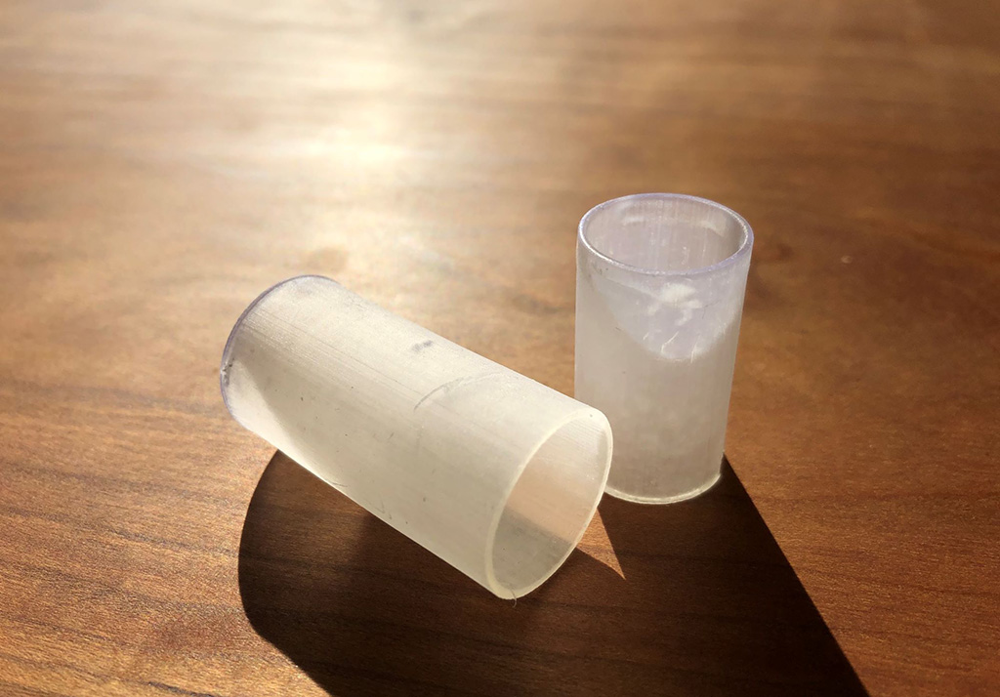

 

## **#13/25 [ 2021/12/13 ]** 
### by 乙女電芸部
  

 

LEDを光源に、マクロレンズで「13」を拡大して映し出すミニ投影機を作りました！ 
3Dプリンタの工程を飛ばしても作れるので、お子様の家庭での工作にもおすすめです。 

 

### **材料**

* OHPシート
* スマホ用マクロレンズ（100均で販売されているもの）
* 3Dプリンタ用溶剤
* 装飾用のホイル折り紙、チャーム
* LED＋ボタン電池（スマートフォンのライト等で代用可）
* 両面テープ
* セロテープ

 

### **技術**

使用した道具

* Adobe Illustrator
* Fusion360
* 3Dプリンタ

 

### **作り方**
 

### **1. LEDで照らされたらかわいい13を試作。**
 

今回LEDを光源に、かなりミニサイズの13を作ることにしました。 
小さい像でも文字がはっきりと見え、かつ、ポワっと光ってかわいいイラストになるように 
イラストの細かさがバラバラの13を色々作ってみました。イメージはクリスマスオーナメントです。 
マクロレンズは凸レンズなので、投影すると上下左右の向きが反転してうつされます。 
そのためプリント用はあらかじめ反転した数字にしています。 

   

### **2. OHPシートにイラストを印刷**
 

マクロレンズの大きさに合わせてイラストを配置し、インクジェットプリンターでOHPシートに印刷します。 
全柄サイズ違いをあらかじめ用意して実験した結果、 
一番輪郭がくっきりしていてカラフルなろうそくのイラストを小さく印刷した部分を使うことにしました。 

OHPシートに油性ペンで直接イラストを描いてもOKです。 
ただし描画エリアが小さいため細かい描写は難しいのと、液溜まりのムラが出やすいです。 

   

### **3. 投影機のケースを作成**
 

マクロレンズの直径に合わせた筒を3Dプリンタで作ります。 
焦点距離が30mmのマクロレンズだったので、長さは30mmです。 
さらにその筒より1mm程度直径の大きな筒も作ります。 
こちらは光源を固定するための筒です。（長さは40mmにしましたがもう少し長くてもOK） 

   

### **4. 組み立て、装飾**
 

細い方の筒の片側にマクロレンズ、反対側に丸く切ったOHPシートを貼ります。 
両方の筒にホイル折り紙を両面テープで巻きつけ装飾します。 
投影する向きの確認用に金色のチャームも貼ってみました。 

太い方の筒の中にOHPシートを貼った細い方の筒を差し込みます。 
この2つの筒をスライドすると光源からの距離を調節できる仕組みです。 
（ただし、太い方の筒は像の周りに余分な光が漏れることを防ぐために用意したので、なくても投影自体は楽しむことができます。細い方の筒のみをボール紙等を丸めて作るのもあり、です） 

 

   

### **5. 完成！投影してみましょう。**
 

部屋を暗くしたら、ミニ投影機の後ろ側から光を当て、壁などに向けてみましょう。 

  

ふんわりと数字が浮かび上がりました！ 

LEDはスマートフォンのライトなどでも代用できます。 
家の中の色々なライトで試してみたところ、 
乳白色のカバーのついたルームライトが程よい明るさが均一に照らされ、綺麗に投影できました。 
カバーで広く拡散されているため、面光源になっているからですね。 

  

色々なところに投影して遊んでみましょう！ 

  

クリスマス飾りの一部にしてみたり・・・ 

  

サンタさんのひげにも映せました。  

---

 
私たち乙女電芸部はLEDを使った工作やワークショップをたくさん開催しているのですが、 
ミニ投影機づくりは初めての挑戦でした。 
暗い部屋にふわりと数字が灯されたらクリスマスらしく心あたまるインテリアになりそう！と思って作ってみたのですが、 
予想以上にかわいらしく楽しいアイテムとなりました。 
OHPシートを貼り替えれば幅広い遊び方ができそうです。 
制作の際の意外なハードルが、マクロレンズが100円ショップでなかなか見つけられなかったこと。 
見かけたらぜひゲットしてミニ投影機づくりに挑戦してみてください！

    

### **作者紹介**
 

**乙女電芸部** 

毎日がちょっと楽しくなる『自分のためのものづくり』をしよう！を合言葉に活動しているDIYグループ。 
今までの手芸や工作に電子工作をプラスした作品づくりや、出張ワークショップ、作品展示などで活動中。 
BASE『乙女電芸部のキット販売SHOP』にてキットを販売。 
makezine.jpにておとでん通信を連載中。 
[乙女電芸部のwebサイト](https://otomedengeibu.com/)
  

（Last Updated: 2023.04.11）

