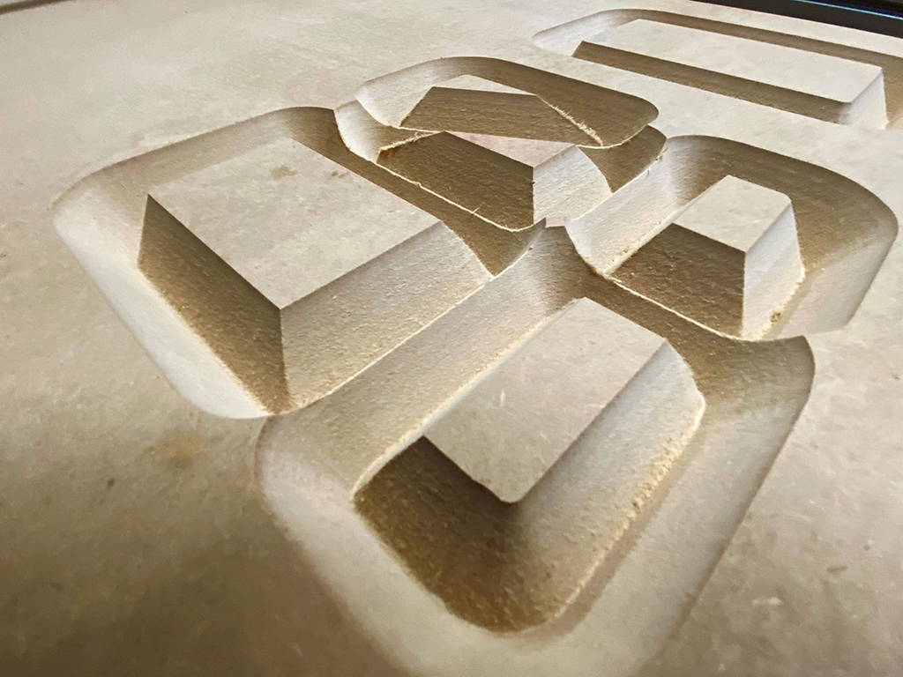

 

## **#14/25 [ 2021/12/14 ]** 
### by Yui Isawa
  

 

「14」って直線で構成されていて、とっても使い勝手が良さそう。 
ということで、今回は「14」型のお弁当容器を作りました。 

 

### **材料**

* MDF　24mm,4mm
* PET材　1mm

 

### **技術**

* illustrator
* ShopBot
* trotec speedy 300
* 真空成型機

 

### **作り方**
 

### **1. データを作る**
 

アイデアを練る段階でベースのイメージが出来上がっていたので、illustratorとRhinocerosを行ったり来たりしながらサイズや形の微調整をしていきます。ゴリゴリにモデリングして切削する時間が取れないので、雰囲気を掴めれば大丈夫。今回制作に使うデータはillustratorの平面データだけです。 

   

### **2. 型作り**
 

今回は速さを求めてShopBotと60°のVビット、スクエアエンドミルでざざっと削っていきます。 
砂漠の遺跡みたいになりましたが、こちらが今回食材を入れるポケット部分になっていきます。 

  

レーザー加工機で位置決めとフチ部分のパーツを作成します。 
ShopBotで一気に削ってもよかったのですが、 
調整が必要になる予感がしたので、バラせる仕様にしました。 
リサイクルの識別表記は切削パーツにレーザー加工機で彫刻します。 

   

### **3. 成形**
 

真空成型機にセットして、成形します。 
加熱し過ぎてしまいちょっと気泡が入ってしまいましたが、 
切削したMDFのテクスチャも相まって良い感じなので、このまま進めます。 

   

### **4. 仕上げをして完成！！**
 

いらない部分をカットして、フチの部分に軽くやすりをかけます。 
今回は食品を入れることを想定しているため、食器用洗剤でよく洗います。 

  

PET材なので電子レンジで温められないのが反省ポイント。 
撮影に使った食材は美味しくいただきました。

    

### **作者紹介**
 

**伊澤 宥依** 

岐阜県にある情報科学芸術大学院大学にて、 
デジタルファブリケーションを活用した制作や研究のサポートを行っています。 
透明な素材とヌメヌメした形が好きです。
  

（Last Updated: 2023.04.11）

