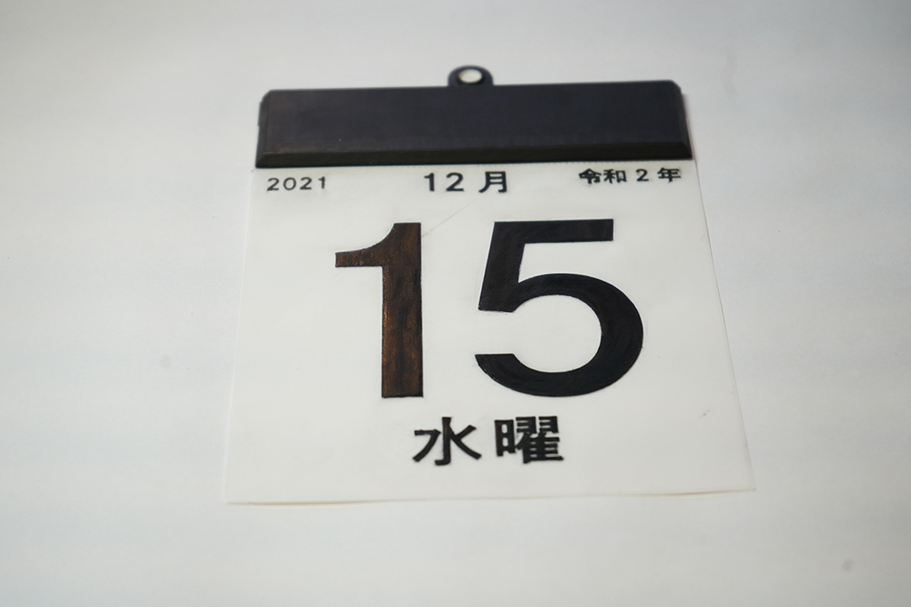

 

## **#15/25 [ 2021/12/15 ]** 
### by Daisuke Toyozumi
  

 

### **材料**

* PLA (Poly Terra)

 

### **技術**

* 3Dプリンタ

 

### **その他**

* ヤスリ
* ポスカ

  

「樹脂を破る」という響きの良さ。 
「15」をつくるという依頼に対して、「15日のカレンダーをつくる。」に。 

出力ファイル間違いにより偶然生まれた0.2mmシートから思いついたアイデアです。 
僕の好きなクロマティコというトレーシングペーパーに質感が似ていてちょっと楽しかったです。 
ぜひ樹脂を破ってみてください 

※14日夜になって、令和2年というに盛大な凡ミスに気付きました。フワッと見逃してください。 

<iframe loading="lazy" src="https://player.vimeo.com/video/655785116?h=a192fec160" width="640" height="360" frameborder="0" allowfullscreen="allowfullscreen"></iframe>

  

### **作り方**
 

### **1.**
 

好きなフォント、サイズでスケッチをつくる。 
僕は、Adobe Illustratorで描いて、dxf書き出し→FUISON 360へ挿入しています。   

### **2.**
 

切り取り線は、0.4×1.2mmの長方形を0.8mm間隔で配置しています。
   

### **3.**
 

土台部分を0.2mm押し出す。
   

### **4.**
 

文字部分を0.6mm押し出す。
   

### **5.**
 

3Dプリントする
   

参考：切り取り線 

   

### **＞注意すること**
 

1.スクレーパーでベッドから剥がすとき簡単に破れるので慎重に。 
2.ベッドから引っ張って剥がそうとしても破れます。 
3.棒ヤスリを使うと角があたった際に破れます。 

 

 

    

### **作者紹介**
 

**豊住 大輔 – FabLab Oita** 

九州の大分県でのんびり活動しています。 
動画のカレンダー破るときの立ち位置、 
逆だったなということが気になっています。 
[https://www.faboita.org/](https://www.faboita.org/)
  

（Last Updated: 2023.04.11）

