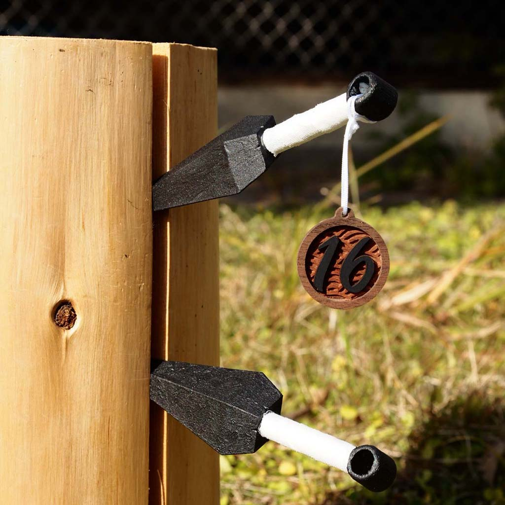
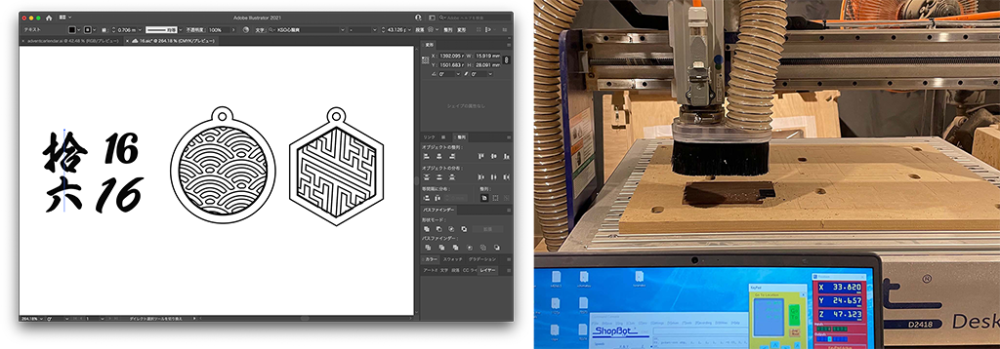
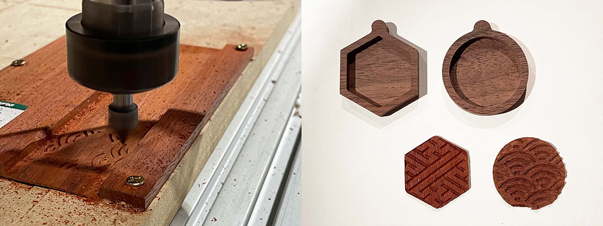
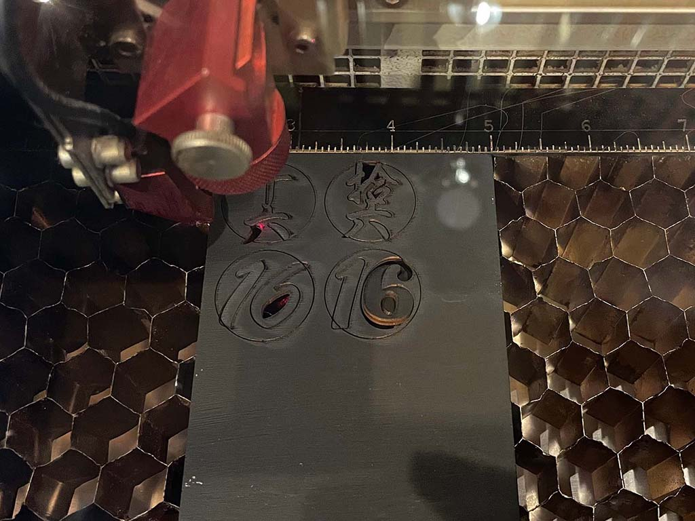
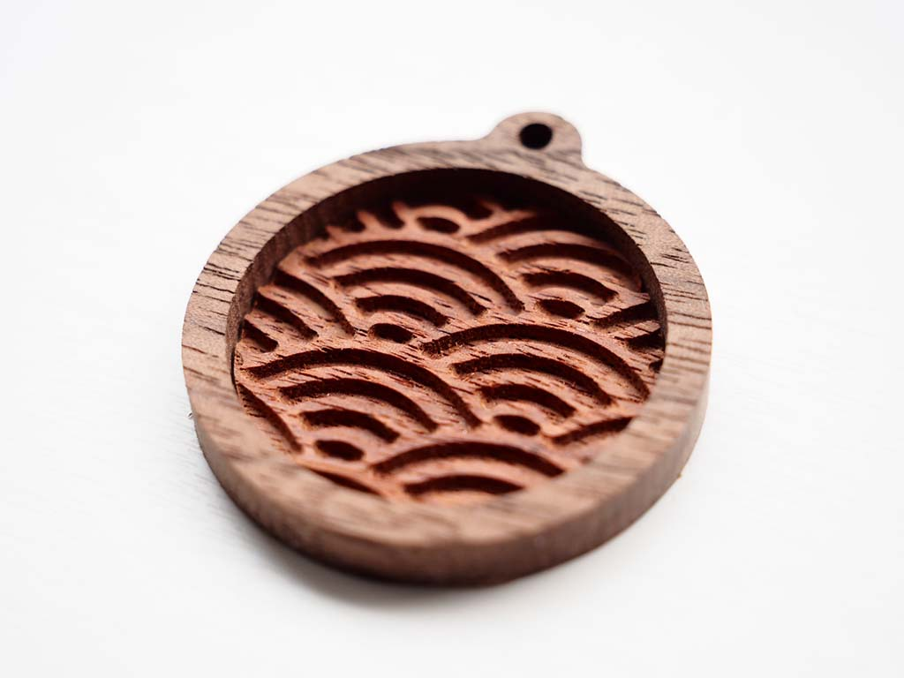
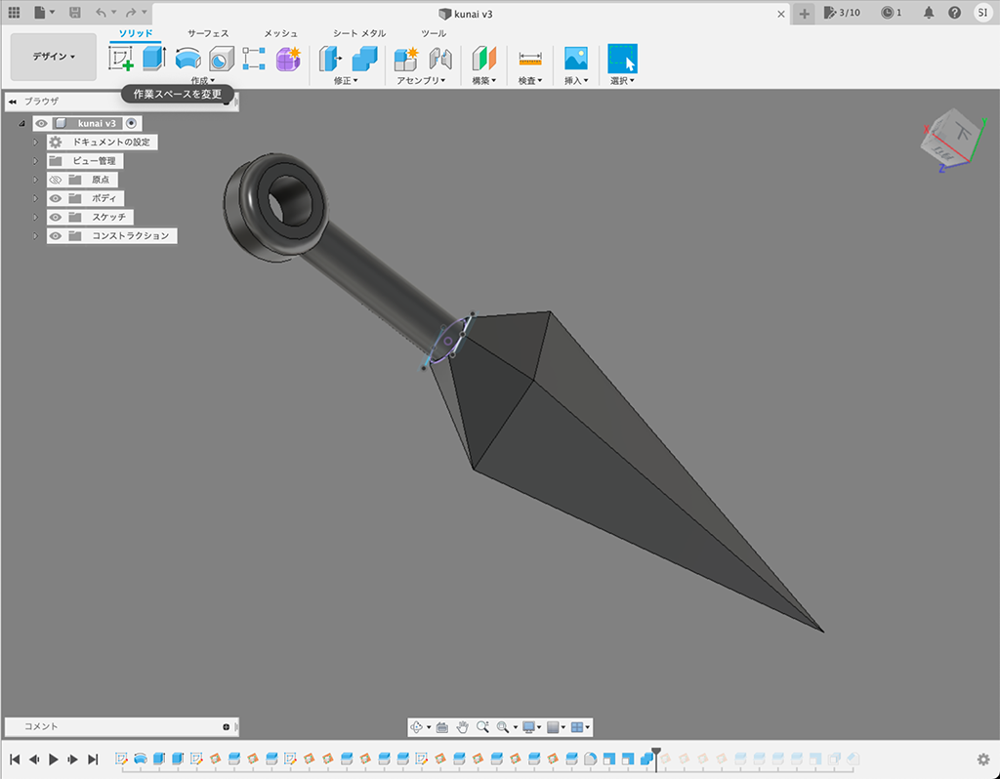
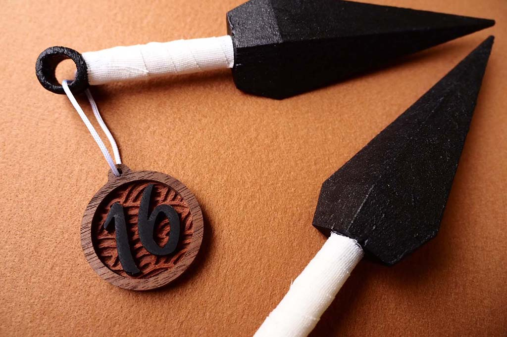

 

## **#16/25 [ 2021/12/16 ]** 
### by Miki Nakazawa & Shinnosuke Irie
  

 

「変わり身の術」を作りたくなっちゃった人と、 
CNCでしかできないことをやりたくなっちゃった人が 
妥協点を見つけながらコラボ制作しました。 

 

### **材料**

* 銘木板ウォルナット（5mm厚・ベース板）※お好きな色で
* 銘木板（5mm厚・和柄刻印パーツ）※お好きな色で
* シナベニヤ（2mm厚・文字用）艶消し黒で塗装
* アイアンペイント アイアンブラック
* 白いテーピング（おすすめは幅10mm）

 

### **技術**

* データ作成：adobe Illustrator/FUSION360
* レーザーカット：trotec Speedy100
* CNCミリングマシン：ShopBot Desktop
* 3Dプリンタ：Afinia H400

 

### **作り方**
 

### **1. Illustratorで作ったデータをもとにCNCで銘木板を加工します。**
 

  

**【ベースパーツ】** 

直径1/8のビットを使用し、3.5mmのポケット加工とカットを行います。 
 

**【和柄パーツ】** 

まず元の木が5mmのものしかなかったため、表面を一度広いビットで削ることで、厚みを2mmに薄くします。 
そのあと先端が尖っているVビットを使い、和柄を彫刻しました。 
（薄すぎて紙ヤスリでバリをとっているときに欠けたり…） 

  

まず元の木が5mmのものしかなかったため、表面を一度広いビットで削ることで、厚みを2mmに薄くします。

   

### **2. レーザーカッターで文字をカットします**
 

数字にするか、まだ誰もいない漢数字に手を出すか最後まで悩みました。 

   

### **3. 16の紋章の組立**
 

和柄部材をベース板にはめ込みます。（ピッタリにしたのでボンドなしでとまります） 

  

その後、文字をボンド接着。（細かい文字のボンド接着は[アクリアのスティックボンド](https://www.amazon.co.jp/%E3%82%A2%E3%83%AB%E3%83%86%E3%82%B3-%E3%83%91%E3%83%AF%E3%83%BC%E3%82%A8%E3%83%BC%E3%82%B9-%E9%80%9F%E4%B9%BE%E3%82%A2%E3%82%AF%E3%83%AA%E3%82%A2-%E3%82%B9%E3%83%86%E3%82%A3%E3%83%83%E3%82%AF-A03/dp/B002XT2RHA/ref=asc_df_B002XT2RHA/?tag=jpgo-22&linkCode=df0&hvadid=253374355083&hvpos=&hvnetw=g&hvrand=7879292666319161622&hvpone=&hvptwo=&hvqmt=&hvdev=c&hvdvcmdl=&hvlocint=&hvlocphy=1009331&hvtargid=pla-632734486272&th=1)がおすすめです） 
紐を通す穴を開けて、紐を通します。穴に関しては今回は後からドリルで開けました。

   

### **4. 苦無をモデリングします**
 

Fusion 360でモデリングしました。 

   

### **5. 3Dプリンターで苦無を出力し塗装します**
 

アイアンペイントを使いました。 

締めにテーピングを巻きます。 
細めがオススメです。 

 

### **7. 完成**
 

苦無に16の紋章をつけて、丸太の溝にいい感じに突き刺さって完成。 

 

    

### **作者紹介**
 

**中澤 未来** 

FabLab太宰府で立ち上げから５年間マネージャー兼ファブマスターを勤めていました。 
今は鎌倉でフリーランスとして「つくることで学べる」もしくは「つくる敷居を下げる」の 
ワークショップやプロジェクトに参加させてもらっています。
  

**入江 信之介** 

鎌倉に住む戦国系フロントエンジニア。グミが好き。
  

（Last Updated: 2023.04.11）

