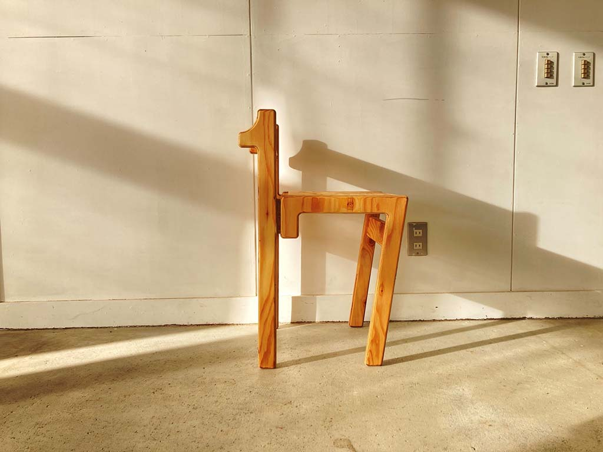
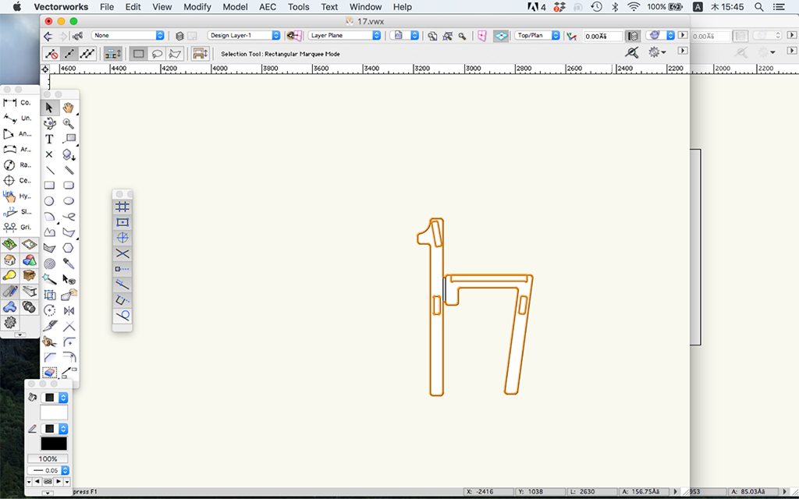
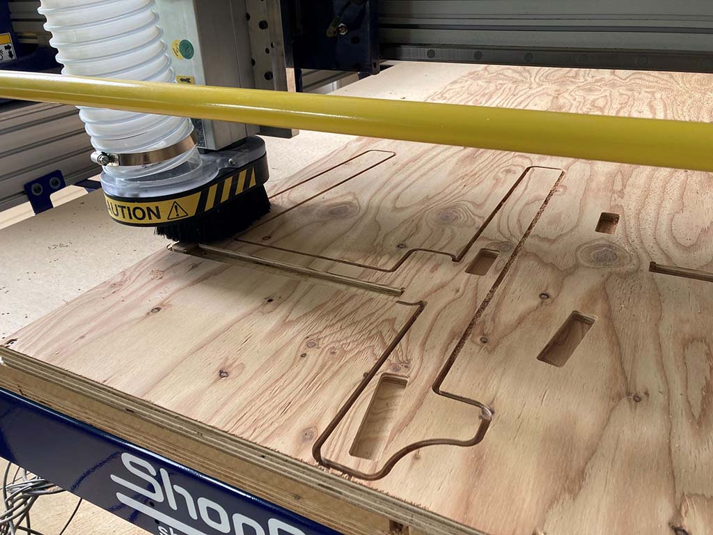
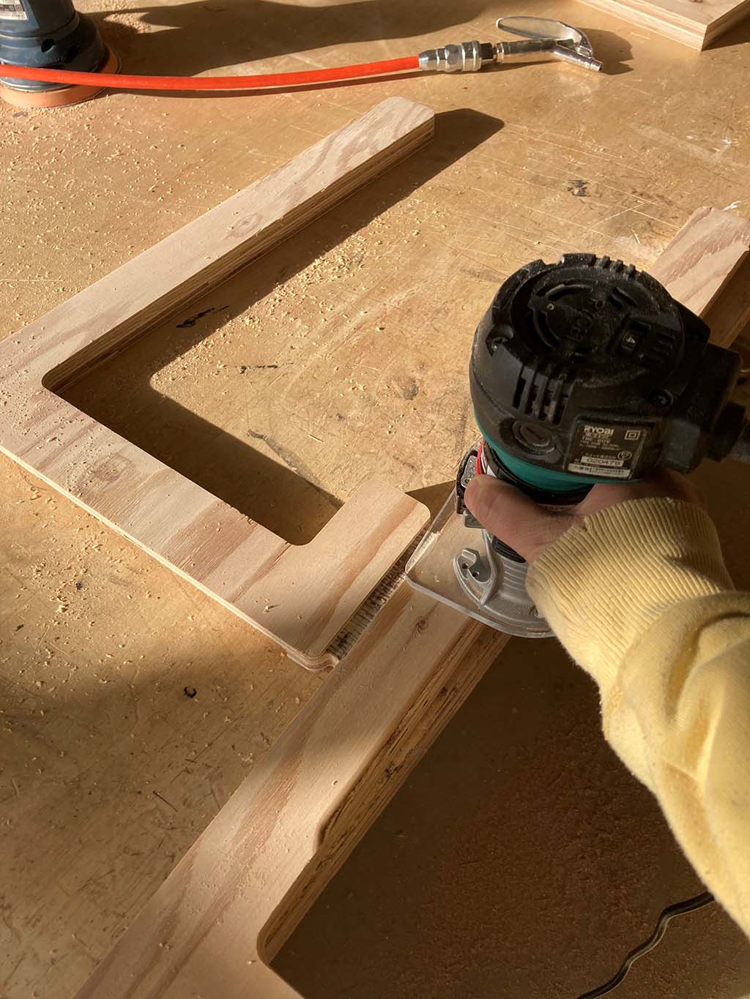
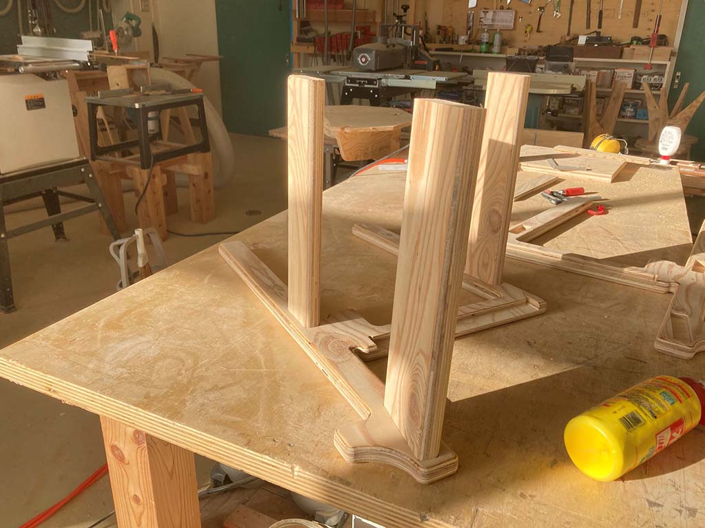
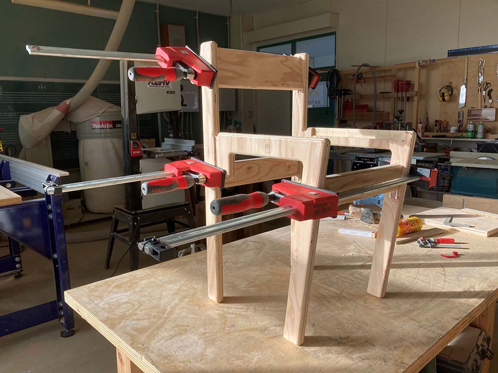
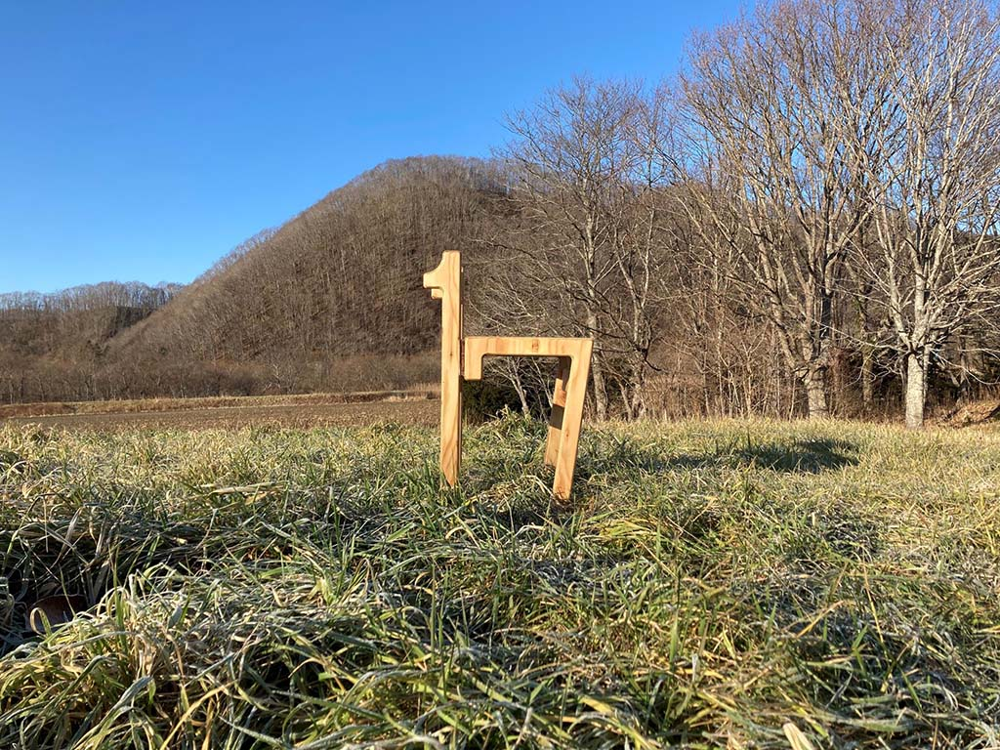
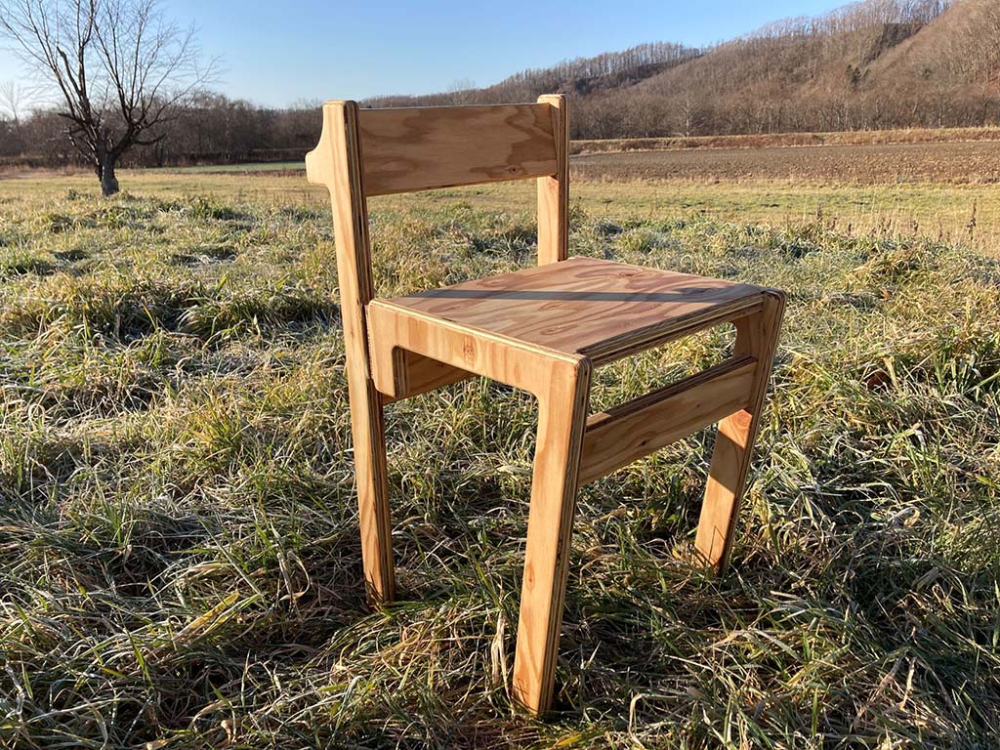
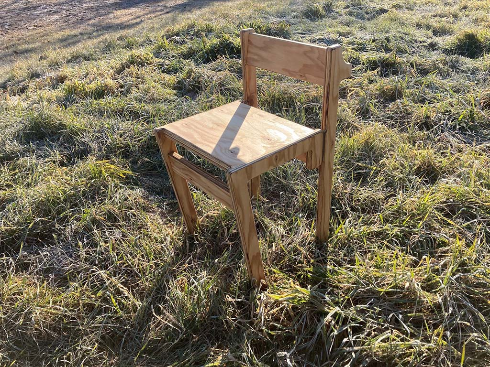
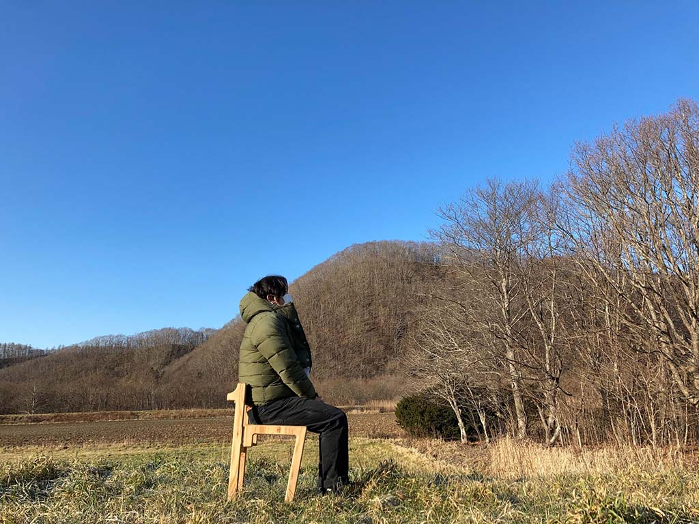

 

## **#17/25 [ 2021/12/17 ]** 
### by Yu Kono
  

 

### **材料**

* 針葉樹合板24mm
* 木工用ボンド
* オスモエクストラクリヤー

 

### **技術**

デジタルツール
* Vectorworks(CAD)
* Shopbot(CNC)

アナログツール
* ルーター
* ランダムサンダー
* クランプ

 

### **作り方**
 

### **0. モノローグ**
 

それは10月半ばのことだった。 
私が家具制作の活動の拠点にしている浦幌町という北海道の道東にある街で 
いつものようにShopbotを使って家具のパーツを切り出していた。 
しかし、その日はいつもとは違った。パーツを切り出そうにもShopbotは原点0から動くことはなかった。 
Shopbotの公式サイトでトラブルシューティングの方法を確認して実行するが何も変わらない。 
スピンドルだけは自らの出番を待つように回転をすることが唯一の救いだった。 

株式会社VUILDさんのカスタマーサポートに連絡すると同時にマイメン拓真a.k.a Fab Masterに連絡をすることにした。 
彼の黒縁メガネの奥にある瞳の一瞬で問題を発見し解決する能力に絶対的な信頼を置いているからだ。 
拓真からのアドバイスは的確だった。しかしShopbotは動かない。 
コントロールボックスを開けても何が何だかわからない。パソコンも初期化した。 
「そういえば、使い方はわかるけどShopbotの仕組み理解してなさすぎるんじゃね？ 
てか導入したときはフィンランドにいたわけだしレクチャーすらまともに受けてないからわかるわけねーじゃん。」 
そう、頭の中で声が聞こえた。 
とりあえず明日から1週間休みだ。休みが開けたら復活していることを願い私は作業場の照明を落とした。 

1週間後,私の願いは悲しくも天には届かなかったようだ。意を決してコントロールボックスを開ける。 
残された時間はあと3日。あと3日で非常勤をしている京都市立芸術大学の学生たちがShopbotを使いにくる。 
コントロールボックスの蓋の部分に配線図があることを初めて知る。それを見てもいまいちよくわからないが、 
文字列と線を目で追いながら確認する。目視では何度も確認した。わからない。 
配線を恐る恐る引っ張ってみる。すると1本の線が音も立てずに抜けた。 
「…これか！」 
それだった。全ての原因はその一本の線だった。 

問題箇所がなかなか見つからず様々な部分をメンテナンスしたため、以前よりもShopbotの調子はよくなっていた。 
マイメン拓真に直ったとお礼の連絡を入れる。 
その10日後ぐらいにマイメン拓真からアドベントカレンダーチャレンジに参加しませんか？と連絡が来た。 
「いつもお世話になってるし、マイメンからのお願いなら」二つ返事で参加を決めた。 
どうやらShopbotから抜けていた線は私と拓真を再び繋いでくれるために抜けていたのかもしれない。 

私に与えられた数字は「17」だった。ティーンエイジャーで言うなら一番鋭い時だ。初期衝動。いい数字だなと思った。 

ぜひ聴いていただきたい17にまつわる曲とともに17日をみなさんと祝いたいので曲のプレイリストも貼っておきます。 

<iframe allow="autoplay *; encrypted-media *; fullscreen *; clipboard-write" frameborder="0" height="450" style="width:100%;max-width:660px;overflow:hidden;border-radius:10px;" sandbox="allow-forms allow-popups allow-same-origin allow-scripts allow-storage-access-by-user-activation allow-top-navigation-by-user-activation" src="https://embed.music.apple.com/jp/playlist/2021-12-17/pl.u-MJqJu2KGZyJ?l=en"></iframe>
  

<iframe style="border-radius:12px" src="https://open.spotify.com/embed/playlist/1Jdp2Nr5yvRKIzqVOVwnvU?utm_source=generator&theme=0" width="100%" height="352" frameBorder="0" allowfullscreen="" allow="autoplay; clipboard-write; encrypted-media; fullscreen; picture-in-picture" loading="lazy"></iframe>

   

### **1. 17に座りたい（VectorWorksで作図）**
 

私は普段家具デザイン制作を主に行っている。 
そんな私に17という数字を与えるという時点で17に座りたい、17で作った家具が見てみたいと言っている様なものだ。 
いや、もしかしたら17って椅子っぽい形になるんじゃないと考えた上で数字を充てがわれた可能性も否定できない。 
楽して1/5ぐらいのスケールで作ることも考えたが相手は拓真、誤魔化しは通用しない。 
今回は頭の中で大体のイメージができていたのでVectorWorks上で作図するところから始めた。 
17という数字だとわかること、座れること、ウッドショックの影響で材料が高騰してるのでなるべく材料を使わず 
シンプルにまとめることをテーマにデザインを考えた。 

   

### **2. Shopbotで切り出し**
 

針葉樹合板24mmをワークテーブルの上に固定し、切り出しを行った。 
貫材や座面がはまる部分は12mmでポケット加工した後にアウトラインを掘削した。 
その日Shopbotは楽しそうに合板を掘削していた。 
人でも機械でも自分の与えられた役割を全うすることができると言うことは幸せなことなのかもしれない。 

   

### **3. 各パーツをルーターで角を丸くしヤスリをかける**
 

まず、ルーターに9Rのボーズ面ビットを装着しパーツのエッジを丸くした。 
今回はクリスマスを楽しみに待つ子供が頭をぶつけても痛くないように結構丸くした。 
話は変わるのだが、歳を重ねるごとに作るものが丸みを増し、体型も丸み増していくのはなぜなんだろうか… 
17才の尖った気持ちを忘れずに生きたい。 

   

### **4. 組み立て**
 

パーツが出来上がったところで、ポケット加工をしたところにボンドを入れ、 
貫となるパーツをはめ込んでクランプで圧着していく。 
Shopbotは基本的には円形のものが回転して掘削を行っていくためマイナスの入り込んだ形の部分は角が出ない。 
そこで、ドックボーン（骨型）かT型というフィレットの加工方法で 
角の部分を余分に削ることで四角いものがハマる加工をしていくのだが、 
ボーズ面のビットであらかじめ角を取り、受けのポケットもあらかじめボーズ面と同じ直径でRをつけておくことで 
そのような加工をしなくても綺麗にハマる。見える場所だとドックボーンとかT型のフィレットの隙間が結構気になる。 

 

   

### **5. 塗装して完成**
 

最後にオスモのエキストラクリアを塗装して完成。塗装をすることで艶がでて作品のクオリティが上がる。 
お風呂上がりにクリームを塗る様な気持ちでオイルを入れていってあげる。 
人も木も綺麗なお肌でいるために油分は欠かせない。 

 

 

 

  

マイメン拓真がこのクオリティのもので納得できるかはわからないが座れるセブンティーンはなんとか完成した。 
クリスマスまであと1週間。 
今年の街はイルミネーションに彩られた輝く通りをウキウキした恋人たちが痛快に行き交えるのであろうか。

    

### **作者紹介**
 

**鴻野　祐** 

家具デザイナー 
横須賀出身。 
フリーランスの家具デザイナーとして京都市立芸術大学環境デザイン専攻非常勤講師、
北海道の浦幌町で地域おこし協力隊に所属。 
浦幌にある株式会社BATONPLUSなどの商品開発に関わりながら地域の木材や森林活用方法を模索中。 
レコードを収集しながらテントサウナのユニットもやるというサブカル男子あるある街道を爆進中。 
フィンランドかぶれ。
  

（Last Updated: 2023.04.11）

