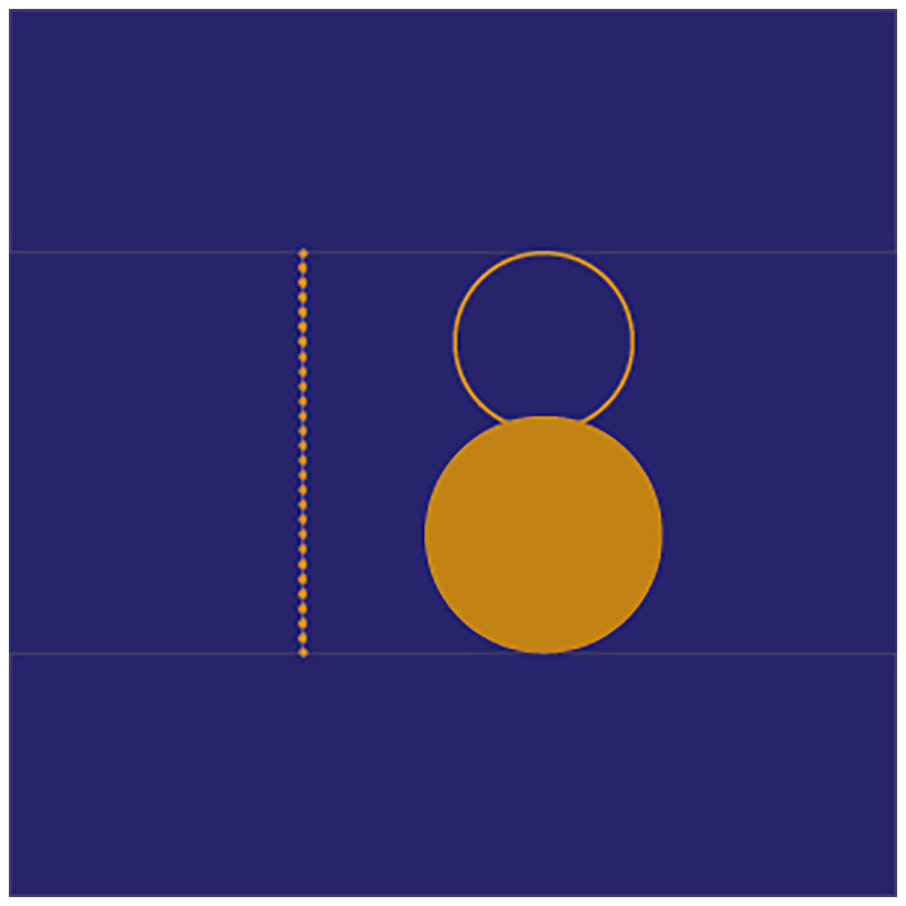

 

## **#18/25 [ 2021/12/18 ]** 
### by Haruka Aramaki
  

<iframe width="680" height="382.5" src="https://www.youtube.com/embed/6ZHoCIsGnFw" title="YouTube video player" frameborder="0" allow="accelerometer; autoplay; clipboard-write; encrypted-media; gyroscope; picture-in-picture; web-share" allowfullscreen></iframe>

 

よいしょー！と一瞬「１８」になります。 

 

### **材料**

* 真鍮
* 真鍮用はんだ
* はんだごて
* フラックス
* ボールチェーンφ5mm
* 低速ギアードDCモーター
* テグス ♯1
* 単三電池２本
* 電池ケース
* 木パネル 300*300
* ベルベット

 

### **技術**

* adobe illustrator：配置を決める
* はんだ付け：真鍮、電線
* 素材加工：切る・穴あけ

 

### **作り方**
 

### **1. どんなのにしようか考える**
 

「１」と「８」ではなく「１８」にするための共通項を持たせたり、 
台の上に作ると否が応でも「１８」なるかとか、 
形にバリエーションもできるので考えるのがとても楽しかったです。 
「８」にある2つの円の接点は、書くときは線で交差する（重なっている）けれど、 
書き順に倣わない2つの円だったとき、どのような構成になるかを考えました。 
日付の数字なので、その数字になっていきまた通り過ぎていく様子を表すためにモーターで動かすことに決めました。 
運動する数字です。 

   

### **2. どれくらいの大きさがよいか検討**
 

土台との色面積のバランスをみます。 

  

スケッチでは「1」をパイプと棒で作ろうとしていましたが、少し単調になりそうだったので、 
変化が大きくなりそうなボールチェーンを使うことにしました。 
これまでの2019,2020のadvent calendarでチャームの印象があったのも、決め手です。 
この時点では、チェーンにかかる重力を忘れている形で検証していますが、 
重力には逆らわないことにしました。 
そして、写真では3mmのボールチェーンですが、 
全体で見ると細くて「１」の印象が「８」に負ける気がしたので、 
最終的には5mmのものを使用しています。 
背景は紺色のベルベットでクリスマスの特別感です。ジングルベル。 

各パーツの長さや大きさを決めたら、配置はイラレでシミュレーションします。 

  

最初からイラレで設計していないのは、実物のサイズからイメージを固めたいという気持ちからです。 
（この文章を書いていてなんでイラレで初めからサイズ決めないんだろうと思ったので、自分への返答）

   

### **3. パーツの作成**
 

写真は、下の円盤をパネルに固定するパーツです。 
ネジ頭が見えたくないなという判断から、長ネジを使用し、 
先端を閉じるようにボールチェーンと同じ大きさの玉をはんだ付けしました。 
このパーツが上のリングの引っ掛かりの役割もします。 

 

  

この他にはんだ付けをしているパーツは、 
リングの閉じとボールチェーンの先端（テグスをひっかける部分）です。 

   

### **4. モーターの位置決め、テグスの長さ調整**
 

１つのモーターで動くようにしています。 
円を垂直に上下させたいので、モーターにつけるクランクの長さは半径に合わせました。 
クランクも真鍮をはんだ付けして作ります。 
こういうことができるのが、真鍮を好んで扱っている理由の一つです。 

  

調整調整…テグス結ぶの難しい…。コーヒーの入れ方と同じくらいあってるかわからない。
   

### **5. できました！**
 

<iframe width="680" height="382.5" src="https://www.youtube.com/embed/6ZHoCIsGnFw" title="YouTube video player" frameborder="0" allow="accelerometer; autoplay; clipboard-write; encrypted-media; gyroscope; picture-in-picture; web-share" allowfullscreen></iframe>
 

 

 

円盤を磨いている様子。急遽、金属磨きがほしいとき、無印良品及び無印良品製品を扱っているコンビニに金属磨きクロスが売っています。安心ですね。 
（撮影場所：nomena） 

明日はM-1決勝戦！敗者復活戦から観ます。 
みなさまよいクリスマス&お年を〜！

    

### **作者紹介**
 

**荒牧 悠** 

[harukaaramaki.com](https://harukaaramaki.com)
  

（Last Updated: 2023.04.11）

