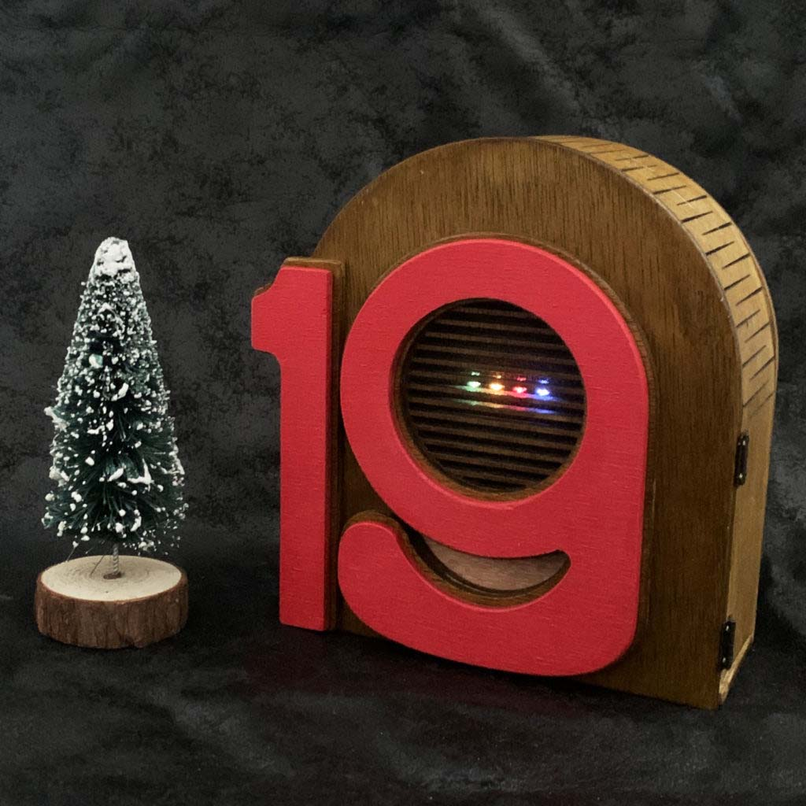
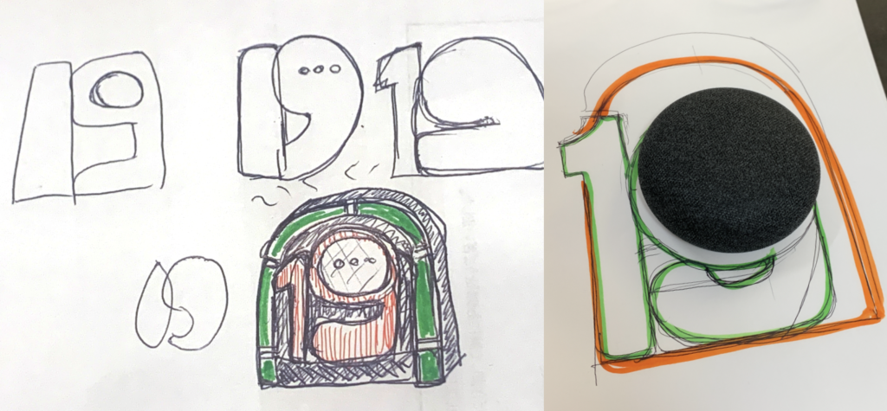
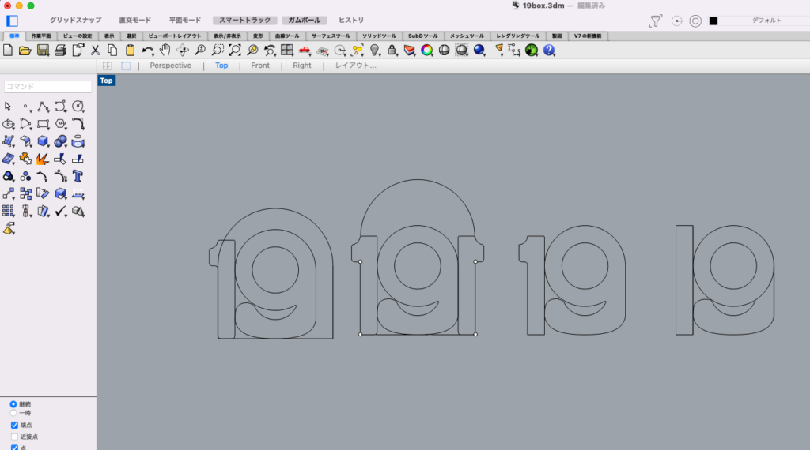
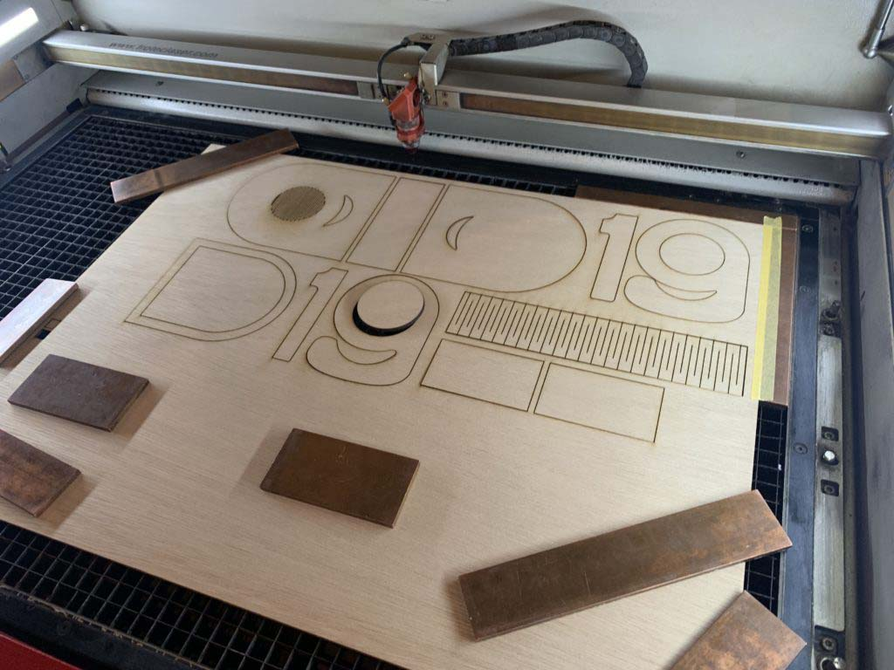
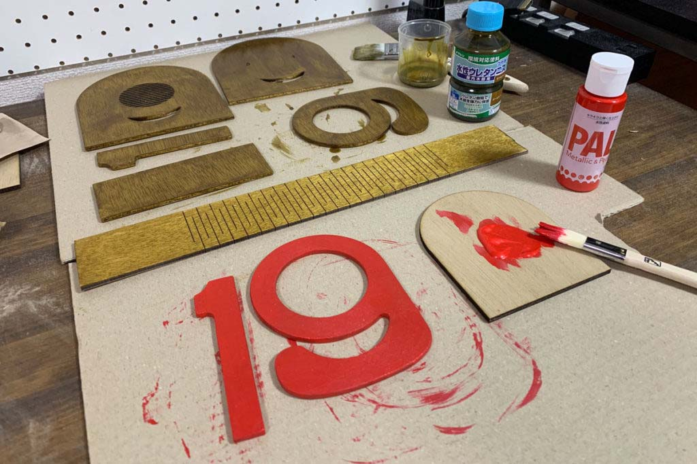
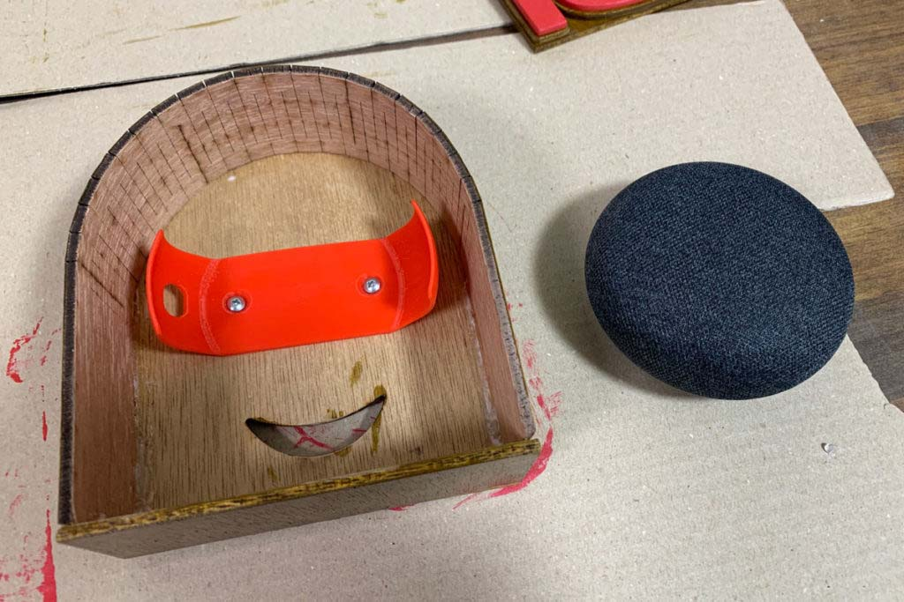
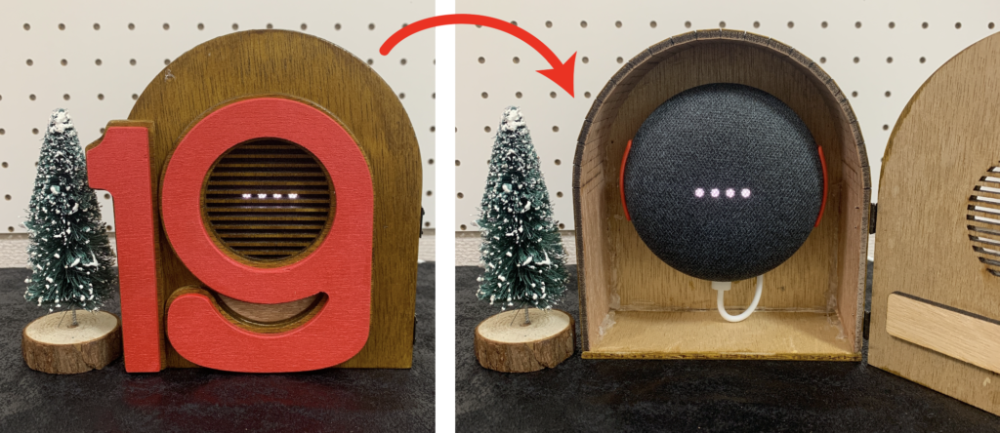

 

## **#19/25 [ 2021/12/19 ]** 
### by Yoshihiro Asano
  

 

ハッピークリスマス！こんなに豪華で楽しいアドベントカレンダー企画に加えさせてもらって嬉しい限りです。 
しかし私には繊細な工作スキルがないので、勢いで乗り越えさせていただきます。伝わってくれ〜！
 

 

### **材料**

* ラワン合板4mm厚
* 硬質な3Dプリントフィラメント
* 各種塗料
* Google Home Mini

 

### **技術**

* 3Dデータ作成：Rhinoceros
* ラワン合板加工：レーザーカッター
* マウント制作：3Dプリント

 

### **作り方**
 

### **1. アイデアをひねりだす**
 

まずはアイデアを考えていきます。 
与えられた日付は12/19。じゅうにがつじゅうきゅうにち。 
じゅうきゅう…じゅうく…じゅーく…ジューク？？？ 

  

というわけで、「19」をかたどったジュークボックス、19ボックスを作りましょう！ 

ジュークボックスはかつてレコードを流すための道具として流行したもの。 
物理メディアが影を潜めた現代では、音楽を聞くために各種ストリーミングサービスが活用されています。 
つまり、箱からSpotifyの音が流れてくれば、それはもうジュークボックスと言えるのではないでしょうか？ 

スマートフォンを差し込むと色々不便なので、家で使っているGoogle Home Miniをデバイス部に採用。 
サイズ感と丸みを頭に入れながら、スケッチを進めていきます。

   

### **2. データ制作＆加工**
 

  

紙で大体決まったら、加工用データを制作していきます。 
作り自体はシンプルなのですが、数字がそれっぽくなるように調整するのが難しい＆楽しい。 

  

平面部分はレーザーカッターで切り出します。今回はFabCafe Tokyoを利用させてもらいました。 
別途、Google Home Mini を取り付けるためのマウントとして、 
Thingiverseで見つけた「[Google Home Mini Slim Wall Mount](https://www.thingiverse.com/thing:2746443)」を3Dプリントしておきます。
 

 

 

加工済みのパーツを家に持ち帰り、やすりがけやら塗装やら進めます。 
木材にはニスを塗っただけですが、良い風合いになりました。 
内部にマウントを取り付けたら、モノタロウのキャラクターみたいになったのがハイライトです。

   

### **3. 組み立て&完成！**
 

 

 

完成したパーツをせこせこと組み合わせていけば、ついに完成！ 
外から見ただけでは機能がわかりづらいので、蝶番をつけて中が見えるようにしてみました。 

それでは皆さんご唱和ください、「OKグーグル、クリスマスソングを流して！」

    

### **作者紹介**
 

**淺野 義弘** 

Fab Loveな駆け出しフリーランスのライターです。2022年はもっとたくさんものづくりするぞ！ 
[https://twitter.com/asanoQm](https://twitter.com/asanoQm)
  

（Last Updated: 2023.04.11）

