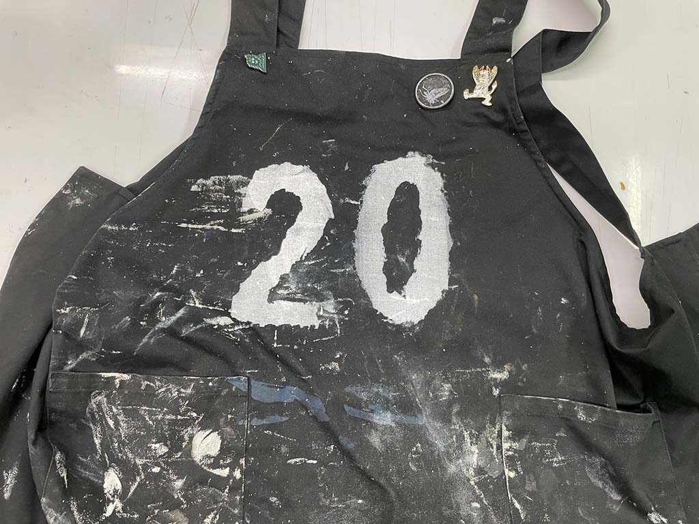

 

## **#20/25 [ 2021/12/20 ]** 
### by analog
  

 

シルクスクリーンで使用されるメッシュと感光乳剤を使って、 
全部フリーハンドでシルク印刷を行ってみた。
 

 

### **材料**

* メッシュの切れ端
* 感光乳剤
* 水性インク

 

### **作り方**
 

### **1. アイデアをひねりだす**
 

端材のメッシュに乳剤でハンドペイント。 
太陽露光で2分。 
インクを刷って完成。 

<iframe width="680" height="382.5" src="https://www.youtube.com/embed/s9WpGVnDu4k" title="YouTube video player" frameborder="0" allow="accelerometer; autoplay; clipboard-write; encrypted-media; gyroscope; picture-in-picture; web-share" allowfullscreen></iframe>  

**［利点］**
 
ステンシル感覚で手軽に作れる。 
フレームがないので頑張れば曲面に刷れる。 

**［欠点］**
 
刷っててブレる。 
きれいに刷れない。

    

### **作者紹介**
 

**[analog](https://www.analogpress.net/)** 

印刷加工に特化したレンタルスタジオ。 
製本加工(天のり・かがり製本・PUR製本・中綴じ・平綴じ・ミシン綴じ・アイレット・箔押し)、 
シルクスクリーン(紙〜衣類まで)、全判レーザーカッター(カット〜彫刻まで) 
出店・出張依頼などもお気軽に
  

（Last Updated: 2023.04.11）

