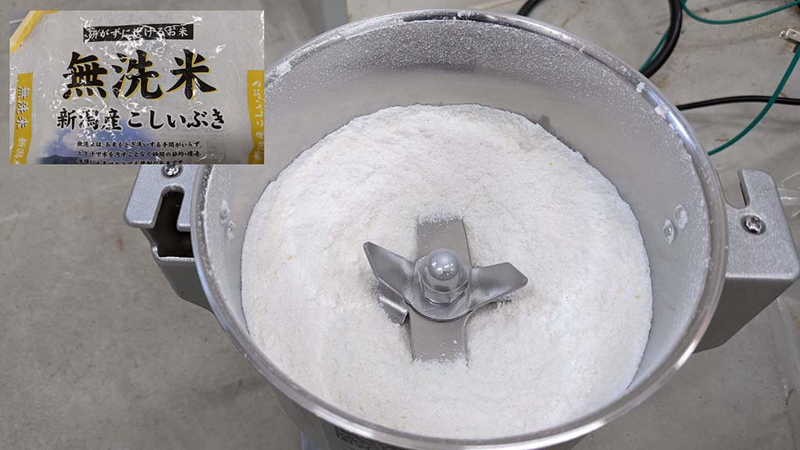
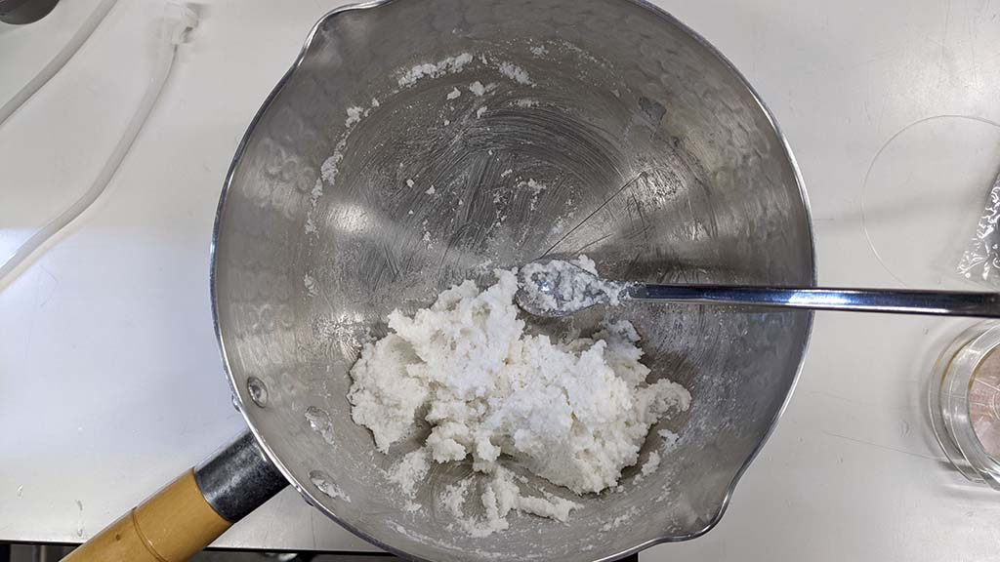
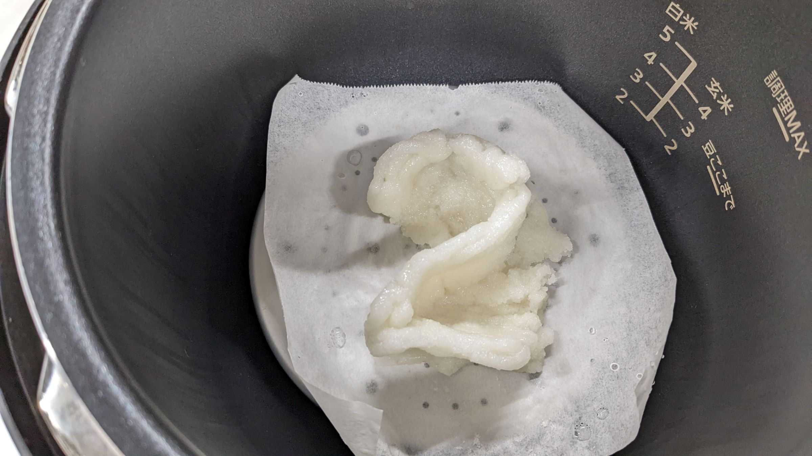

 

## **#21/25 [ 2021/12/21 ]** 
### “Additive煎餅（アディ煎）” by Kohei Morimoto
  

 

中学時代、煎餅屋になることを夢見ていた時期がありました。 
（種類ごとに大きなガラス瓶に入れた煎餅を計り売りするタイプの店） 
焼く時の煙で近所からクレームが来たらイヤだなと思い、別の道を歩むことにしたのですが、 
米と醤油の産地である新潟で働くことになったのも何かの縁。 
あの時の衝動を、なぜかアドベントカレンダーという企画の中で放出してやりました。
 

 

### **材料**

* 米：60g
* 水：40g
* 醤油：少々

 

### **機材・ソフト**

* ミル（上新粉を購入すれば不要）
* 3Dプリンタ―（無茶な設定をしても見逃してくれるスライサーに対応したもの）
* 蒸し器
* トースター（電子レンジについてるもの）
* 3D CAD（Fusion 360）

 

### **作り方**
 

### **1. 米粉をつくる**
 

新潟県長岡産こしいぶきをミルで粉砕し米粉をつくります。 
研ぐタイミングがない気がしたので無洗米にしましたが、 
本来は研いで水を吸わせた後に粉砕するらしいです。
 

   

### **2. 材料をつくる**
 

米粉に熱湯を加え、こねます。 
米粉：水＝1:1で造形すると積層時に崩れたので、 
最終的に3:2の割合にしました。 

   

### **3. データをつくる**
 

ノズル径が4㎜であることを考慮しつつ、 
出力時に不要なルートを通らないようデータを作成します。 
文字幅を制御するため、既存のフォントは使わず、 
パスで描いた数字に4mm×8mmの長方形をスイープさせ、 
4の倍数の高さだけ押し出しました。 

  

この形だったら手で作れるじゃん、というのは今回はナシで。 

  

続いて出力設定を行います。（スライサー：Qidi Print） 
ノズル径が4㎜なので、レイヤーハイト4mm、ライン幅4mmとし、 
ウォールライン数、上面レイヤー、底面レイヤーを全て１に、充填率を0％に設定します。 
「お前正気か!?」というアラートが出ますが、スルーしてgcodeを保存します。 

   

### **4. 成形する**
 

シリンダーに材料を詰めます。 
本当は成形前に蒸してこねないといけないみたいですが、 
蒸すと粘りが出て、さすがに出力できない気がしたので、 
このまま投入します。 

  

出力装置は、既存の3Dプリンタ―（i-mate S）をハックしたもの。 
シリンダーの先にホースとノズルがついており、エアコンプレッサーで押し出して成形します。 
フード3Dプリンタ―がある場合は、そちらを使いましょう。 

  

1層目がプラットフォームに引っ付いてくれないので、手で適当にラフトを作ります。 
（出力の際、1層目はコンプレッサーを動作させず空打ちする） 

  

エアコンプレッサーを繋いで積層造形します。 

（空気圧0.6-0.7MPa） 

 

<iframe width="680" height="382.5" src="https://www.youtube.com/embed/KP8p7H6gvc4" title="YouTube video player" frameborder="0" allow="accelerometer; autoplay; clipboard-write; encrypted-media; gyroscope; picture-in-picture; web-share" allowfullscreen></iframe>
 

非常に崩れやすいため、下にクッキングシートを敷いておき、 
シートごと蒸し器に投入します。 
（「2」の上面が変な感じになっているのは材料が途中で切れたため） 

   

### **5. 蒸す**
 

蒸します。（Panasonic SR-MP300を使用） 
何となく15分蒸しました。 

  

### **6. 干す**
 

天日干しでもOKですが、この時期の新潟はお日様がなかなか出ないので乾燥器を使用。
（45℃×5時間ぐらい） 
しっかり乾燥させるとパリッとした触感に、水分を残すとモチっとなるらしいです。 

  

### **7. ラフトを剥がす**
 

ここでラフトを除去します。 
剥がしたラフトは捨てずに取っておきます。 

  

### **8. 醤油を塗る**
 

醤油を刷毛で塗ります。 

  

醤油はもちろん長岡市摂田屋の越のむらさき 

  

積層痕に醤油が絡むぜ！ 

   

### **9. 焼く**
 

トースターで焼きます。（約10分） 

   

### **10. 完成**
 

  

ラフトも残さず食べましょう。 

   

---

 

**！！！注意！！！**

* 食品に接するパーツを3Dプリンタ―で制作する場合は、食品対応フィラメントを使いましょう。
* エアコンプレッサーから出力される空気はキレイではないです。 
シリンダー内の材料は出し切らずに、ちょっと残しましょう。 
いや、やはりフード3Dプリンタ―を使いましょう。
* 積層造形で制作できるよう、通常の煎餅づくりとは材料の配分や手順を変えています。

    

### **作者紹介**
 

**森本 康平** 

長岡造形大学助教＆ファブラボ北加賀屋の運営者。 
最近は練り物系の3Dプリントをいろいろ試しています。 
[https://www.nagaoka-id.ac.jp/about/teacher/list/morimoto_kohei/](https://www.nagaoka-id.ac.jp/about/teacher/list/morimoto_kohei/) 
[https://fablabkitakagaya.org/](https://fablabkitakagaya.org/)
  

（Last Updated: 2023.04.11）

