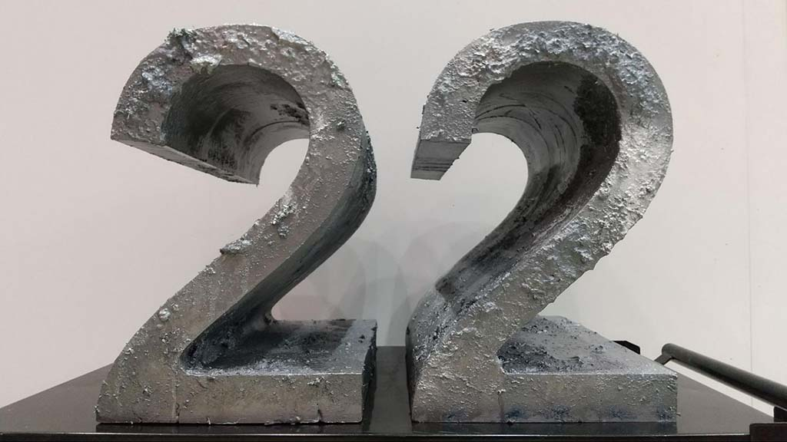
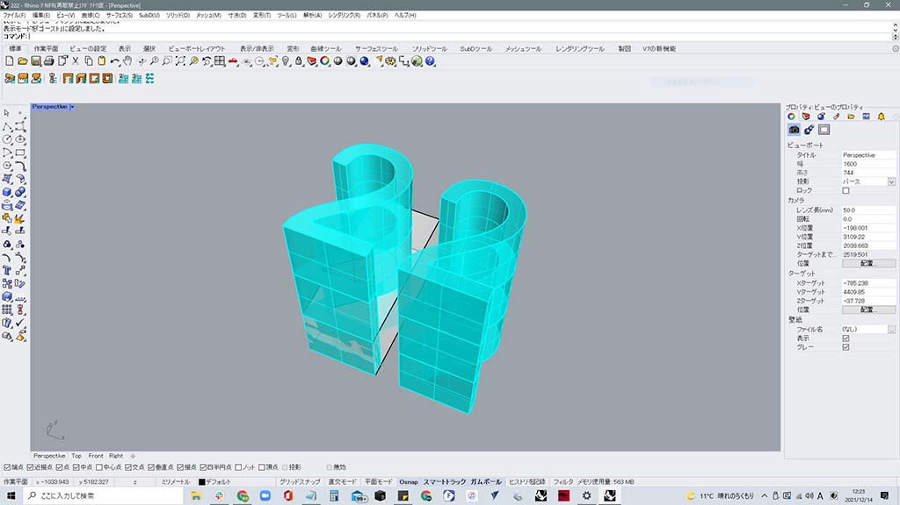
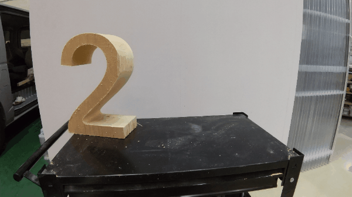
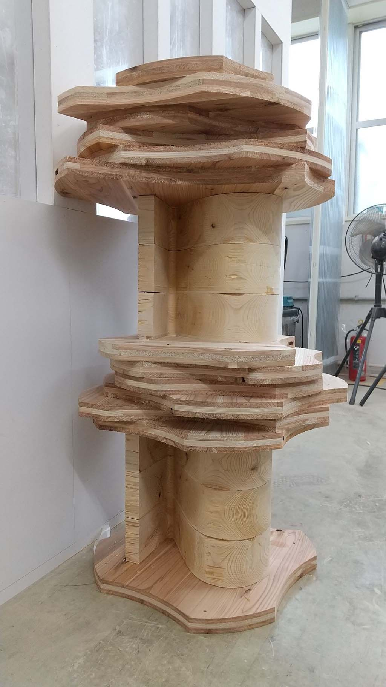
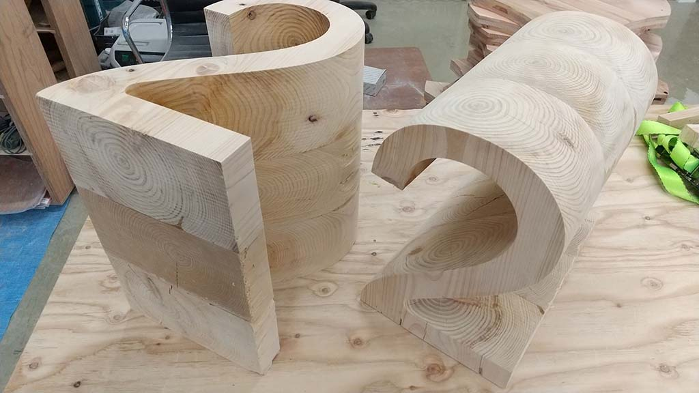
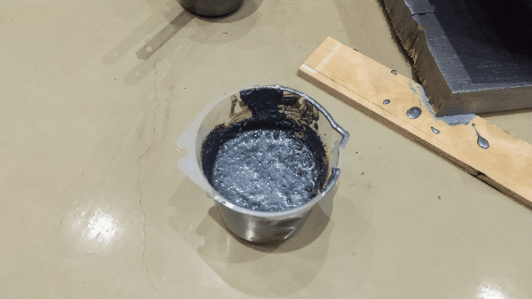

 

## **#22/25 [ 2021/12/22 ]** 
### by Yasufumi Hanada
  

 

クリスマスイヴイヴイヴの”22”を担当しました。 
今年の12/22は、あの伝説のバンドの無期限活動停止ライブが開催されるVSDなのです。 
あ、VerySpecialDayなのです。 
そんな日を担当することになり、どうしようかと思いましたが、 
一切奇をてらわずド直球ど真ん中do正直に制作することにしました。 
そう、あのバンドのように。

 

### **材料**

* 桧無垢材（端部の割れが酷く廃棄してしまう部分）t:210ｍｍ
* 木工用ボンド
* 桧木粉、鉄粉、塗料諸々
* 音楽（PEDRO）

 

### **技術**

* Rhinoceros (3DCAD)
* BIESSE(cncルーター）
* 特殊塗装
* ヴァイブス

 

### **作り方**
 

### **1. パッションが立ち上がるのを待つ**
 

3DCAD Rhinocerosで数字を触りながら、どんな形状にするか、天からのお告げを待ちます。 
嘘です。 
とにかくマッチョな感じにしたかったので、歩留りマックスのボリュームを作り出します。
 

   

### **2. 桧の声を聴く。**
 

桧の端材を集め、cncルーターで吸着できるように割れを考慮しながら切り出す。 
t:210mmのマシン限界の最大サイズの材料。 
端部の割れが酷い部分で、普通なら捨ててしまうような部分の有効活用。 
ルーターのサイズは、Φ25有効長230mmのモンスター級のもの。 

   

### **3. パイルダーオン**
 

木工用ボンドで接着します。ズレない様に、桧に声をかけながら固定していきます。 

 

   

### **4. おめかしタイム**
 

檜の無垢材なので、そのままでも綺麗だったし、割といい感じになってしまいました。 
しかし、今回はやってみたいことあったので、特殊な塗装を施しました。 
シルバーの粉と塗料と檜の切削くずを混ぜてオリジナル塗料を作りました。 
シュッとしてた、檜の表情が一気にパンキッシュに変わったことかと思います。 
いかがでしょう？ゴリゴリのパンクですね。 
ここからは、作業してる自分の気持ちもパンクになってきて、ジャクソンポロックよろしく、 
塗料投げたり、刷毛でテクスチャー作ったり、まさにパッションの赴くまま。 
もちろんBGMは、PEDRO。そんなこんなで、完成です。 
皆さん良いクリスマスイヴイヴイヴをお過ごしください！ 

    

### **作者紹介**
 

**花田 康史** 

京都芸術大学（旧京都造形芸術大学）ウルトラファクトリーにてチーフテクニカルスタッフとして従事したのち、 
VUILD株式会社VUILD fabricationのプロジェクトリーダーとして日々Do It Myselfを行っている。 
FRP、塗装、金属加工、木工、デジタルファブリケーションと多岐にわたる技術と知識はあるものの、 
全てのモノづくりはヴァイブスで何とかなると本気で思っている。
  

（Last Updated: 2023.04.11）

