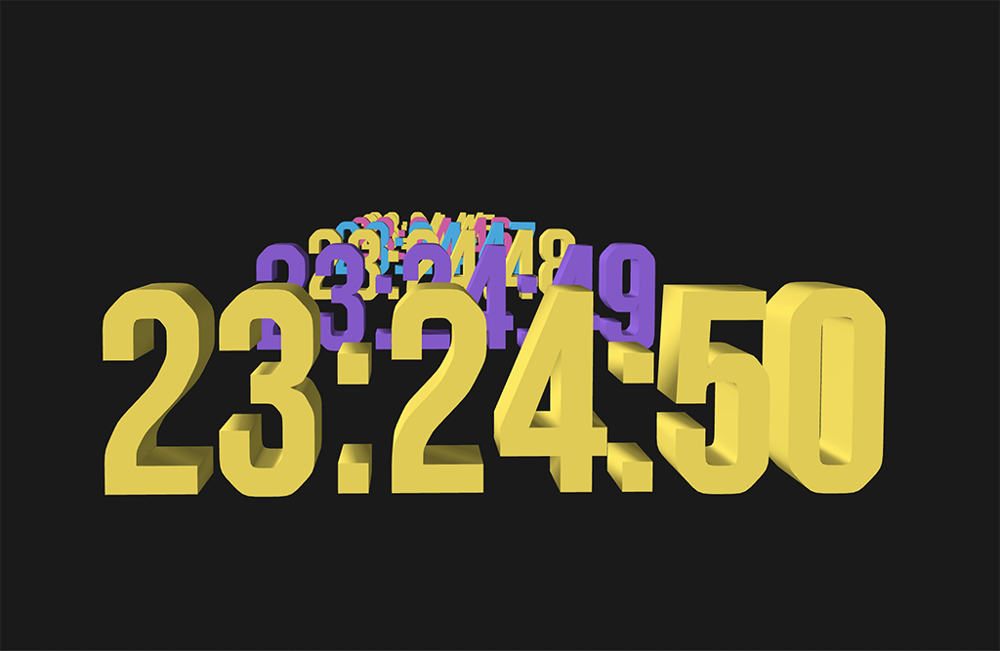

 

## **#23/25 [ 2021/12/23 ]** 
### by Takawo Shunsuke
  

 

こんにちは．高尾俊介（@takawo）といいます． 
普段は神戸にある甲南女子大学で教員としてプログラミングやCGについて教えつつ， 
クリエイティブコーダーとして活動しています． 

Advent Calendarにお誘いいただいたものの， 
これまでのエントリのFab達人たちの技巧に恐れおののいているなかで， 
良いアイデアがでるはずもなく…縮こまっていました（笑）． 
しかし締切も迫り，そうもいっていられない！ 
日々のコーディングの延長として，いつもどおり気負わず気楽に取り組んでみることにします．

 

### **技術**

* [OpenProcessing](https://openprocessing.org/)

 

### **作ったもの**
 

僕は取り組んでいるクリエイティブコーディングによるCG制作として， 
3Dの文字が空間を飛んでいくようなものにしました． 
23という数字に何か意味があるといいなと思いながら， 
締め切りの時間に追われている状況をコードで書いてみることにしました． 
時間が刻一刻と降っていくアンビエントな時計のようなものになりました． 
23は……12月23日23時23分23秒にちなんでということで！（笑）  

<iframe src="https://openprocessing.org/sketch/1414016/embed/" width="400" height="400"></iframe>
  

スケッチのURL 
[https://openprocessing.org/sketch/1414016](https://openprocessing.org/sketch/1414016) 
 

設立からずっとライフサイズで魅力的な，ここからしか生まれないと思える，ユニークなものづくりを発信している 
「FabLab SENDAI – FLAT」の小野寺さん大網さんのお二人から今回お声がけいただけたこと，大変光栄でした． 
来年はもう少し落ち着いて活動ができるはずなので，懲りずにお声がけください． 
本当は23個コードでプロトタイプを作ろうと思っていたんですが，全然間に合いませんでした〜！（笑）

    

### **作者紹介**
 

**高尾 俊介([@takawo](https://twitter.com/takawo))** 

クリエイティブコーダー。
詩を書くように自由にコードで自己表現するデイリーコーディングを提唱、実践している。
[https://www.openprocessing.org/user/6533](https://www.openprocessing.org/user/6533)
  

（Last Updated: 2023.04.11）

