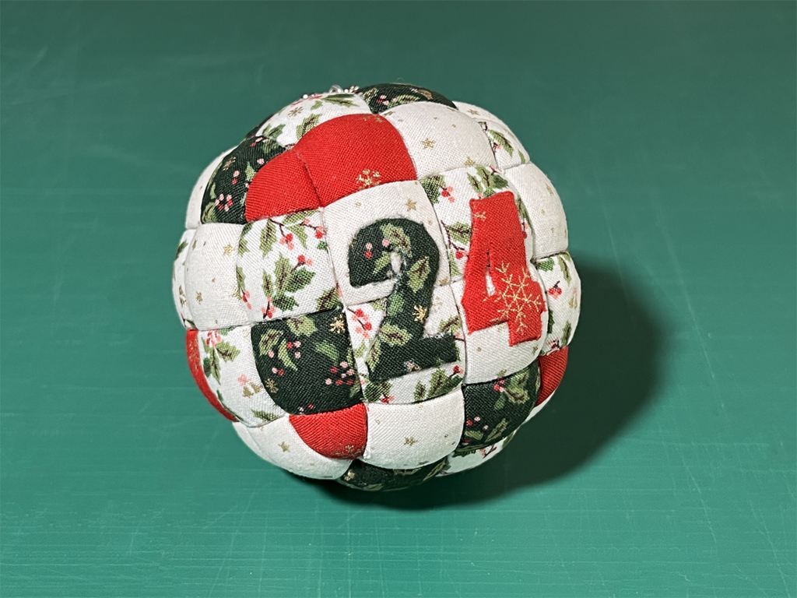
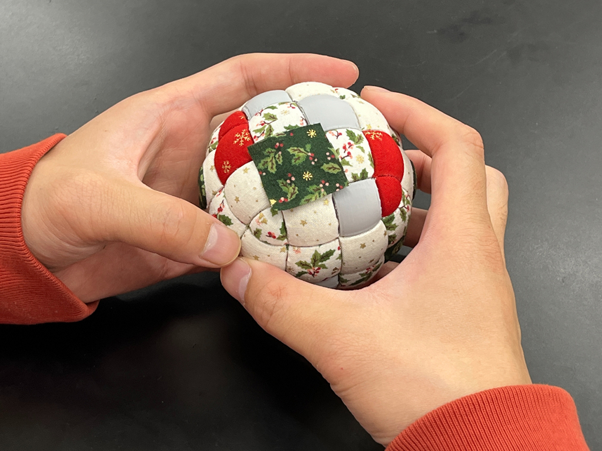

 

## **#24/25 [ 2021/12/24 ]** 
### by Syota Mizuguchi
  

 

”24”を担当させて頂きました。 
ウルトラファクトリーのテクニカルスタッフ水口です。 
クリスマス・イブということで、なにかクリスマスっぽいものを作ろうと思い、 
今回は「3Dプリント+木目込み」でオーナメントを制作しました。 

［[木目込み](https://ja.wikipedia.org/wiki/%E6%9C%A8%E7%9B%AE%E8%BE%BC%E4%BA%BA%E5%BD%A2)］について 
基本的に筋彫りした部分に布を押し込んで張り込んでいく技術です。 
 

### **材料**

* FLASHFORGE　MODERA：PLAフィラメントStandard
* 好きな布
* 両面テープ

 

### **技術**

* Rhinoceros (3DCAD)
* 3Dプリント
* 木目込み

 

### **道具**

* ハサミ
* カッター
* 木目込み 両刃べら 
（[https://www.juho-tougei.com/kimekomi/dai_komono/daihoka/hera.html](https://www.juho-tougei.com/kimekomi/dai_komono/daihoka/hera.html)）

 

### **作り方**
 

### **1. モデリング&3Dプリント**
 

3DCAD Rhinocerosを立ち上げ、モデリングしていきます。 
使う布に厚みによって筋彫りの幅と深さが変わるので、 
丁度良くなるようにモデリングしていきます。
 

  

このまま3Dプリントしてもいいのですが、 
このあとの作業のことも考えて半分に分割して出力しました。
 

   

### **2. 下準備(出力物の処理＆布の準備)**
 

筋彫りの部分のサポート材をとり、シームの部分が盛り上がったりするので、 
気になるようであれば少しヤスリがけします。 

  

木目込む布も用意し、布の裏地に両面テープを貼ります。
木目込む部分より少し大きめに布をカットします。   

### **3. 木目込む！**
 

まずは木目込みする部分にカットした布を貼り付けます。 

  

曲面なので、布を伸ばしながら形に沿わしてなじませます。 

  

筋彫りの深さよりも、はみ出ている布が大きい場合は少しカットします。 
※切りすぎないように注意 

  

ここまできたらあとは布を筋彫り部分に、木目込みのへらを使って押し込んでいきます。 
※へらの先で布を突き破らないように注意 

  

あとはひたすらこの作業を繰り返していきます…！ 
数字の部分は若干複雑なので難しかったです。 
両側のパーツがつながる部分以外ができたら、接着して残りの部分を木目込みしていきます。 

   

### **4. 完成！！**
 

そして出来上がったものが、↓のものになります。 
いい感じのクリスマスっぽい写真を撮るのにだいぶ彷徨いました。 

 
（撮影場所：京都芸術大学前）

    

### **作者紹介**
 

**水口 翔太** 

京都芸術大学ウルトラファクトリーにてデジタル加工を中心に学生の制作支援をしています。 
クリスマスは、予定空いてます！！！！
  

（Last Updated: 2023.04.11）

