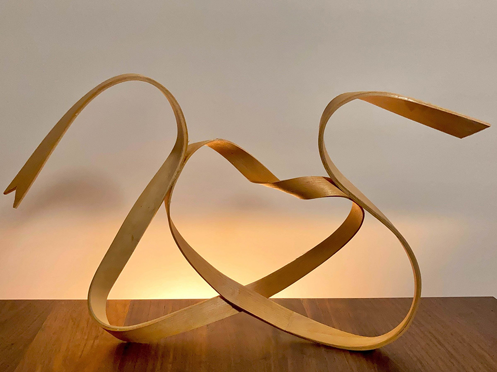
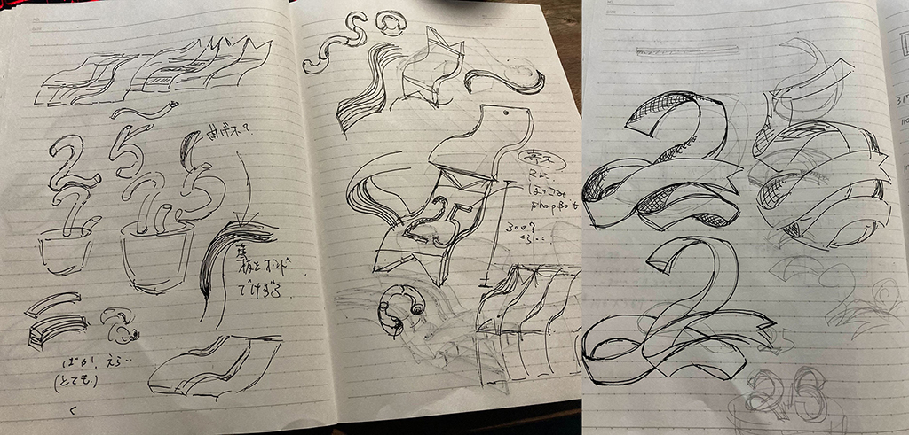
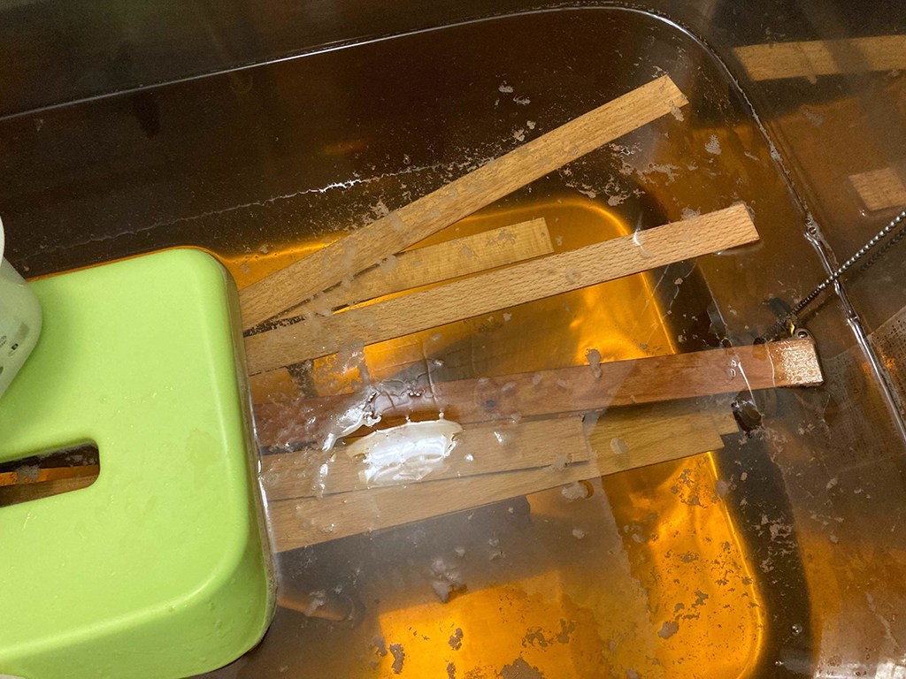
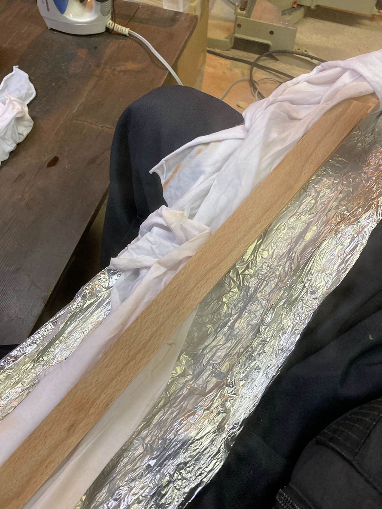
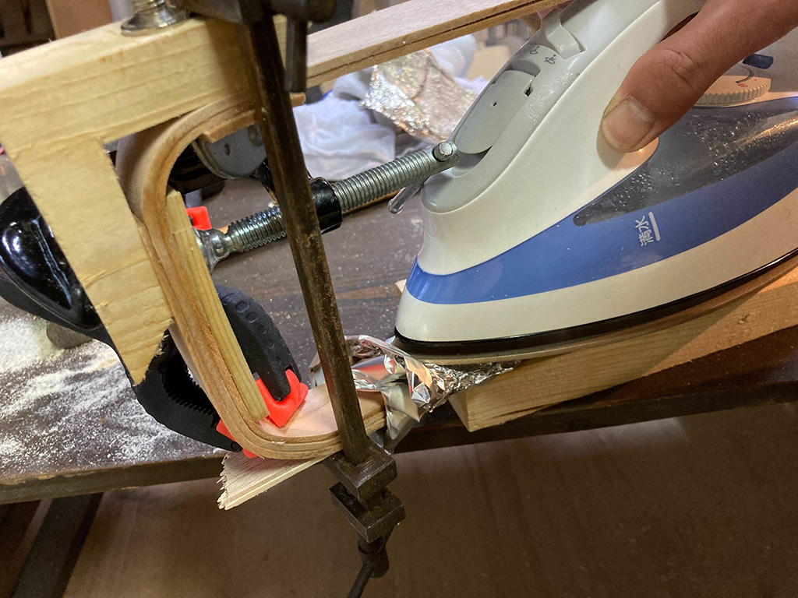
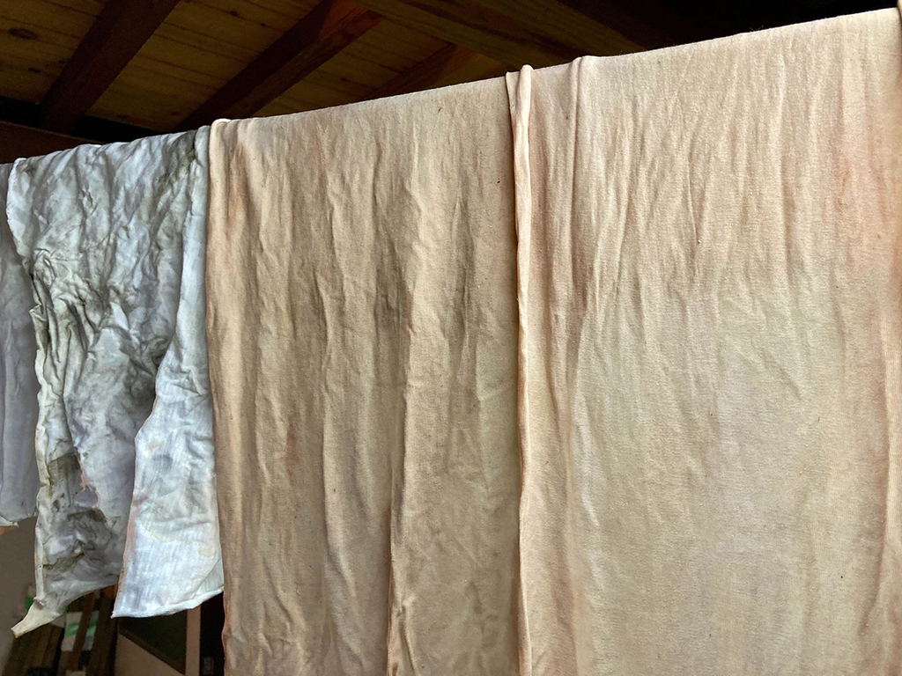
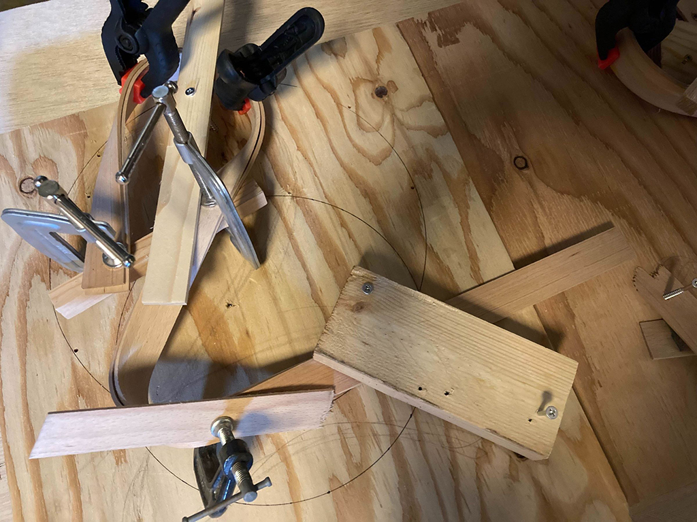
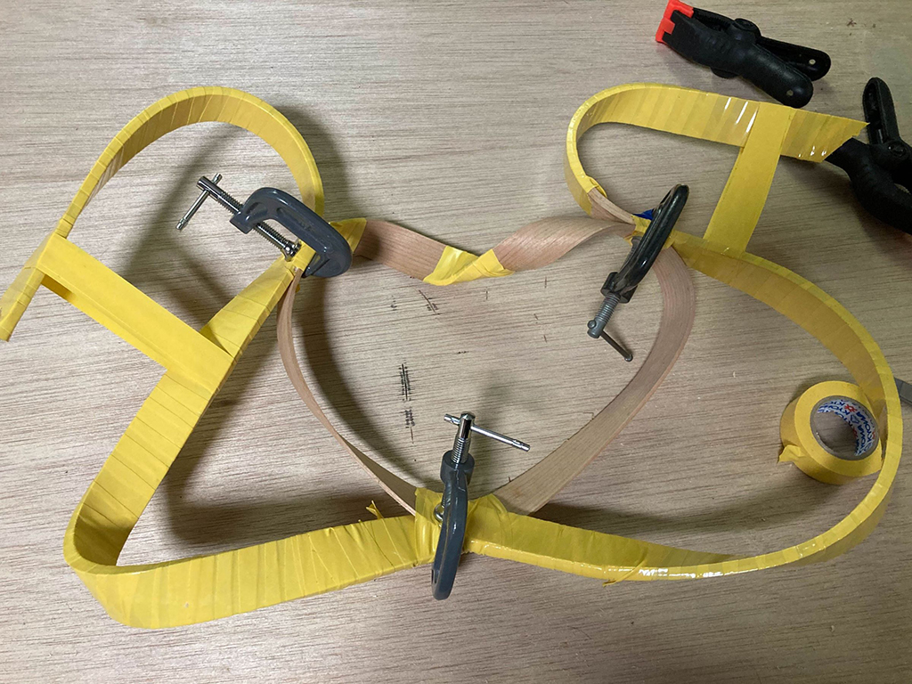
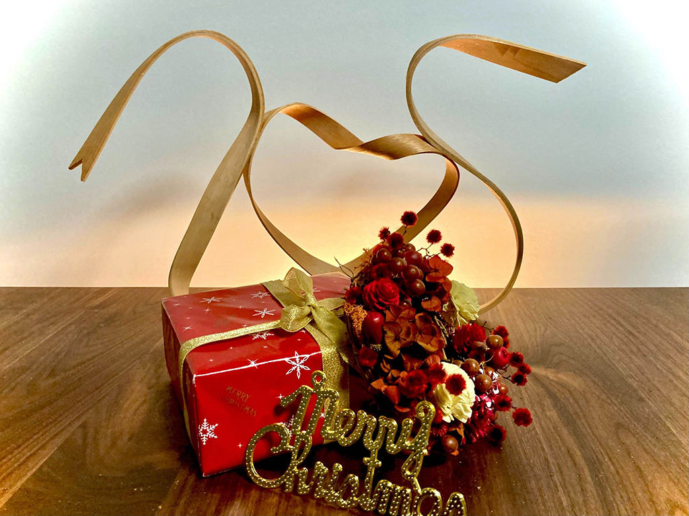

 

## **#25/25 [ 2021/12/25 ]** 
### by Fumiaki Yokoyama
  

 

”25”を担当させて頂きました。 
今回やったことがなかったことに挑戦してみました。 
技法としてはよく聞く曲木だと思いますが、12/25はクリスマスということもあり、 
リボンを木材で再現したような形を目指しました。 

曲木をするにあたり参考にしたサイト 
[https://www.forest.ac.jp/academy-archives/steam_iron_bending/](https://www.forest.ac.jp/academy-archives/steam_iron_bending/) 
曲木技法は蒸籠（蒸し器）を作って蒸し曲げが一般的ですが、今回はアイロン曲げに挑戦

 

### **材料**

* 木材（ビーチ、チェリー）
* 仕上げオイル

 

### **技術**

* 曲木
* 愛

 

### **道具**

* アイロン
* クランプ
* 布
* アルミホイル
* ビス
* ビニールテープ
* 木っ端

 

### **作り方**
 

### **1. アイデア出し**
 

方法は知っているがちゃんとやったことがない曲木。 
この機会にチャレンジしてみようと思い、 
取り合えず手を動かそうとペンを走らせる。 
細長くリボンのような形状を木材で再現できないか・・

 

   

### **2. 材料の厚みを揃える、切り出し**
 

今回曲木に使う材料は昔から曲木に適しているといわれる「ビーチ」ともう一つは個人的に色味が好きな「チェリー」 

幅25ｍｍ×厚み2.5ｍｍの材料を取れるだけ切り出そうと思います。 
30角程の材料の面だしと直角を出すために手押し鉋をかけます 
厚みを揃えるために材料を自動鉋に通します 
直角を出し終わり厚みが揃ったら縦挽きで3㎜ぐらいの厚みに割いて行きます。 
（縦挽きで細い材料からさらに薄物を切り出すのは超危険！めちゃくちゃ神経使います・・） 
自動鉋で厚みを2.5mmに揃えます   

### **3. お風呂タイム**
 

水分が多く含まれた木材は、熱すると柔らかくなるという性質があり、 
自在に形を変えられるようになります。 
切り出した長さの木材が入る容器がなかったので、 
家のお風呂でお湯を沸かし、いざ入浴！ 

  

ん～木材の出し汁が香ばしい～   

### **4. アイロンがけ**
 

水分を十分に含んだ材料にアイロンがけです。 

曲木の原理は、熱によって細胞同士をつなぐリギングを軟化させ、 
気の構造をなすセルロースをずらして圧縮することで、木を曲げるというもの 
（ページ上部の参考サイト参照） 

1.まず水分を含ませた布を木材に巻きます 
2.その上からアルミホイルで包みます 
3.アルミホイルの上から高温にしたアイロンをあてて行きます 

型を使わずフリーハンドで曲げているので、一度全体にアイロンをあて、
曲げたい箇所でまたアイロンをあてます。 
熱が引いて冷めてしまうと曲げづらくなる為、熱してすぐ取り出し成形していきます。
熱気ムンムンです

 

 

  

厚みが薄いので思った以上に曲がりましたが、木目や節の影響か折れてしまうことも多々 

  

木材を巻いていたウエス 
だいぶ色移りしている。これは木材で染物が出来る予感・・
   

### **5. 固定と組み立て**
 

型がないのでクランプやその辺にあった木っ端をビスで打ち、 
形を維持出来るように固定します。 
（次は形を決めてからやろう・・）

 

  

当初の予定では「２」と「５」を作って組み合わせるだけでした・・ 

ん～ 
何か足りない・・ 
・・ 
・・ 
#### **あ、愛や！！！！！！！！**
 

  

ということで、真ん中にハートをあしらわせていただきました。 
（表面の黄色は2.5mmを二枚重ねているので接着の為、ぐるぐる巻きにして固定しています。）   

### **6. 完成**
 

仕上げはオイルで化粧します。

 

  

ものつくりは**愛**やで 

ハッピーメリークリスマス！！

    

### **作者紹介**
 

**横山 文昭**と申します。 

京都在住　2021年4月～フリーで活動中 
月の半分は滋賀県の家具屋（近江家具商人）で日々家具製作に励む 
12月よりヘルプスタッフとして京都芸術大学内の共通工房「ウルトラファクトリー」にたま～に出没 
木工を中心に個人の仕事を受けつつ、オリジナルプロダクトを製作しています。 
過去にライブなど大型イベントの装飾の仕事も経験しており、様々な素材、大きなものから小さなものまで何でも作ります。 
心が燃えてるので寒くても大丈夫、魂で仕事します！！
  

（Last Updated: 2023.04.11）

