## 2021

 <a href="https://fablabsendai.github.io/acc/2021/1201.html" title="2021/12/01">
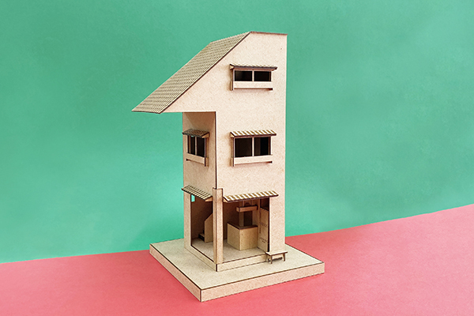
</a>
<a href="https://fablabsendai.github.io/acc/2021/1202.html" title="2021/12/02">
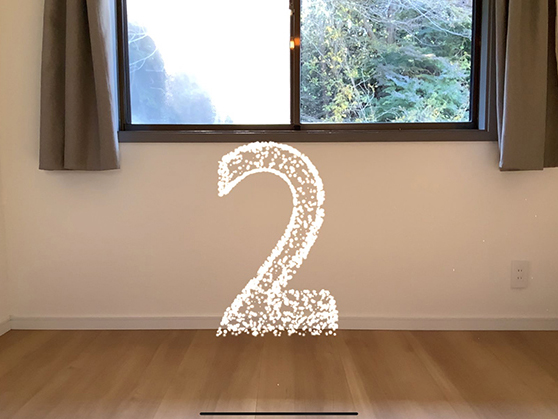
</a>

<a href="https://fablabsendai.github.io/acc/2021/1204.html" title="2021/12/04">
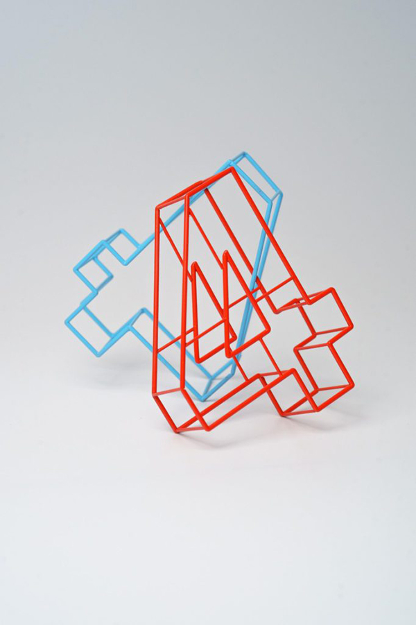
</a>

<a href="https://fablabsendai.github.io/acc/2021/1210.html" title="2021/12/10">
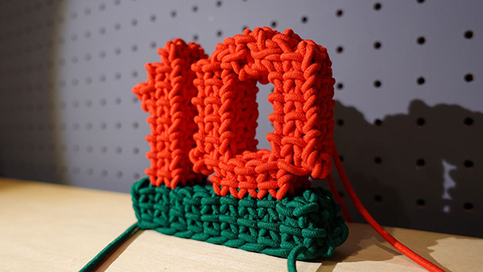
</a>
<a href="https://fablabsendai.github.io/acc/2021/1211.html" title="2021/12/11">
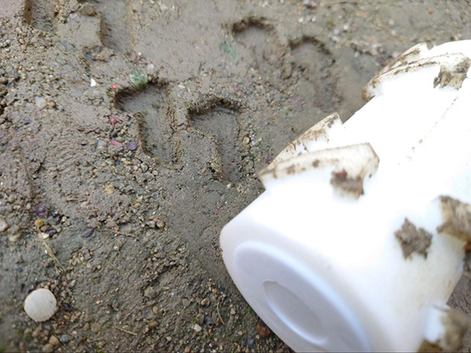
</a>
<a href="https://fablabsendai.github.io/acc/2021/1212.html" title="2021/12/12">
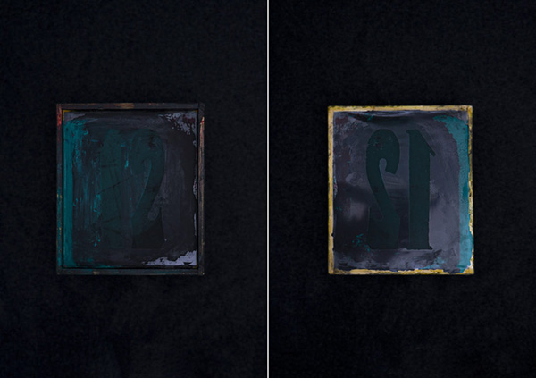
</a>
<a href="https://fablabsendai.github.io/acc/2021/1213.html" title="2021/12/13">
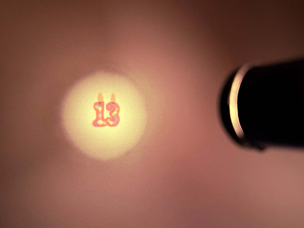
</a>
<a href="https://fablabsendai.github.io/acc/2021/1214.html" title="2021/12/14">
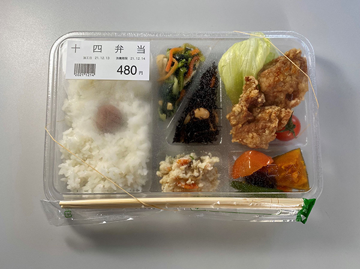
</a>

<a href="https://fablabsendai.github.io/acc/2021/1216.html" title="2021/12/16">
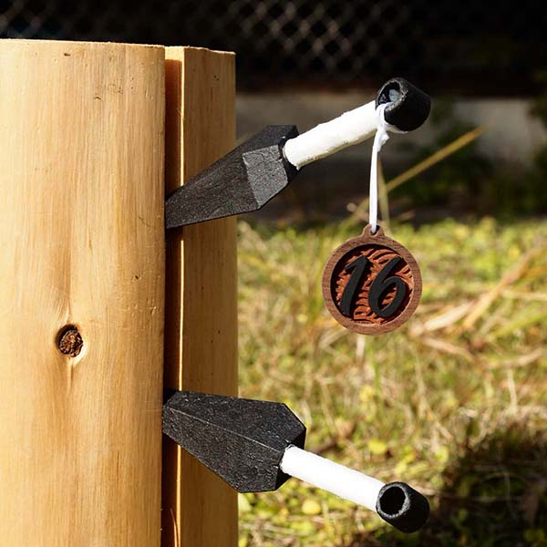
</a>
<a href="https://fablabsendai.github.io/acc/2021/1217.html" title="2021/12/17">
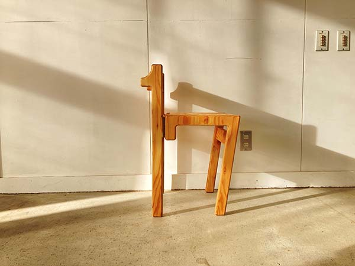
</a>
<a href="https://fablabsendai.github.io/acc/2021/1218.html" title="2021/12/18">
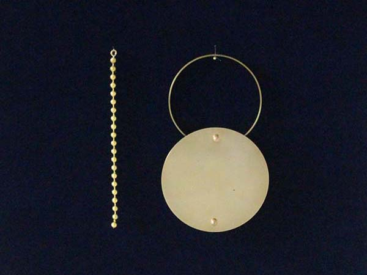
</a>

<a href="https://fablabsendai.github.io/acc/2021/1220.html" title="2021/12/20">
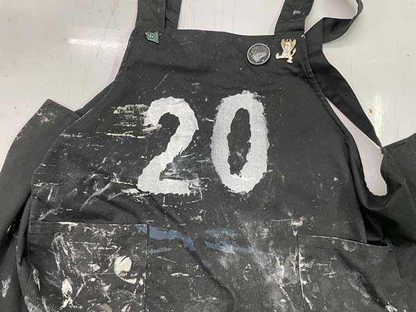
</a>

<a href="https://fablabsendai.github.io/acc/2021/1222.html" title="2021/12/22">
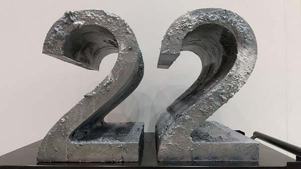
</a>
<a href="https://fablabsendai.github.io/acc/2021/1223.html" title="2021/12/23">
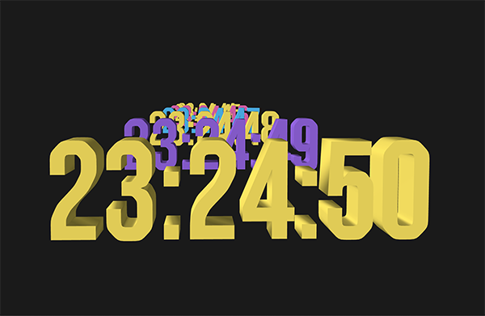
</a>
<a href="https://fablabsendai.github.io/acc/2021/1224.html" title="2021/12/24">
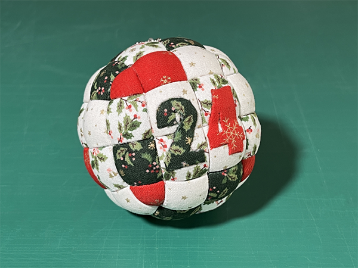
</a>
<a href="https://fablabsendai.github.io/acc/2021/1225.html" title="2021/12/25">
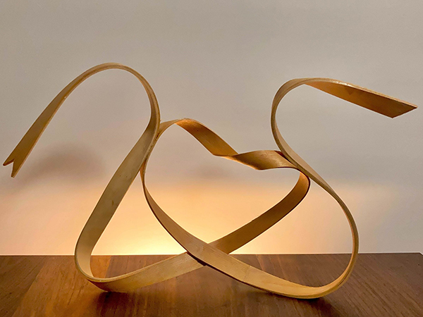
</a>

 

  