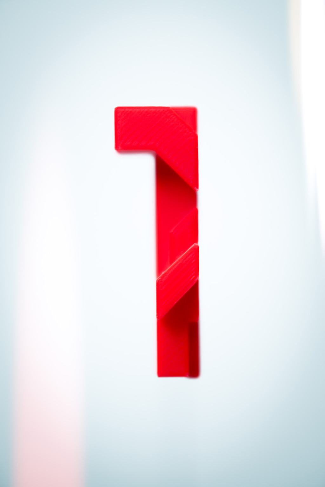
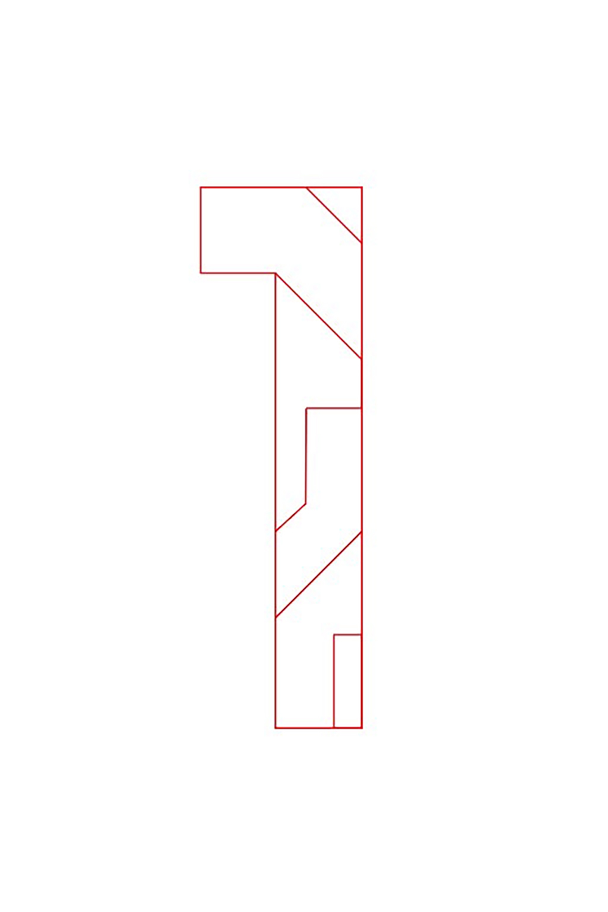
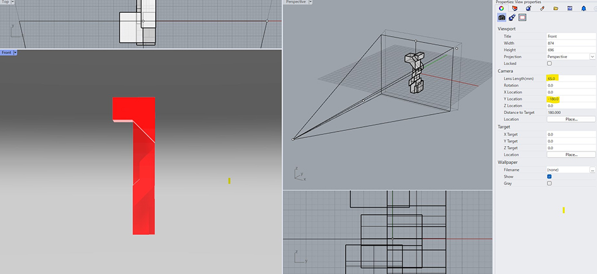
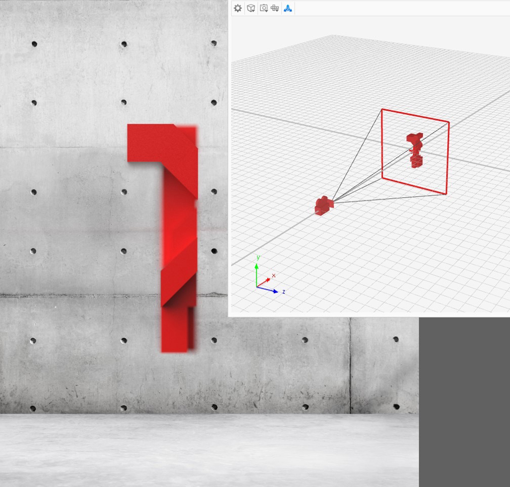
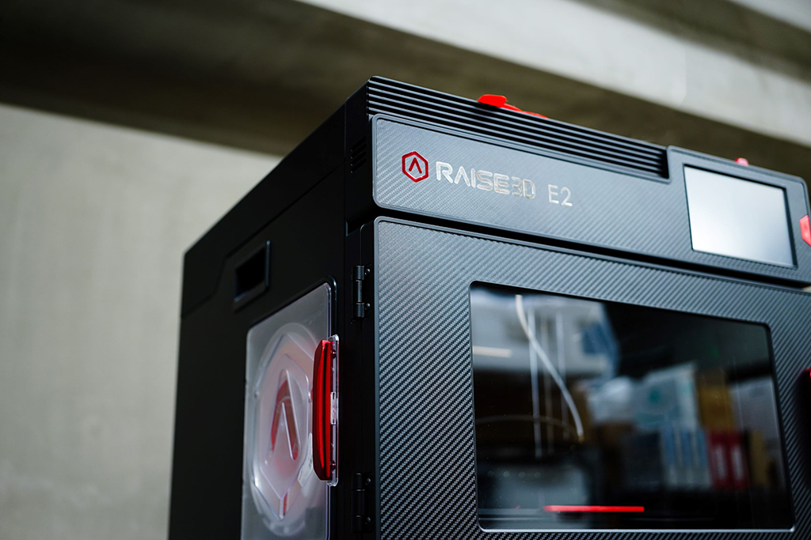
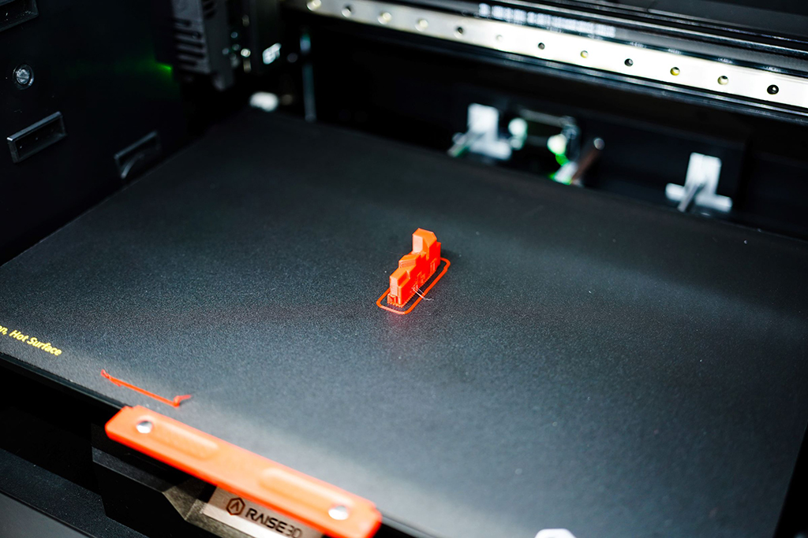
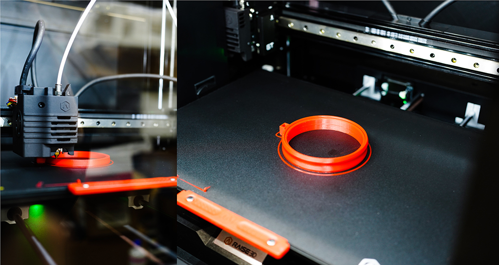
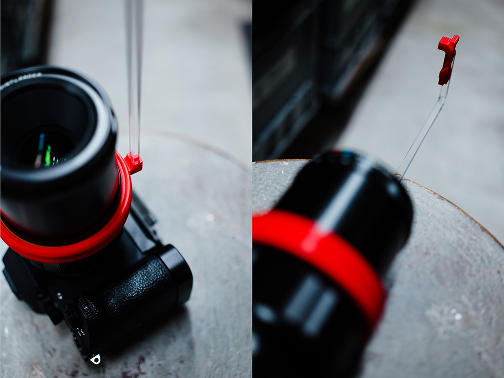

 

## **#01/25 [ 2022/12/01 ]** 
### by Kengo Fujimori
  

 

はい、皆さんこんにちは。 

東京の片隅で、ひっそりと息をしているStudioDIMの藤森です。 
数年間DIY工房に務めておりましたが、『Do It Yourself』ってなんだか乱暴な言い方だなぁ、と 
思いつつ、工房が潰れたことをキッカケに『Do It Myself』の会社を設立した藤森です。(2回目） 

早いもので、もう12月です。今年もあっという間に過ぎ去りようか、という師走の流れに抗って五寸釘でも打ちましょう、と言うのが、この企画に対する自分なりの解釈です。締切があると、時計を監視する機会が増えるので、時間泥棒も眉をひそめる今日この頃です。 

さて、今回の食材は「1」です 

運営様の忖度に任せてみた結果の、「1」です。極めてシンプルな造形ですが、ミニマリストが好む「0」とは違って、より潔さがあります。素材の持つ良さを活かしつつ、奥ゆかしさみたいなものを出せたらと思います。 

ということで、早速調理に移るわけですが、今回は実験的に、CAD上でのカメラシミュレーションが実際の所、正確に機能するかというテーマで進めてみたいと思います。

 

### **材料**

* PLAフィラメント
* アクリル棒

 

### **技術**

* データ作成：Illustrator, Rhinoceros, KeyShot
* ３Ｄプリント：RAISE3D E2

 

### **作り方**
 

まず、illustratorで適当な「1」を選んで、やや要素を増すための分割を行います。 

  

そして、それをCADにインポートして、奥行きを作成しますが、この時点で、カメラアングルを設定し、最終的に撮影する条件と同じ条件を設定したビューを作り出し、そのビューを基に形を変形させて行きます。 

今回使用するレンズの仕様は以下の様になります。 

* 焦点距離　65mm
* 絞り F2 – 22
* 最短撮影距離　0.31m
* 最大撮影倍率　1 : 2
* 画角　38°

↑の条件を設定の上で、Rhinoceros及びKeyShot上で、パーツの前後関係や大きさを調整していきます。 

  

Rhino上でのカメラアングルと焦点距離の設定。 

  

KeyShot上ではボケ感や、遠近感によるパーツの位置やサイズ確認を行います。 
あくまで、レンダリングなので、実際に同じ様になるとは限りませんが参考にはなります。 
カメラアングルに必然性を出す為に、正面以外からのアングルでは形状にまとまりがありません。 

「1」の形状が決まったら、3Dプリンターで出力を行います。 

  

見た目はほぼヘルシオですが、調理に1時間半もかかってしまいました。 
出来上がりに関しても、ヘルシオと違って外はカチカチ。中もカチカチです。 

  

この時点での期待感はゼロですね。 

更に今回は、焦点距離を維持しながら、縦横構図の切り替えに対応させる為のオプションパーツを出力します。 

  

ベアリング機構も考えましたが、結構ノウハウが必要な様です。 
二重のリングにするだけでも、スムーズには回転します。 

テキトーなアクリルの棒をカットして、テキトーに差し込みます。 
仕組みとしてはこれでほぼ出来上がりです。 

  

被写体までの距離が変わらないので、どこで撮っても常に同じ倍率で、同じ焦点距離を保ってくれます。時間があれば背景で遊んでみても楽しいかもしれません。 

HyperFocalというアプリによると、65mmF2距離0.3mmの場合、過焦点距離はわずか2mmです。つまりピント面から前後1mmの範囲しかピントが合いません。積極的にボケをトーンとして扱っても良かったかもしれません。 

  

しまった、今日は平日だ。

    

### **作者紹介**
 

**藤森 研伍** 

合同会社 StudioDIM 代表 
某DIY工房にてマネージャーを務めるも、施設が閉館となり、DIYからDIM（DO IT MYSELF）へと転換し、 
スタートアップ支援やメーカースペースの立ち上げなどに携わる。 
機械好きが高じてデジタルファブリケーションに傾倒するも、元々は金属工芸の作家であるため、手仕事からは離れられない。
  

（Last Updated: 2023.04.11）

