 

## **#03/25 [ 2022/12/03 ]** 
### by Takuma Oami (FabLab SENDAI – FLAT)
  

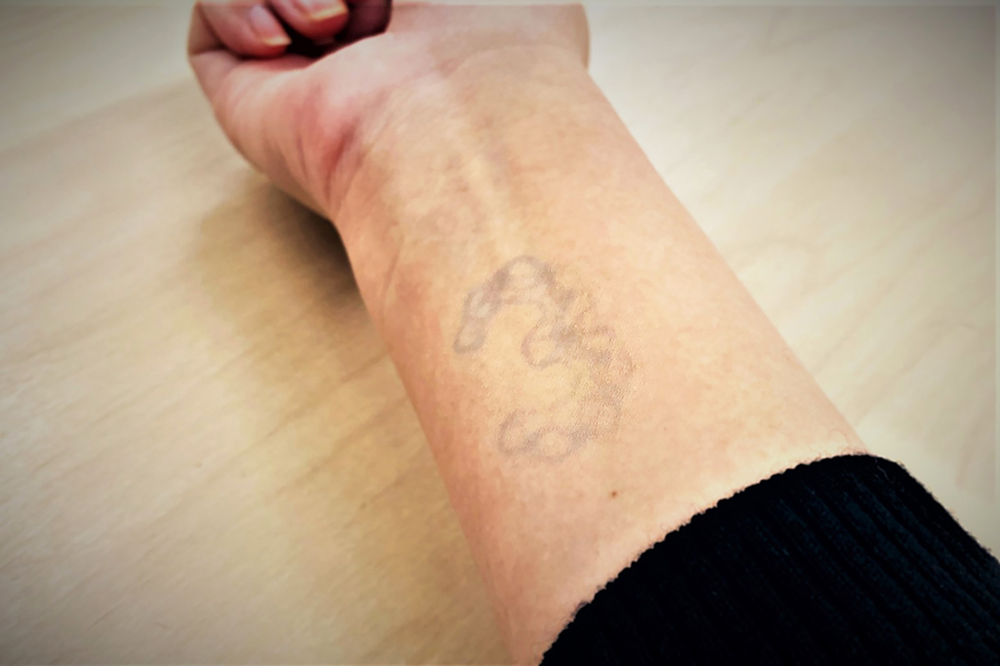

 

ということで、“３”はマシンに描かせたタトゥーです！ 

今年のアドベントカレンダーは実験したいなぁ、とぼんやり考えていたところ。[ひょんなこと](https://omocoro.jp/kiji/368066/)から、[Inkbox](https://inkbox.jp/)という２週間ほどで消えるタトゥーインクの事を知りました。これを日ごろ使ってるShaper Originというマシンに取り付けて、パソコンで設計した通りの図柄をタトゥーとして入れられたら面白いだろうなぁ、と思い立ったのがキッカケです。 

…そう、それがもはやリセットできない戦いの始まりだったとは、２週間前の僕は知る由もなかったんだ… 

[※改造したマシンShaper Originの紹介記事はコチラ！](https://fablabsendai-flat.com/2018/04/20/intro_shaper/) 
（ホントはこういう使い方するマシン何だってこと、あらかじめ知っておいた方が楽しめると思うので、よかったら読んでみてね） 

それでは、今回使った材料と技術デス ↓↓↓

 

### **材料**

* [Inkbox フリーハンドインク](https://inkbox.jp/collections/freehandink)
* PLAフィラメント [Polyterra Black](https://polymaker.com/polyterra-pla-info/)
* DAISOで買った化粧品用注射器 (20ml)
* 血圧計から取り出したDCモーターエアポンプ
* 真鍮パイプ 外径 4mm
* Seeeduino XIAO
* 可変抵抗 10kΩ
* 細々した電子部品(N-ch MOSFET, ダイオード, LEDなどなど)

 

### **技術**

* インク射出機データ作成：Rhiniceros
* タトゥーデザイン：Illustrator
* 3Dプリント：Anycubic i3 maga-s
* タトゥーインクCNC：Shaper Origin + 今回作ったインク射出ユニット

 

### **作り方**
 

木材加工でパズルのような有機的な形状を切り抜くやり方は何パターンかありますが、今回はShopBotを活用して形状の切り出し、彫り込みを行っていきます。  

### **1. いろいろ考えながらデータ設計**
 

とにもかくにも、タトゥーインクが無いと何も始まらないので、まずはポチってみることに。 

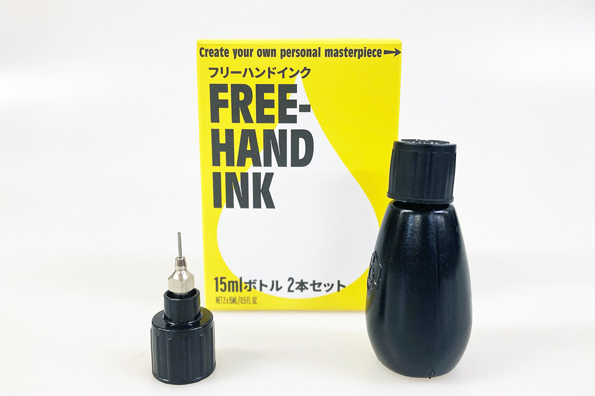
  

今回Inkboxから購入したのは、フリーハンドインクという製品。右の黒い容器にタトゥーインクが入っており、それに左の金属製のノズルをつけて使用するもの。 

<iframe width="680" height="382.5" src="https://www.youtube.com/embed/I1Loz3TRv7g" title="YouTube video player" frameborder="0" allow="accelerometer; autoplay; clipboard-write; encrypted-media; gyroscope; picture-in-picture; web-share" allowfullscreen></iframe>
  

本来は↑の動画のように手で持って模様を描きますが、これをCNCマシンに任せるっていうのが今回の趣旨。 

しかしこのインク、ちょっと粘性があり傾けてもノズルから自然に出てくることはありません。そこで、“たまたま”工房にあった小さなエアポンプを使い、空気圧でインクを押し出してやることにしました。 

オリジナルの黒い容器だと改造しにくいので、100円ショップDAISOに行きコスメ用の注射器(20ml)を購入。フリーハンドインクのノズルを付けてみると、なんとジャストフィット！こりゃ、幸先いいぜ！ってことで、これをマシンに取り付けるためのアダプタをモデリング開始～ 

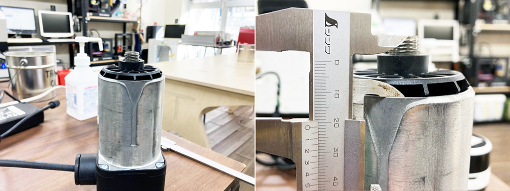
  

これが、もともとShaper Originについてる刃を回転させるためのモーター。この代わりにさっきのインク注射器を付けるアダプタを作らなけらば。色々採寸して。Rhinoでモデリングして出来たのがコチラ↓ 

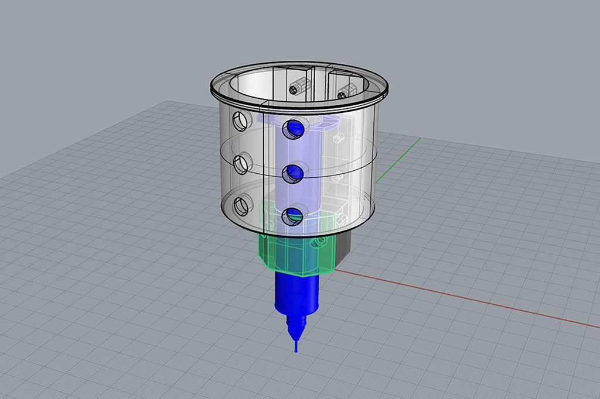  

まぁ、まずは3Dプリントしてマシンに取り付けてみないとだねーってことで、第１試作に入ろう。
   

### **2.とりあえずプリントして試してみよ**
 

先程のデータをプリントしてみたものがコチラ。 

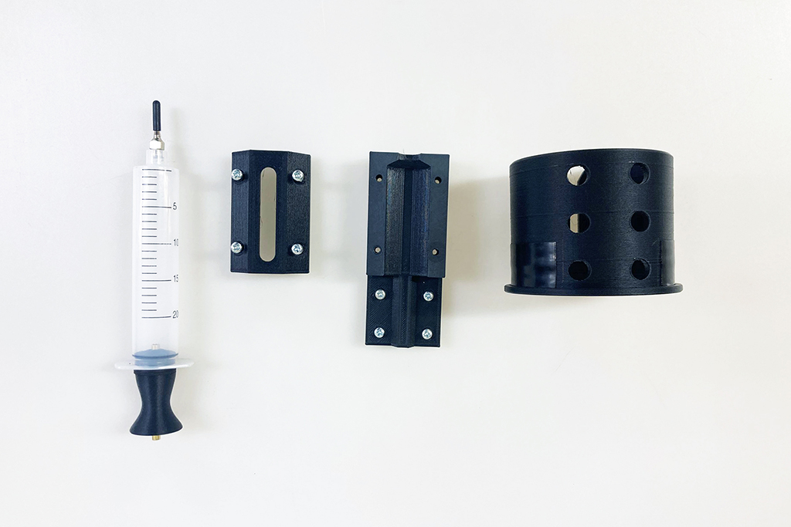  

基本的にパーツは接着などせず、埋め込んだM3ナットとM3ボルトで組み立つように設計。 
他にも、あとで修正があった時にやりやすいような工夫をしておくと、後々トラブった時に、過去の自分と協力してるような気分になって嬉しい。 

あと、エアポンプからのチューブを繋ぐため、注射器のフタも作っておいた。 

じゃあ、組み上げていきまっしょっ！！！ 

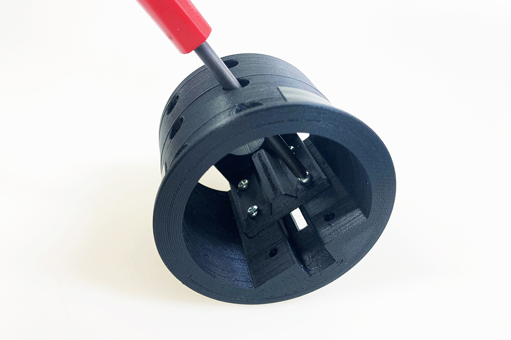  

ほらぁ、言ったそばから。ちゃんとドライバーが通るような穴あけといて良かったぁ～。 

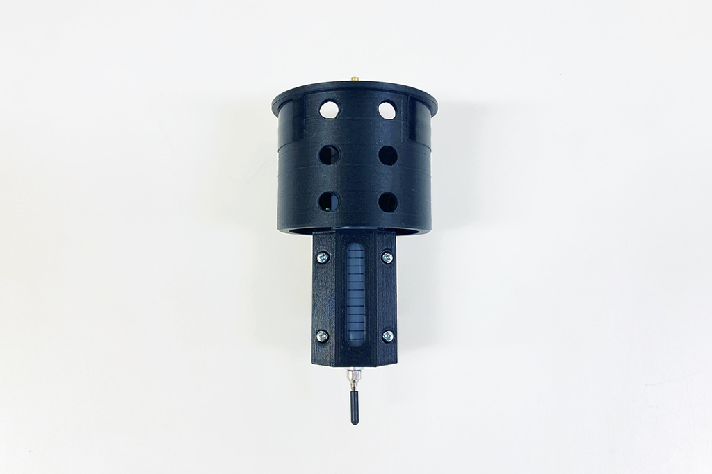  

とりあえずできた。これをマシンに付けてみると… 

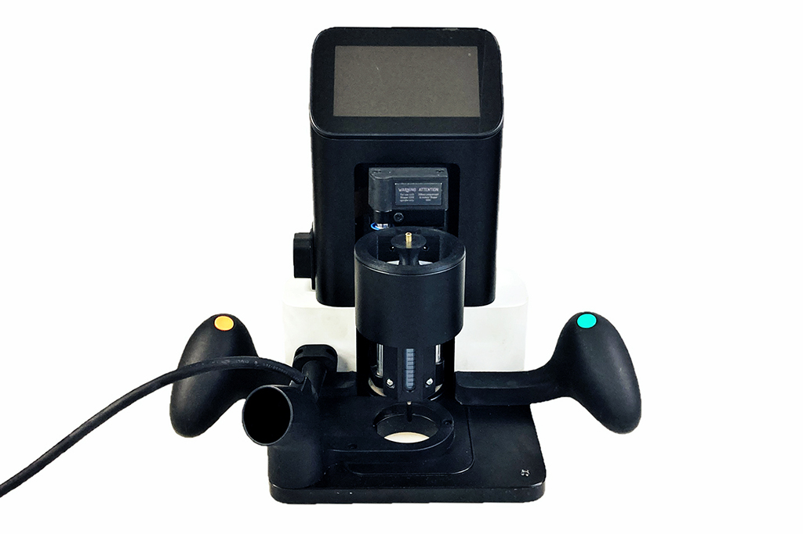  

こう！ 

なんだよ、マットなブラックフィラメントが相まって、『公式のオプションパーツですけど？』みたいな顔で居座ってんじゃないの。じゃあ次は、良い感じにインクを出すためのエアポンプとその制御部分を作っていこう。

   

### **3.インクとポンプ部分を考える**
 

ポンプから送られた空気で注射器の中のインクを押し出すとは言ったものの、いくつか課題があった。特に懸念していたのは… 

(1)常にポンプが動いてると、余分なところにインクをバラまいてしまう。 
(2)ポンプの圧力が強すぎると、インクが大量に出すぎちゃう。 

という２点。考えた対策としては、 

(1)の対策： 
金属製のノズルをタッチセンサーとして使い、肌に触れた時だけポンプを動かす。 
(2)の対策： 
ポンプの空気圧を調整できるツマミを付けとく 

ってアイデアを考えていた。これを自動化するためにSeeeduino XIAOっていう小さなコンピュータをプログラムして、電子回路を作っていく。詳しい人のために、参考にしたリンクを貼っておきます！ 

* Seeeduino XIAO公式リファレンス
* XIAOのタッチセンサを使った作例
* MOSFETとDCモーターの使い方 [Arduino] by プチモンテ
* Basics of Potentiometers with Arduino*

とにかく懸命に頑張った結果、ノズルを触るとポンプが動くようになった！ 
なのでさっき作ったユニットに、 

* エアポンプ
* コントロールのための電子回路
* 空気圧を調整するためのツマミ

の、三種の神器を追加しなければ！ということで再度モデリング。 

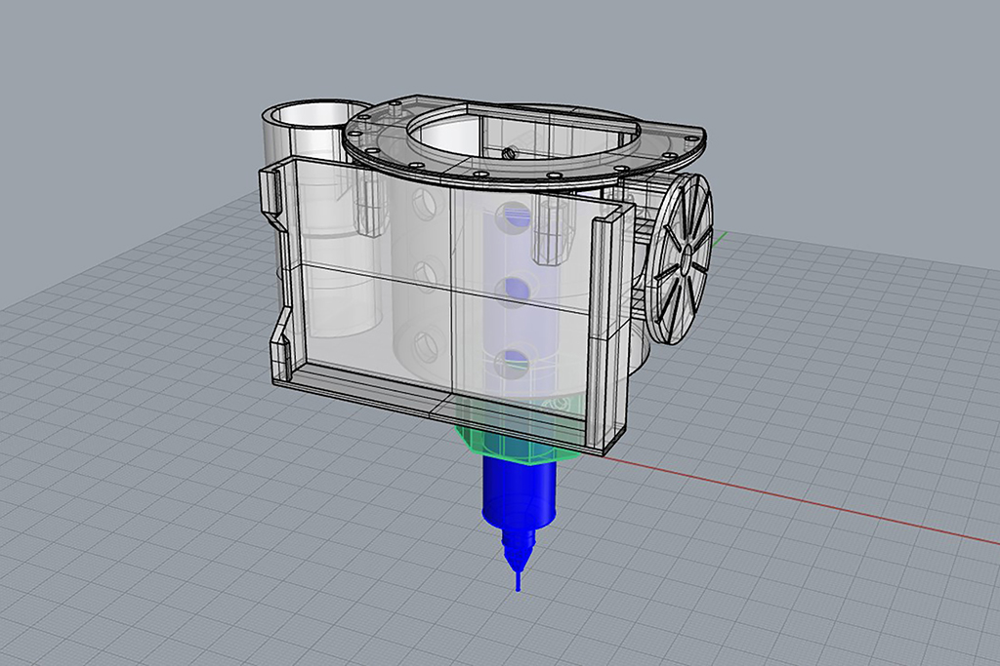
  

はい、やっとゴチャゴチャしてまいりました！ 
コチラから向かって左にエアポンプ、中央に電子回路、右にツマミが付く予定。 
早速プリントして組み上げてみると、こんな風になる↓ 

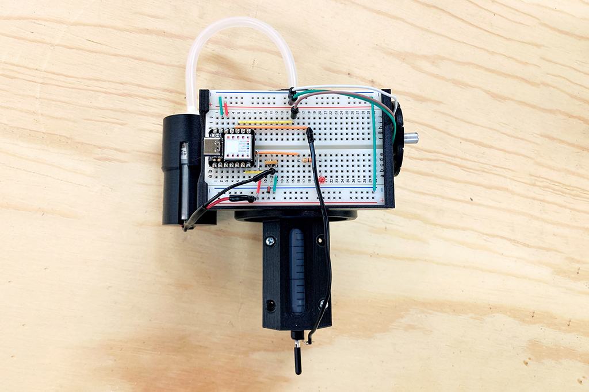
  

なかなか、サイバーな雰囲気が出てきたね。さっきまでのスッキリしてたお前も良かったけど、そういう粗削りなトコロも嫌いじゃないぜ？

   

### **4.もうさ、動かしちゃお、そうすれば分かるよ色々。**
 

試運転するために、インクを入れてレザーの切れ端に丸を描かせてみる。 

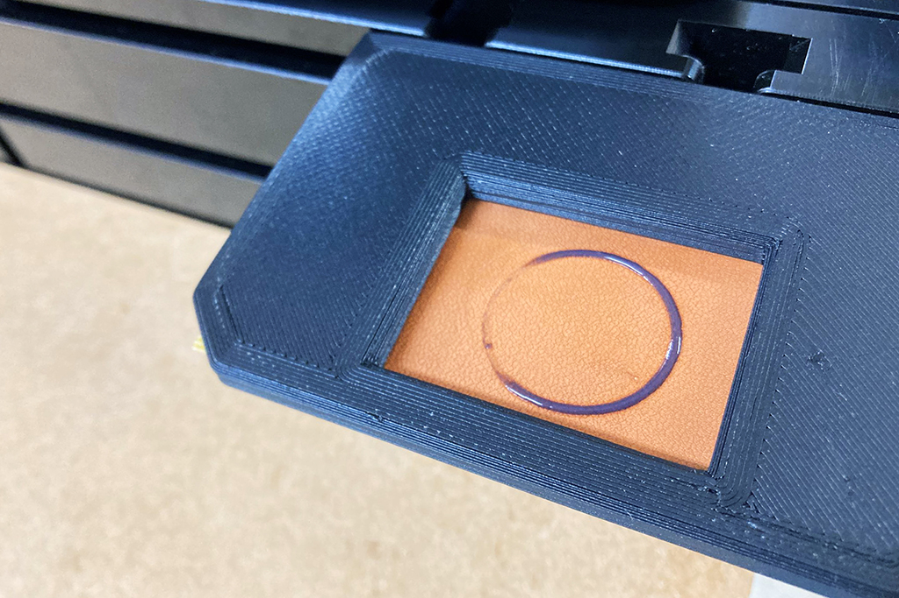
  

すると、色々分かってきた。まず皮膚にノズルが当たると先端の穴がふさがれて、上手くインクが出ない。↑の写真の途切れてるところは、ノズルが当たり過ぎてしまってる。肌よりもちょっと浮かせて、動かした方がインクの”かすれ”を回避できる。 
しかし一方で、ノズルが肌に当たらないので、タッチセンサが反応しなくなる。ならいっそ手動でスイッチ押すと、その間だけインクが出るように修正した。 

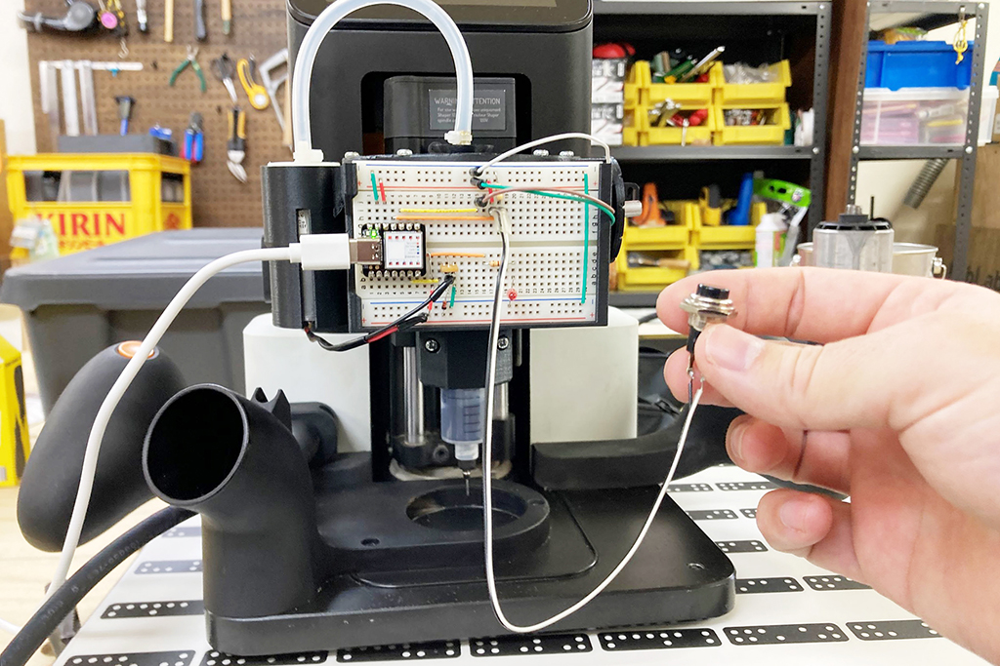
  

あと、適度なポンプの空気圧も分かってきた。やっぱりMAXだとインクがとんでもない量出てきてしまう。 

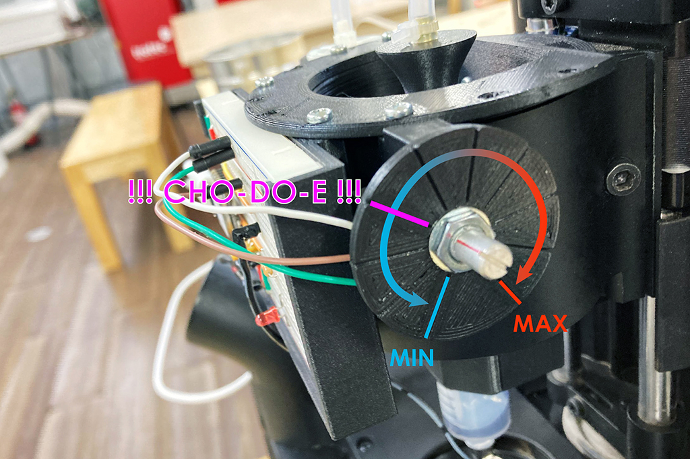
  

そこで圧力ツマミに、目印として赤いラインを付けて実験を繰り返したところ、↑の写真の位置がちょうど良いインクの射出量になる事を突き止めた。 

他にも細かい調整を繰り返し、テストの丸を描かせてみたら… 

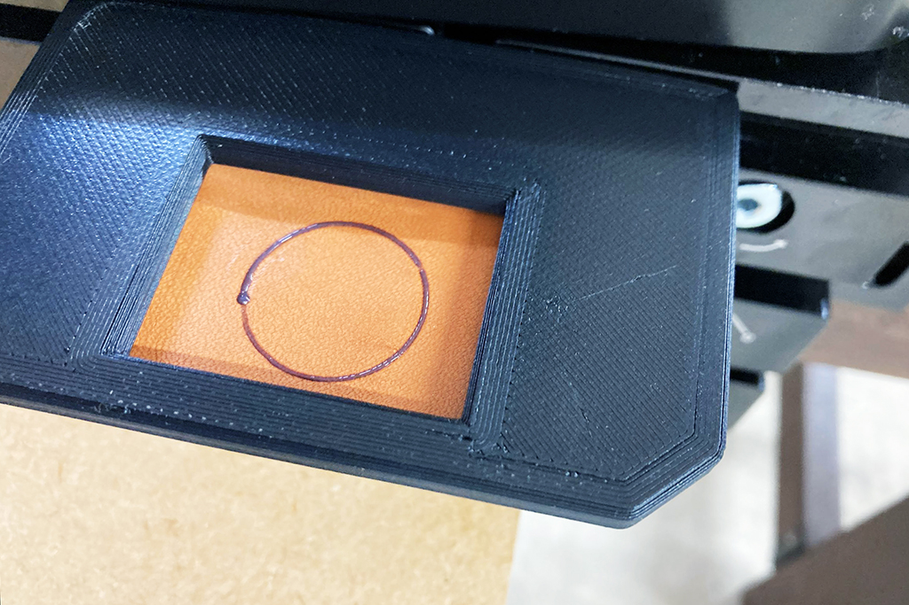
  

最初のより全然良ーい。この設定で行くことにした。

   

### **5. "３"の図柄を考える**
 

最低限、インクが肌にのせられるなと確かめたところで、じゃあどんな”3”を肌に入れるか、図柄を考えていく。線幅が約1mmくらいになるので、そんな細かい模様は難しそう。あと液体なので、シャープなエッジもきついかな～と、思いつつも色んな”3”をマシンに描かせてみた。 

マシンの癖を知りたいので、できるだけ違ったデザインを用意する。 

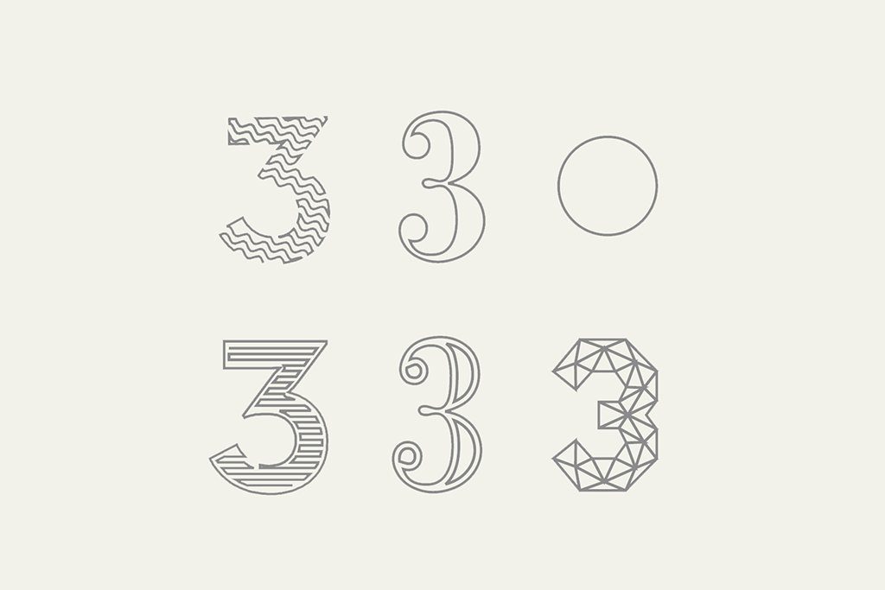
  

↑ これをマシンに描かせると、こうなった ↓ 

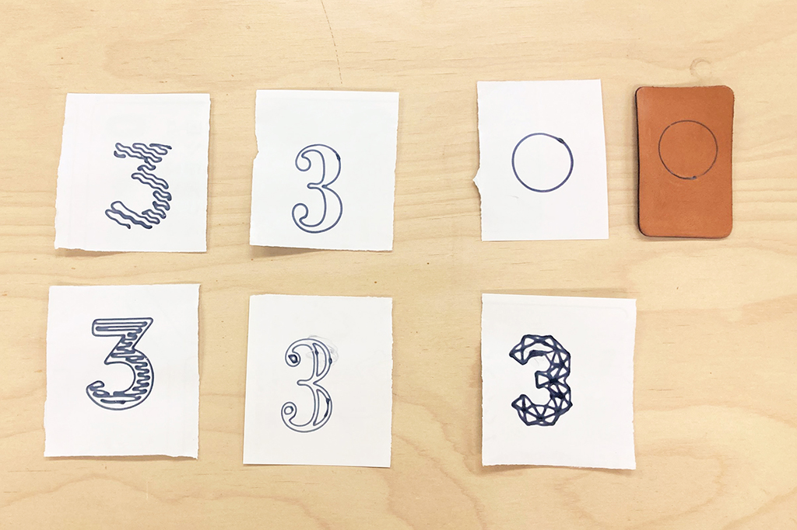
  

やっぱりピン角を描くのが、難しいみたい。 
だが、曲線で構成されている図柄、編むようにノズルが動く図柄はなかなか出来ているぞ！ 

せっかくなので、複雑な図形にしてみよう。ということで、右下のボロノイチックなデザインを採用する。
   

### **6. 本番！**
 

マシン、データ共に一応準備出来たので、いよいよ人間にインクを描いていこうと思う。 
こちらが、腕を装置にセットした様子 

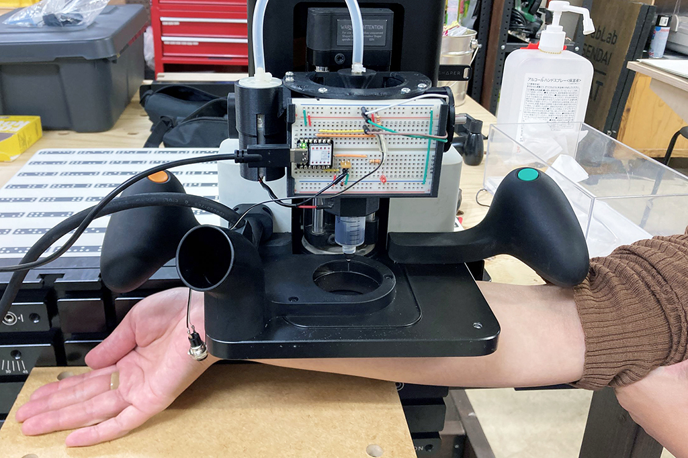
  

確実に悪いことしてるな。 
という見た目ですが、被験者を傷つけないように、二重三重の安全確認をしながら進めております。 

緊張の一瞬、ノズルを肌ぎりぎりまで近づけて、エアポンプ始動、インクがノズルから出はじめたところで、Shaper Originを動かすと…. 

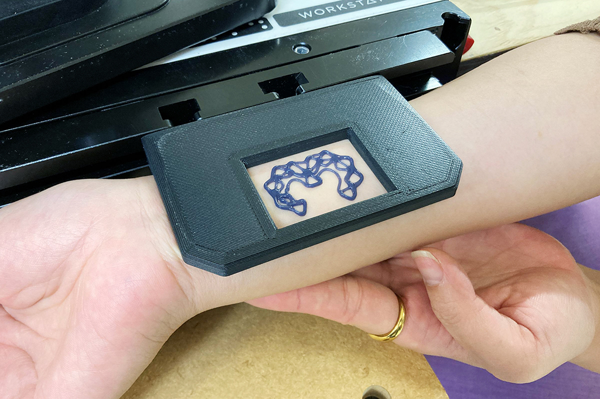
  

描けてますやん。 

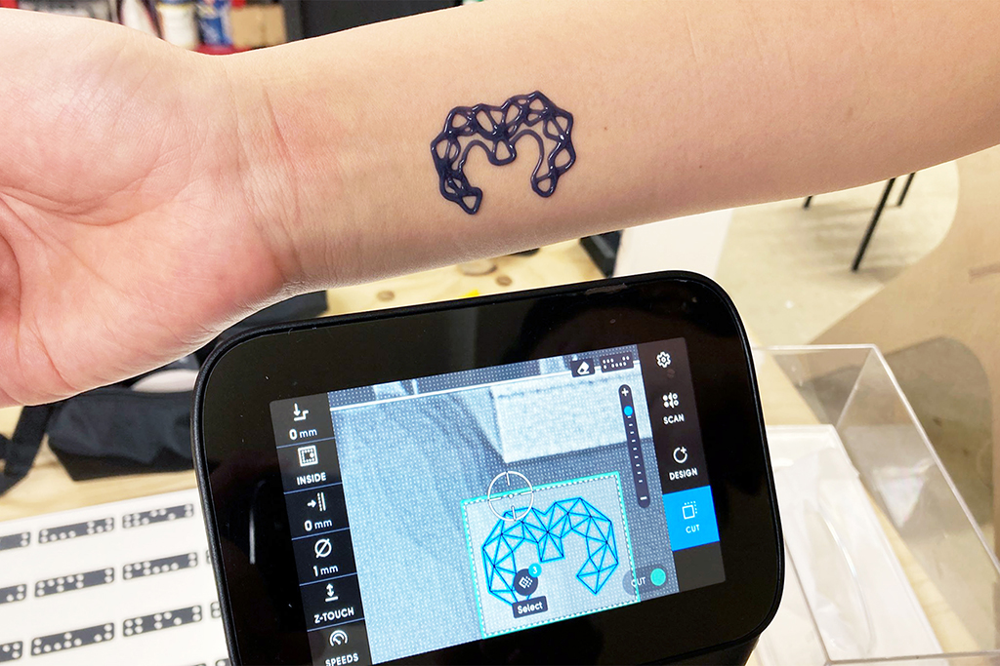
  

ねぇ、描けてますよね！？　ちょっと入力デザインより有機的にはなっとるけども！

   

### **7.まとめ**
 

Inkboxが公開しているチュートリアルに沿って、インクを乗せた後は１時間ほどそのままにしておきます。するとインクが固まってくるので、時間が来たら石鹸で洗い流してその日は終了。洗った後は、なにも模様がついてないように見えますが、次の日インクを乗せた箇所を見てみると… 

  

タトゥーが浮き出てきてる！塗ってから、24 ~ 36時間で色が濃くなっていくそうなので、もうちょっと待てば更にハッキリしそうですが、ここでタイムオーバー。 

※ ( [色を濃く出すためのTips](https://monro187.com/inkbox)を発見したので、再チャレンジして上手くいったら写真更新します！ ) 

今回は、既製品のマシンを改造してインクを塗りましたが、これ専用のCNCマシンを作っても面白そうですね！ちょっとサイドプロジェクトとして続けてみようと思います！

    

### **作者紹介**
 

**大網 拓真**（FabLab SENDAI – FLAT） 

東北は仙台駅前のメイカースペース。 
思い付きや初期衝動を大切にする運営スタッフ2名（小野寺&大網）が勢いのあるプロトタイプを行なっている。
  

（Last Updated: 2023.04.11）

