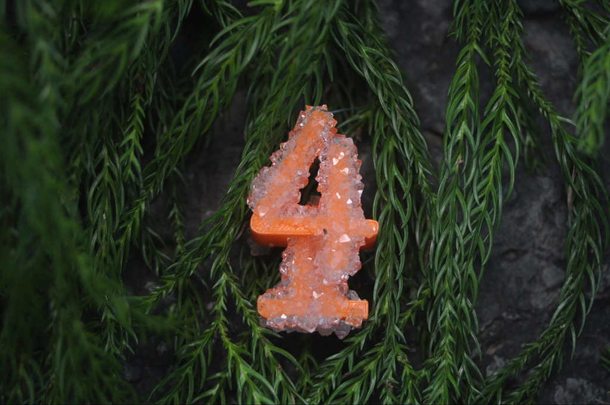
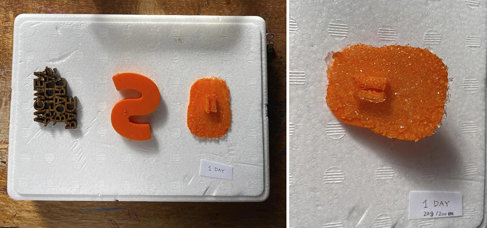
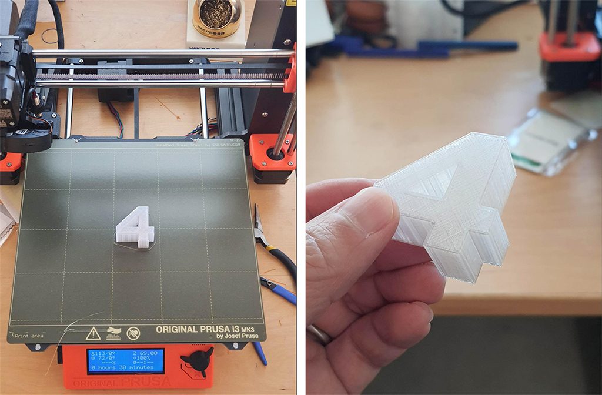
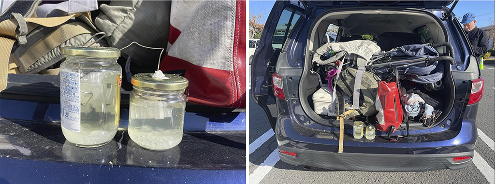
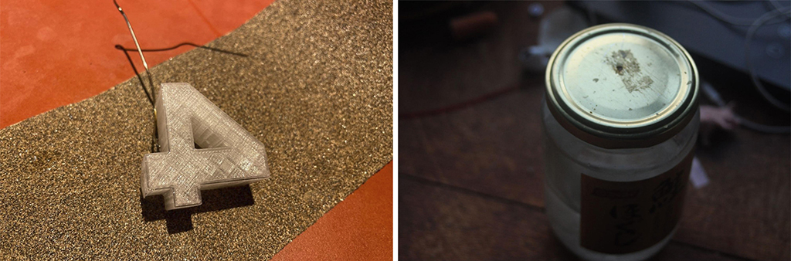
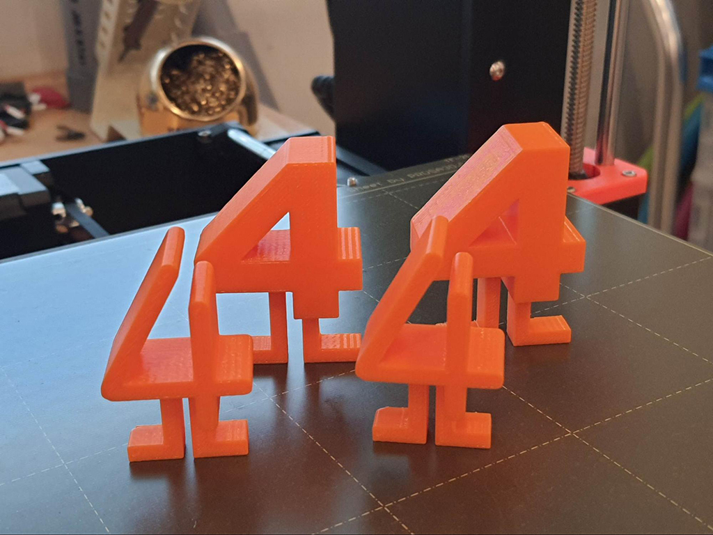
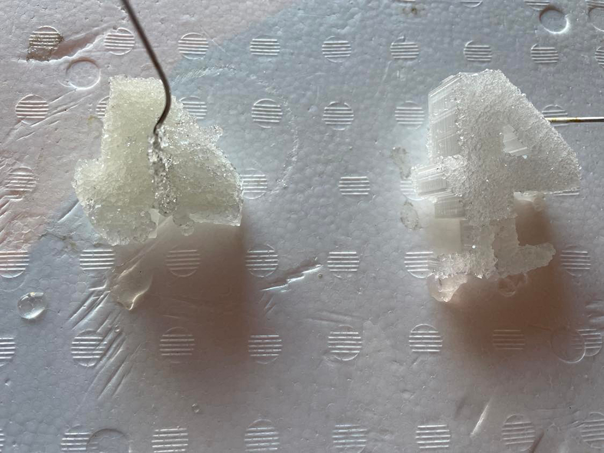
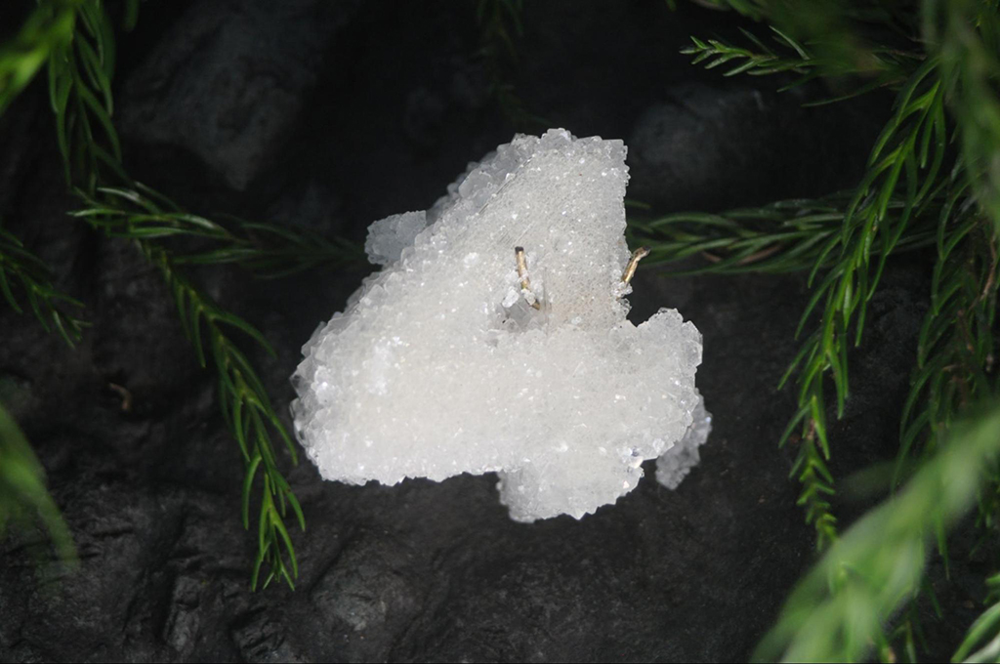
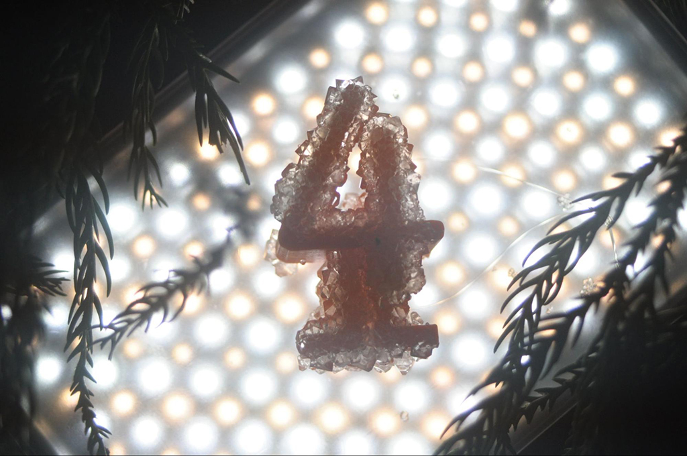

 

## **#04/25 [ 2022/12/04 ]** 
### by KAMIYAMA MAKER SPACE (KMS)
  

 

神山に滞在していたベルリン在住アーティストが、3000本の毛糸と植物に再結晶を付着させているのを目の当たりにし、人工物に再結晶がどんなふうに成長するのか、あるいは付着すらしないのか、ふと見てみたくなってしまいました。そんな時、４というお題をFablab sendaiのお二人からタイミングよくいただき、再結晶実験の機会とさせていただきました。

 

### **材料**

* PLA
* PETG
* みょうばん

 

### **技術**

* 3Dプリント
* 再結晶

 

### **作り方**
 

### **1. 飽和水溶液でテスト**
 

  

４の支持体は何にしようか考え、とりあえず再結晶が身近な素材に付着するのか実験。 
水100mlに対してみょうばん10gの飽和水溶液を使用。 
水溶液に素材を漬け込み1日経過、見事PLAフィラメントの表面に再結晶が！ 

木材などの素材も考えたのですが、ここは形作りに自由度のある３Dプリンターで支持体を作ることに。
   

### **2.支持体を３Dプリンターで出力**
 

  

フィラメントの色は結晶に馴染むよう、透明フィラメントPETGで４を制作。
   

### **3.いざ、飽和水溶液へ**
 

  

フィラメントが浮いてこないよう、４を針金で固定し飽和水溶液の入った瓶へ投入。島根の方へ出かけていたので、家に放置していくわけにもいかず、再結晶させながら一緒に移動することに。こそこそ作業していたので、旦那や友人の不思議そうな視線をかなり背中に浴びながらの制作でした。

   

### **4.PETGの表面をやすりでやする**
 

  

飽和水溶液へ４を沈めてから2日後、再結晶の付着具合をみてみたらほぼ付着していない！ 
ヤバイ！PETGの表面は結晶がツルツルしすぎているのか！？ 
次の策として４の表面を紙やすりで傷つけて、再び飽和水溶液へ投入。

   

### **5. PLAで教科書体の4を出力し直し**
 

  

こちらも飽和水溶液へ投入！   

### **6. やすりがけしたPETGにも再結晶が付着**
 

  

1日後、やすりがけしたPETGにも再結晶が付着していた。やすりがけしなかった方には、再結晶の付着が少なかったので、やすりの効果はあったのか。もしくはPETGに再結晶が起こらなかったのは、４の瓶中での位置の問題だったのか。 
とにかく数日後には再結晶が４にもりもり付着している。 
PLAにも再結晶がモリモリ。もりもり。 

  

これは、女子の憧れティファニーの指輪よりも、キラキラピカピカ。ロマンチックなクリスマスイブにお部屋に飾れば、間違いなくプロポーズ大成功の脇役!? 実際クリスマスはまだまだ先なので、すぐに忘れられちゃいそうな数字ではありますが。 

<iframe src="https://player.vimeo.com/video/777018663?h=216c11588c" width="680" height="383" frameborder="0" allow="autoplay; fullscreen; picture-in-picture" allowfullscreen></iframe>

<a href="https://vimeo.com/777018663">DSC_1519</a> from <a href="https://vimeo.com/user61050514">Sayaka Abe</a> on <a href="https://vimeo.com">Vimeo</a>.

   

### **４を制作させていただいて。**
 

  

期限ギリギリまで腰を据えて、アドベントカレンダーのことを考えられなかったことがかなりの反省点ですが、、、楽しかったです！小学校の時にやったであろう再結晶の実験と、現在身近な技術になった3Dプリント。相手は自然物なので、時間がかかることや思ったように行かないところも多くありましたが、それも含めて良い経験でした。4日までまだ数日残っているので、４たちをもう少し飽和水溶液につけておこうと思います。（もう少しモリモリ＆キラキラさせたい！）そしてこれを機会に引き続きいろんな素材に再結晶を成長させる実験をしてみたいと思います。 

さあ、クリスマスまであと21日！ 

 

    

### **作者紹介**
 

**KAMIYAMA MAKER SPACE (KMS)** 

作りたいものを自分たちで作るをモットーに2016年徳島県の山の中でスタートしたKMS。細々とやっていて、何をやっているか分かりにくい団体ですが、少しづつ機材やノウハウが増えてきました。今年は新しい工房へ移動し、外でも作業できるようテラスを増設中。最近は生木を使って手でスプーンや椅子を加工できるグリーンウッドワークの講師になったコアメンバーも！ 
今回のACCは、ガジェット好きな副代表本橋大輔とビールを日々愛する代表あべさやかで協同制作しました。説明文はあべの独断と偏見で書いています。 
[http://kamiyama.ms/](http://kamiyama.ms/)
  

（Last Updated: 2023.04.11）

