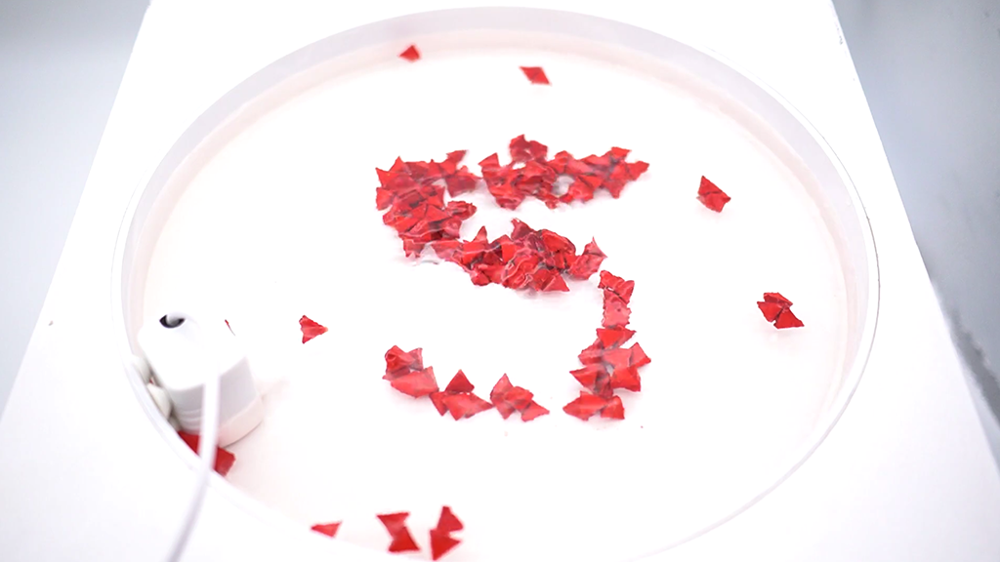

 

## **#05/25 [ 2022/12/05 ]** 
### by Junichi Yamaoka
  

 

<iframe width="680" height="382.5" src="https://www.youtube.com/embed/zmBkv9Xz7fw" title="YouTube video player" frameborder="0" allow="accelerometer; autoplay; clipboard-write; encrypted-media; gyroscope; picture-in-picture; web-share" allowfullscreen></iframe>
 
 

今回、５ということで、私の開発しているFloating Pixelsという、浮遊する粒が集合して、数字を表示する作品を使って表しました。 

こちらは作品のキャプションです。 

 

*Floating Pixelsは、実体のあるピクセルが、集合・拡散することで情報を表示します。磁性を持つピクセルは、水面を浮遊して、磁力により集合して成形します。これまでの画面の中に留まっていたピクセルは、実体化することで、実世界に溶け込み、人と直接触れる対話を実現することができます。* 

[https://futurecrafts.kmd.keio.ac.jp/floating-pixels/](https://futurecrafts.kmd.keio.ac.jp/floating-pixels/)
  

  

浮かんでいる球体の素材としては、3Dプリンタ用の磁性のフィラメントを使ってます。浮かぶように、中空構造になってます。 

粒を集めるための機構は、水槽の下に、磁石が配置されていて、それらを動かして制御します（権利の関係上ちょっとお見せできなくて、すみません） 

大型のものを構想していたり、今は日本テレビR&Dラボと共同研究で、未来の日常で溶け込むような新しいディスプレイ技術として研究開発してます。 

もし、こういう場面で使ってみたいとか、面白い利用方法などありましたらご連絡ください！ 
Twitter：[https://twitter.com/FutureCraftsPj](https://twitter.com/FutureCraftsPj)

    

### **作者紹介**
 

**山岡 潤一** 

研究者・アーティスト。慶應義塾大学大学院 メディアデザイン研究科 専任講師。 マテリアルの特性に着目した、インタラクティブメディア、デジタルファブリケーションに関する研究を行う、Future Crafts プロジェクト主宰。
[https://futurecrafts.kmd.keio.ac.jp/](https://futurecrafts.kmd.keio.ac.jp/)
  

（Last Updated: 2023.04.11）

