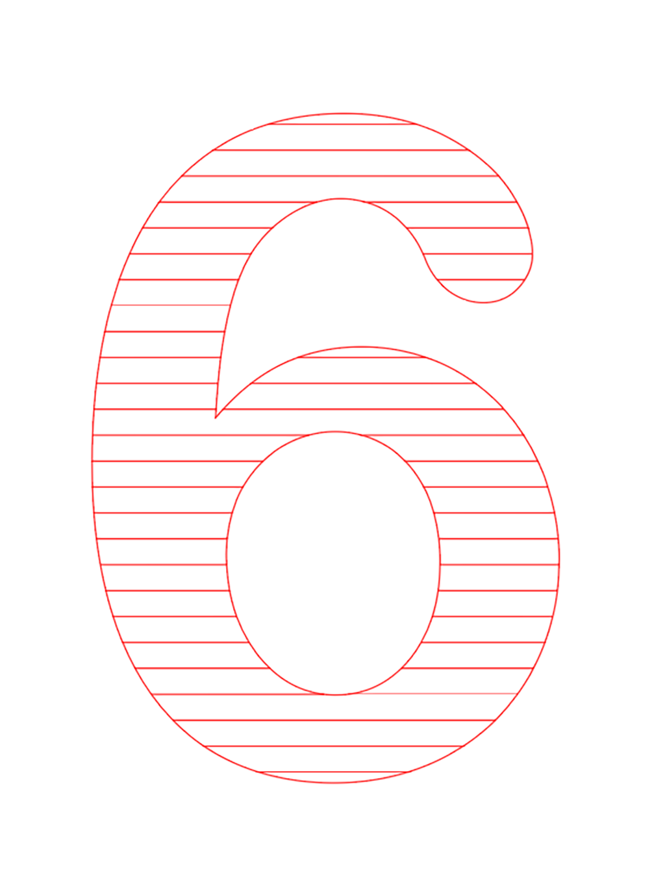

 

## **#06/25 [ 2022/12/06 ]** 
### by Mizuki Suzutani
  

 

## 石を強めにレーザーで溶かしてみた
 

火山のふもとには、溶岩プレートで肉を焼く店がだいたいある、という偏見がある。
ドロドロモコモコした溶岩は地球のエネルギーを感じられる（気がする）。 

当初は石板をレーザーで加熱して焼肉する予定だったのだが、11月に早まった忘年会の暴飲暴食で胃腸を壊して肉焼いても食べられなさそう、という個人的な理由で、使うはずだった石の板をいじめまくる回になった。

 

### **材料**

* スレートコースター（Amazon）
 

### **技術**

* レーザー加工機（trotec speedy 100）
* Illustrator CC

 

### **作り方**
 

石をレーザーで彫刻することができるのは周知の事実だが、~~焼肉ができなかった腹いせに~~もっと加熱するとどうなるのか？は安全管理上知っておく必要があるだろう。危険を冒すのは安全のためなのだ。そういうことにしておこう。 

  

まず普通に彫刻（ラスター）とカット（ベクター）を行った。 
この出力は 
P100 S3.5 1000PPI(彫刻) 
P100 S0.1 1000Hz(カット) 
カットはできていないが、カットで強めにレーザーを当てたらなんかモコモコきらきらして溶岩っぽい。内部のガラス質が溶けて出てきたのか。 

  

さっきのカットの出力（P100 S0.1 1000Hz）で彫刻してみた。 
時間をかけてガラスを溶かしたがカサブタみたいになっている。 

この間で「もこもこキラキラした彫刻を時間かけずにやりたい」という欲望がわいてきた。
ここでやっとこの記事の方針が決まった。 

Illustratorで、好きな文字を入力し、アウトライン化する 

  

次に、直線ツールで長めの直線を書き、 

  

「オブジェクト＞変形＞移動」を選択 

  

水平方向 0mm、垂直方向に1mmをセット、「コピー」をクリック 

  

二本目の線があらわれる 

  

二本目の線を選択した状態で「Ctrl + D」を連打すると、1mm間隔で下に直線がどんどんできていくので、そこにアウトライン化した状態の文字を重ねる 

  

直線と文字を選択してからパスファインダーの「分割」をクリック 
（パスファインダー無いときはウィンドウ＞パスファインダー） 

  

こんな感じに切り抜かれる 

  

この状態だと線が重なってたり隙間にいろいろあって大変なので、選択したまま「オブジェクト＞ライブペイント＞作成」をクリック 

  

そのまま、「オブジェクト＞ライブペイント＞拡張」をクリック 

  

見た目がちょっとかわる  

あとはレーザー加工機の仕様に合わせてパスを変更して 

  

彫刻するとこんな感じのモコモコでキラキラな感じに。海苔の佃煮たべたくなってきた。 

  

直線の間隔を調整したりするともっと質感が変化するかも？

    

### **作者紹介**
 

**鈴谷 瑞樹** 

合同会社博多図工室 代表 
福岡市のエンジニアカフェでコミュニティマネージャとしていろんなものづくり相談を担当。 
胃腸が治ったら牡蠣小屋に行きたい。 
[https://zookoo.net/](https://zookoo.net/)
  

（Last Updated: 2023.04.11）

