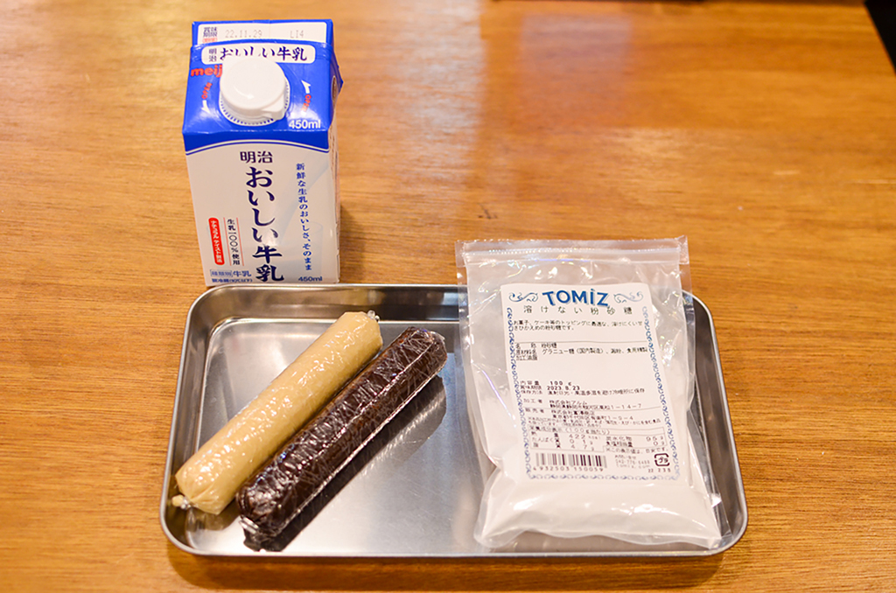
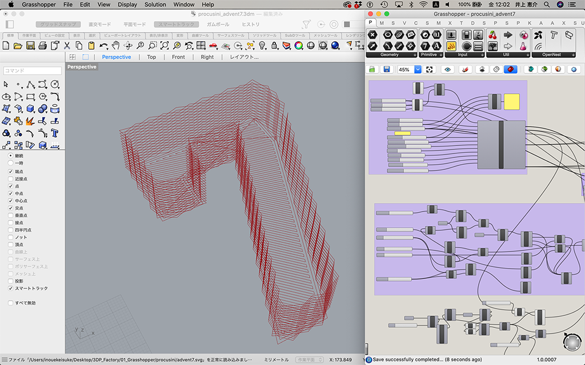
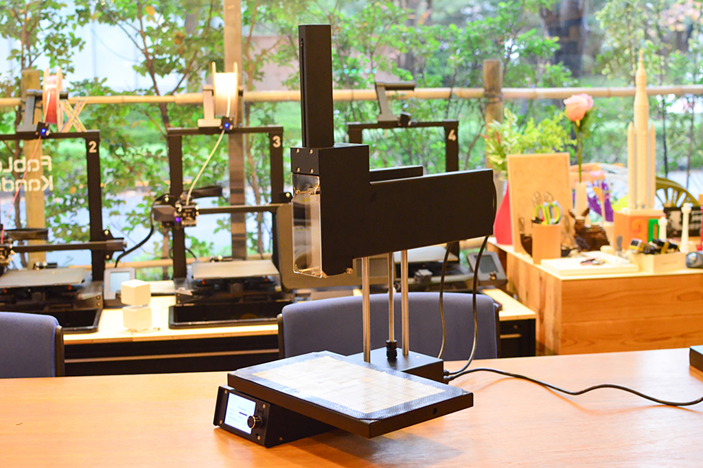
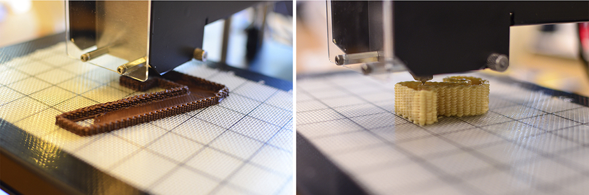
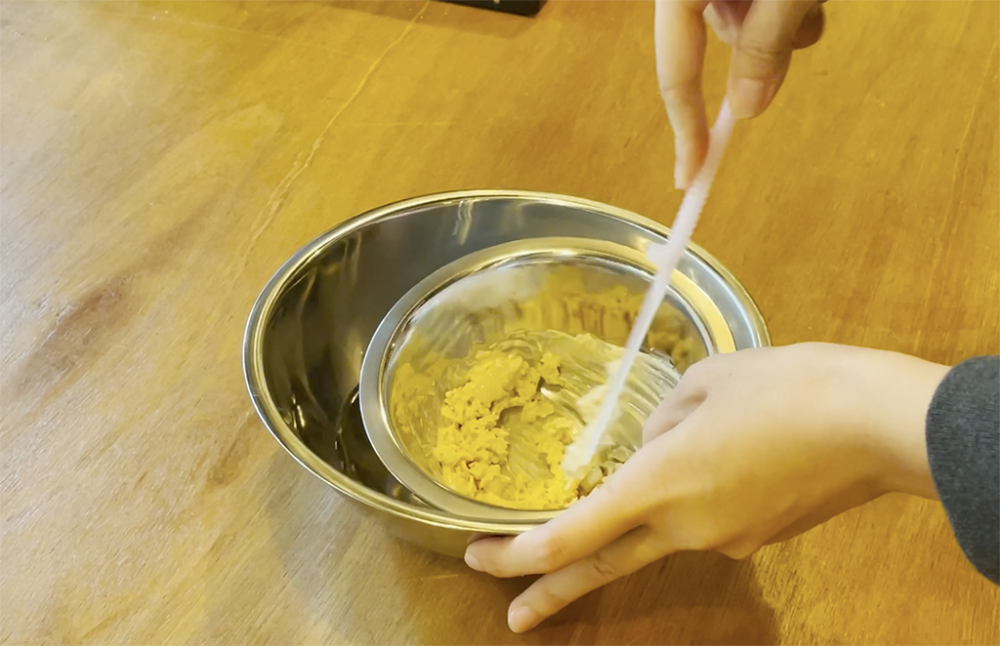
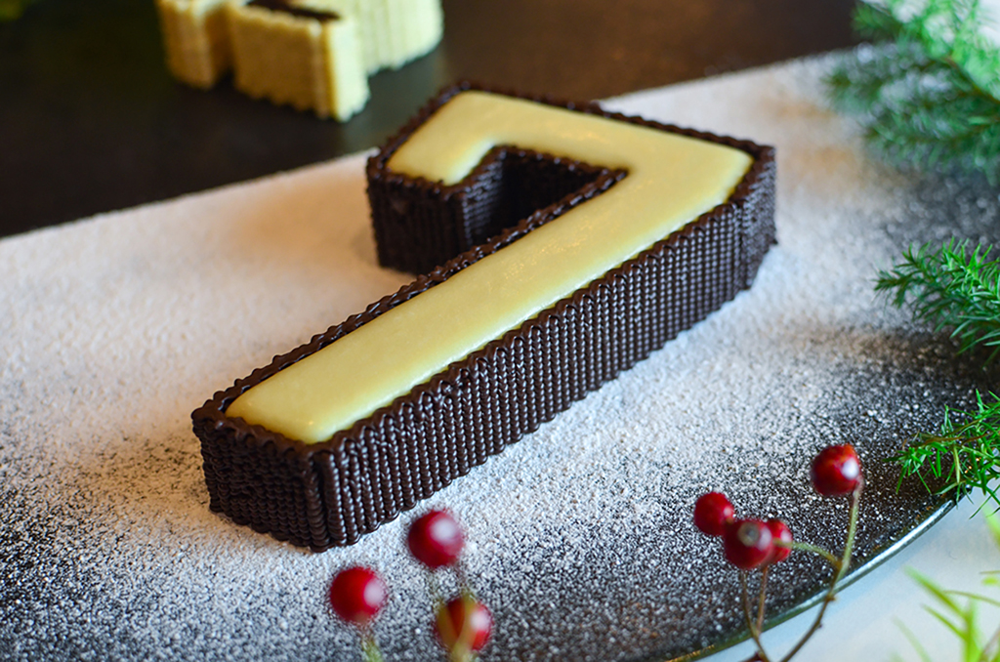
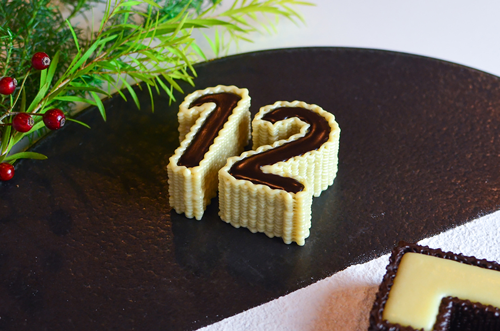
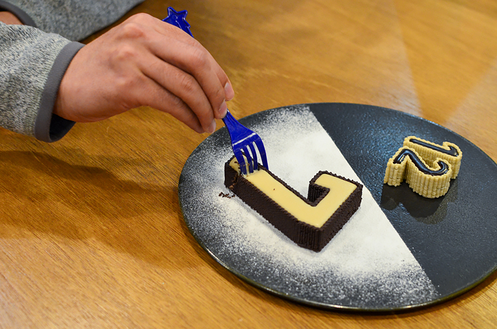

 

## **#07/25 [ 2022/12/07 ]** 
### by Keisuke Inoue, Mana Takata
  

 

### **材料**

* Procusini5.0専用チョコレートリフィル　ダーク・ホワイト
* 粉砂糖
* 牛乳

 

### **技術**

* データ作成：Rhinoceros+Grasshopper
* 3Dプリント：Procusini5.0

 

### **作り方**
 

今回私たちは、ドイツ製のフード3Dプリンター”Procusini5.0”を使って、チョコレートを3Dプリントし数字の「7」をつくりました。
 

<iframe width="680" height="382.5" src="https://www.youtube.com/embed/9QgYtZSAaJY" title="YouTube video player" frameborder="0" allow="accelerometer; autoplay; clipboard-write; encrypted-media; gyroscope; picture-in-picture; web-share" allowfullscreen></iframe>   

 

### **1. 材料を揃えます。**
 

通常フード３Dプリンターを使用する場合、材料を3Dプリントに適した状態（ペースト状）にするため加熱し潰したり、混ぜたり、練ったりといった工程が必要です。チョコレートを使用する際も、それぞれの機器に適した状態にしてシリンダーにセットする作業がありますが、今回使用した”Procusini5.0”には3Dプリントに適した配合の専用チョコレートが準備されています。機器に投入すると自動で最適な状態になるまで加熱する機能が備わっているため、準備の手間なく造形を開始することができます。 
今回は、専用チョコレートリフィルのダークとホワイトの２色を準備しました。また、つくったチョコレートの中にチョコレートガナッシュを流し込みたかったので、ガナッシュを作るための牛乳と、飾り付けのための粉砂糖も用意しました。   

 

### **2. Rhinoceros+Grasshopperでプリントデータを作ります。**
 

数字の「7」をモチーフに、プリントパスをGrasshopperで直接描きます。中にガナッシュを入れるので底面と外壁面のみ描きつつ、遊びとして外壁面が波目のレリーフになるように描いています。Grasshopperはすでによく知られたパラメトリックデザインのためのツールですが、一般的な3Dスライサーソフトでは表現できないことができるのが魅力です。3Dプリント用のGrasshopperプラグインにはXylinus（http://www.ryanhoover.org/rd/xylinus.php）を使用しています。   

 

 

### **3. つくったデータをProcusini5.0で3Dプリントします。**
 

造形するモデルのサイズによって編み目の数の設定の調整が必要なため、何度か試しにプリントしてみながらGrasshopperでデータ調整を繰り返しました。   

 

### **4. チョコレートの中に入れるガナッシュをつくります。**
 

湯煎したチョコレートに少しずつ牛乳を加え、温めながら混ぜていきます。チョコレートに流し込む必要があるので、通常より柔らかめに仕上げました。   

 

### **5. 黒い皿に粉砂糖をかけ、その上に3Dプリントチョコを置きます。**
 

3Dプリントしたチョコレートの中にガナッシュを慎重に流し込み、完成です。   

 

 

編み目の均一な模様とガナッシュのツルツルした表面のコントラストが綺麗なチョコレートに仕上がりました。  

 

最後はみんなで美味しくいただきました！  

［**関連リンク**］ 
食品用3Dプリンター「Procusini」レビュー 
[https://digifab.or.jp/archives/3078](https://digifab.or.jp/archives/3078)

    

### **作者紹介**
 

**井上 恵介、髙田 麻菜** 

所属　ファブラボ神田錦町 
[http://fablabkn.tokyo/](http://fablabkn.tokyo/)
  

（Last Updated: 2023.04.11）

