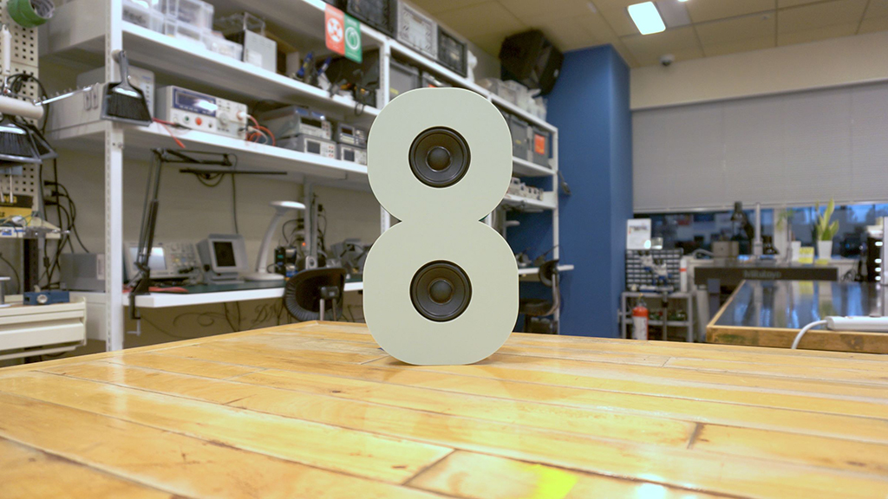
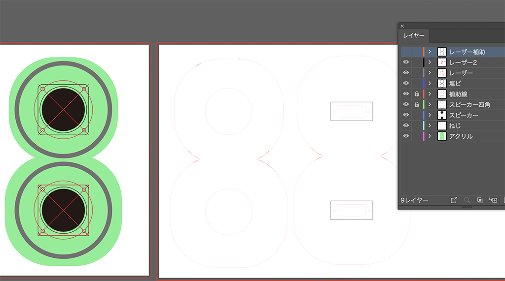
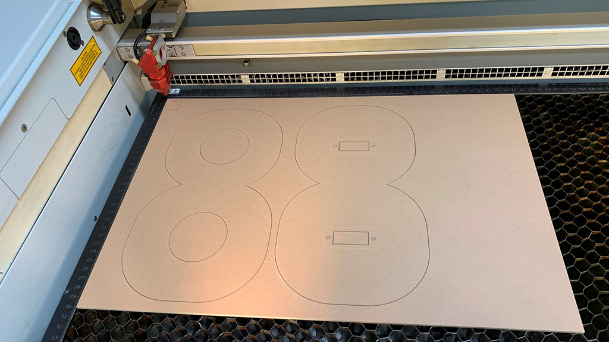
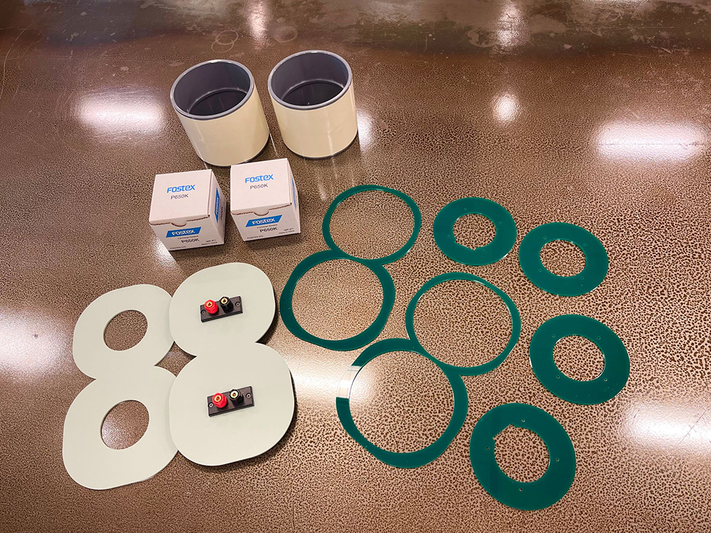
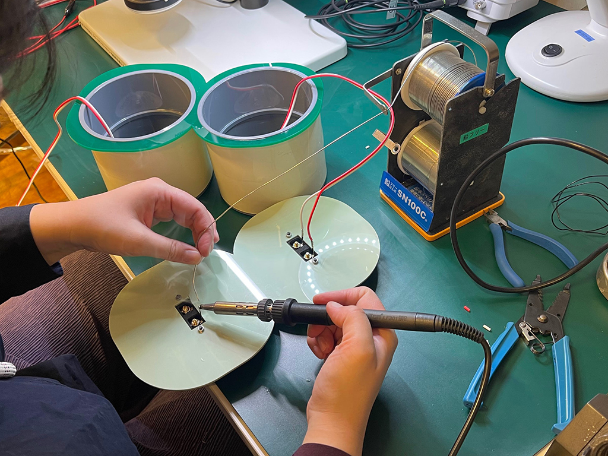
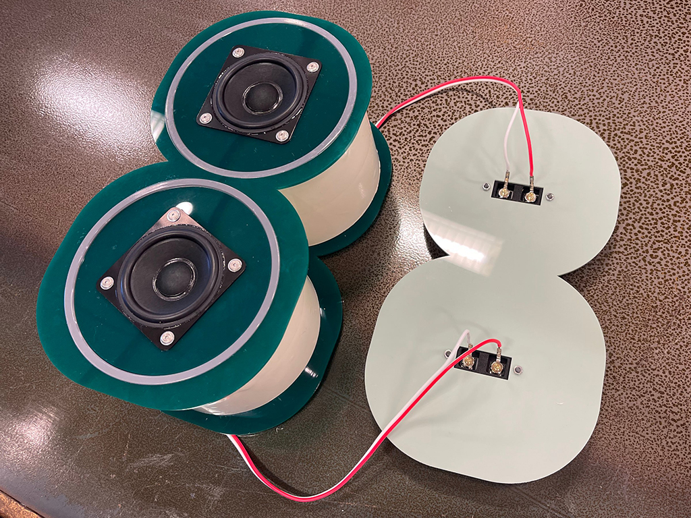
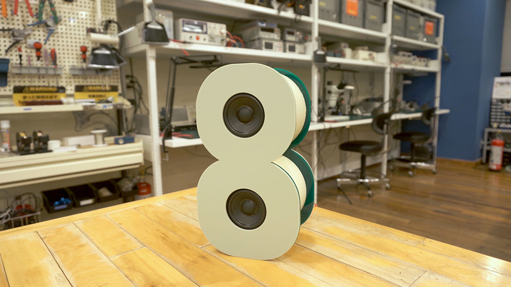

 

## **#08/25 [ 2022/12/08 ]** 
### by 乙女電芸部
  

 

8を担当させていただきました、乙女電芸部です。これパッと見て何かわかりますか？そうです、実はスピーカーなんです！8の形のステレオスピーカーを作りました。

 

### **材料**

* [アクリル板 ファンタレックス パステルシリーズP-202M](https://www.hazaiya.co.jp/category/akuriru_fantarex.html#a02)
* 塩ビ管
* [スピーカー Fostex P650K](https://www.fostex.jp/products/p650k/)
* 端子台
* スピーカーケーブル
* カッティングシート

 

### **技術**

* データ作成：Adobe Illustrator
* レーザーカッター
* はんだづけ

 

### **作り方**
 

まずはなるべく小さいスピーカーにしようと思ってスピーカーを選定し、それにあったサイズの塩ビ管をホームセンターに買いに行きました。塩ビ管にぴたっとはまるようにレーザーカッターで切り出すアクリル板のデータを Illustratorで作成します。 

   

レーザーカッターで切り出します。本番の前にいらない板で試作をつくってぴったり寸法を合わせるのがおすすめです。 

   

材料を切り出せたらせっせと組み立てるのみです！スピーカーをアクリル板にねじでとりつけて、あとはどんどん塩ビ管に嵌めていきます。塩ビ管はそのままだと無骨なのでベージュのカッティングシートを貼りました。 

   

スピーカーの端子と端子代を内部で接続するためにはんだづけします。 

   

スピーカーを嵌め込んだ表面はこんな感じ。 

   

裏面も嵌め込んで、前面に両面テープで化粧板を貼り付ければ完成です！化粧板に使ったアクリル板は材料でも紹介したとおり、ファンタレックスというブランドのパステルシリーズの薄緑を使っています。これがとってもかわいいんです。片面がマットになっていて、もう一面はつやありです。私たちは表面をマットな質感にしました！少々お値段の張るアクリルですが、マットはインテリアにもおすすめな質感なので、機会があればみなさんも使ってみてください。 

   

もちろんスピーカーなのでちゃんと音も鳴りますよ！ 

<iframe width="680" height="382.5" src="https://www.youtube.com/embed/LkNwg1N_MQc" title="YouTube video player" frameborder="0" allow="accelerometer; autoplay; clipboard-write; encrypted-media; gyroscope; picture-in-picture; web-share" allowfullscreen></iframe>
  

クリスマスなのでアクリルは緑系の色、スピーカーケーブルは赤系にしてみました。実際に使う時にはステレオなので横に倒すと音的に良いと思われます。さあ、今年のクリスマスソングはこれで聴こ〜

    

### **作者紹介**
 

**乙女電芸部** 

毎日がちょっと楽しくなる『自分のためのものづくり』をしよう！を合言葉に活動しているDIYグループです。手芸と電子工作を組みあわせた『テクノ手芸』をベースに、乙女心とかわいさをスパイスにして、様々な作品を作っています。今までの手芸や工作に電子工作をプラスすることで広がる『自分のためのものづくり』の可能性をお伝えするべく、ワークショップなどを行っています。BASEにて楽しみながら電子工作が学べるキットを販売中！Makezine.jpでおとでん通信を連載中！ 
[https://otomedengeibu.com/](https://otomedengeibu.com/)
  

（Last Updated: 2023.04.11）

