 

## **#09/25 [ 2022/12/09 ]** 
### by Yoshihiro Asano
  

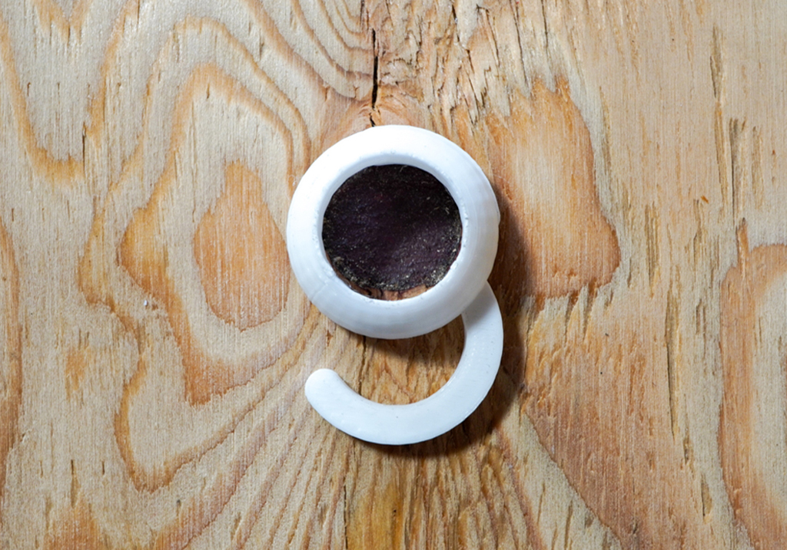

 

こんにちは、淺野です！ 
 
普段はフリーランスのライターとして、ファブ施設やMakerへの取材などを行っています。 
 
去年に引き続き、参戦させてもらったアドベントカレンダー企画。周りの凄腕作品に圧倒されているうちに、締切の時が刻一刻と近づいてきてしまったぞ！

 

### **材料**

* PLAフィラメント

 

### **技術**

* 3Dプリンター（CREATOR PRO2）
* TinkerCAD

 

### **作り方**
 

今回いただいた数字は「９」。 
 
９… どうしようかな… きゅう…. キュウ… 
 
提出までの時間もないし… どうしよう… きゅう… キュウ… ぴろ… 球…  

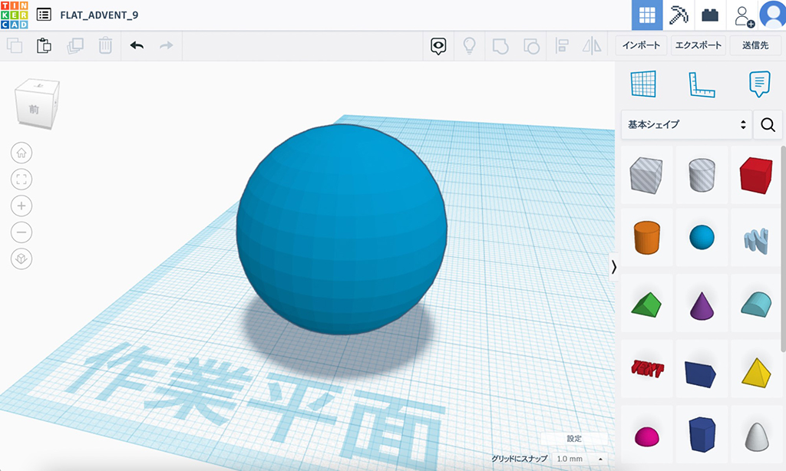
   

球（きゅう）？  

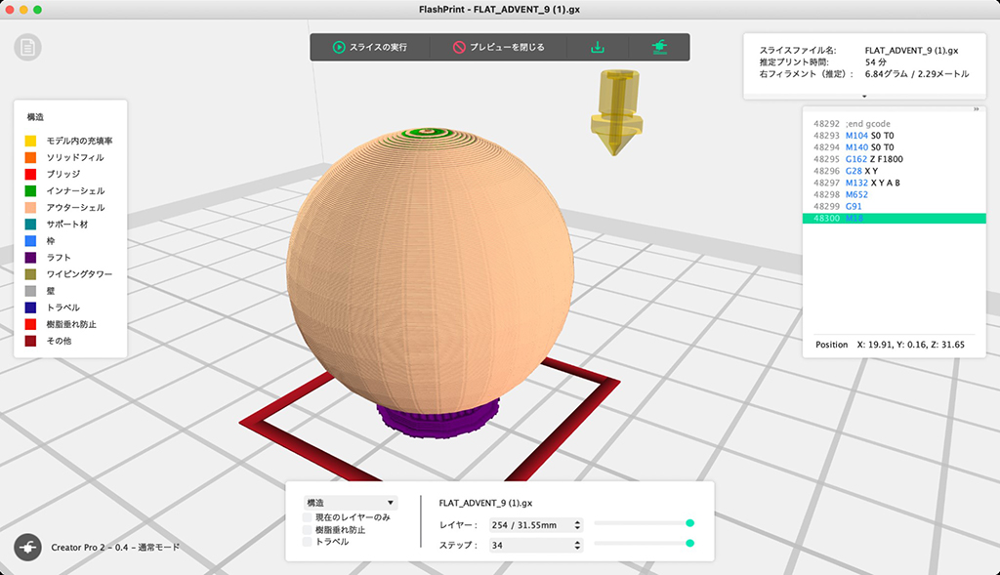   

これを3Dプリントすれば、れっきとした「きゅう」なのでは？ 
  

**はい、というわけで「きゅう」が完成しました〜！** 
  

……と言って終えることもできたかもしれない。 
しかし、流石に一点突破すぎるし、 
場合によっては二度と笑顔で仙台に行けなくなる。 
仏の顔も三度までかもしれない。 

ちゃんと今年の「感謝」を伝えられるようなアイテムにしないとダメだ！ 

そんなわけで、ここからアドベント仕様に変換していきます。  

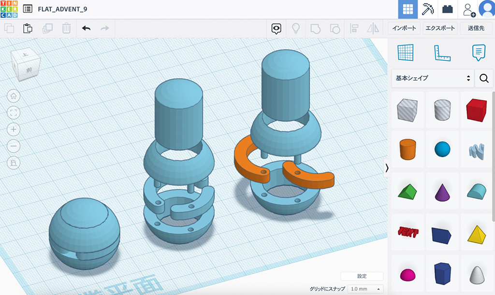   

ポンと置かれた球をベースに、ちょっとしたギミックを盛り込んでいきましょう。 
そこはかとないデススターっぽさを感じつつ、パーツを全て3Dプリントします。 

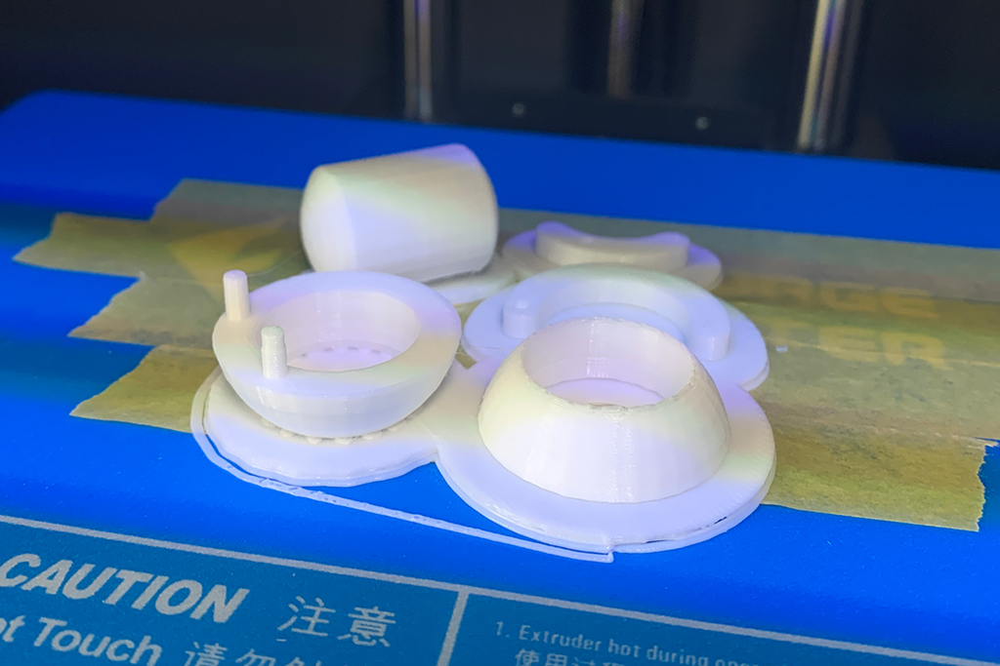 

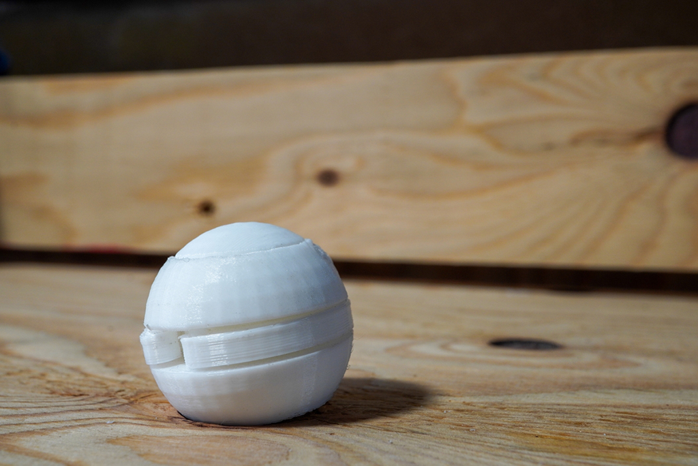  

組み立てると、ひとつめの「球」が完成です。   

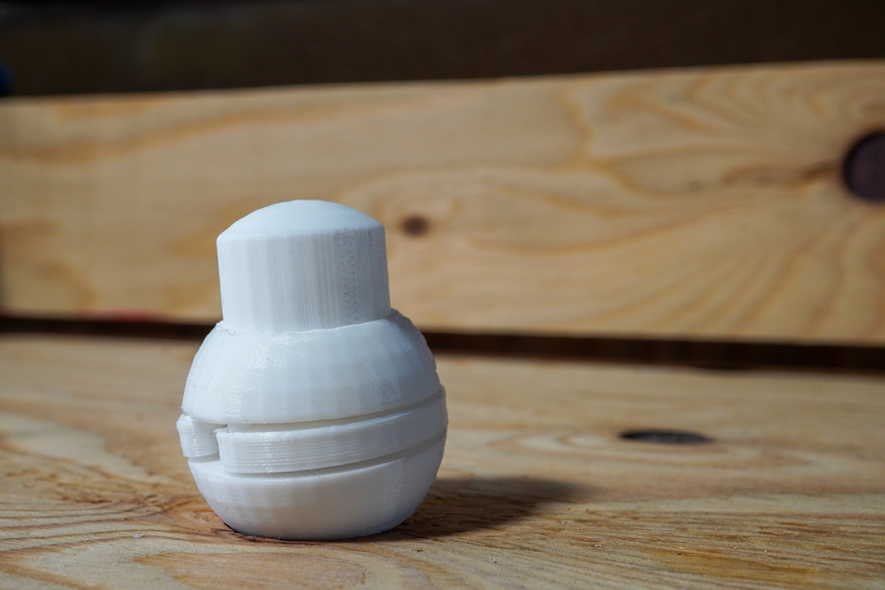 

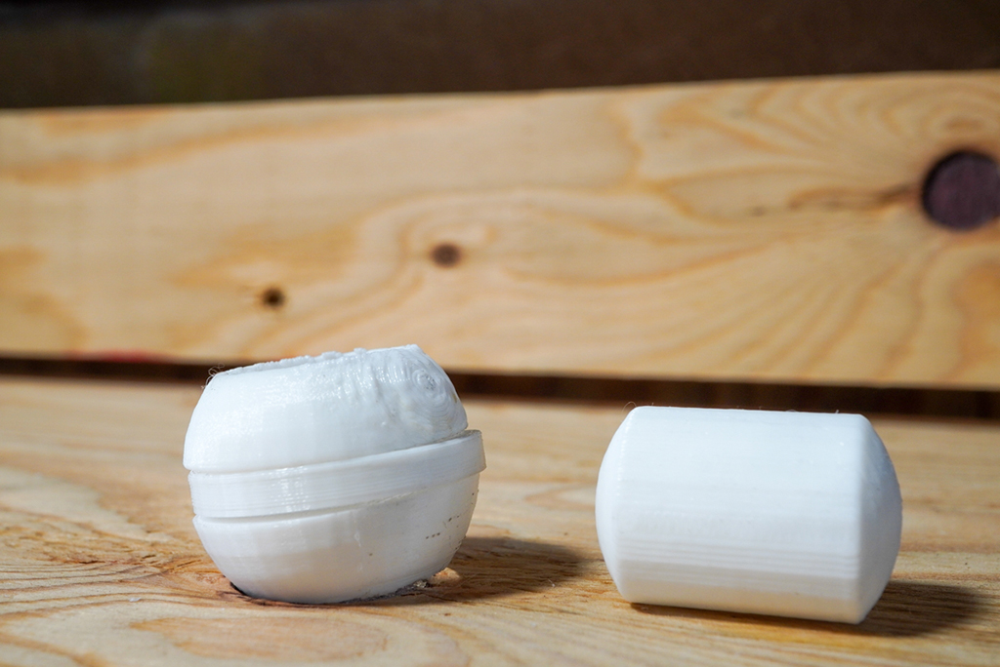   

真ん中をくり抜いて、上から覗いてみると…   

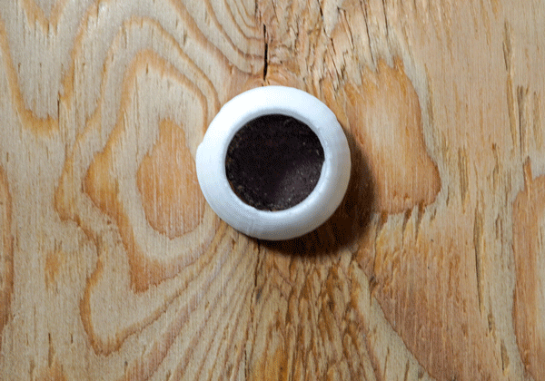   

  

腕が変形して、数字の「９」が現れました。 
そしてさらにさらに……？   

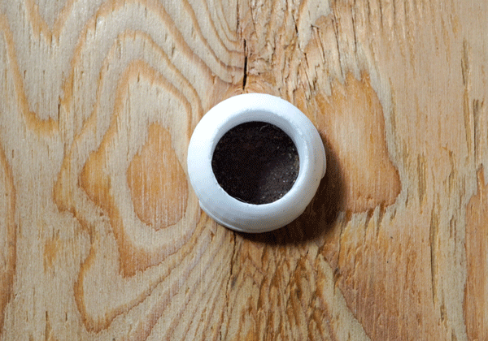   

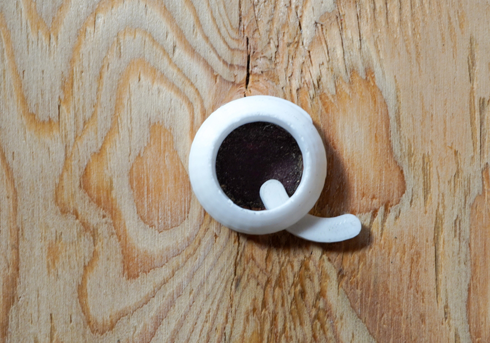  

今度はアルファベットの「Q」が登場です！   

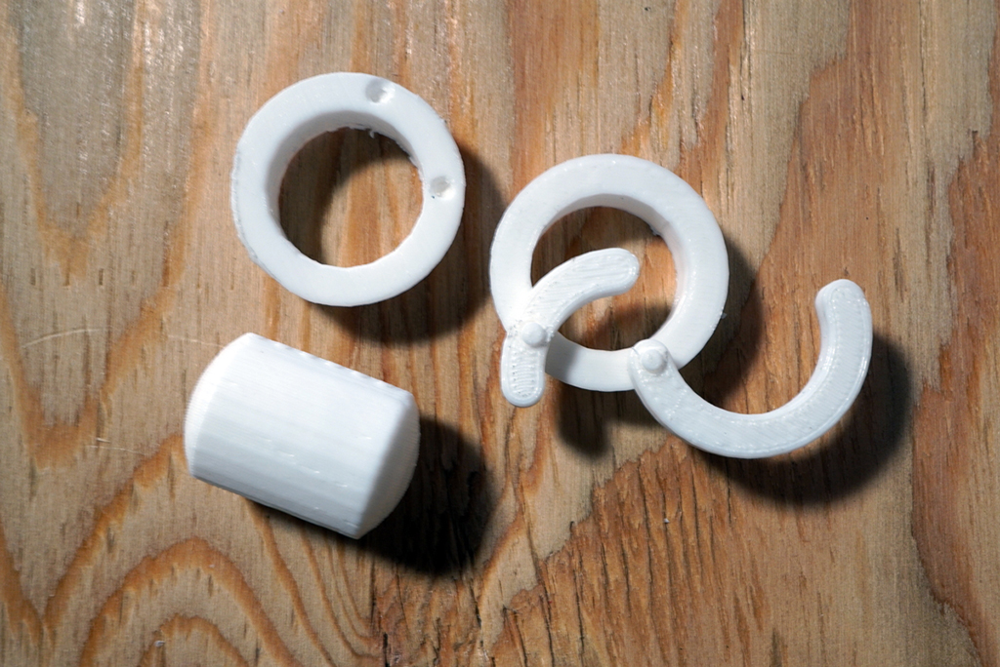  

そんなわけで、球と９とQ、 
一粒で三つが揃う「サンキュースフィア」を作ってみました。 
「きゅう」を集めて感謝を伝えられるアイテムです。   

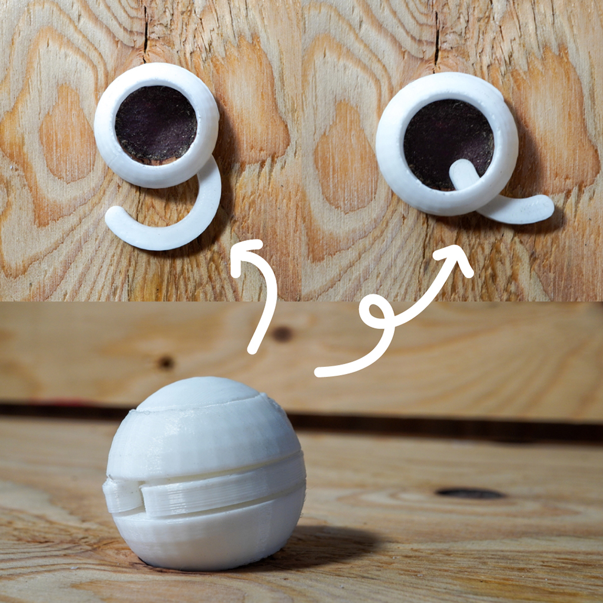   

来年も無事、言葉とものづくりに触れられていたら嬉しいです。
それではみなさん、良いお年を〜！

    

### **作者紹介**
 

**淺野 義弘** 

Fab Loveなフリーランスのライターです。
2023年はもっと全国を飛び回りたい！
[https://lit.link/asanoQm](https://lit.link/asanoQm)
  

（Last Updated: 2023.04.11）

