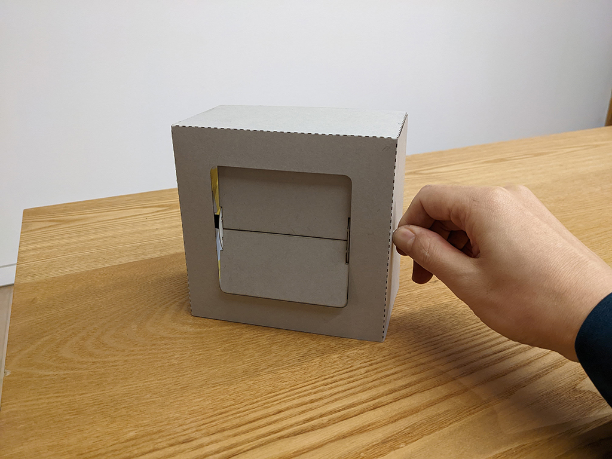

 

## **#10/25 [ 2022/12/10 ]** 
### by Yoshiyuki Habashima
  

 

アドベントカレンダーチャレンジ2022、“10”を担当した[Surface&Arcihtecture](https://www.surface-arch.com/)の巾嶋です。例年みなさんの作品を見て楽しそうだな〜と眺めていたのですが、今年こそはと参加させてもらいました。 
 
とりあえずなんか動くものがいいかな…と考え始めて、パッと思いついたのが「フリップクロック」でした。パタパタめくれて表示が変わるレトロな時計や、昔の空港サインなどに使われていたアレです。昔からなんとなく惹かれるものがあったので、この機会に挑戦してみたいと思います。 
 
お題となる数字は「10」なので、10枚のフリップで、めくってもめくっても10が出てくるようなものにします。実は奇遇にもSurface&Architecureは今年で10周年！なので、その記念の品（？）ということにします。

 

### **材料**

* ボール紙
* マグネット
* 割り箸

 

### **技術**

* データ作成：Adobe Illustlator
* レーザーカッター（beamo）

 

### **作り方**
 

### **1. 作り方を考える**
 

作り方を検討するためにまずはリサーチ。既製品の写真だけでは構造が分かりにくい感じでしたが、やはり自分で作ってみたいという人は世の中にたくさんいるようで、先人たちによるDIYプロジェクトがいくつか見つかりました。 
 
当初はモーターで制御するイメージでしたが、時間がかかりそうだったのでハードルを下げ、「手回し方式」に方針転換。手動でパタパタ動くだけのオブジェにします。 
 
素材はボール紙を使用。アクリルやMDFの方がもちろんかっちり作れますが、レーザー加工時の匂いも控えめで安いし、手軽なのでこちらを使います。
   

### **2. スケッチ＆データ作成**
 

スケッチしながら全体の作りを考えつつ、Illustlatorでデータを作成。設計と試作を行ったり来たりしながら進めていきます。 

 

正面図と側面図（この時点ではモーターを入れるつもりだった）

   

### **3. フリップ部分の試作**
 

まずはメインとも言えるフリップから。四角柱を軸として、左右に円形のパーツ（フランジ的なもの）が付くようにデータを作成。2枚のフリップが開いたときにまっすぐになるように円の直径と穴の間隔を調整します。 

 

フリップ部分のカットデータ

  

レーザー加工機でカットしたデータを組み立て、動きを確認。いざ組んでみると、ゆるすぎてフリップが抜けやすかったり、逆にきつすぎると引っかかってパタンと降りてこなかったり。データを微調整して再出力…を何度か繰り返します。ちょっとした修正であれば、カッターで削ったりして対応しやすいのもボール紙の良さ。 

 

フリップ部分をとりあえず組んでみた様子

  

フリップ部分の寸法が固まったので、数字をフリップに彫刻していきます。使用したボール紙は片面が白いので、白い面が内側になるように２枚ずつノリで貼り合わせます。 

 

フリップに数字を彫刻したもの

   

### **4. ケースをカットして組み込む**
 

続いて外装となるケース部分を作っていきます。 

 

エアーで紙が動くので、マスキングテープで固定しながら加工

  

ケースにフリップ部分を組み込んで、動きを確認します。 

 

ケースに組み込んで動作確認

  

とりあえずイメージしていた感じのものができました。これで完成！…と言いたいところでしたが、実はこれだと手を離すと自重でだらんと動いてしまい、数字が見えない状態になってしまいます。軸が細くて回しづらいのもあるので、もうひと工夫します。
   

### **5. ダイヤル部分を作る**
 

 

ダイヤル（組み立て前の状態）

  

ダイヤルを作り、その中にマグネットを仕込みます。ケースの内側にもマグネットを取り付け。一定の角度でスナップされ、磁力で回転しないように保持します。このやり方は、以前知人に見せてもらったテクニックを参考にしてます。感触が心地よく、これもいつか真似してみたいと思っていた手法でした。 

 

裏から見た様子。ケースの内側にもマグネットを取付け

  

最後に、割り箸が空回りしないようにホットボンドで固定します。   

### **6. 部品を組み付けて完成**
 

 

完成イメージ

  

これで完成です。動画だとフリップが下の窓に引っかかっちゃってますが、まあ良しとしましょう。 

<iframe width="680" height="382.5" src="https://www.youtube.com/embed/aZrVRhSBRDI" title="YouTube video player" frameborder="0" allow="accelerometer; autoplay; clipboard-write; encrypted-media; gyroscope; picture-in-picture; web-share" allowfullscreen></iframe>
  

ステッピングモーターをつなぐのも、いつかやってみたいところです。時計やカレンダー以外にも、天気アイコンで天気予報の表示なんかもできるかも。フリップを白アクリルで作るとホワイトボードのように使えるので、手書きで何かやるのもいいかも…などといろいろ妄想が膨らみます。

    

### **作者紹介**
 

**巾嶋 良幸** 

[Surface&Arcihtecture](https://www.surface-arch.com/)という会社で、体験をデザインする仕事をしています。ファブラボ運営者のコミュニティ、FabLab Japan Networkに裏方として関わっていたりもします。“ものの改変しやすさ”に興味があり、“Hackability”についてのリサーチをnoteの記事にまとめました。 
[https://note.com/hbsm/n/nc6976d9a0316](https://note.com/hbsm/n/nc6976d9a0316)
  

（Last Updated: 2023.04.11）

