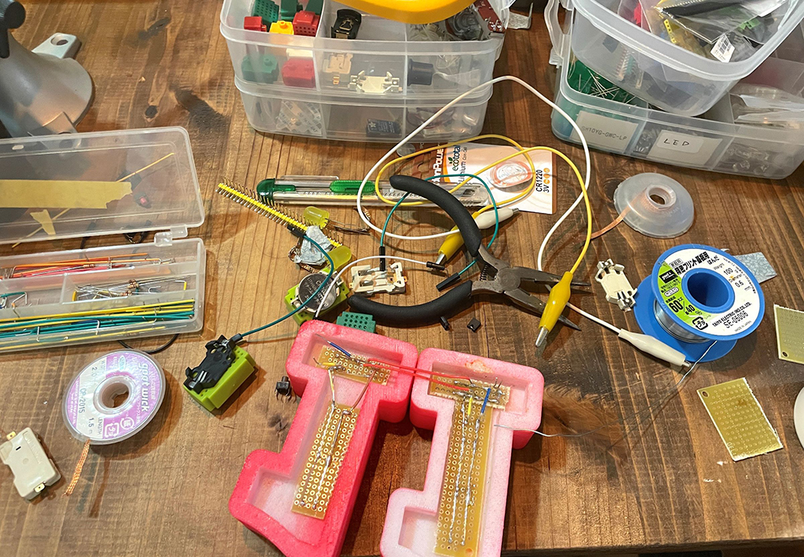

 

## **#11/25 [ 2022/12/11 ]** 
### by Miki Nakazawa
  

 

 

キャンディーのようなLEDを使ってレトロな電球看板風の数字を作ってみました。

 

### **材料**

* ABS樹脂フィラメント
* LED（10mm・黄色）10個
* ユニバーサル基盤
* ミニサイズブレッドボード
* スイッチ
* ジャンパワイヤー
* ボタン電池CR2032
* 電池ケース

 

### **技術**

* データ作成：adobe Illustrator/TinkerCAD
* 3Dプリンタ：Afinia H400
* 電子工作

 

### **作り方**
 

### **0.アイデアを考える**
 

久しぶりに電子工作をしようかなと思い家にある電子部品を漁っていたら、昔買い込んだかわいいキャンディみたいなLEDがたくさん出てきたので、これを使ってなにかやろうと構想し始めました。 

  

元々は導電性の系や布を使ってあえて配線をみせる電子工作をしていました。今回はアドベントカレンダーならではの数字を見せたかったので、LEDを生かしたデザインを考え、レトロな電球サイン風の数字をつくることにしました 

   

### **1. イラストレーターを使ってイメージ作り。**
 

   

### **2. SVGに書き出して、TinkerCADに取り込み、３Dモデルをつくる**
 

TinkerCADにした理由ですが、 

* LED10mmの3Dモデルがデフォルトのシェイプとしてある 
* 難しい操作が不要なモデル 

というので使ってみました。 
 
立体的にみながらサイズ感を調整していきます。 

   

### **3. 3Dプリント**
 

サポート材が勿体無いのでパーツを２分割して出しています。 

 

 
  

### **4. 塗装・配線はんだづけ**
 

アクリルラッカースプレー表面を塗装します。 
実は配線の収まりをあまり考えず作業を始めてしまったのですが、ユニバーサル基板でなんとかおさまりました。 

  

電源の供給もどうするかあまり考えてなかったのですが、こちらはミニサイズのブレッドボードが奇しくも溝にぴったりハマってくれてこんな感じで収まりました。 

 

かわいいブレッドボードをコレクションしていた自分に感謝！

  

配線はシンプルな並列繋ぎ・スイッチ付きです。（ズボラ電子工作なので、抵抗を入れていません！） 

   

### **5. 完成**
 

明るいところでもかわいい（一応光っております） 

 

  

暗いところではこんな感じ。文字でぜひ作ってみたいですね！（そのときはユニバーサル基板ではなくオリジナル基板を作ろうと思います） 

  

久しぶりの電子工作、たのしかったです。 
みなさま良いお年を！

    

### **作者紹介**
 

**中澤 未来** 

FabLab太宰府でファブマスターやってました。今は鎌倉でフリーランスしつつ、最近は[VUILD](https://vuild.co.jp/)という会社でShopBotでものづくりする人の応援隊長をしています。
  

（Last Updated: 2023.04.11）

