 

## **#12/25 [ 2022/12/12 ]** 
### by Shinnosuke Irie
  

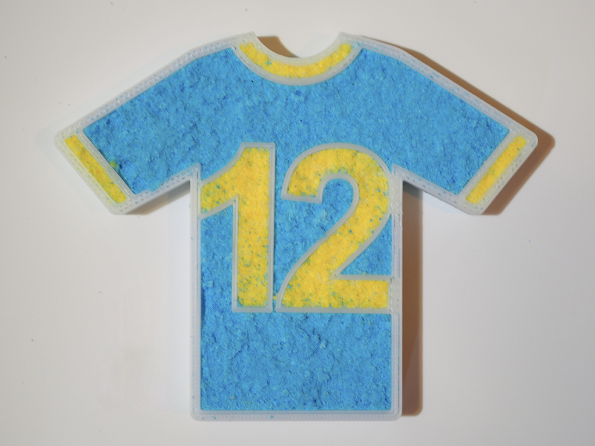

 

サッカー観ましたか？ 
今年のワールドカップがとても面白かったので、勢いでユニフォームっぽい型を作りました。糖質制限中なので、お菓子ではなく入浴剤を作ることにしました。

 

### **材料**

* ABSフィラメント
* 重曹
* クエン酸
* 片栗粉
* 精製水
* 食紅

 

### **技術**

* データ作成: Fusion 360
* 3Dプリンタ: Afinia H400

 

### **作り方**
 

### **1. モデリングします**
 

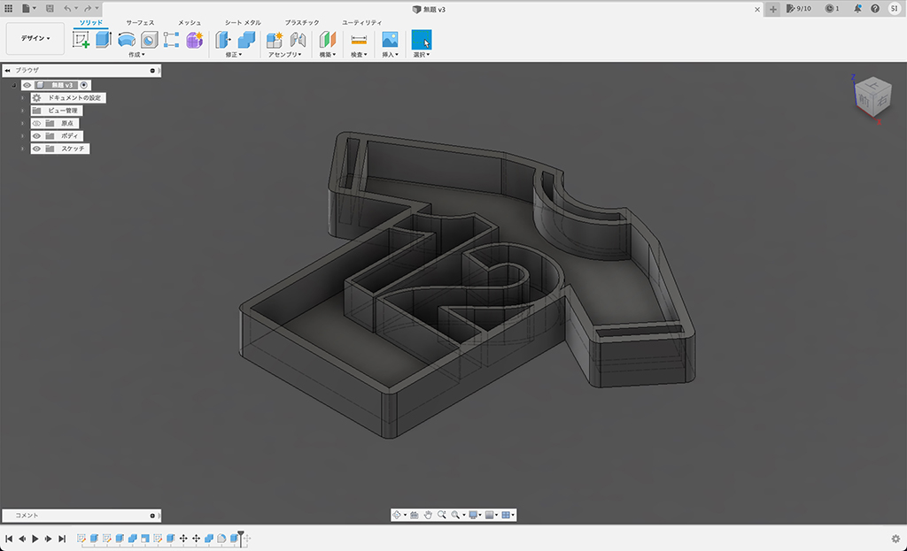
   

### **2. 3Dプリントします**
 

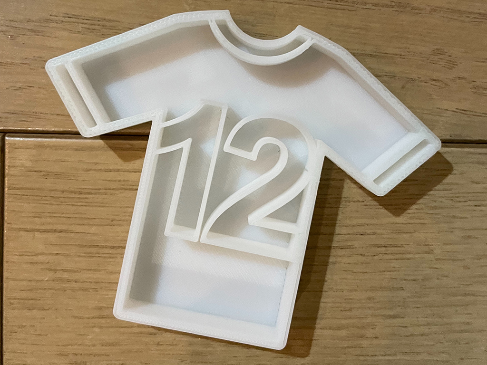
   

### **3. 入浴剤の素を作ります。**
 

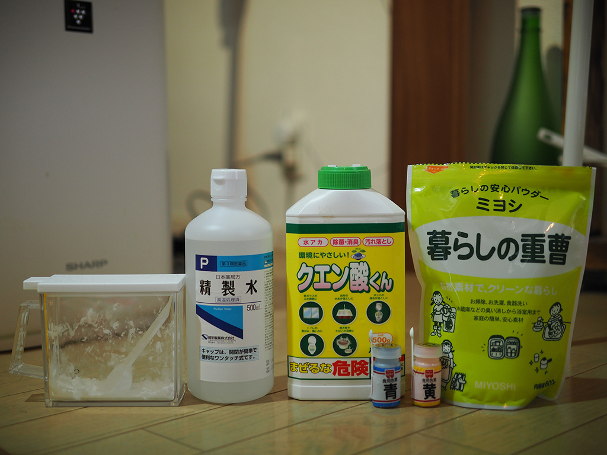
  

* 重曹 : 大さじ2, クエン酸 : 大さじ1, 片栗粉 : 大さじ1, 食紅 : 専用のスプーン1さじ をポリ袋に入れます。(A)
* Aに精製水を満遍なく吹きかけながら、やや湿り気がある状態にします。(一箇所に吹きかけすぎると、シュワシュワして溶け始めるので注意!!) ポリ袋の上から握って塊が作れるくらいが良いです。

 

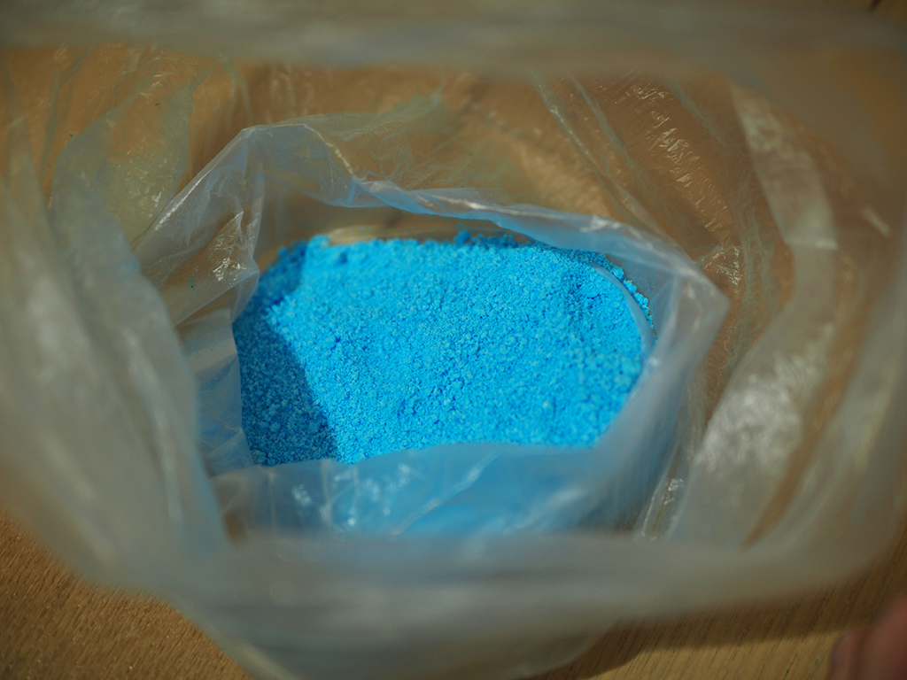
 

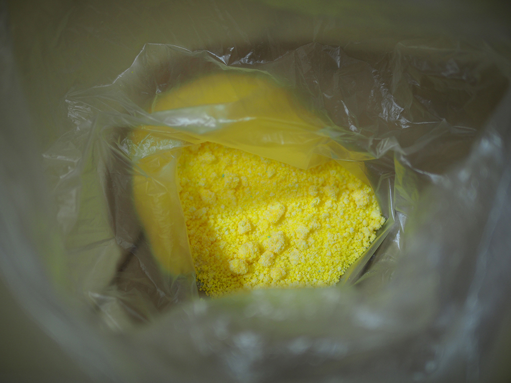
   

### **4. 3Dプリントした型に入浴剤の素を詰めます。 (できるだけ圧をかけた方がお風呂に入れた時に長持ちします。)**
  

### **5. 密閉できる箱に乾燥剤を入れて半日放置して完成です！**
 

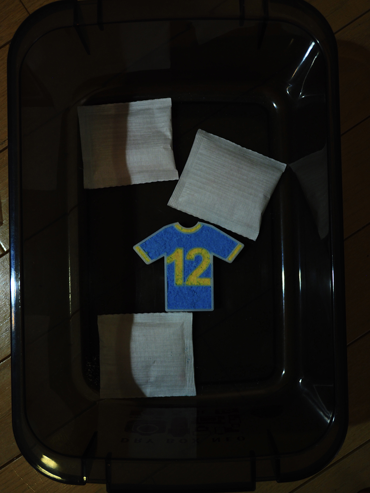  

それでは、実際にお風呂に入れてみます。 

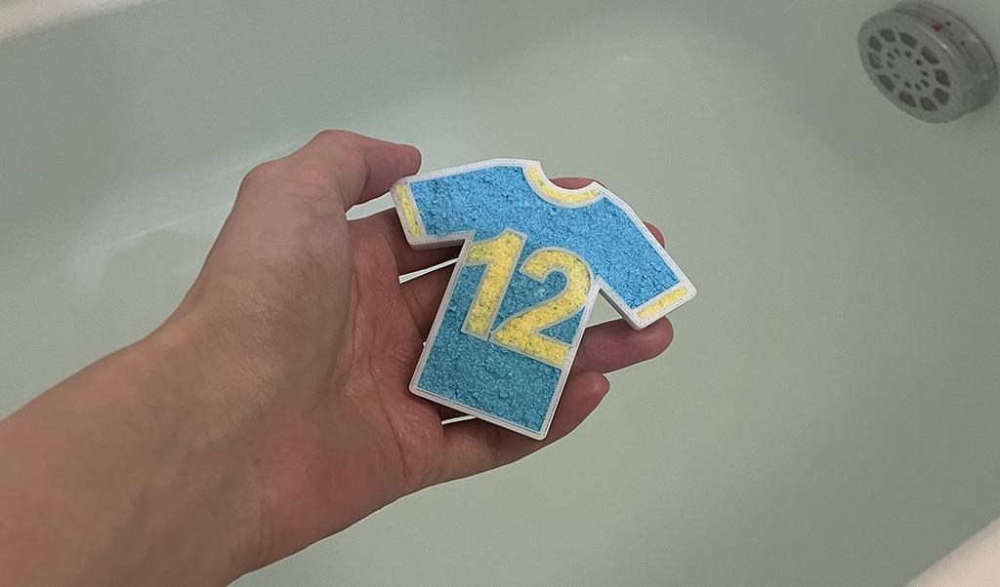 

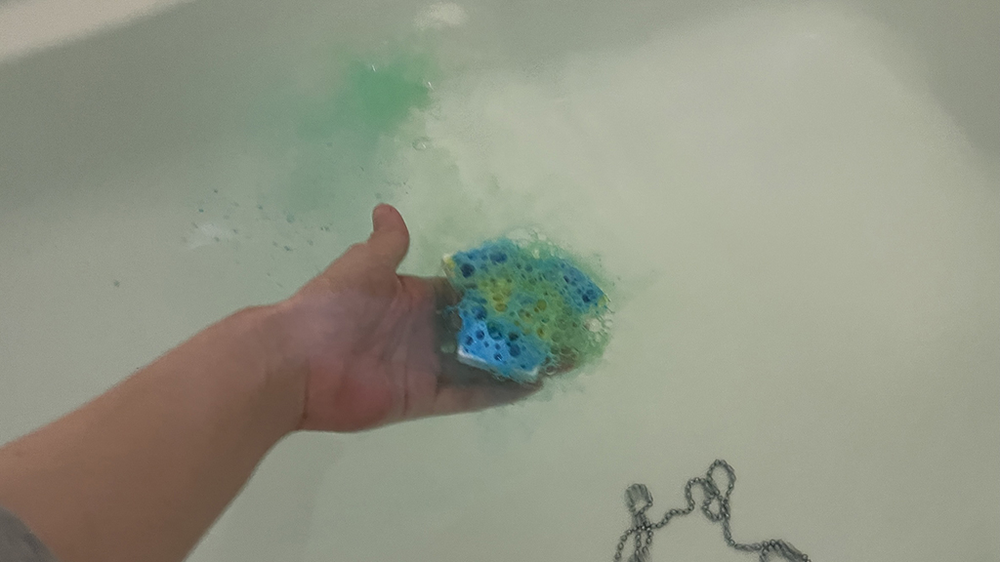  

すごい勢いで溶けてます！  

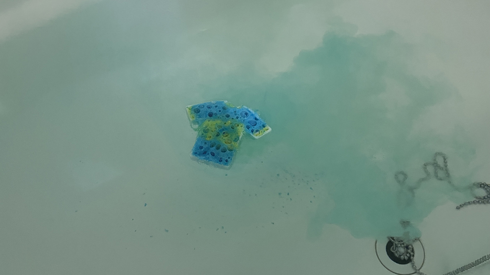 

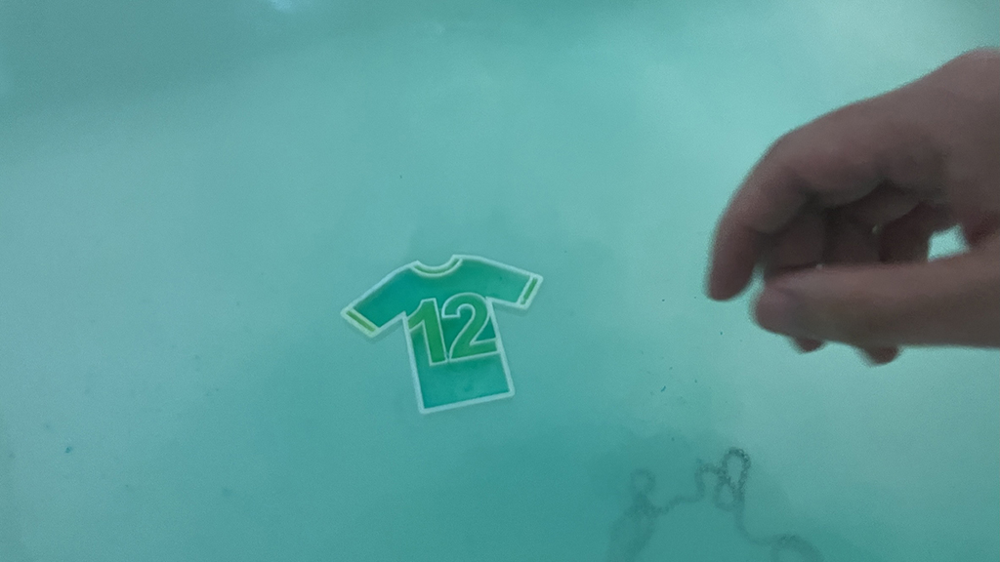  

溶けきりました。

    

### **作者紹介**
 

**入江 信之介** 

鎌倉に住む戦国系フロントエンジニア。グミが好き。
[https://note.com/kiyoshidainagon/](https://note.com/kiyoshidainagon/)
  

（Last Updated: 2023.04.11）

