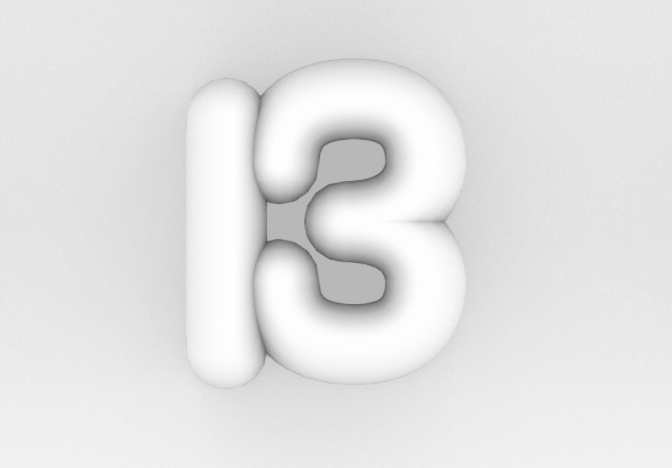
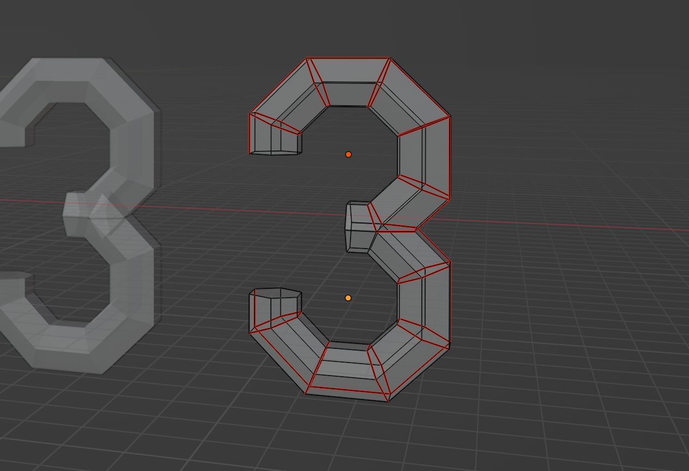
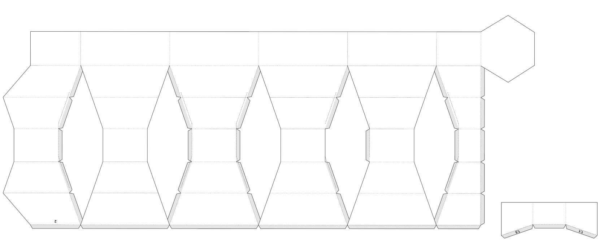
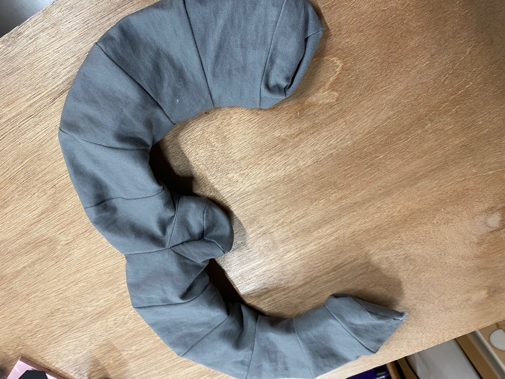
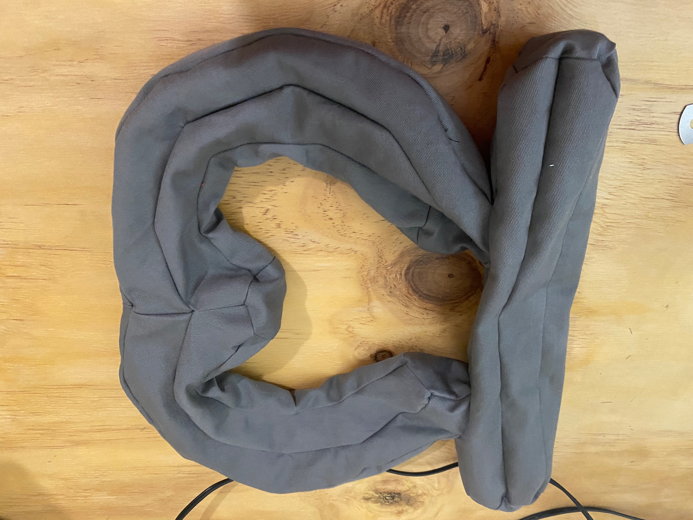
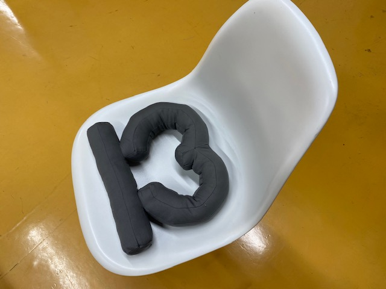

 

## **#13/25 [ 2022/12/13 ]** 
### by Yui Isawa
  

 

### **材料**

* 布
* 棉

 

### **技術**

* Blender
* ミシン

 

### **作り方**
 

### **0. 考える**
 

何を作るか考えるために、ひとまず13を立体にして、ぼんやり眺めていたらおしりにしか見えなくなりました。今回はおしりにフィットする「13 」座布団を制作しようと思います。 

   

### **1. 型紙を作る**
 

特に「3」の型紙が難しそうなので、ひとまずBlenderのExport Paper Modelというアドオン機能を使って型紙を作ります。 
 
まず、Blenderで適当な3を作ってメッシュを減らしたり形を整えたりします。 
そのままペーパーモデルを書き出すととんでもなく材料取りが悪いため、シームを入れて好みの型紙に近づけていきます。 

 

 

「3」の半分でこんな感じ。想定よりも大分メッシュを減らしたため、めちゃくちゃシンプルになりました。

   

### **2. 試作**
 

作成した型紙を元に一度縫製してみます。 
サイズを適当に拡大して進めていたので、めっちゃデカい 「3」ができました。おしり、全くフィットしません。 
また、柄のある布ならこの型紙でも良い気がしますが、無地の布だと縫い目が目立ちます。 

   

### **3. 型紙調整と本制作**
 

サイズと縫い目を生かす方向に型紙を調整します。ついでに「1」と離れ離れはかわいそうなので、一体型にしました。 

   

### **4. 綿を詰めて完成！**
 

理想のムチムチ感が出るようにぎゅうぎゅう綿をつめていきます。 

  

座り心地を確かめてみたところ、綿の入れ過ぎでちょっと固めになってしまったのが、今回の反省ポイント。ムッチリ感を求めてビーズクッションにも挑戦してみたいです！

    

### **作者紹介**
 

**伊澤 宥依** 

岐阜県にある情報科学芸術大学院大学（IAMAS）にて、デジタルファブリケーションを活用した制作や研究のサポートを行っています。透明な素材とヌメヌメした形が好き。サイズを間違ってデカいものを作りがちです。
  

（Last Updated: 2023.04.11）

