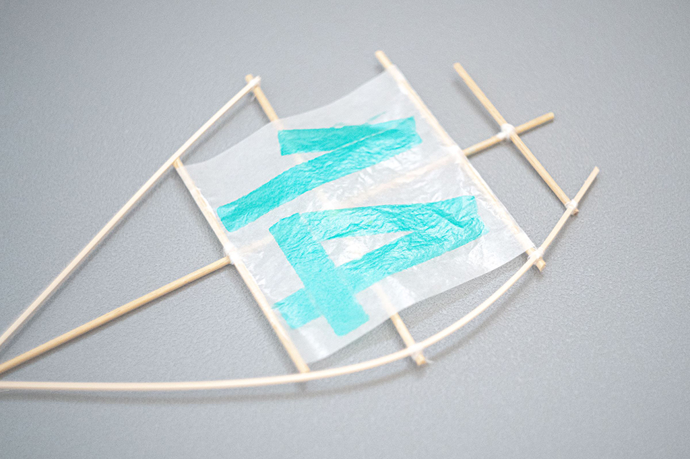
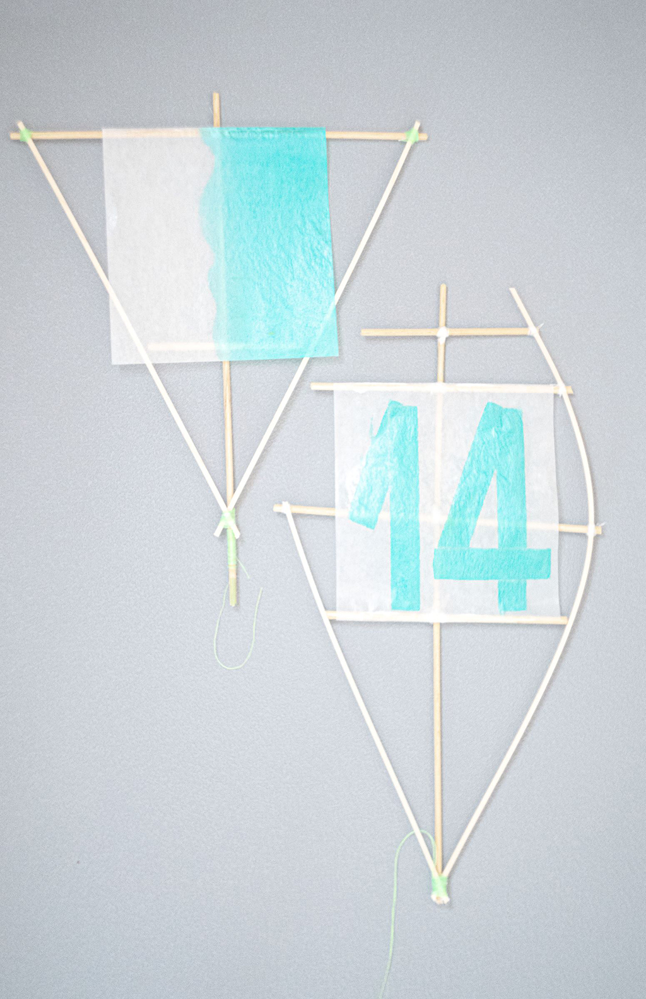

 

## **#14/25 [ 2022/12/14 ]** 
### by TEXT
  

 

一部地域ではすでに絶滅した民藝文化として、欧米から伝わってきたアドベント文化とその地域に昔から伝わる縁起凧とが魔合体したような玩具が残されています。  

   

薬包紙のような素材には、光を乱反射させる貝粉末を練り込んだ染料によって、アドベントの数字や、思い思いに縁起をあらわした模様が印刷されています。  

   

薬包紙のような素材には、光を乱反射させる貝粉末を練り込んだ染料によって、アドベンアドベント•フォーク•ミュージアムには、このアドベント縁起凧を復元したサンプルが飾られています。  

   

### **材料**

* 和紙
* 鮑貝染料
* 竹
* 糸

 

### **技術**

* 鮑貝の粉末インク化
* UVインクとアクリル樹脂の混合インク
* デジタル製版などによるfabrication

 

### **取材先**
 
宮城県登美市柚木２３−１６１０ 
（社）アドベント・フォーク・ミュージアム 
代表：亜土健斗（館長）

    

### **作者紹介**
 

**大江 よう** 

仙台を拠点に、言葉により織り上げられるテキスト、繊維によって織り上げられるテキスタイルとを取り扱いながら、コンテキスト＝文脈を探るテキスタイルファンデーション「ＴＥＸＴ」を主宰。アドベントリサーチャー。
  

（Last Updated: 2023.04.11）

