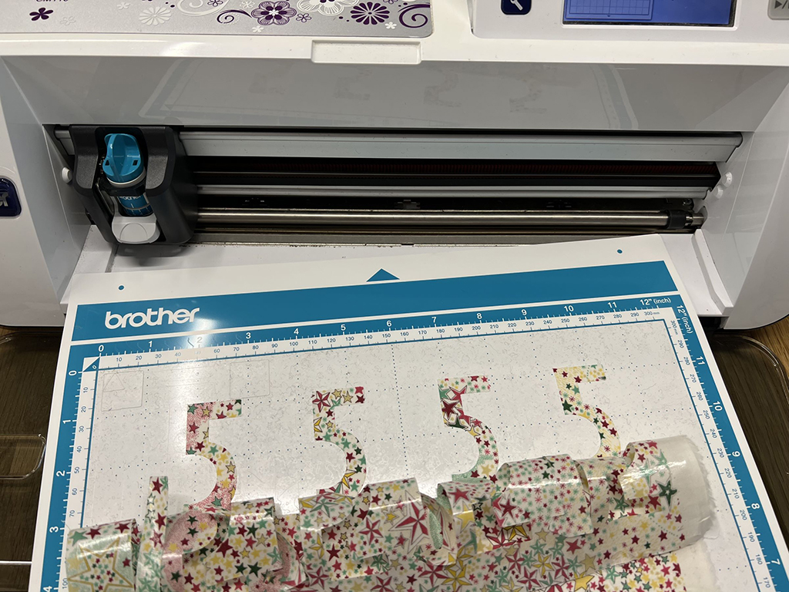

 

## **#15/25 [ 2022/12/15 ]** 
### by Emi Iguro
  

 

“15” といえばイチゴ🍓でしょっ！ ということで、昭和レトロなイメージでイチゴ型のクリスマスオーナメントを作りました。 
今回の数字は、Scratch の拡張機能を使ってプログラミングしたデータからアップリケにしています。 
 
Scratch のプログラミングで描いた線を拡張機能を使って刺しゅうデータにできることは、今年のメイカーフェア東京で知りました。さらに、10月に行われたファブラボみなとみらいのユーザーミーティングで、この機能で制作したアップリケを見せていただき、これは面白そう！と思ったことがきっかけです。 
Scratch は小学校のプログラミング教育でも定番のように使われていますが、こんなスゴい機能があるなんて！！ということで、さっそく作っていきます。

 

### **材料**

* フェルト（赤）
* アップリケ用の布（リバティの[アデラジャ タナローン](https://www.liberty-japan.co.jp/item/detail/1_2_11-3631256-TEE_LBE_LF/LBE)）
* [ブラザー スキャンカット用アイロン接着シート](https://direct.brother.co.jp/catalog/category/0/113Z06E7002/)
* 手芸用わた
* 毛糸（緑：葉っぱ用）
* ステッチ用の糸（[ダーニング用のウール調 糸](https://clover.co.jp/products/57218)）
* ソーイングセット
* 両面テープ（※本来は使いません〜！）

 

### **技術**

* 数字データ作成：[刺しゅう拡張機能付きScratch](https://scratch.sugiura-lab.jp/) 
→こちらの動画も参考にしました：[デジタル刺繍ミシンを活用したプログラミング学習のためのツール開発](https://youtu.be/E4QYUslajFg)
* 布のカット：Brother ScanNCut (データ変換：CanvasWorkspace),  
Trotec Speedy100 (データ作成：Adobe Illustrator)
* 刺しゅうミシン：Brother Innovis SE3800D(データ変換：刺しゅうPRO　NEXT)

 

### **作り方**
 

### **1. 数字のデータをプログラミング**
 

“1”と“5” の2文字をプログラミングしていきます。“1”は直線が多いので手早く完成。“5”は曲線のバランスでなかなか苦労します。プレビューで緑の旗を押すたび、ネコがけなげにぬってくれる姿がかわいくて、作業中もめちゃくちゃ癒されます。 
 
縫い方は「走りぬい」と「サテンぬい」が選択でき、縫い目の幅も「ピッチ」で変えることができます。細かな調整にとても便利です。 

   

### **2. アップリケ用 布のカット**
 

プログラミングで作った数字のデータを「SVG」形式（ベクター形式の画像ファイル）でダウンロード。カッティングマシン用のデータに変換します。 
 
普段はレーザーでカットすることが多いのですが、今回の素材（タナローンという薄手の綿）はレーザー加工機でのオペレーションが難しかったため、カッティングマシン（ブラザーのスキャンカット）でカットしました。 
 
ここでのポイントは、スキャンカット用のアイロン接着シートを使うこと！ このシート、めちゃくちゃいい仕事してくれます。カット後の作業でもこのシートを使用したことで、ほつれにくく、仮止めもしやすいのでとても助けられました。が！　本来は「仮止め」ではなく「アイロンで接着させる」までできるのが正しい使い方です（作業後に気づきました…）。
とりあえず4セット切り出します。 

   

### **3. 刺しゅう1　アップリケのガイドを縫う**
 

「走りぬい」「サテンぬい」の刺しゅうデータをそれぞれダウンロード。データ形式がDST（タジマフォーマット）のため、刺しゅうミシンのアプリケーション（刺しゅうPRO NEXT）でブラザーのミシン用フォーマットに変換します。 
なお、この作業はミシンの機種によっても異なるようです。使用したミシンは10年以上前の機種で、懐かしのCFカードリーダーにデータを読み込ませるタイプ。今時の機種では、パソコンにダウンロードしたDSTデータをUSBメモリに保存、ミシンでファイルを開いて縫うタイプが多いようです（便利になったものですね〜）。 
 
データが読めたら、まずは「走りぬい」で縫います。これが位置合わせ用のガイド線になります。 

   

### **4. アップリケの布を貼る**
 

ガイドの縫い線上にアップリケの布を貼ります。 
上からアイロンで押さえるとパチっと接着できます（これが本来の使い方）。 
ですが、私はアイロンで接着できる便利機能に気づかなかったので、カットした数字の裏側に両面テープを貼りまくっています（涙）。この貼り方が甘くて、刺しゅうをした時に布がズレる悲劇が多発しましたが、アイロンで接着していたならズレることはなかったはず… 
よい子の皆さんは、位置合わせをした時点でアイロン接着しましょう！！ 

  

座り心地を確かめてみたところ、綿の入れ過ぎでちょっと固めになってしまったのが、今回の反省ポイント。ムッチリ感を求めてビーズクッションにも挑戦してみたいです！   

### **5. 刺しゅう2　アップリケの布の上をステッチする**
 

次は「サテンぬい」で上から縫います。 
何度か布がズレる失敗をした後、無事にぬい上がりました！ 

 

左：両面テープで貼り付けたが故の失敗作。“5” のカーブの難易度よ…（泣）

   

### **6. フェルトをイチゴ型にカット**
 

ステッチの周りをレーザー加工機でイチゴ型にカットします。データはSVGデータの位置を元にIllustratorで作成。レーザーは位置合わせが便利ですよね〜。 

 

   

### **7. フェルトをイチゴ型にカット**
 

ここからは手作業。イチゴ型をブランケットステッチで縫い合わせます。立体感が出るように中にわたを詰め、毛糸のぽんぽんを葉っぱとして縫い付けました。 

  

初のアップリケ、アナログ要素も満載で、緊張感もあってとても楽しい作業でした。
アップリケ制作にあたっては、[@moto_5555](https://www.instagram.com/moto_5555/)さんにアドバイスいただきました！（ありがとうございます🙏） 
 
想像以上にかわいらしい仕上がりになるので、いろいろなものにワンポイントでアップリケしてみたくなります。プログラミングと合わせて、ワークショップにしてみても面白いかもしれませんね。 
 
今回の教訓：説明書、ちゃんと読もう…！（次回はもう少し手際よく作業できるはず 笑）

    

### **作者紹介**
 

**井黒 恵美** 

所属： [FabLab MinatoMirai](https://www.kanagawa-u.ac.jp/cooperation/project/fablab/) 
ひとこと：デジファブやプログラミングのゆるい楽しみ方を模索しています。
  

（Last Updated: 2023.04.11）

