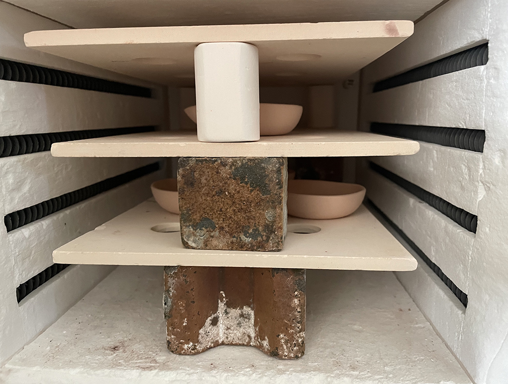

 

## **#16/25 [ 2022/12/16 ]** 
### by とばり
  

 

「ハンコをやめろ」の鶴の一声からデジタル化が進み、ずいぶん仕事がしやすくなりました。一方で、工芸品の道具としてのハンコ業界は後継者不足により手に入りづらくなってきています。 
大好きだったハンコ屋さんも廃業するということで、ハンコの技法を使って焼物に模様をつける方法を実験してみようと思いました。 
去年の長崎地方の初雪は12月17日。（引用：長崎地方気象台HP） 12月16日はまだ雪になる前でした、ということで、雫の形に決定。 
雫形のお皿を成型する際、まだ柔らかい状態の時に数字の模様を押して造形する挑戦をしました。

 

### **材料**

* 石膏 （型用）
* 土 （本体）
* アクリル （模様ハンコ用）
* 端子台

 

### **技術**

* データ作成：Rhinoceros、illustrator
* CNC：IWAMA切削機
* レーザー加工機：HAJIME
* プレス：人間

 

### **作り方**
 

### **1.**
 

Rhinoで作ったお皿のデータを元に、型用のデータを作る。 

   

### **2.**
 

石膏のブロックを作り、完全に乾かした後、CNCで切削する。 

   

### **3.**
 

土を柔らかく、空気を抜くように菊練りする。 

   

### **4.**
 

石膏の型を使って成形する。めっちゃ押す。型が水分を吸うまでしばらく置く。 

   

### **5.**
 

数字の模様をillustratorで描き、レーザーで切る。 

   

### **6.**
 

石膏を開けて、成形物が柔らかいうちに数字を押す。 

   

### **7.**
 

焼く 900度 

   

### **8.**
 

完成！アロマを垂らして、残りの15日、こころ穏やかにすごした。。。無理かな。 

 

 

  

釉薬をかけてたりもしてみました。ガラスの溜まりが綺麗ですね。 

    

### **作者紹介**
 

**とばり** 

プロダクトデザイナーを経て、工場制手工業製品を中心にものづくりの支援をしています。一児の母。子育て奮闘フェーズ。 
趣味：色んなものを素材別、製法別で収集しています。コップですと陶器、磁器、漆、木、メラミン、ポリプロピレン、ガラス、耐熱ガラス、琉球ガラス、シリコン、ステンレス、琺瑯、などなど。次は曲げわっぱやスズのぐい呑を狙っています。
  

（Last Updated: 2023.04.11）

