 

## **#17/25 [ 2022/12/17 ]** 
### by Shizuko Takahashi
  

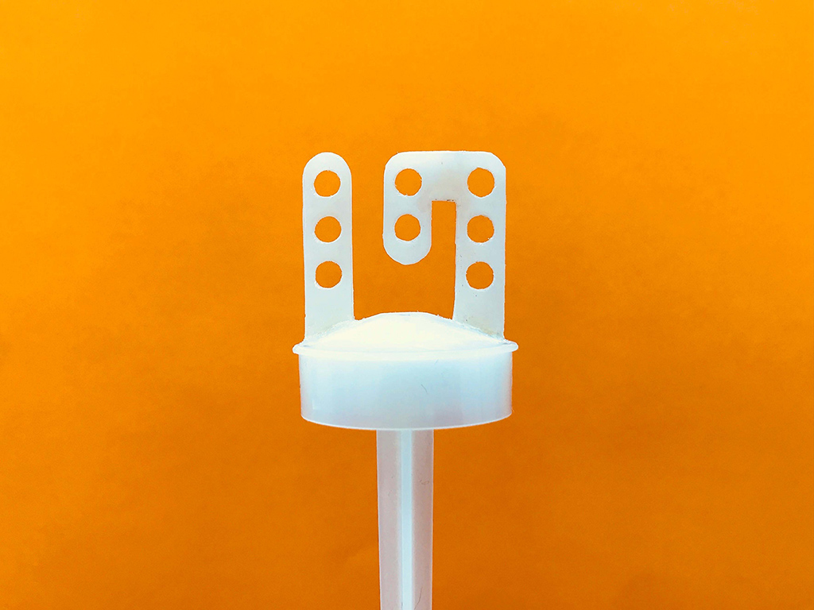

 

こんにちは。高橋です。 まずはこちらの動画をご覧ください。

 

<iframe width="680" height="382.5" src="https://www.youtube.com/embed/r3ZtgfnsfCE" title="YouTube video player" frameborder="0" allow="accelerometer; autoplay; clipboard-write; encrypted-media; gyroscope; picture-in-picture; web-share" allowfullscreen></iframe>  

（1:45までは私がアイスを食べているだけなので、せっかちさんは飛ばしてもらって大丈夫です。）   

そうです！17アイスの棒を17にしました！ はじめは全く別のアイデアで考えていたのですが、FLATのお二人から割り当てられた「17」という数字を見た時に、もうこれをやるしかないと思いました。 素材もちゃんと17アイスの棒を使っていますぞ。どうぞご覧ください〜。

 

### **材料**

* 17アイス

 

### **技術**

* 射出成形機
* 3Dプリンター
* （ニッパー、カッター、やすりなど手加工の道具）

 

### **技術**

* Illustratorでデザイン
* fusion360で型のモデリング
* form2で出力
* 射出成形機EasyMoldで成形
* やすりがけ
* 17アイスの分解と組み立て  

 

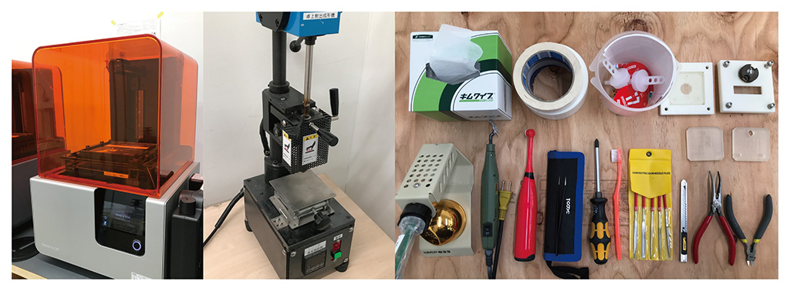
  

### **作り方**
 

### **1. アイデアスケッチと採寸**
 

とりあえず17アイスを買ってきて、食べます。 
棒の部分は実験の分も含めるとたくさん必要なので、同僚にも食べてもらいます。 
寒い中ありがとう〜！ 

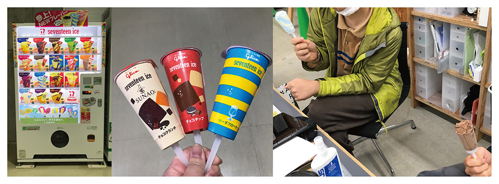
 

＜17アイス自販機/アイス購入/アイス食べる＞

  

まずは採寸をしてアイデアスケッチをいくつか試しながら、加工可能な条件（その機械でできることできないこと）に合うか、どれぐらいのサイズ感が現実的かなどを検討します。 
棒全体は射出成形できないサイズなので、17の部分だけ作って合体させることにします。 

ところで、17アイスの棒の丸い穴の部分、なんでこんな形なのか気になりますよね。 
調べたところ、この穴はアイスを食い込ませて落ちにくくするためらしいですよ。まあそうだろうなと納得の結果でした。 

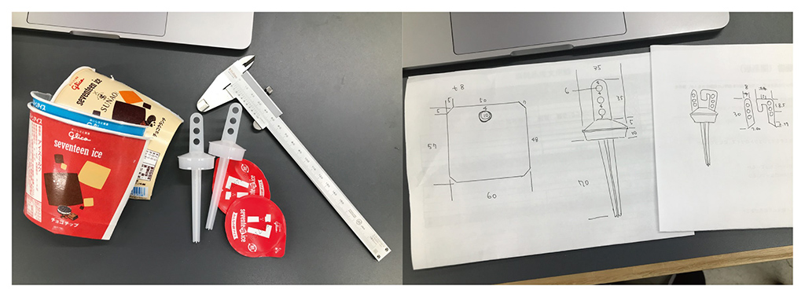
 

＜採寸/スケッチ＞

  
 

### **2. プロトタイプとデザインの決定**
 

これぐらいかなーという形が出来上がったので、レーザー加工機でMDFを切り出したものをプロトタイプとして組み合わせ、観察します。 
ちょっと細すぎたなあと思ったので、図面を引き直して再度出力と観察をします。 
2回ぐらいやってまあいいかなという形になったのでこれでデザイン決定とします。 

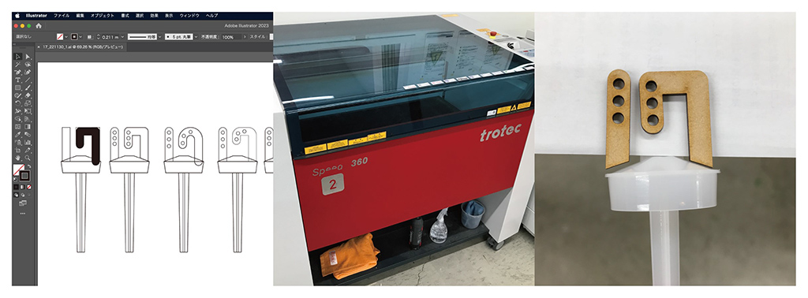 

＜Illustratorでデータ作成/レーザー加工/プロトタイプちょっと細いのでやり直し＞

   

### **3. 射出成形機用の型のモデリングと出力**
 

射出成形機では熱可塑性樹脂を溶かして注型します。工場などでは金型が用いられますが、ここではform2で出力したUVレジンの型を使います。レジンは熱で溶けないからね！金属を切削するのはちょっと大変だし、光造形ありがたいね。 
1と7の部分だけでなく、空気を逃す穴も忘れずに作っておきます。  

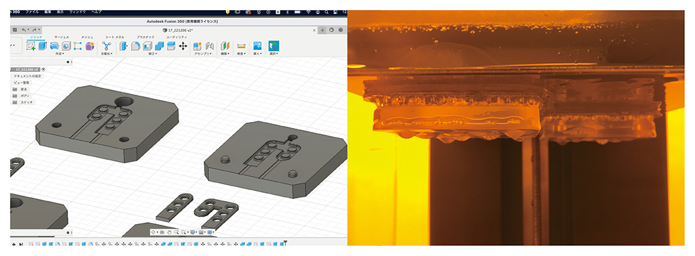 

＜fusion360でモデリング/form2で3Dプリント＞

   

### **4. 射出成形**
 

ここからがメインの射出成形です。まずはやってもいい材料か調べます。 
17アイスの棒って白かった記憶があったのですが、なんか乳白というか少し透明がかった素材に変わっていました。調べると、2019年にバイオマスプラスチックに切り替えたそうです。 
17アイスの棒はサトウキビから作ったポリエチレンになったらしい。ほ〜。
 

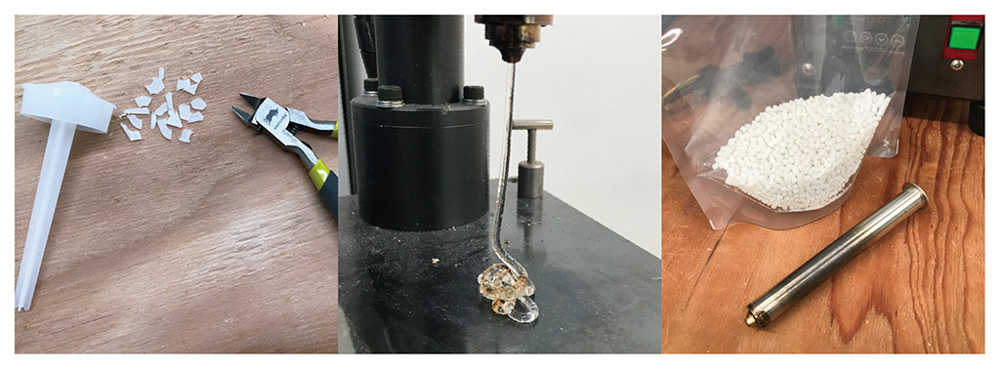 

＜17アイスの棒を砕く/シリンダーポッドが汚れていた/パージ材でゴミを除去＞

  

そういうわけで加工して大丈夫そうだったので、17アイスの棒を小さく砕いてシリンダーポッドに入るサイズにします。結構やわらかいです。 
試しに出してみると汚れた樹脂が出てきました。シリンダーまわりの洗浄とパージ材でポッド内のゴミの除去をします。
 

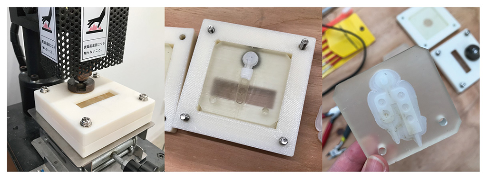 

＜射出成形/ゆっくりすぎると冷えて途中で固まる/多く入れすぎ＞

  

何度か失敗しながら、いい感じに出力できました。 
バリをとってはんだごてで本体と17を熱で溶着します。形としてはこれでほぼ完成です！ 
ただ、表面がなんかガサガサしてあまりきれいではない状態です。 

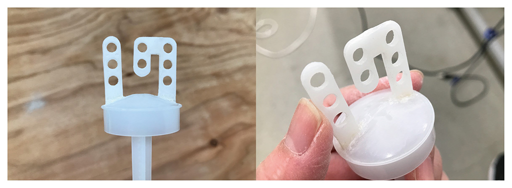 

＜17アイスの棒組み立て完了＞

   

### **5. やすりがけ**
 

私は知っている。[やすりがけをすれば大体のものはきれいになる。](https://fablabsendai-flat.com/2021/12/08/acc2021_08/) 
無心であるいは歌いながらやすりがけをします。なんにもかんがえなくていいです。
   

### **6. アイスの分解と観察と組み立て**
 

再び17アイスを買ってきて、紙を破らないように慎重に開封します。（で、溶けちゃうのでアイスを食べます。）それから、巻いてある紙と棒の部分の構造を観察します。 
刀でいう鍔（つば）の部分の手元側に紙を折り込む形で組み立ててある。これなら、分解しても組み立てることはできそうです！OKいいかんじ〜！ 
元の棒を引っこ抜いて、17の棒を差し込みます。紙を巻き直してのりで接着し、しばらく冷凍します。 
ものを凍らすのって結構時間がかかるんですね。この日に撮影までやりたかったのですが、アイスが固まらなくて翌日になりました。 

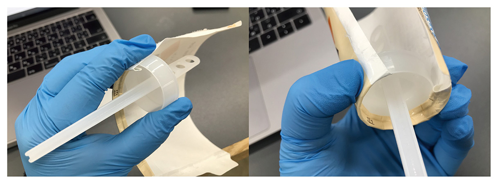 

＜紙が折り込んである/巻き付けて鍔の内側に折り込む＞

   

### **7. 撮影と編集**
 

買ってきた17アイスの棒が17になっていてほしかったので、必要な映像を撮影します。 
作った17の棒にアイスをさして食べる行為は、私は自分の責任でやったので、みなさんはマネしないでください。 
去年は編集の時に、絵コンテを作ってなかったことを後悔したので（撮り忘れ撮り直しがたくさん発生した）、めちゃくちゃ簡単にではあるが一応流れがわかる程度のものを初めの段階で書いておきました。 
Premiere Proで動画を編集します。早送りしても、ほぼ私がアイスを食べているだけの動画になってしまうことをちょっと不安に思いながら作業を進めます。 
そして最後はこの文章を書いています。これにてフィニッシュです！ 

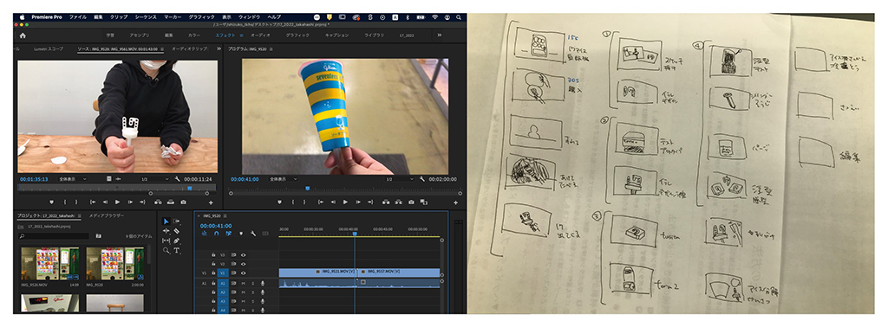 

＜Premiere Proで動画編集/編集構成＞

   

### 感想

17アイスの棒を砕いて溶かして17に成形する…… 
17アイス棒には自分で自分の素材になってもらいました。 
射出成形は温度と時間の管理が難しかったです。 
前の利用者の焦げなどの汚れが残っていて、洗浄も大変でした。 

そして余談ですが、ACC2021では「8」、今年は「17」を作らせてもらいました。 
たまたまですが私の誕生日は8月17日なので、誕生日コンプリートできました。 
ありがとうございました（？）。またがんばります。

    

### **作者紹介**
 

**高橋 志津子** 

京都芸術大学ウルトラファクトリーでデジタル加工を担当しています。 
ネギとA&Wとゲームが好きです。 
来年こそは旅がしたいです。
  

（Last Updated: 2023.04.11）

