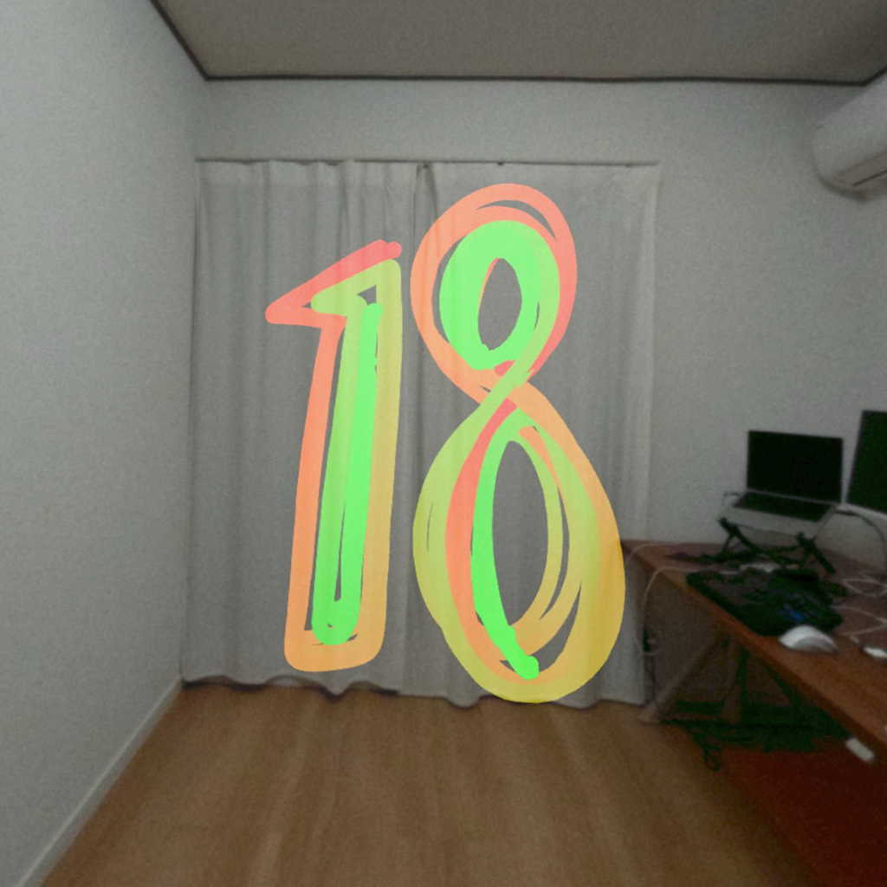
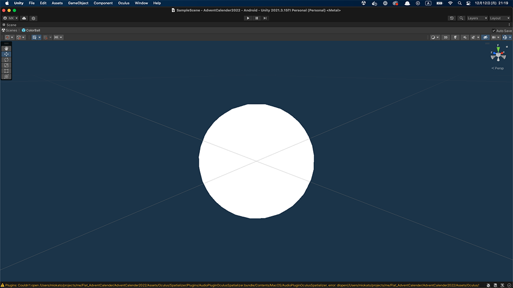
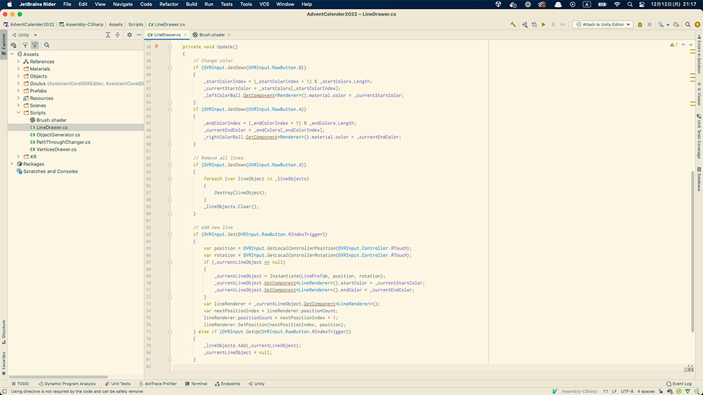
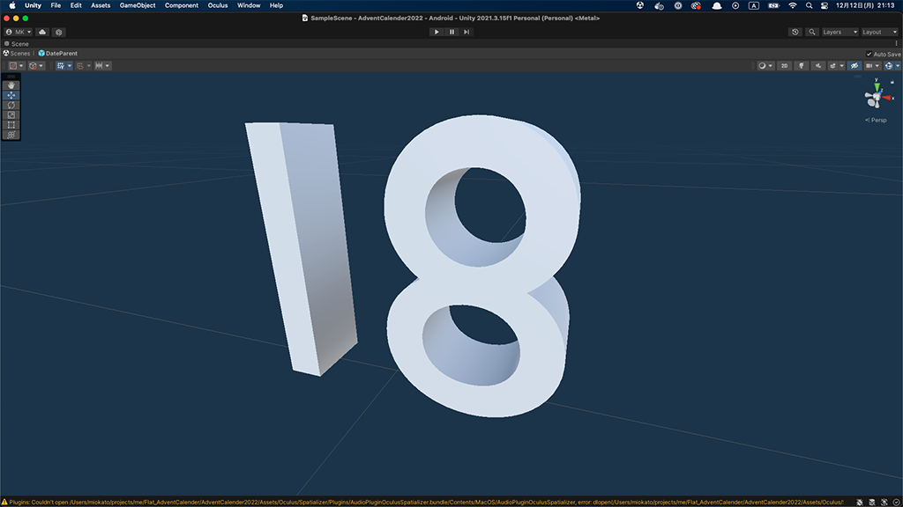

 

## **#18/25 [ 2022/12/18 ]** 
### by Mio Kato
  

 

MetaQuestProを買いました！ 
MetaQuestProはVRヘッドセットですが、カメラがついているので、カメラから取り込んだ現実の映像の上に仮想のオブジェクトを置いて、現実と仮想を組み合わせたMixedRealityの表現ができます。この新しいガジェットを使って僕が担当する18を作ってみたいと思います。

 

### **材料**

* ポリゴン

 

### **技術**

* MetaQuestPro
* Blender
* Unity
* C#

 

### **作り方**
 

まずはBlenderで作成した数字の3DオブジェクトをUnityに取りこみます。
 

   

Unityのスクリプトを書いて、MetaQuestのコントローラーでつかんで動かせるようにしてみました。 

<iframe width="680" height="382.5" src="https://www.youtube.com/embed/rMk7GA6G0Ss" title="YouTube video player" frameborder="0" allow="accelerometer; autoplay; clipboard-write; encrypted-media; gyroscope; picture-in-picture; web-share" allowfullscreen></iframe>

   

楽しいけど、地味。。。ですね。 
3Dオブジェクトのテクスチャを変えたり、大きさを変えたりもできますが、去年と同じ方向に向かってしまいそうなので、今年はコントローラーを使って、空間に数字を描いてみることにしました。 
Unityでスクリプトを書いて、コントローラーのトリガーを押している間、線を引くことができるようにします。 

   

線を描く色をAボタン、Bボタンで変更できるようにして、描き始めと描き終わりの色を変えることでグラデーションを作れるようにしてみます。選択している色が分かるようにコントローラーオブジェクトの周りに玉を配置して色を表示できるようにします。 

   

自分の手が3Dプリンターのヘッドになったみたいで楽しい！絵心がないので、同じ形の数字を重ねて立体感を出してみました。 

<iframe width="680" height="382.5" src="https://www.youtube.com/embed/Ay-pKKNFlJs" title="YouTube video player" frameborder="0" allow="accelerometer; autoplay; clipboard-write; encrypted-media; gyroscope; picture-in-picture; web-share" allowfullscreen></iframe>
   

MetaQuestPro内蔵のカメラで写真を撮影。 

    

### **作者紹介**
 

**加藤 未央** 

[VIE STYLE](https://www.viestyle.co.jp/)というイヤホン型脳波計をつくっている会社でソフトウェアエンジニアをしています。 
MR(AR)が好きで、日常でつけられる軽いヘッドセットを心待ちにしています。 
[https://note.com/utomica](https://note.com/utomica)
  

（Last Updated: 2023.04.11）

