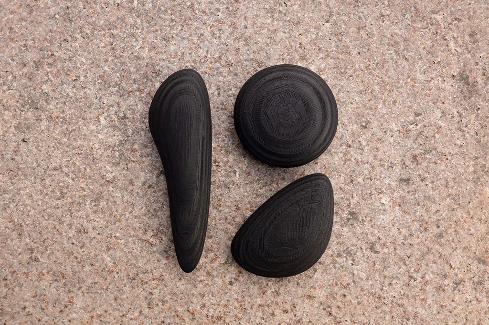
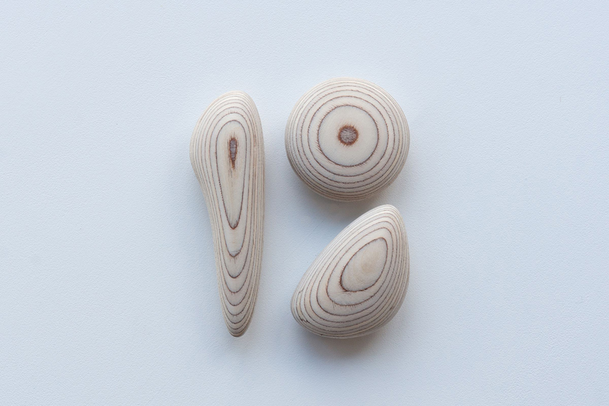
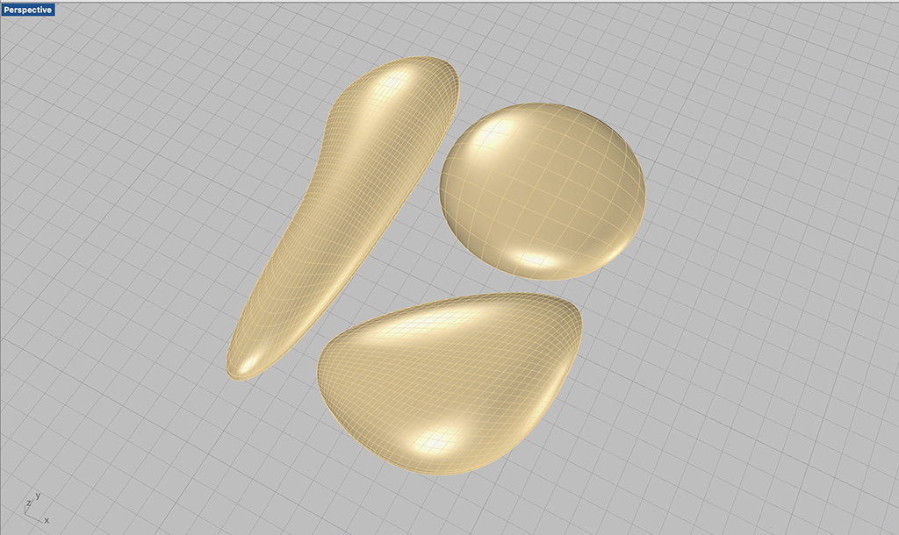
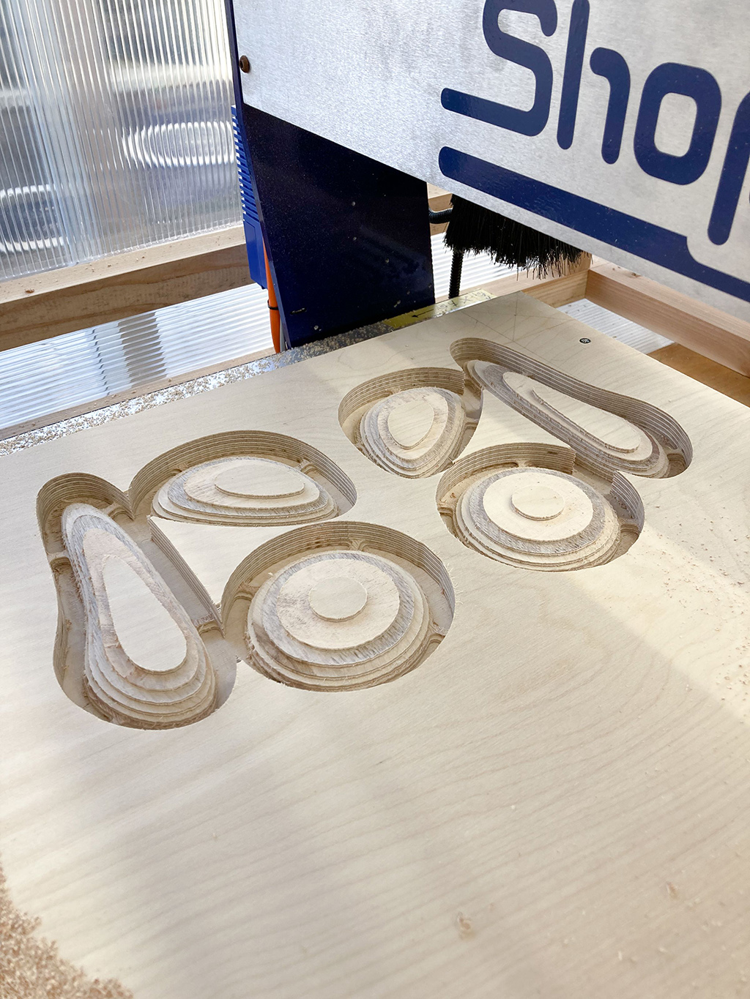
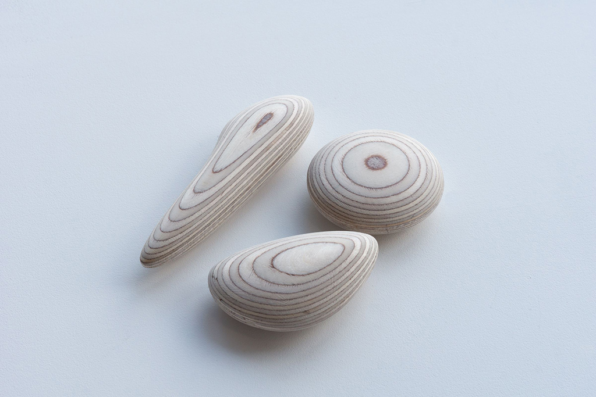

 

## **#19/25 [ 2022/12/19 ]** 
### by Daichi Komatsu
  

 

博物館で古代の遺物を見るのが好きだ。 
土器、土偶、石器、鏃、装飾品、石棒… 
現代の生活から見ても使用用途がわかるものから、なぜこんな形にする必要があったのだ 
ろうか?と2000年以上もの時空を超えた彼らの信仰や、美的感覚を妄想させるものまで。 
それらは、触ることや使うことはできないが、「いま」とは違うそこにあった世界へと 
誘ってくれる見えない「機能(作用)」を纏ったオブジェとして存在している。 

  

さて、今回僕が与えられたお題は「19」。 
アドベントカレンダーの企画が終わってしまえば、ただの数字を模した置物になって 
しまうのが切ないので、2000年後の誰かへの、ちょっとした悪戯にしたいと思った。 

 

「19」を3つの要素(1と9の上下)に分け、打製石器のような曲面の抽象的な幾何学形態で表現してみた。 
中を一部空洞にして、手元にあった1円玉を入れて、振ると音が鳴る仕掛けも入れてみた。 

 
 

それだけでもいいかな、と思ったのだけども、 
2000年後の君を大いに惑わせ、妄想させるため、表面をバーナーで黒く焦がしてみた。 
黒く煤けた音が鳴る幾何学的なオブジェを、さて、君はどんなものだと思うだろうか。  
 
 <iframe width="680" height="382.5" src="https://www.youtube.com/embed/tq4DB0XH3tE" title="YouTube video player" frameborder="0" allow="accelerometer; autoplay; clipboard-write; encrypted-media; gyroscope; picture-in-picture; web-share" allowfullscreen></iframe>  

何かをすり潰すための道具だったと想像するかも知れない。 
崇めた神々を楽しませるための祭りの楽器だったと思うかも知れない。 
割った中に見つけた1と書かれた金属片に、呪術的な祈りを感じるかも知れない。 
炭化した理由はこの時期に大規模な火災があったに違いない、なんてしたり顔で語るだろうか。  

<iframe width="680" height="382.5" src="https://www.youtube.com/embed/HCSZ5CnkNSA" title="YouTube video player" frameborder="0" allow="accelerometer; autoplay; clipboard-write; encrypted-media; gyroscope; picture-in-picture; web-share" allowfullscreen></iframe>  

そんなふうに思ってくれたら、きっと僕はどこかでニヤリとするだろう。 
どうせならば、19歳の君が見つけてくれることを願う。
  

2022年より。

  

---

  

### **材料**

* バーチ合板(学生の課題の端材)
* 1円玉(財布にあった小銭)

 

### **技術**

* shopbot desktop max
* Rhinoceros
*  ガスバーナー焦がし
* くだらない妄想

 

### **作り方**
 

#### **スケッチからRhinocerosでモデリング**
 

   

#### **stlデータを書き出して、shopbotで加工**
 

   

#### **形状を片面づつ作り、接着面を一部穴を開けておく。**
 

   

#### **財布にある1円玉を穴に入れ、接着。 穴あけは、制作時間を短縮すべく、ボール盤で行っています。（写真を撮り忘れました）**
  

#### **バリを軽く取ったら、ガスバーナーでこんがり焼き上げる。完成。**
 

   

    

### **作者紹介**
 

**小松 大知** 

プロダクトデザイナー / 宮城大学特任助教 / 古物店店主 
仙台市でTORCHという屋号で活動しています。 
[https://www.torch-design.com/](https://www.torch-design.com/)
  

（Last Updated: 2023.04.11）

