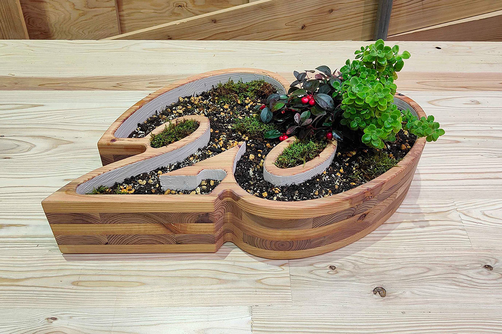
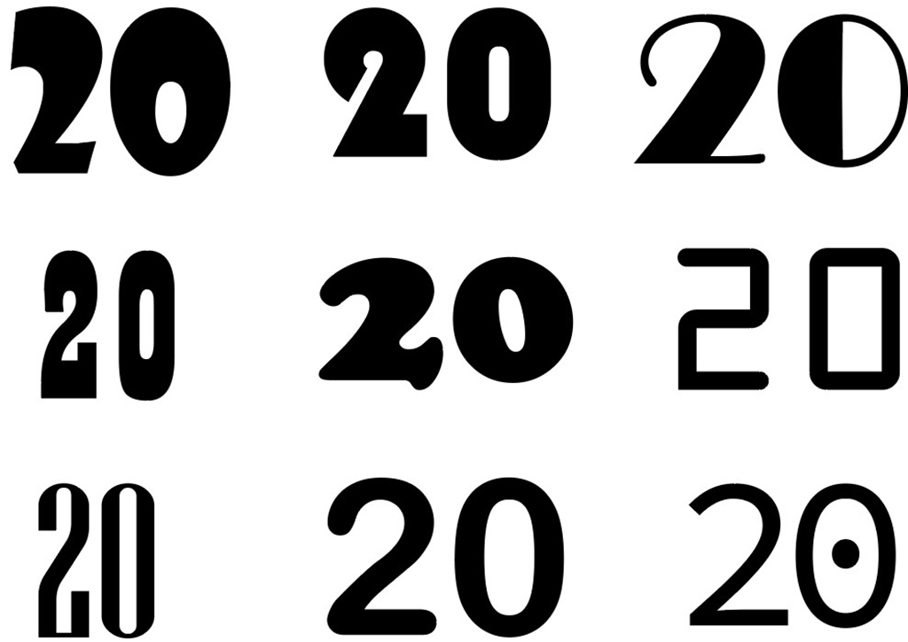
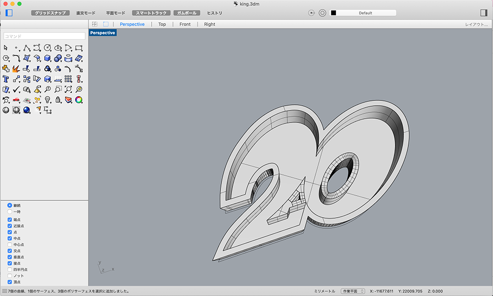
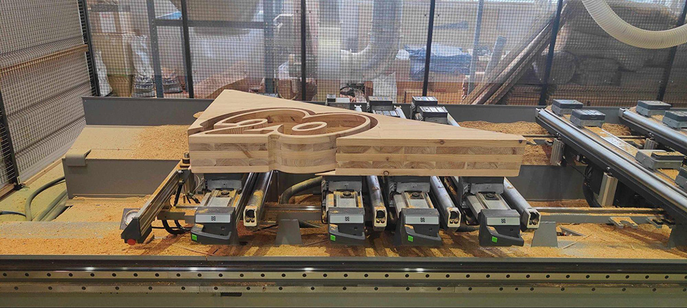
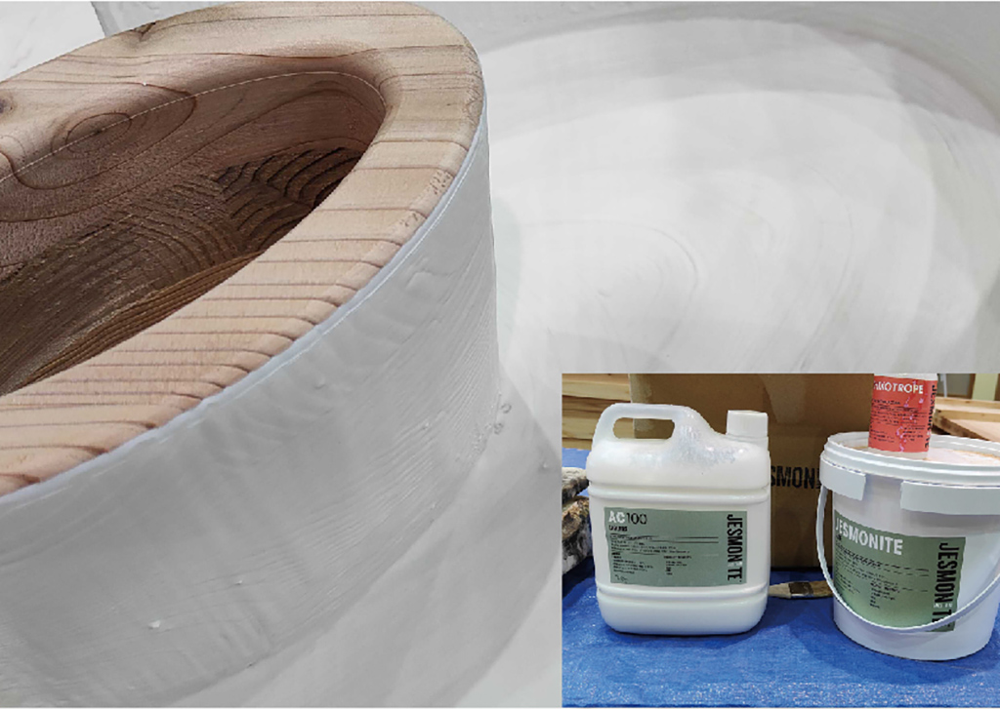

 

## **#20/25 [ 2022/12/20 ]** 
### by Yasufumi Hanada
  

 

### **材料**

* 激厚CLT（杉）
* ジェスモナイト
* 土
* 植物たち
* 透明少女

 

### **技術**

* Illustrator
* Rhinoceros
* CNC
* ヴァイブス

 

### **作り方**
 

### **0. 焦る**
 

１２月になり、何をつくるか考えてなかった私は、ただひたすらに焦る。 
しかし、焦ったところで意味はないので、「２０」を任された責任を果たすべく、考える。 
うん、植木鉢でも作ろう。
   

### **1. イメージする**
 

どんな形の「NiziU」にするかイメージする。いや「２０」だった。そうだった。 
Make you happyを添えていこうと決意。 

Illustratorで、いろんなフォントを並べてイメージするが、なんかピンと来ず。一旦頭を切り替えてナンバーガールの解散ギグを前から１０列目で拝む。青春の１ページ。 

  

そうか。僕たちには、ともだちがいるじゃないか。某漫画のフォントをトレースして、アウトラインをDXFで取り出す。 

ここで、植木鉢にしたかったことを思い出す。プロポーションを整えながらRhinocerosでモデリング。 

   

### **2. 生み出す**
 

いつまでもPCの中に閉じこもっていたら、いつまで経ってもゴールなんて決めれないぜ！モロッコvsクロアチア戦で、背番号２０グヴァルディオルのヘディングゴールを見ながら実行に移していく。 

CNCで切削するためにCAMを書きます。今回は、t:150mmという激厚の材料から削り出すためにφ４０の特注ルーターなど数種類の刃物を駆使して削り出す。 

   

### **3. 愛でる**
 

生まれたての「２０」を愛でてあげる。 
CNCで削り出したままだとバリもあるし、まだまだ粗削りの荒くれ者。 
丁寧に研磨して、トリマーで面取りして、表面の仕上げを行う。 

ここでまた植木鉢を作ろうとしていたことを思い出す。 

このままだと水が木材に染み出し残念な結果になるので、内側にジェスモナイトを塗布してコーティングする。ジェスモナイトは、水性樹脂なので、止水はこれでバッチリ！、、なはず。 

   

### **4. 女将さん、Do it !!**
 

出来上がった植木鉢に、土いれて、植物入れて、完成！ 
This is 植木鉢！ 

    

### **作者紹介**
 

**花田 康史** 

京都芸術大学（旧京都造形芸術大学）ウルトラファクトリーで、テクニカルスタッフとして従事したのちVUILD株式会社VUILD fabricationプロジェクトリーダーに着任。京都芸術大学（旧京都造形芸術大学）非常勤講師。 
世の中に流通しているものは大抵作れると思っている。何を見てもどうやって作ってるのかに着目してしまう職業病。ブラボー。
  

（Last Updated: 2023.04.11）

