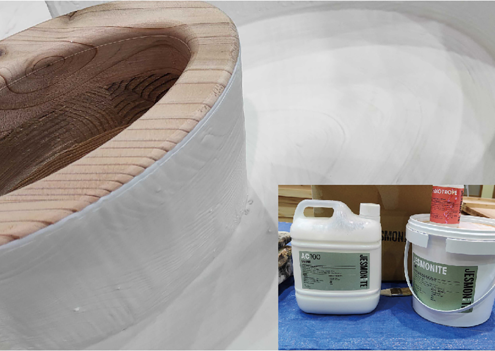

 

## **#21/25 [ 2022/12/21 ]** 
### by Yuichi DancingAllNight Hirose
  

 

胸、キュンしてますか？ 

Solidknit（ソリッドニット）の廣瀬・ダンシングオールナイト・悠一です。 
ダンシング、今年の夏からアメリカにいます。 
カーネギーメロン大学のテキスタイルズラボという研究室でソリッド編み機をつくってます。 
（ソリッド編みやソリッド編み機について知りたい方は去年のアドベンチャーカレンダーの記事をご覧ください！） 
この研究をご覧になったことがある方もいらっしゃるかもしれませんが、この研究室は「編み機版Gコード」みたいなknitoutっていうファイルフォーマットをつくったところなんです。 
3Dデータや画像データをこのknitoutに変換して、そのknitoutを産業用編み機に送るとそれを編んでくれるという。 
ダンシング、ソリッド編み機をつくる忙しさにかまけてこのknitout関連のソフトとか研究室に置いてある編み機、全然さわれてなかったんですね。 
それでこのアドベンチャーカレンダーの依頼をいただいたものですから、これをよい締め切りにしようと思いまして。 
knitoutと編み機で21を編みました！

 

### **材料**

* 毛糸（TAMM PETIT 2/30 赤、緑、白）

 

### **技術**

* 産業用編み機（島精機 SWG-N2）

 

### **作り方**
 

### **1. 絵を描く**
 

  

あなたの大切な、編み物を渡す相手のことを思い浮かべながら、もしくは思い浮かべずに絵を描きます。 

ここではIllustratorを使っていますが、最終的にpngファイルかjpgファイルにできればなんのソフトでもよいです。 

pngファイルかjpgファイルの画像として保存してください。

   

### **2. 画像をknitoutファイルに変換する
す**
 

  

テキスタイルズラボメンバーのガブリエルのつくったソフト↓で画像をknitoutファイルに変換します。 
[https://github.com/gabrielle-ohlson/knitout-image-processing](https://github.com/gabrielle-ohlson/knitout-image-processing) 
インストラクション（README.md）に従って進めていきます。 
英語がわからなかったらDeepLだ！ 
（ちなみにガブリエルの個人サイトがかなりイカしてるのでチェケラです！） 
knitout-image-processing/in-colorwork-images のフォルダにさきほどのpngファイルもしくはjpgファイルを入れて、Windowsだったらコマンドプロンプト、Macだったらターミナルなどを使って knitout-image-processing のフォルダに移動、そこで npm run knitify というコマンドを入力してエンターします。 
そうすると質問モードが起動し「１段何目にしますか？」「色は何色ですか？」といったことを聞かれるので、設定していきます。 
基本デフォルト、よくわからないものはn（no）で進めました。 

  

※注意点 

* Git Bashを使うとnpm run knitifyが通らなかったのでコマンドプロンプトを使いました（OSはWindows 10 Pro for Workstations、Gitのバージョンは2.31.1.windows.1）。
* Would you like to save the prompt answers you provide in this session?（回答を保存しますか？）でy（yes）にして保存しようとするとエラーになったことがあったので、それ以降nにしています。そんなにたくさん質問があるわけではないので保存しなくてもいいかと思います（ちなみにいまyで試したら通りました、そういうこともありますよね）。
* 幅60目、高さ80段にしました（たしか）。編み物は縦につぶれるので縦長に設定するといいかんじになります（手編みと同じく、正確につくりたい場合はゲージを取る＝100目×100段など決まった編み目をサンプルとして編んで、寸法を測ってそれに合わせて縦横比を調整する必要があります）。

  

完了すると knitout-image-processing/knit-out-files のフォルダにknitoutファイル（.k）ができます。

   

### **3. ビジュアライザで確認する**
 

  

同じくガブリエルのつくったknitout-live-visualizer↓でどんなかんじか確認します。 
[https://github.com/textiles-lab/knitout-live-visualizer](https://github.com/textiles-lab/knitout-live-visualizer) 
インストールしなくてもオンライン版もあります。 

  

この時点でかわいい。 
変なところがないか、周りの詳しい人に見てもらいます。 
え、詳しい人などいない？そのままできっと大丈夫！
   

### **4. knitoutファイルをdatファイルに変換する**
 

上の方で「knitoutファイルを編み機に送ると」と書きましたが、正確にはknitoutファイルを島精機仕様のdatファイルに変換する必要があります。 
このあとこのdatファイルを島精機のKnitPaintというソフトで読み込んで、ちょこっと設定して編み機に送信、という手順です。 
それでこのdatファイルへの変換ソフトがこちら↓なのですが… 
[https://github.com/textiles-lab/DAT-format](https://github.com/textiles-lab/DAT-format) 

  

とのこと。このメイカー感（？）しびれます。 
ということで本当に使いたくなったら上記手順でお問い合わせください！
   

### **5. datファイルをKnitPaintに読み込み、編み機へ送信！**
 

datファイルを島精機のソフトKnitPaintで開き、キャリア（毛糸をつかんで移動させる3Dプリンタのヘッドのような部分）の番号と色が合うように設定していきます。 

  

編み機の手前（上の写真の左側）から奥（上の写真の右側）に向かって1→10です。 
赤が2、白が3、緑が10となってます。   

  

knitoutファイルに戻り、コードの最初のほうのx-vis-colorのところを見ます。 

#f7f8f8（白）が1 

#006934（緑）が2 

#e60012（赤）が3 

になっています。 

（#f7f8f8などはウェブデザイナーさんなどが「ウェブサイトのここを白にしろ！」みたいなときに使うカラーコードで、Googleで「#f7f8f8」などと調べるだけでもその色を表示してくれます。）   

  

またKnitPaintに戻ります。 

Yarn No. 1、Yarn No. 2、Yarn No. 3の左上の数字をキャリアの数字にします。 

Yarn No. 1 = 白 = 3番のキャリア 

Yarn No. 2 = 緑 = 10番のキャリア 

Yarn No. 3 = 赤 = 2番のキャリア 

なので3、10、2とします。   

  

Y. Hold Hookのタブでも同じく。
   

  

そのあといろいろやって編み編み開始！ 

なんなのこの機械、すごすぎる。よくこんなものつくったな～～～ 
  

  

ん？終わった？と思ったら吐き出されて足元に落ちてた。   

  

いやめっっっっっっっちゃかわいいやんか～～～～～！！！！！！！！！   

  

裏もめちゃくちゃかわいいやんか～～～～～！！！！！！！！！   

  

かわいいなぁ。   

knitoutについてさらに知りたい方は 

こういった論文↓や 

[https://la.disneyresearch.com/publication/machine-knitting-compiler/](https://la.disneyresearch.com/publication/machine-knitting-compiler/) 

[https://textiles-lab.github.io/publications/2018-autoknit/](https://textiles-lab.github.io/publications/2018-autoknit/) 

テキスタイルズラボ担当教員のジムの動画↓ 

[https://youtu.be/iEaK68VRAng](https://youtu.be/iEaK68VRAng) 

をご覧ください。 

 

動画、特に9:54あたり～の、プレゼンスライド上で編み機の3Dモデルを動かして編みのシミュレーションを行っているところ、めちゃくちゃすごいので注目です。 

え、こんなプレゼンツールあるの？と思っていたのですが、ジムが全部C++で書いたとの噂です。 

  

はじめての機械を、教えてもらいながらおっかなびっくり動かして、それで完成品が出てきたときの感動。 

こういう感覚久しぶりで、10年以上前に3Dプリンタやレーザーカッターをはじめて使ったときを思い出しました。 

あの気持ちを思い出したら、あのころに抱いていた将来への漠然とした不安や淡い恋心まで、付属品みたいに思い出しちゃった…ナ。

    

### **作者紹介**
 

**廣瀬・ダンシングオールナイト・悠一** 

メカエンジニア。 
ソリッド編みを自動化する「ソリッド編み機」をつくっています。 
「椅子をほどいて靴に編みなおす」（＝物体のアップデート）を可能にしたい。 
Solidknitという名前で活動ちう！ 
[ダンシングTwitterアカウント](https://twitter.com/solidknit) 
[ダンシングYouTubeチャンネル](https://www.youtube.com/channel/UCoKSMabXirurhL8UbVTO1JA)
  

（Last Updated: 2023.04.11）

