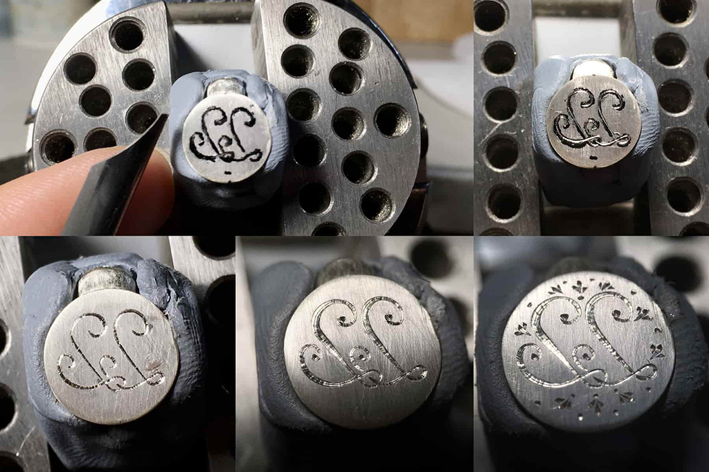
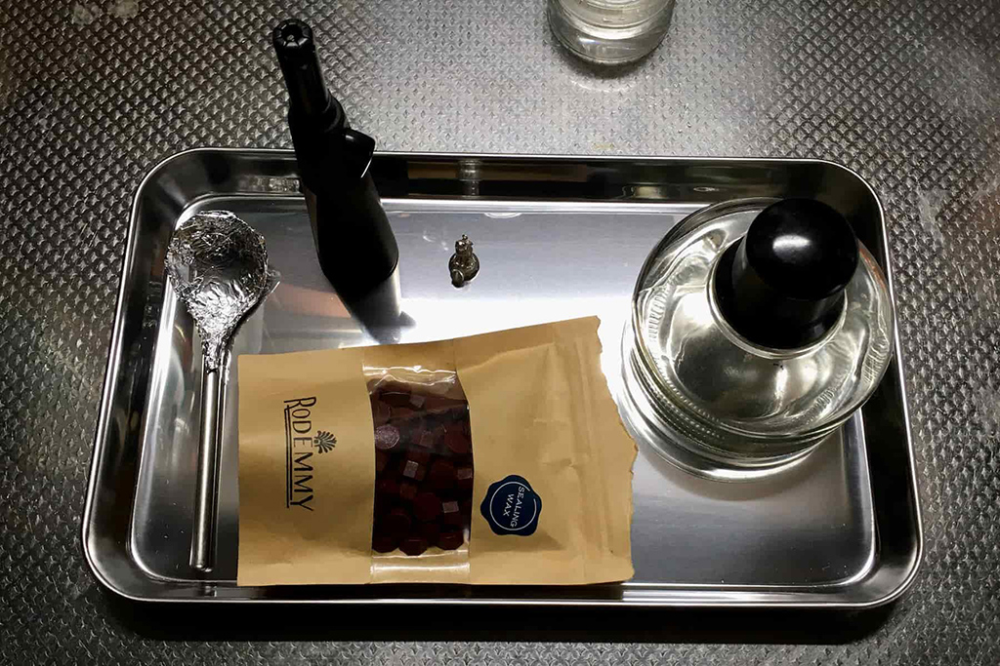

 

## **#22/25 [ 2022/12/22 ]** 
### by Hikaru Ishi (Root n)
  

 

 

“22”の担当の石井です。去年に引き続き、アドベントカレンダーのお誘いをいただきました。 
さて、“22”といえば2022年もそろそろ終盤に近づいてまいりました。 
この時期、男性ならば誰もが近づきたくないであろう、ジュエリー業界からの刺客です。 

“アドベント”という言葉を聞いて、真っ先に思いつくのが某ライダーという私です。 
“22”は「ニャー！ニャー！」なので、猫さんのシーリングスタンプを鏡の世界から召喚…ではなく制作することにしました。 
紐を通してオーナメントやペンダントトップとしても使える設計です。 
 
今回の宝石はクリソベリル・キャッツアイです。猫目石とも呼ばれていて、少し前に二月の誕生石に追加されたそうです。 
その選定理由については諸説ありますが、個人的には「ニャー！」で二月になったのではと勘繰っています。 
鉱物としての分類はアレキサンドライトと同じクリソベリルで、モース硬度が8.5なので結構キズに強い石です。 
小ぶりですが、ちょっと珍しい清涼感のあるグリーン系。飴玉だったら『青リンゴミルク味』のしそうな石です。 

去年は1からデザイン画を描いてジュエリー制作する方法を紹介しました。 
製造業におけるトップダウン設計に近いものでしょうか。 
今年は応用編で、手持ちの部材を組み合わせて新しい物を生み出す、ボトムアップ設計的な手法で制作する方法を紹介します。 

去年の基本編と流れの共通する部分は説明を省略していたりするので、ご興味のある方や貴金属で何かを作ってみたい方は、去年の物を見ていただくと分かりやすいかと思います。  

去年の → [https://fablabsendai.github.io/acc/2021/1209.html](https://fablabsendai.github.io/acc/2021/1209.html)

 

### **材料**

* スターリングシルバー(Ag92.5%, Cu7.5%)
* クリソベリル・キャッツアイ(天然、約0.6ct)
* 銀ロウ

 

### **技術**

* 彫金

 

### **主な道具**

* 糸鋸
* ヤスリ各種
* コンパス
* 洋彫りタガネ各種
* 彫刻台
* ピンバイス
* 先端工具各種
* ヤットコ各種
* ガスバーナー&ふいご
* ヤニ
* 線引き板
* 圧延ローラー
* 球台
* リューター

 

### **作り方**
 

去年は板材等から部材を制作して組み立てていく、いわゆる鍛造という作り方でした。 
今回は以前制作して余っていた猫の鋳造部品と、端材から制作した鍛造部品とのハイブリッドです。 
時々、『鍛造と鋳造とどっちが偉いか？』…みたいな話を聞くことがあります。 
作るデザインによって向き不向きがあり、それぞれ一長一短です。 
『技術に貴賎なし』という私の個人的な考えのもと、今回はあえて両者を組み合わせてみました。   

### **1. 鋳造品の解説と下ごしらえ**
 

鋳造品は精密鋳造・ミクロフュジオーネ(micro fusione)という蝋型を使用した方法で作ります。 
ワックスで作った原型を金属に置き換える技法です。 
日本では英語名のロストワックスという呼び名の方が伝わりやすいかと思います。 
イタリア語だと響きが無駄にカッコ良かったりするのですが、私たちは単純にキャストと呼んでいます。 
基本的にキャスト屋さんに、ワックスで作った型を送って鋳造してもらっています。 
 
鋳造品は僅かな工具から始められるので、初めての方にもおすすめです。 
ワックスを削れれば何でも良いので、極端な話カッターナイフとヤスリだけでも何か作れます。 
こだわり始めると工具がどんどん増えていきますが…。 
あらかじめ制作したワックスの重量を計測し、鋳造する種類の金属との間の比重差を確認して、鋳造された完成重量を計算される事をおすすめします。 
銀ならまだしも、金やプラチナの場合は非常に高額になりますので…。 

  

写真の猫さんはすでに軽く磨いてあったものなのですが、鋳造上がりの状態は鋳肌がザラザラです。 
鋳造の具合にもよるのですが、#400あたりの紙ヤスリで一皮剝くような感じで表面を整えます。 
磁気バレル研磨機なんかがあれば、少し楽です。 
加えて、湯口という溶けた地金を流し込む部分、プラモデルでいう所のランナー部を金ヤスリで削り落とします。 
これで鋳造品の下ごしらえは完了です。
   

### **2. 素材を見ながら構想**
 

猫さんと端材と石を眺めながら、構想を練ります。 
あまり手を加えずに良い物を作るにはどうすれば良いか…。 
個人的には制作技術よりもデザインの方が難しいと思います。 
見栄え、着用感、コスト、耐久性…といった諸々の要素のバランスをとらないといけないので。 
今回は猫さんの下にシーリングスタンプになる土台と石(クリソベリル・キャッツアイ)を仕込む事にしました。 
土台は半球状のドーム型中空構造にします。中空構造だとかなり軽量化することができます。

   

### **3. 部材・パーツづくり**
 

まず部材を制作します。 
地金を焼きなまし(バーナーで加熱後、水で急冷)して柔らかくしてから、圧延機で狙いの板厚にします。 
線材は線引き盤(ダイス)を使って、引抜き加工で目標の太さに。 
この辺りは去年、詳しく解説しました。 

ドームの上半分はあまり深く彫らないので、板厚が0.6mm位 
ドームの底部は印にするために彫るので、やや厚めに1.1mm位 
宝石が収まる石座部分は石のサイズとのバランスで0.4mm位 
丸カンやダボに使う線材はφ0.55mm 

  

ドーム上半分は玉台と矢坊主を使って叩いて作ります。 
大きな窪みから始めて、少しずつ小さな窪みに移行し、Rをきつくしていきます。 
金属は叩いているうちに地金が加工硬化して、形が変わらなくなってくるので、その都度焼きなましして、柔軟性を復活させながら作業を進めてください。 
線材の引抜き加工も同様に、焼きなまししながら徐々に細い線にしていきます。 
目標の太さになったら丸カン(紐やパーツを通すための輪っか)を作ります。 
良く焼きなましした線材を芯棒に巻き付けてコイル状にします。 
芯を抜き取って糸鋸を通して切断すれば、一度に沢山作れます。 

丸カンをはじめとした金具類は、いかに意匠の邪魔にならないようにするかが重要な点かと思います。 
そのためには… 
1.金具を目立たなくする 
2.金具自体をカッコ良くする 
3.金具を意匠の一部にする 
…の三択になるかと思います。(…バイクのカスタムなんかと考え方は一緒ですね！) 
今回は3番目の手法で、猫さんの尻尾の先に接合して、輪っかを乗っけて遊んでいる風にしました。

   

### **4. 石座づくり**
 

ここからは石座の作り方です。 
石座をイタリア語で無駄にカッコ良くカストーネ(castone)と言うのもアリかと思います！ 
ブラボー(bravo)と違って、ジュエリー関連の人しか使うシチュエーションの無さそうな単語ですが…。 
オーバル型の石座を作るにはまず長径と短径をノギスで計ります。 
二つの値を足して2で割って平均値を求めます。そこに石座に使う板厚(0.4)を足します。 
合計した値に円周率の近似値3.14をかけると、石を取り巻くのに必要な地金のおおよその長さ(楕円の円周の近似値)が導き出せます。 

  

必要な地金の幅(石座の深さ)は、石の厚みと形状によってケースバイケースなのですが、石留めした時にちゃんと石が固定されて、なおかつ正面から見た時に石が地金で隠れる面積が最低限になるようにする事がポイントです。 
今回は覆輪留めという石留め方法ですが、基本的な考え方は爪留めでも彫り留めでも共通です。 
必要最小限の爪の大きさ・かかり具合で綺麗に留めるのが理想です。 

これは使用される環境(お客様)によっても最適解が変わってくるので難しい所ですが、高級なジュエリーや職人の腕を見極める際の重要ポイントだったりもします。 
石留め部分以外でもジュエリーは高級品ほどデリケートなつくりになっております。 
高級ホテル・レストラン等、そういったものを身に付けて入る場所には必ずドアマンさんがいて、扉を開けてくれます。 
彼らがいる理由のひとつに、ジュエリーへの配慮もあると聞いた事があります。 

少々話が脱線しましたが、先ほど計算した寸法の地金を糸鋸で切り出してリング状に丸め、バーナーでロウ付接合。 
最初は芯金という治具で真円に整えます。芯金は非常に緩やかなテーパーのついた鉄の丸棒です。 
その後、平行プライヤーで少しずつ潰して、真円から楕円に近づけていきます。 
途中、仮で石をはめてみて、いい感じに収まる楕円になるように調整します。 
同じ0.4mm厚で底板を作り、接合して余分な部分を削ぎ落とし、真ん中に穴を空けてドーナツ状に。 
加えて、本体に接合するために使うダボを、先ほどのΦ0.55mm線材で作って接合し石座の完成です。 
これは接合位置決めをする時に大変重宝します。
   

### **5. 部品の接合**
 

ドーム上部の形状が概ね完成したら、歪んでいる端部を大きめの金ヤスリで整えます。 
この時、重要なのは断面を水平に削ぎ落とす事です。 
底板と接合するときに隙間なく擦り合わせされていると綺麗に接合できます。 
定盤などの真っ平らな板に載せて確認しながら削っていきます。 
底部はドーム上部よりも、直径が0.5mm程度大きな円をコンパスでケガキして糸鋸で切り出します。 

ドームの上部と底部が完成して、ここから接合(ロウ付)する所なのですが、もう一つ加工します。 
中空形状にするときの注意点として、空気穴を空ける必要があります。 
穴が無いとバーナーの火を当てた時、内部の空気が膨張して破裂したり、動いてズレたりするので接合不良になりやすいです。 
穴は猫さんの足の間に来るあたりが目立たないので、φ0.6mmドリルで二箇所ほど空けておきます。 
綺麗にロウ付けできたら、底部直径のはみ出した部分をヤスリで削ぎ落として土台の完成です。 

  

これで各部品が揃いました！ 
あとはそれらを合体すれば良いのですが、接合した後ではタガネが入らない部分は先に彫っておきます。 
ロウ付けは正確な位置に置いて、ズレないように少しずつ。 
一気に接合してしまうとズレたときに取り返しがつかないので、初めは小さなロウ材で仮止めするような感じです。 
石座に付けたダボが刺さる穴をドーム部に空けてロウ付け。 
石を仮で置いてみて傾きを確認してから、石座の他の接点も接合していきます。 
キャッツアイは縦筋が光る石ですから、石座が傾いてると目立ってしまうので要注意です。
   

### **6. 石留め**
 

綺麗に接合出来たら、次は石留めです。 
ヒートフォームという熱湯で柔らかくなり、冷えると硬くなる樹脂で覆います。 
ヤニ(昔ながらの松脂をベースにした物)の代替品です。 
子供のおもちゃの『おゆまる』に近いイメージです。 

  

石の付近だけを残して、それ以外は保護のためにヒートフォームで覆ってしまいます。 
それを『彫刻台』と呼ばれる、角度を変えられる自在万力に固定。 
鉄の棒で、石座のフチを石に寄せる方向で押していきます。 
なかなか“寄せる”という感覚が伝わりにくいかも知れませんが、石のフチに対して石座のフチをほんの僅かに絞って、 
石が外れなくする感じです。 
安物にありがちな、“地金を上から被せる”みたいなイメージでも固定はできますが、石を隠す面積が広すぎて不格好になります。 

上を寄せたら次は下、右の次は左、次は右斜め上…といった具合に対角線の位置を順番に少しずつ寄せていきます。 
イメージとしてはタイヤ交換のボルトを締める順番みたいな感じで、偏らないようにバランス良く寄せていくと、石が変な方向に傾かずに綺麗に仕上がると思います。
   

### **7. 彫り**
 

彫りに関しては感覚的な部分に寄る所が多く、解説が難しいです。 
恐らく解説しても「ね、簡単でしょ?」「なるほど、分からん」という具合になるかと…。 
重要なのは『刃先を彫りたいポイントに正確に置く事』と『無理なく彫り進められる角度と力加減を覚える事』です。 
幾何学的な模様はコンパスを使って、均等分割したり水平高を計測して目印をケガキをしておくと、正確に彫れます。 
ヘッドルーペ等の拡大鏡は必須で、実体顕微鏡があれば尚良いです。 
私は実体顕微鏡を持ってないので、時計職人さんが着けているようなアイルーペを使っています。『刃先がどこに置かれているのか見えること』は綺麗に彫るための最低条件です。 

  

私も彫りについては、最初は専門書を読んで試したのですが、結局は習いに行きました。 
また、タガネの仕立て方も国によって、さらには職人さん毎に違ってきたりします。 
…なので好きな作風の師匠のもとにつく事が近道かなぁ…と思います。 
裏を返せば、ここまでの制作行程でタガネを使った作業以外ならば、器用な方は専門書や動画を探して独習できるかと思います！ 

 

“22”のフォントは、何となく猫っぽさを感じる『ヘ音記号』から着想を得てデザインしました。 
野良フォント…もとい『野良猫フォント』です！ 
『ヘ音記号』のモチーフとしての人気度は、大スターの『ト音記号』に大きく水をあけられている感がありますが、よく見ると猫の尻尾の様でなかなか可愛いです。 
スタンプしたときに正しい表記になる様に鏡文字で彫ります。 
しっかり正確に彫る場合はデザイン画を描いて、それを縮小コピーしたものを転写して下絵にするのが正攻法です。 
…ですが私は横着者ゆえ、マジックでザックリと下書きして、現物合わせで彫りながら微調整して仕上げました。 
良い感じに彫って、余白にあしらい模様を彫り加えて完成です。 

  

彫りに使った主なタガネは三角刀みたいなものと、丸刀みたいなものと、テクスチャー用の計3本でした。 
猫さんの顔や毛並み、ドーム部の装飾も洋彫りタガネで彫りました。   

### **8. シーリング**
 

それでは、実際にシーリングスタンプを使ってみましょう！ 
スプーンにシーリングワックスを乗せて、アルコールランプで加熱して溶かします。 
スプーンはあらかじめアルミホイルで覆っておくと、お掃除が楽です。 
火に近づけすぎるとワックスが焦げたり、燃えたりします。 

  

ワックスは一般的なスティック状のものよりも、ペレット状の物の方が使い易いと思います。 
溶かしたワックスを封印する所に流すのですが、一発勝負は難しいです。 
そこで、張り付かないクッキングシートの上で一度作って、それを後からボンド等で接着する方法がおすすめです。 
(ちなみにトレーシングペーパーやクリアファイルの上で試したところ、見事に張り付いて取れずに失敗でした。) 

  

溶けたワックスを流し込んだら、固まる前に素早くスタンプしてください。 
最初は意外と難しいですが、失敗しても再び溶かしてやり直しが出来るので、何度か繰り返せばコツがつかめると思います！ 
実はスタンプしたワックスを型にして鋳造することも可能です…やったことないけど。  

  

ペーパーレス・印鑑レスな世の中ですが、たまにはアナログな物を作って、時代錯誤をたしなむ事もまた一興かと思います。  

 

  

かなり端折って説明したにもかかわらず、やはり今年も長くなってしまいました。 
皆様、よいお年をお迎えください。

    

### **作者紹介**
 

**Root n / いしい ひかる** 

イタリアの伝統的な彫金技法でジュエリーを作っています。 
石、光らせます。 
 
来年こそ放置中のwebページを更新しなくては！ 
[https://rootn.jp](https://rootn.jp)
  

（Last Updated: 2023.04.11）

