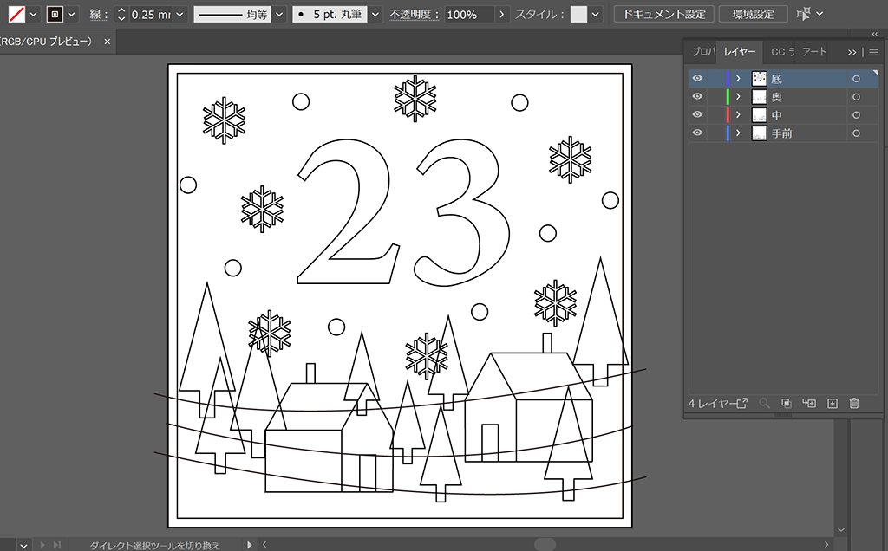

 

## **#23/25 [ 2022/12/23 ]** 
### by Yuki Oka from ジモトファブ
  

 

“23”を担当させていただきました、合同会社ジモトファブです。 

クリスマスといえばぼんやりとした暖かみのある光だ！という個人的な世界観（先入観）をカタチにするべく、今回はシャドーボックスづくりに挑戦してみました。 
シャドーボックスは切り抜いた絵を重ね、層をつくり、奥行きのある立体的な作品にするというなかなかに歴史のあるアート技法で、作品の裏側に光源をうまく忍ばせて光と影の調和を楽しむことのできる作品が多く存在します。 
我々がいつもいるファブラボ栗山には3Dプリンタがあるので、それらを使って箱と絵の部分をつくり、光源は電子工作で用意することにしました。

 

### **材料**

* PLAフィラメント透明
* PLAフィラメント白
* ホログラムちよがみ
* 両面テープ
* ESP-WROOM-02開発ボード
* LEDテープライト（LED5個分）
* ブレッドボード
* 電池ケース
* 単4電池3本

 

### **技術**

* データ作成：(Adobe Illustlator/Fusion360)
* 3Dプリンタ（Prusa i3 MK3S+）
* Arduino(ESP8266)
* Blynk

 

### **作り方**
 

### **1. 絵を描く（Adobe Illustlator）**
 

今回メインで使うのは3DCADソフトのFusion360ですが、その前にIllustlatorを使用してシャドーボックスの元となる絵を描きました。立体化しやすいようにシンプルな形状の木や家、雪の結晶を描き、そこに今回忘れてはならない23を加えます。層になることをイメージして描きましたが、Illustlatorはレイヤーを表示したり非表示にしたりできるのでそんな時とても便利ですね。 

   

### **2. 3Dデータをつくる（Fusion360）**
 

絵を立体化するためSVGで保存し、そのデータをFusion360に取り込みます。そして1.5mmの厚みの板とし、3Dプリントが可能なSTL形式で保存しました。 
そして外側の箱もつくります。4枚の板から成る組立式の箱にしてみました。絵を一定の間隔で並べられるよう、内側には差し込むための溝が掘ってあります。 

   

### **3. 3Dプリントする（Prusa i3 MK3S+）**
 

3Dデータが作成できたら3Dプリンタで出力しました。絵の部分はぼんやりと光が透るようにしたかったので透明のフィラメントで、箱は雪の上に置いてなじむようにしたいと思ったので白のフィラメントを選びました。 

   

### **4. 電子工作で光らせる（Arduino/Blynk）**
 

3D出力をしながら光源の準備も行います。よくあるLEDテープライトをマイコンを使用して光らせることにしました。小型のものがよかったので手元にあったのESP-WROOM-02の開発ボードを選んだのですが、ESP-WROOM-02はWIFI経由の操作が可能なので、Blynkという簡単にIoTグッズを作れてしまうスマホアプリも利用してスマホから色のコントロールを可能にしました。これで飽きることなく長く使えますね！ 

### **5. 手直しする**
 

できたパーツから仮組みしてなんとなく光らせてみたところ、肝心の文字が目立たないことがわかりました。“23”の奥にある板がただの白だと透明の板との区別ができないんだぁ！と考え、近所の100均で折り紙と一緒に売られていたホログラムシートを買い、板にはりつけて色が変わるように、またLEDの光をより反射するように対策してみました。また、この際に箱の溝が3Dプリントしたままだと絵のはまりがよくなかったので小型ルーターでこっそり削ってます。すみません。1.6mmだった幅が2㎜くらいになりました。画像なくてすみません。 

### **6. 組立て**
 

ついにパーツがそろいました。組み立ててみます。 

  

1センチごとに絵の層が並び、一番うしろにはマイコンが収納されています。今回の電子工作はブレッドボード&雑配線で失礼します。雪の上に置いてみたかったので外でもどこでも置きやすい電池駆動にしました。 

 

   

### **7. 動作チェック**
 

最後にLEDの光り具合とスマホからの操作テストを行いました。ESP-WROOM-02はケータイのテザリング経由で動いているのでWIFIのない場所でも設置することができます。5V用のLEDテープを3.3Vで無理矢理光らせたので心配でしたが、それなりに光ってくれて一安心です。 

<iframe width="680" height="382.5" src="https://www.youtube.com/embed/Rb9Q12FekxQ" title="YouTube video player" frameborder="0" allow="accelerometer; autoplay; clipboard-write; encrypted-media; gyroscope; picture-in-picture; web-share" allowfullscreen></iframe>   

### **8. 完成**
 

完成したので雪の上に置いてみます。撮影の時にかぎって雪が降らず十分な量がありませんでした（涙）が一応思い通りにできた！のではないでしょうか。後から追加した黄系のホログラムが色味を足してくれて求めていたぼんやり感が増した気がします。結果オーライですね！つくってみてわかることってたくさんあるなと改めて思いました。 

 

  

今回つくったものは板を入れ替えて簡単にデザインを変えることができるので、いろんなバージョンをつくってみようと思います！それではみなさま良きクリスマスをお過ごしください！！

    

### **作者紹介**
 

**合同会社ジモトファブ** 

北海道栗山町で町役場と連携しながらファブラボ栗山を運営しています。デジタルファブリケーションやプロトタイピングの技術を駆使して地域課題の解決を行うことのできる人材「まちの未来を開拓する担い手」を育成することを目的とし日々活動しています。今回の制作および作文は岡が担当しました。 
[https://fablabkuriyama.jp/](https://fablabkuriyama.jp/)
  

（Last Updated: 2023.04.11）

