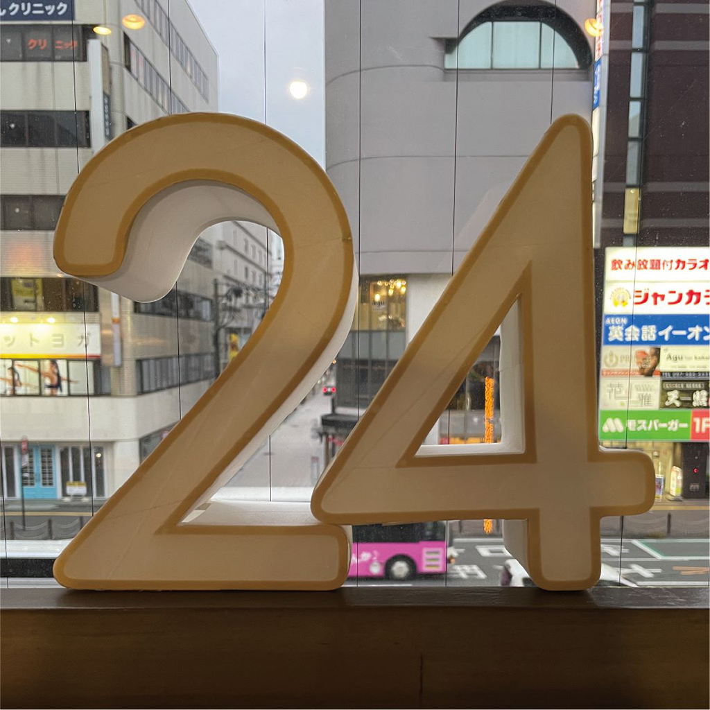
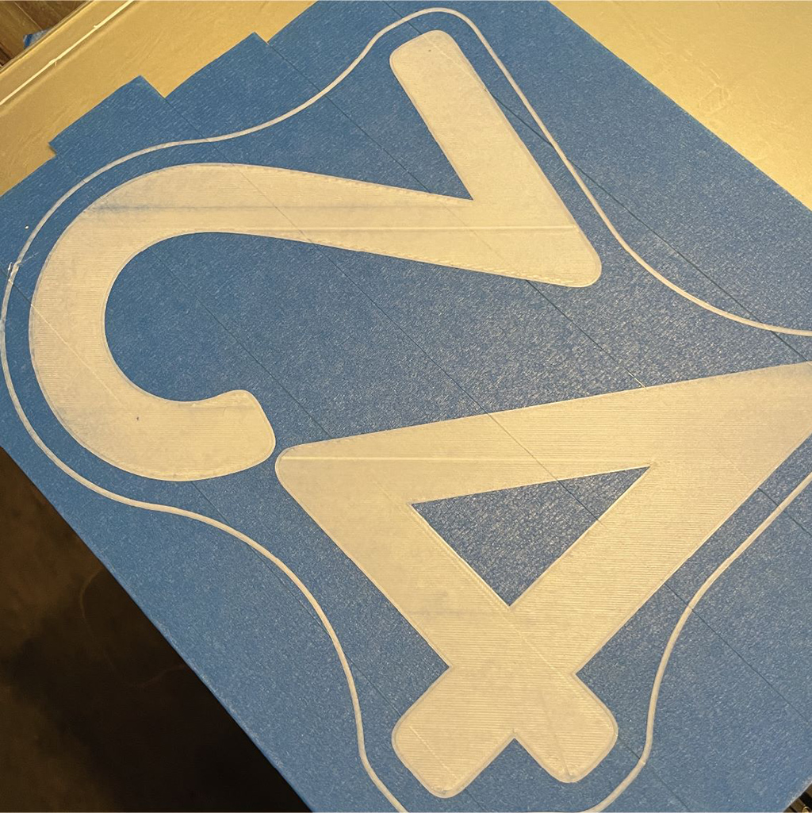
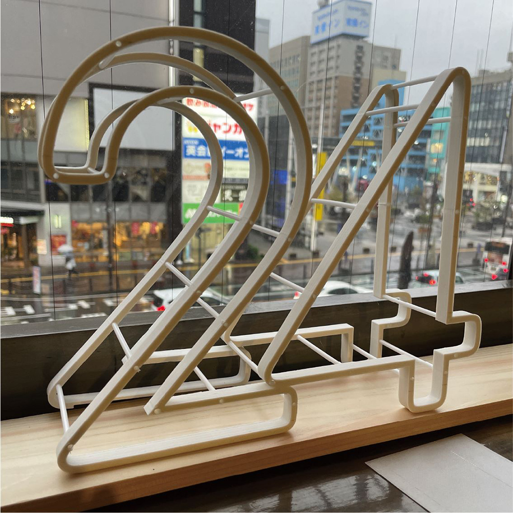
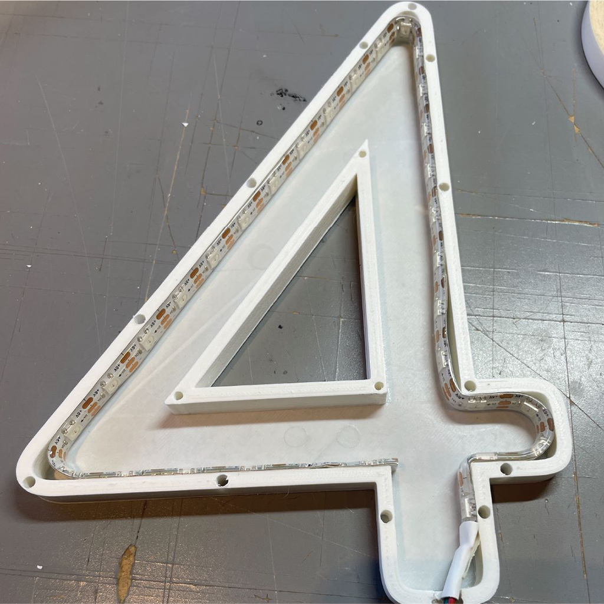
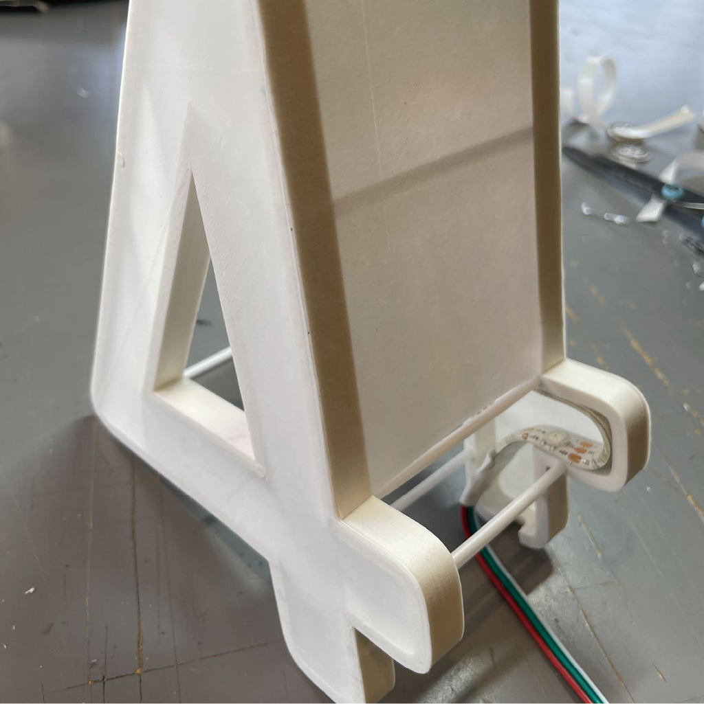

 

## **#24/25 [ 2022/12/24 ]** 
### by Daisuke Toyozumi
  

 

こんにちは、ファブラボ大分の豊住です。 
今日は、クリスマス・イブですね。 
パーティの準備は万端ですか？お酒もチキンも買いましたか？僕は買いました。 

勢いよく「昨年に引き続き参加します！」と返事したところ、24というちょっとプレッシャーのかかる日になってしまいました。 
前もって色々と考えていたんですが、24番目という遅出しとなってしまった結果、「あ、ちょっとネタかぶりしている。」という地獄を見ました。 

そうは言っても何かつくらねば！ 
昨年つくった破れる樹脂を今年も使おうということをベースにアイデア出しをします。 
たまたまyoutubeで地元のお祭りの山車をつくる過程を見つけて、あ、張り子にしてみようというところに行き着きました。

 

### **材料**

* PLAフィラメント
* M5StickC
* テープLED 1.6mくらい

 

### **技術**

* 3Dプリント
* 電子工作

 

### **作り方**
 

ということで、まずは厚さ0.2mmの「2」と「4」を出力します。 

  

続いては、骨組みとなる部分を出力、仮組みをしてみます。 
はい、「4」が自立しません。仕方なく「2」の肩を借りることにします。 
ちなみに僕は、この状態が一番好きです。ここでおしまいにしたい気持ちをぐっと堪え、次の工程に進みます。 

  

そのままだと面白くないので、フルカラーLEDを仕込んでいきます。ちなみにinとoutが逆になっていることに気付かず、30分くらい「ん？？？」となりました。 
この薄い「4」は、アクリル接着剤で貼っつけています。 

  

そして、厚さ0.2mmの長方形の出力物を両面テープで貼り合わせていきます。 
ハサミでもカッターでもかんたんにカットすることができるので、折り紙的な使い方も行けそうだなぁとか調子に乗っていると、積層方向に簡単に裂けていき、何箇所か破れました。 

が、気にせず上からかぶせて貼って隠していきます。 

  

ということで、張り子が完成しました。大きさは高さ20cm程度です。 

  

光らせてみました。 
Adafruitのneopixelライブラリを使わず、FastLEDライブラリを使っています。 

<iframe src="https://player.vimeo.com/video/783557823?h=7e78bebd95" width="680" height="1209" frameborder="0" allow="autoplay; fullscreen; picture-in-picture" allowfullscreen></iframe>

<a href="https://vimeo.com/783557823">2022/12/24</a> from <a href="https://vimeo.com/user55140203">Daisuke Toyozumi</a> on <a href="https://vimeo.com">Vimeo</a>.
  

なんかもう少しひねりが欲しかったな、と今更ながら思っています。 

それではみなさん、よいクリスマスを。 

    

### **作者紹介**
 

**とよずみ　だいすけ** 

[ファブラボ大分](https://www.faboita.org/)の人。そろそろ旅に出たいです。
  

（Last Updated: 2023.04.11）

