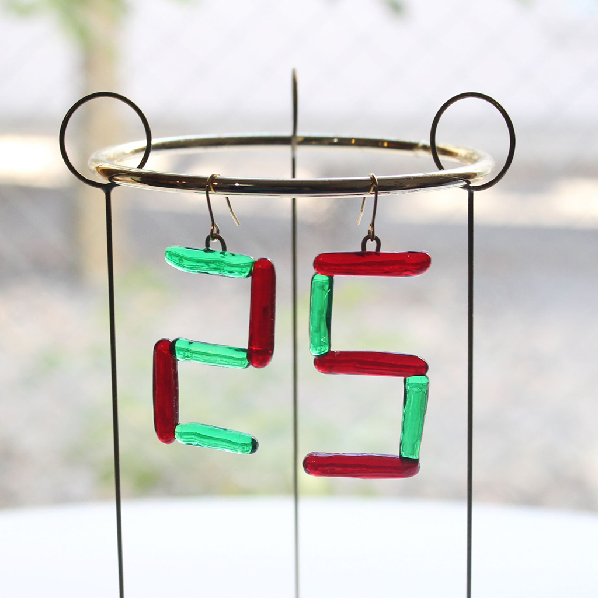
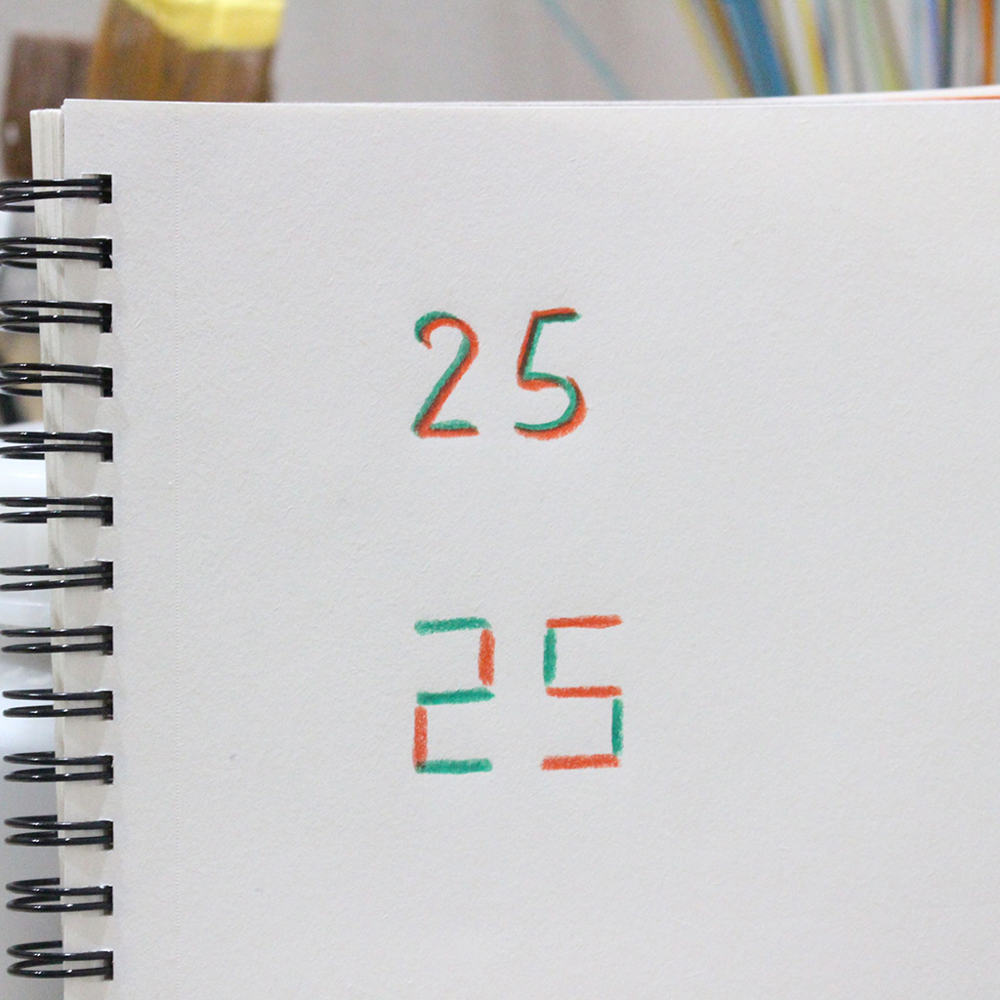
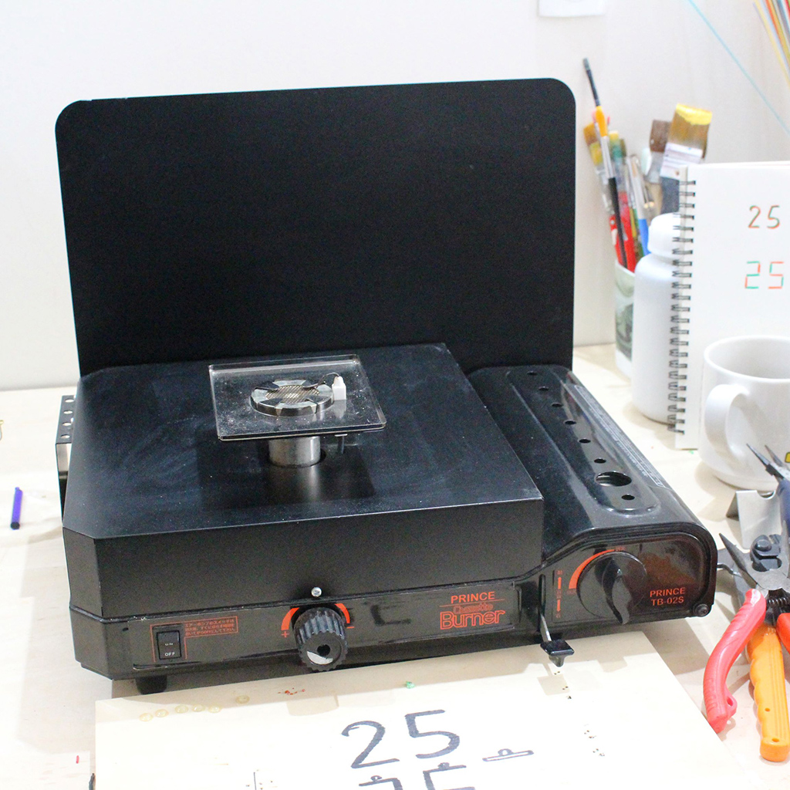
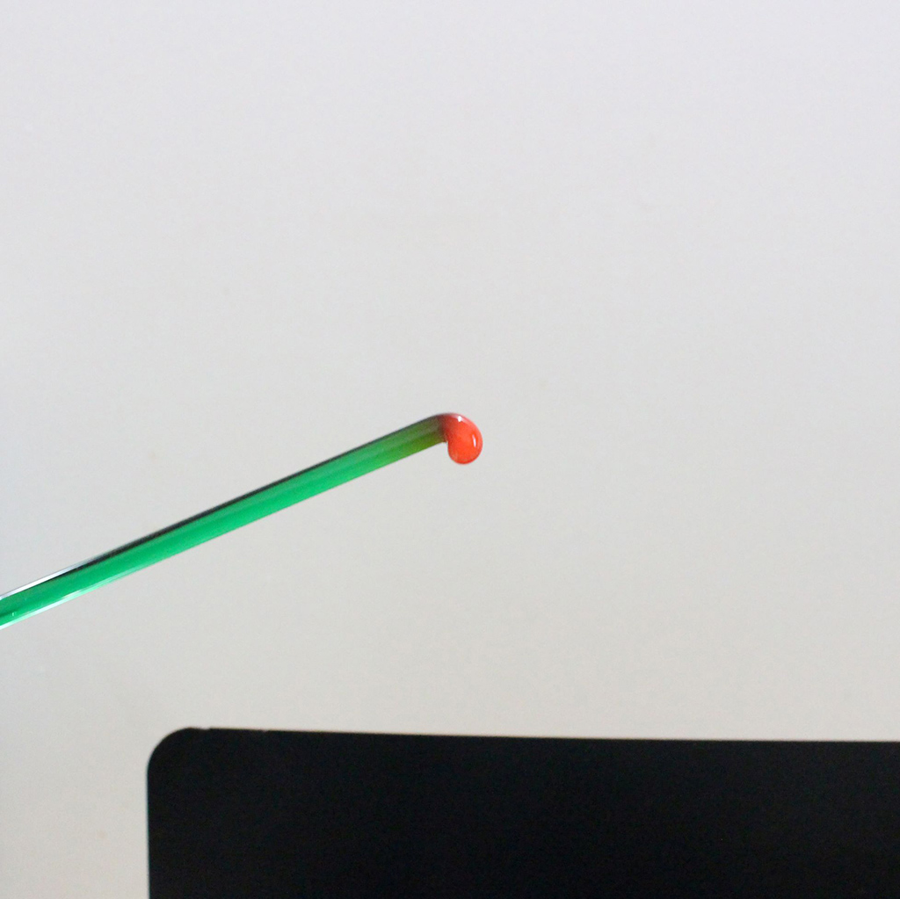
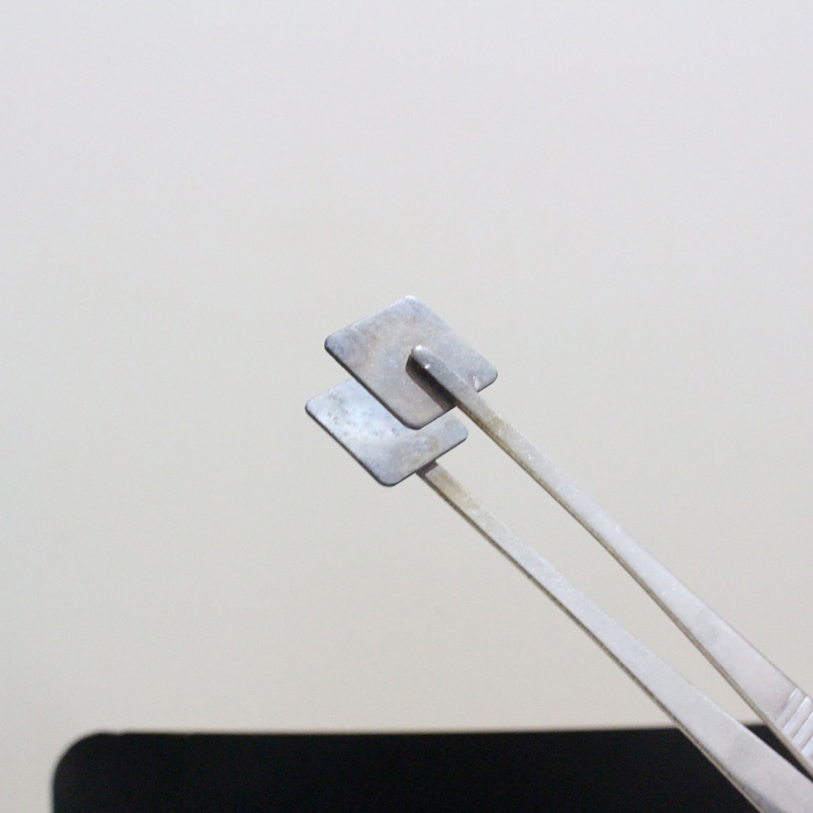
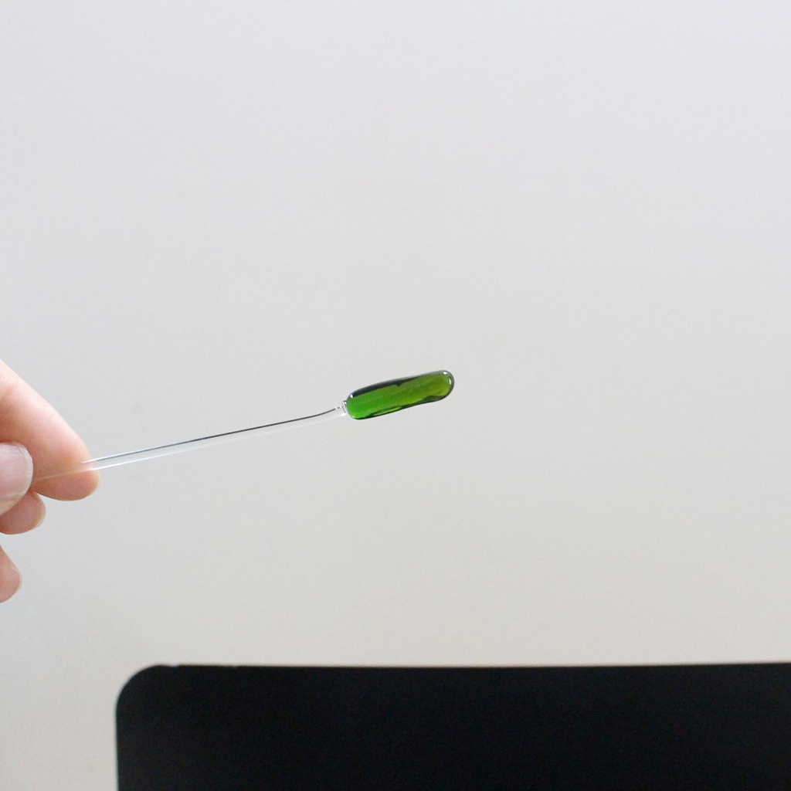
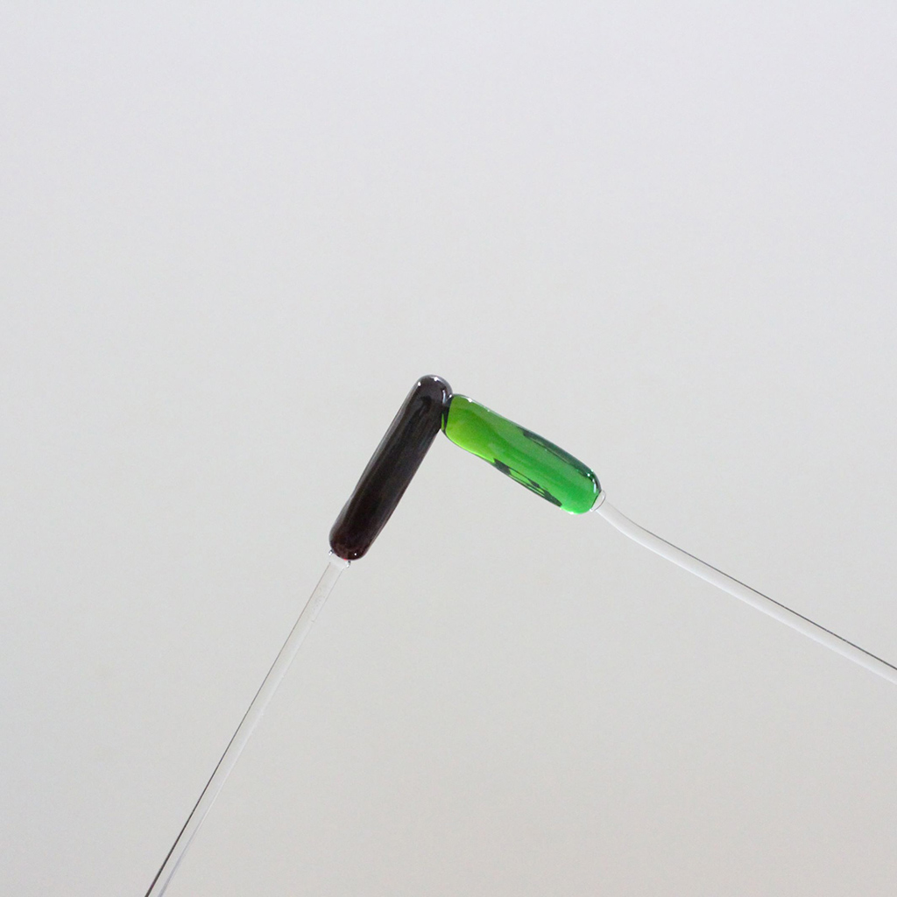
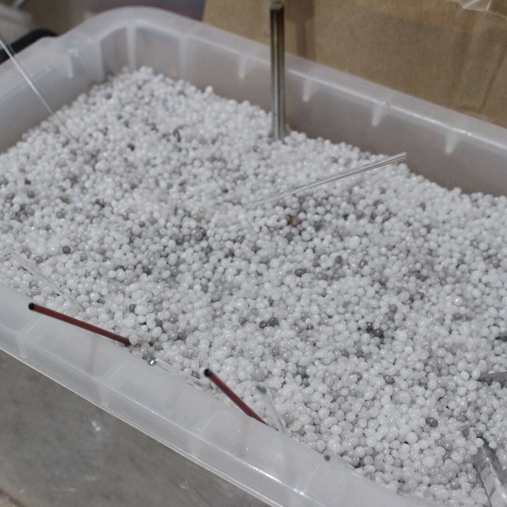
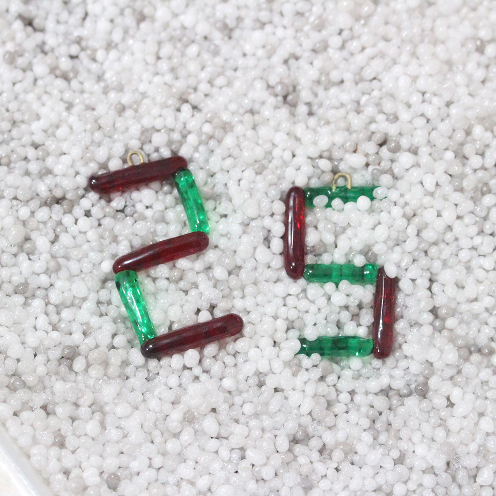
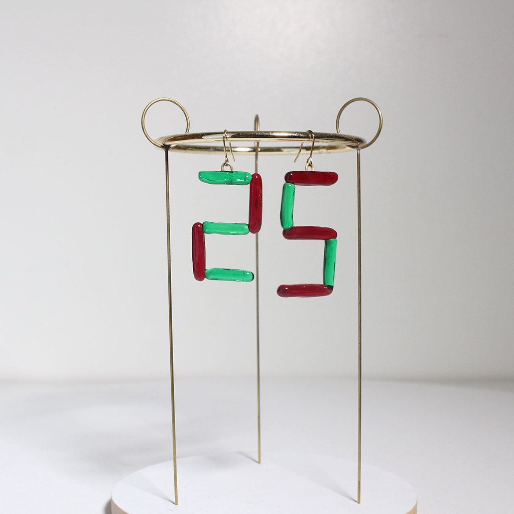

 

## **#25/25 [ 2022/12/25 ]** 
### by Haruka Aramaki
  

 

メリークリスマス！ 

ガラスで25を作ってみます！

 

### **材料 ＆ 道具**

* 保護メガネ
* トンボ玉用ガラス
* トンボ玉用ガスバーナー
* 平たいピンセット
* 真鍮丸線
* ピアス金具

 

### **作り方**
 

ガラスの棒を曲げながら作っていくのもいいけど、７セグメント表記にすれば、２と５は線対称！ですので、そのことを際立たせたいなと思い、短い棒をくっつけていく方法にしました。できるかな。できるはず。 

  

使用するガラスはトンボ玉用（クリスタル及びソーダ系ガラス）です。 
実験器具用の耐熱ガラスなどとは異なり、融点が低いのが特徴です。 
使用しているガスバーナーはプリンスから発売されている、ガスボンベを使用するタイプのトンボ玉用のバーナーなのですが、今は販売しているのかは不明。 

  

膨張率の高いガラスは特に、熱の行き渡らせ方にムラがあると、歪みができて割れてしまうので、徐々に温めながらゆっくりとかしていきます。 

  

平たいピンセットで形を整えながら成形します。こういう、何かをつくるための特製の道具、グッと来ますよね。
飴のように整えていきます。 

  

ポンテ棒といって、元の材から切り離すために仮の棒をくっつけます。 

  

赤色のガラスは、熱が入っていると、黒っぽく見えます。冷えると透明な赤色になります。 
溶かしつける。 

  

短い棒材ができたら軽石のつぶつぶのような除冷材の中に突っ込んで除熱しておきます。これも急に冷えないように徐々に熱を取るためのものです。 

  

できました！割れてなさそう！やった！ 

  

（ピアスの金具を取り付けるための半円に丸めた真鍮丸棒の融着シーンは時間との戦いのため、撮影できず、、。） 

  

幸い？普段から吊すのに適した？作品を作っている？ので、 
その中でも適したものに引っ掛けて撮影です。 

  

今日は25を装着して過ごします。 

今年もアドベントカレンダー、ありがとうございました！ 
毎日アップされる創作物を見るのが楽しかったです！ 

明日からはもう年越しの準備ですね。 
みなさま、良いお年を～～！（一番好きな掛け声）

    

### **作者紹介**
 

**荒牧 悠** 

[harukaaramaki.com](harukaaramaki.com)
  

（Last Updated: 2023.04.11）

