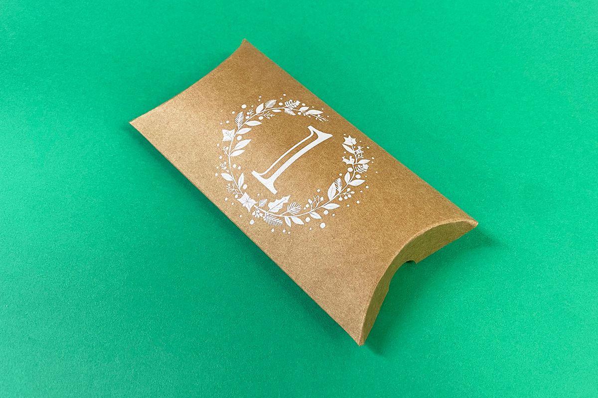
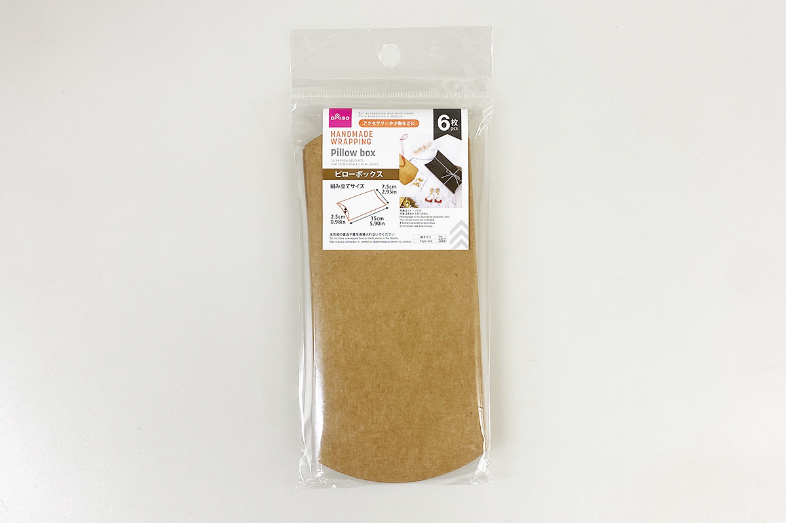
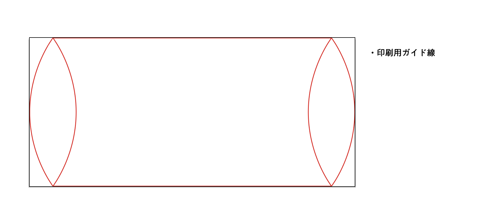
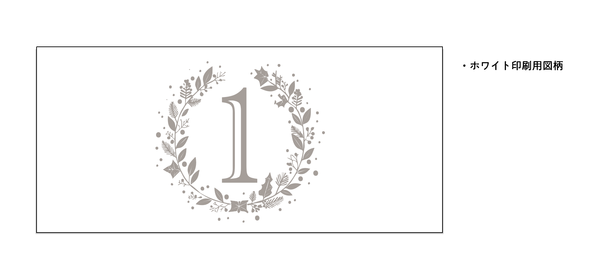
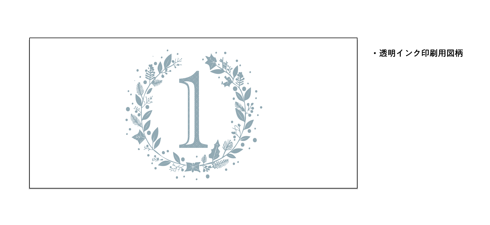
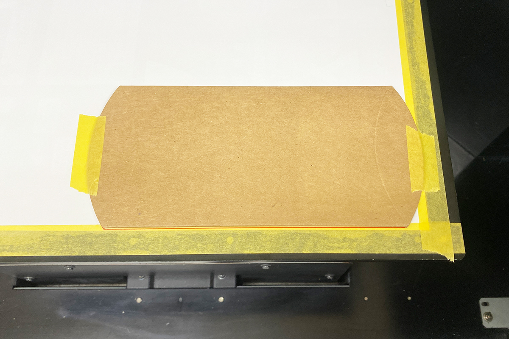
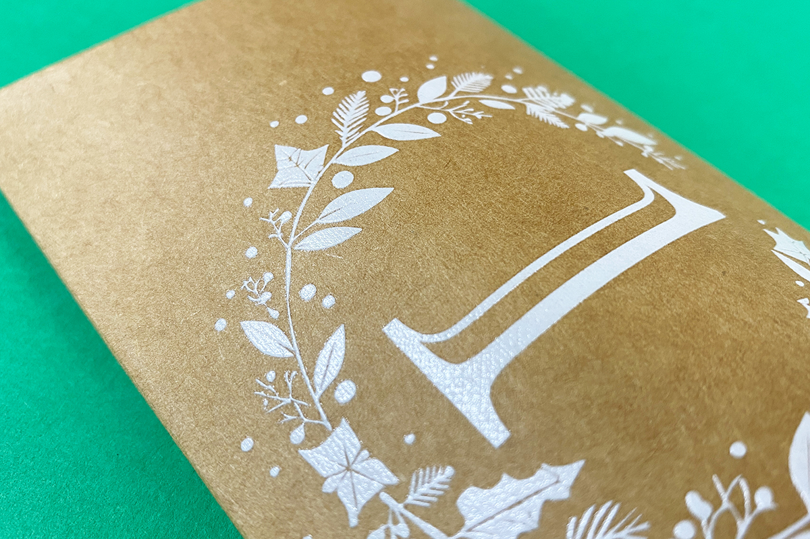

 

## **#01/25 [ 2024/12/01 ]** 
### by Shino ONODERA (FabLab SENDAI - FLAT)
  

 

### **材料**

* ピローボックス（DAISO）
* 材質：紙
* 組み立て時サイズ：15cm × 7.5cm × 2.5cm
* JANコード：4997642171198

  

### **技術**

* データ作成：Adobe Illustrator
* UVプリント：Roland LEF-12

 

### **作り方**
 

### **1.** 
UVプリンタは、通常のプリンタと同じようにカラー（CMYK）印刷ができるだけでなく、ホワイトとグロス（透明）インクによる印刷ができるという特徴があります。ホワイトとグロス印刷を行う場合には、図柄に特色（専用の色）を使用するため、以下のように3種類のデータをレイヤーを分けて作成しました。 

  

### **2.** 
UVプリンタに設置された捨て紙に、1.の「印刷ガイド線」を印刷したら、そこに合わせてボックスをセットします。UVプリンタは平らな面にのみ印刷が可能なため、ボックスは組み立てずに潰した状態で使用します。また、印刷時に位置ずれが起こる可能性があるため、マスキングテープでボックスを捨て紙に固定しました。 

  

### **3.** 
印刷時の様子です。ホワイト→透明（グロス）の順に印刷を行いました。今回ははっきりとした仕上がりにするために、どちらも2回ずつ塗り重ねています。 

  

### **4.** 
印刷が完了したら組み立てて完成！ 

  

合計4回重ねて印刷をしたので、印刷面が盛り上がっています。印刷回数を増やしてインクを重ねるほど、インクの色が濃く、盛り上がりが大きくなります。 

  

今回は茶色い厚紙に印刷をしましたが、他の色や厚さの用紙も使用可能です。ただし、用紙の原料によってはインクの発色や定着が悪い場合もあるので、本番前にテスト印刷を行なっていただくのがおすすめです。  

（Last Updated: 2025.11.13）

