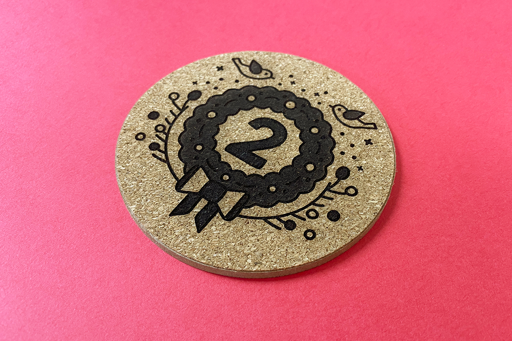
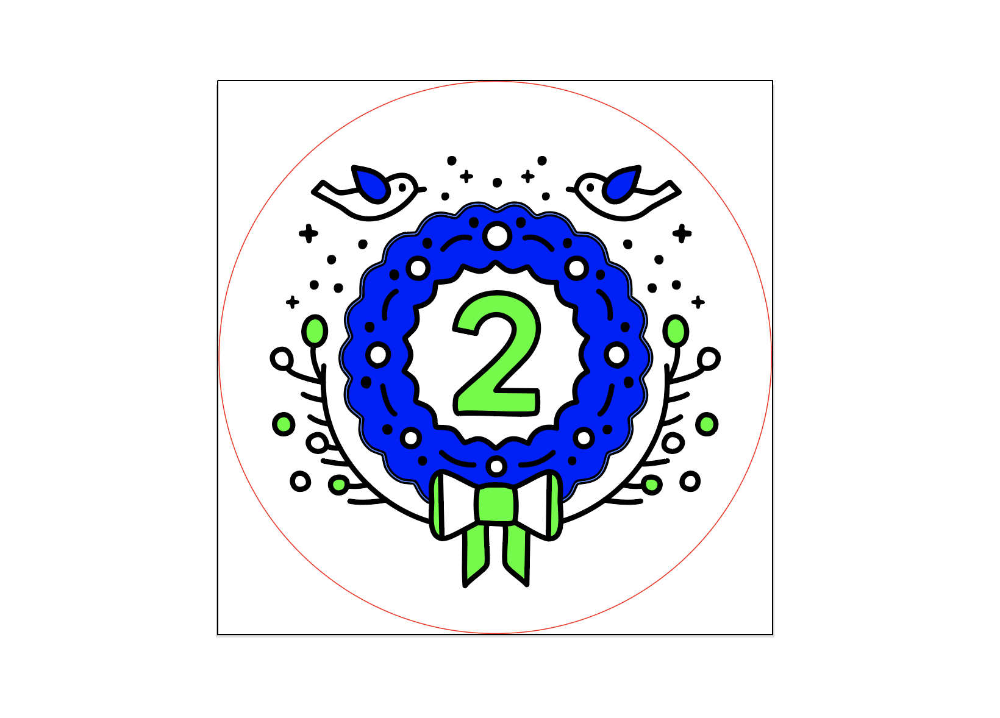
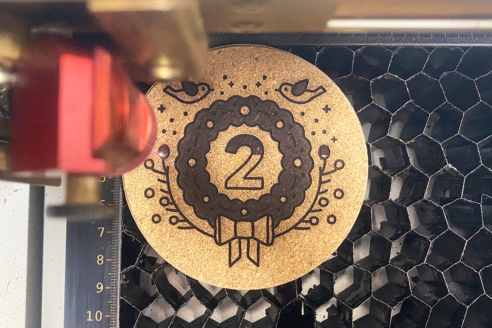
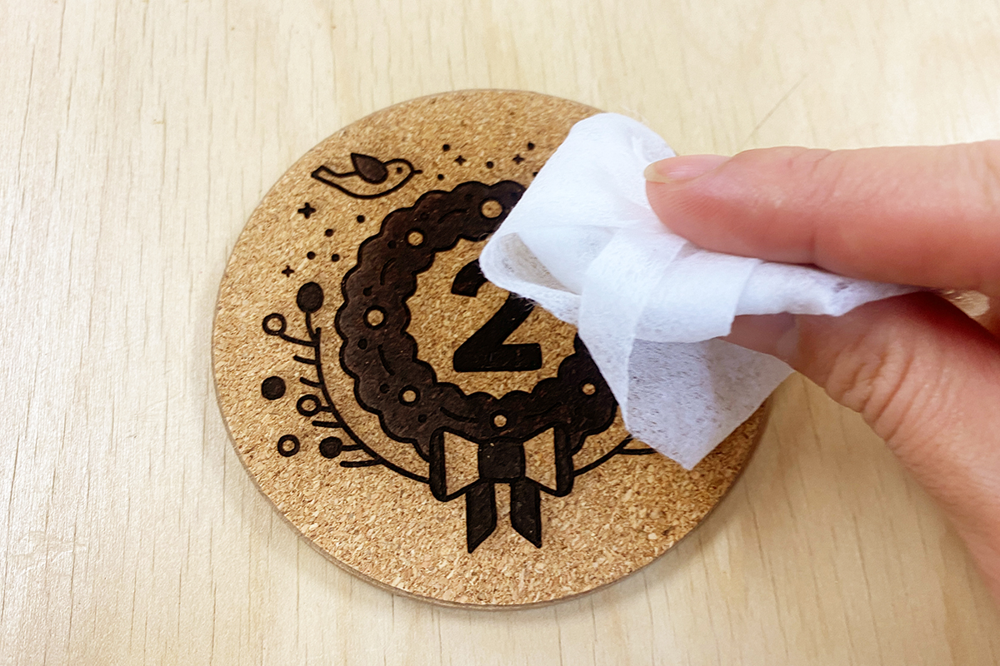
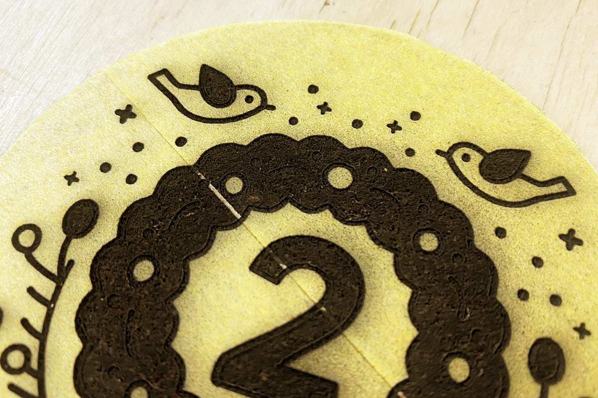
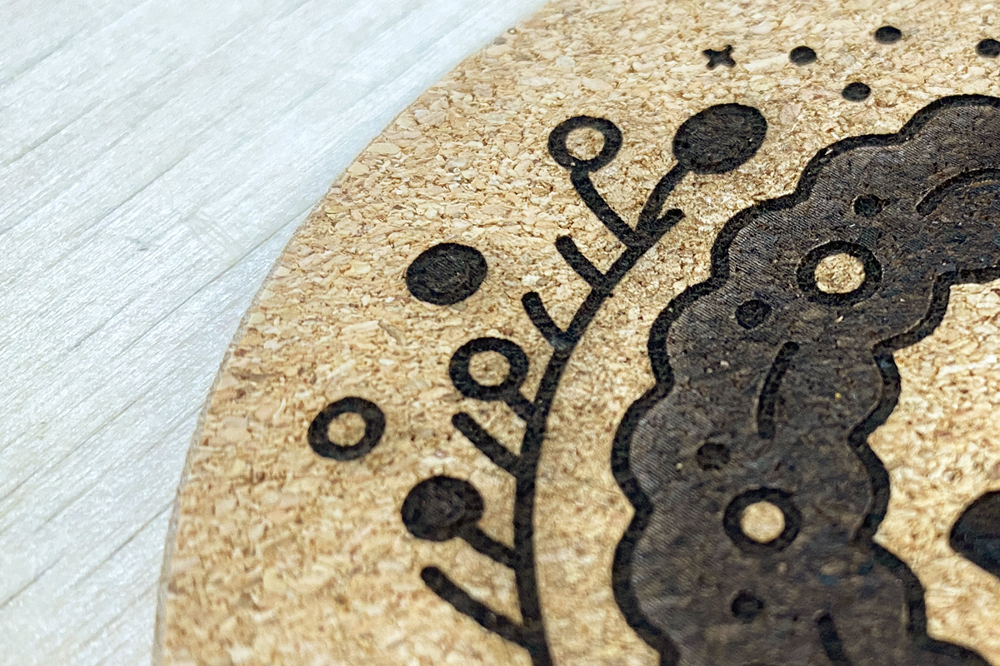

 

## **#01/25 [ 2024/12/01 ]** 
### by Shino ONODERA (FabLab SENDAI - FLAT)
  

  

### **材料**
* コースター 9cm 4P 無地（セリア）
* 材質：コルク、MDF
* サイズ：約 直径9mm × 厚み 5mm
* JANコード：4968583514160

  

  

### **技術**
* データ作成：Adobe Illustrator
* レーザー彫刻：trotec Speedy 100

 

### **作り方**
 

### **1.** 
レーザーカッターは、素材の切り抜き加工と、表面を削るような彫刻加工を行うことができます。更に、データ上で色の塗り分けを行うと、焦げの濃淡や彫りの深さを個別に指定することが可能です。 
今回は、以下のように3種類の濃度で図柄を表現することにしました。 

  

### **2.** 
レーザーカッターにコースターをセットし、加工を行います。コルクや木材、紙など、燃えると焦げる素材は、加工箇所の周囲にススが付着します。（図柄の周りに薄く見える茶色いモヤがススです。） 
各色のレーザー加工のパラメータは以下の通りです。 
・黒（R0 G0 B0）：パワー15／スピード15 
・青（R0 G0 B255）：パワー15／スピード30 
・緑（R0 G255 B0）：パワー15／スピード43 
（赤は加工用ガイドのため加工は行なっていません。） 

  

### **3.** 
レーザー加工が完了したら、ウェットティッシュなどで表面に付着したススを優しく拭き取ります。このとき強く力をかけると、コルクが剥がれる可能性があります。 

  

加工面にマスキングテープを貼ってレーザー加工をすることでススの付着を防ぐことも可能ですが、以下の写真のようにテープ同士が重なってしまうと加工にムラが生じてしまったり、テープを剥がす際にコルクも一緒に剥がれてしまうことがあるので注意が必要です。 

  

### **4.** 
ススの拭き取りが完了したら完成！ 

  

コルクは調整が難しいので分かりにくいですが、よく見ると部位ごとに若干焦げの濃度が異なっています。 

  

コルクは燃えやすい素材のため、レーザー加工のパラメータ調整に注意が必要です。また、彫刻加工部分はあくまで表面のみが焦げているため、爪で引っ掻くなどすると素のコルクが出てくる場合があります。図柄に耐久性を持たせたい場合は、UVプリンタでの印刷もおすすめです。  

（Last Updated: 2025.11.13）
